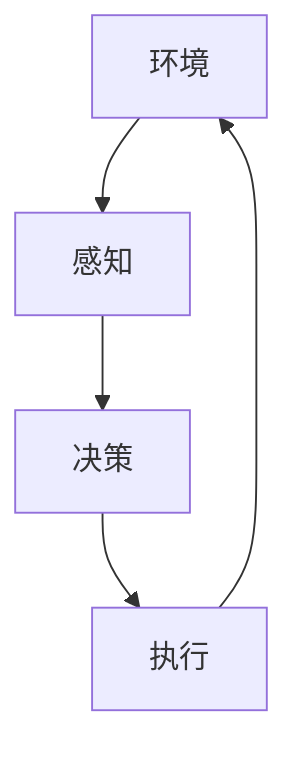
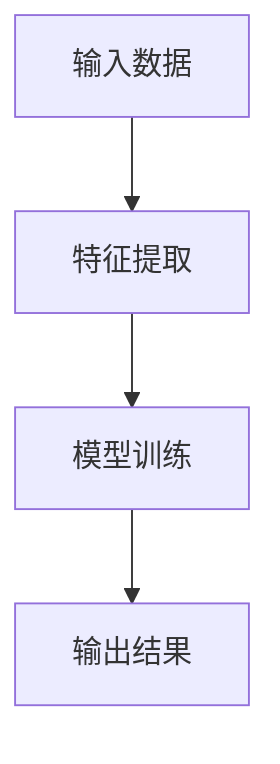
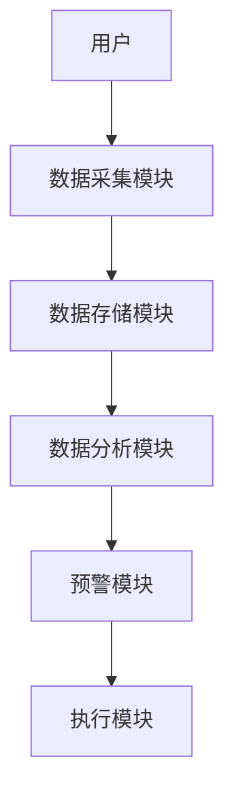

                 


---

# AI Agent在智能水质监测中的实践

> 关键词：AI Agent, 智能水质监测, 强化学习, 深度学习, 水质预测, 系统架构

> 摘要：本文详细探讨了AI Agent在智能水质监测中的应用，从核心概念、算法原理到系统架构和项目实战，系统性地分析了AI Agent如何提升水质监测的效率和准确性。通过实际案例和详细代码实现，展示了AI Agent在水质监测中的巨大潜力和实际价值。

---

# 第一部分: AI Agent与智能水质监测的背景与概念

## 第1章: AI Agent与智能水质监测概述

### 1.1 AI Agent的基本概念

#### 1.1.1 什么是AI Agent
AI Agent（人工智能代理）是指在计算机系统中，能够感知环境并采取行动以实现目标的智能实体。它能够通过传感器获取信息，利用算法进行决策，并通过执行器与环境交互。AI Agent的核心特征包括自主性、反应性、目标导向性和社交能力。

#### 1.1.2 AI Agent的核心特征
- **自主性**：AI Agent能够在没有外部干预的情况下自主决策和行动。
- **反应性**：能够实时感知环境变化并做出响应。
- **目标导向性**：所有行动都围绕特定目标展开。
- **社交能力**：能够与其他AI Agent或人类进行有效通信和协作。

#### 1.1.3 AI Agent的分类与应用场景
AI Agent可以根据智能水平分为反应式和基于模型的Agent。反应式Agent仅基于当前感知做出决策，而基于模型的Agent则利用内部模型进行规划和推理。AI Agent广泛应用于自动驾驶、智能助手、游戏AI和水质监测等领域。

### 1.2 智能水质监测的背景与意义

#### 1.2.1 水质监测的重要性
水质监测是保障饮用水安全和环境保护的重要手段。通过实时监测水质参数，可以及时发现和处理污染问题，防止对环境和人类健康造成危害。

#### 1.2.2 智能化水质监测的发展趋势
随着物联网和人工智能技术的发展，水质监测正在从传统的人工监测向智能化方向转变。智能水质监测系统能够实现数据的自动采集、分析和预警，显著提高了监测效率和准确性。

#### 1.2.3 AI Agent在水质监测中的优势
AI Agent能够通过机器学习算法实时分析水质数据，预测潜在的污染风险，并采取相应的措施。与传统方法相比，AI Agent具有更高的效率和准确性，能够显著提升水质监测的能力。

## 第2章: AI Agent在水质监测中的问题背景

### 2.1 水质监测中的传统方法与挑战

#### 2.1.1 传统水质监测的技术手段
传统水质监测主要依赖实验室分析和人工采样，这种方法效率低下，成本高昂，并且难以实现实时监测。

#### 2.1.2 传统方法的局限性
- 数据采集间隔长，无法实现实时监测。
- 人工分析容易受到主观因素的影响，准确性不足。
- 数据处理能力有限，难以应对复杂的水质变化。

#### 2.1.3 新兴技术的需求与机会
随着物联网和人工智能技术的发展，智能化水质监测系统的需求日益增长。新兴技术为水质监测提供了新的解决方案，例如基于AI Agent的实时监测和预测系统。

### 2.2 AI Agent在水质监测中的问题解决

#### 2.2.1 AI Agent如何提升水质监测的效率
AI Agent能够实时采集和分析水质数据，快速识别异常情况，并采取相应的措施。这显著提高了水质监测的效率。

#### 2.2.2 AI Agent在异常检测中的应用
通过机器学习算法，AI Agent能够学习正常水质数据的分布特征，及时发现异常情况，例如污染事件。

#### 2.2.3 AI Agent在数据预测与优化中的作用
AI Agent可以利用历史数据训练预测模型，准确预测未来的水质变化趋势，并优化监测策略。

## 第3章: AI Agent与水质监测的核心概念联系

### 3.1 核心概念原理

#### 3.1.1 AI Agent的感知与决策机制
AI Agent通过传感器获取环境数据，利用算法进行分析和决策，并通过执行器采取行动。这种机制使得AI Agent能够在复杂环境中自主工作。

#### 3.1.2 水质监测系统的数据流分析
水质监测系统包括数据采集、传输、存储和分析等多个环节。AI Agent能够实时处理数据，快速做出决策。

#### 3.1.3 AI Agent与水质监测系统的协同工作原理
AI Agent与水质监测系统协同工作，通过实时数据交换和信息共享，实现高效的水质监测和管理。

### 3.2 核心概念属性特征对比

| **属性特征**       | **AI Agent**                  | **水质监测系统**              |
|--------------------|-------------------------------|-------------------------------|
| **自主性**          | 高                           | 较低                         |
| **反应性**          | 高                           | 中                           |
| **目标导向性**      | 高                           | 中                           |
| **数据处理能力**    | 强                           | 较弱                         |
| **决策能力**        | 强                           | 较弱                         |

### 3.3 ER实体关系图架构

```mermaid
er
    %% ER Diagram for AI Agent and Water Quality Monitoring System
    entity AI Agent {
        id
        name
        target
        status
    }
    entity Water Quality Monitoring System {
        id
        location
        sensor_type
        data_type
    }
    entity Data {
        id
        value
        timestamp
        status
    }
    AI Agent --> Data: Collects
    Water Quality Monitoring System --> Data: Monitors
    AI Agent --> Water Quality Monitoring System: Coordinates
```

---

# 第二部分: AI Agent与水质监测的核心概念联系

## 第4章: AI Agent的核心算法原理

### 4.1 强化学习算法

#### 4.1.1 强化学习的基本概念
强化学习是一种通过试错机制学习策略的方法。AI Agent通过与环境交互，学习采取最优行动以获得最大奖励。

#### 4.1.2 强化学习的训练过程



#### 4.1.3 强化学习的Python代码示例

```python
class Environment:
    def __init__(self):
        self.state = 0
        self.reward = 0

    def get_state(self):
        return self.state

    def get_reward(self, action):
        # 根据动作计算奖励
        pass

class Agent:
    def __init__(self):
        self.q_values = {}

    def take_action(self, state):
        # 选择动作
        pass

    def update_q_values(self, state, action, reward):
        # 更新Q值
        pass
```

### 4.2 深度学习算法

#### 4.2.1 深度学习的基本概念
深度学习是一种基于人工神经网络的机器学习方法，能够从大量数据中学习特征和模式。

#### 4.2.2 深度学习的训练过程



#### 4.2.3 深度学习的Python代码示例

```python
import tensorflow as tf
from tensorflow.keras import layers

model = tf.keras.Sequential([
    layers.Dense(64, activation='relu'),
    layers.Dense(1, activation='sigmoid')
])

model.compile(optimizer='adam', loss='binary_crossentropy', metrics=['accuracy'])
```

### 4.3 数学模型与公式

#### 4.3.1 强化学习的贝尔曼方程

$$ Q(s, a) = r + \gamma \max_{a'} Q(s', a') $$

其中，\( Q(s, a) \) 表示状态 \( s \) 下采取动作 \( a \) 的期望奖励，\( \gamma \) 是折扣因子。

#### 4.3.2 深度学习的损失函数

$$ \text{Loss} = -\frac{1}{m} \sum_{i=1}^{m} [y_i \log(p_i) + (1 - y_i) \log(1 - p_i)] $$

其中，\( y_i \) 是真实标签，\( p_i \) 是模型预测的概率。

---

# 第三部分: AI Agent在水质监测中的算法原理

## 第5章: AI Agent在水质监测中的算法实现

### 5.1 数据预处理

#### 5.1.1 数据清洗
水质数据可能包含缺失值和异常值，需要进行清洗和归一化处理。

#### 5.1.2 数据特征提取
从原始数据中提取有用的特征，例如温度、pH值、溶解氧等。

### 5.2 模型训练

#### 5.2.1 强化学习模型
使用强化学习模型对AI Agent进行训练，使其能够根据水质数据做出最优决策。

#### 5.2.2 深度学习模型
使用深度神经网络对水质数据进行分类和预测。

### 5.3 模型评估

#### 5.3.1 准确率
$$ \text{Accuracy} = \frac{\text{正确预测数}}{\text{总样本数}} $$

#### 5.3.2 召回率
$$ \text{Recall} = \frac{\text{正确预测的正例数}}{\text{总正例数}} $$

#### 5.3.3 F1分数
$$ F1 = 2 \times \frac{\text{Precision} \times \text{Recall}}{\text{Precision} + \text{Recall}} $$

---

# 第四部分: 智能水质监测系统的系统分析与架构设计

## 第6章: 智能水质监测系统的系统分析与架构设计

### 6.1 问题场景介绍

#### 6.1.1 监测目标
监测水体的pH值、温度、溶解氧等参数。

#### 6.1.2 监测地点
例如，饮用水处理厂、河流监测站等。

### 6.2 项目介绍

#### 6.2.1 项目目标
实现一个基于AI Agent的智能水质监测系统，能够实时采集、分析和预警水质异常情况。

#### 6.2.2 项目范围
包括数据采集、数据处理、模型训练和系统集成。

### 6.3 系统功能设计

#### 6.3.1 数据采集模块
负责采集水质传感器的数据，并进行初步处理。

#### 6.3.2 数据分析模块
利用AI Agent对数据进行分析和预测，识别异常情况。

#### 6.3.3 预警模块
当检测到异常情况时，触发预警机制，通知相关人员采取措施。

### 6.4 系统架构设计



---

# 第五部分: 项目实战

## 第7章: 项目实战

### 7.1 环境安装与配置

#### 7.1.1 Python安装
安装Python 3.8及以上版本。

#### 7.1.2 库的安装
安装必要的库，例如TensorFlow、Keras、Mermaid等。

### 7.2 系统核心代码实现

#### 7.2.1 数据采集模块

```python
import serial

ser = serial.Serial('COM3', 9600)
data = ser.readline().decode().strip()
```

#### 7.2.2 数据分析模块

```python
import tensorflow as tf
from tensorflow.keras import layers

model = tf.keras.Sequential([
    layers.Dense(64, activation='relu'),
    layers.Dense(1, activation='sigmoid')
])

model.compile(optimizer='adam', loss='binary_crossentropy', metrics=['accuracy'])
```

#### 7.2.3 预警模块

```python
def trigger_alarm():
    print("水质异常，请采取措施！")
```

### 7.3 代码应用解读与分析

#### 7.3.1 数据采集模块解读
通过串口读取水质传感器的数据，并将其转换为可读格式。

#### 7.3.2 数据分析模块解读
使用深度学习模型对水质数据进行分类和预测，识别异常情况。

#### 7.3.3 预警模块解读
当模型预测到水质异常时，触发预警机制，通知相关人员采取措施。

### 7.4 实际案例分析与详细讲解

#### 7.4.1 数据采集
从传感器获取实时水质数据，例如pH值、温度等。

#### 7.4.2 数据分析
将数据输入模型，进行实时分析和预测。

#### 7.4.3 预警与响应
当模型检测到异常情况时，触发预警，并执行相应的响应措施。

---

# 第六部分: 小结与注意事项

## 第8章: 小结与注意事项

### 8.1 全文小结

本文详细探讨了AI Agent在智能水质监测中的应用，从核心概念、算法原理到系统架构和项目实战，系统性地分析了AI Agent如何提升水质监测的效率和准确性。通过实际案例和详细代码实现，展示了AI Agent在水质监测中的巨大潜力和实际价值。

### 8.2 应用注意事项

在实际应用中，需要注意以下几点：

1. **数据质量**：确保数据的准确性和完整性，避免噪声干扰。
2. **模型可解释性**：选择合适的模型，确保模型的决策过程可解释。
3. **系统安全性**：确保系统的安全性和稳定性，防止数据泄露和系统崩溃。

### 8.3 未来展望

随着人工智能技术的不断发展，AI Agent在水质监测中的应用将更加广泛和深入。未来的研究方向包括更高效的算法、更智能的系统架构以及更广泛的应用场景。

---

# 第七部分: 最佳实践与扩展阅读

## 第9章: 最佳实践与扩展阅读

### 9.1 最佳实践总结

在实施基于AI Agent的水质监测系统时，建议遵循以下最佳实践：

1. **数据驱动**：以数据为中心，确保数据的准确性和及时性。
2. **模块化设计**：将系统划分为多个模块，便于维护和扩展。
3. **持续优化**：定期更新模型和系统，适应新的数据和需求。

### 9.2 扩展阅读推荐

1. **《深度学习》 - Ian Goodfellow**
2. **《强化学习》 - Richard S. Sutton**
3. **《人工智能: 一种现代的方法》 - Stuart Russell, Peter Norvig**

---

# 作者信息

作者：AI天才研究院/AI Genius Institute & 禅与计算机程序设计艺术 /Zen And The Art of Computer Programming

---

**摘要：** 本文详细探讨了AI Agent在智能水质监测中的应用，从核心概念、算法原理到系统架构和项目实战，系统性地分析了AI Agent如何提升水质监测的效率和准确性。通过实际案例和详细代码实现，展示了AI Agent在水质监测中的巨大潜力和实际价值。

