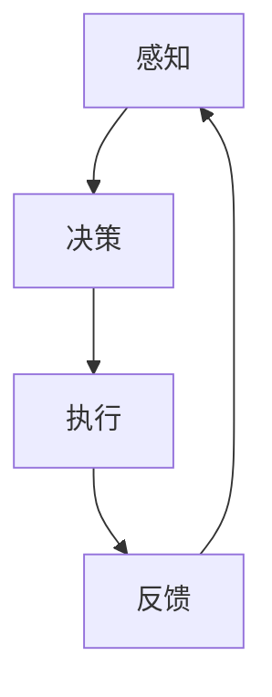
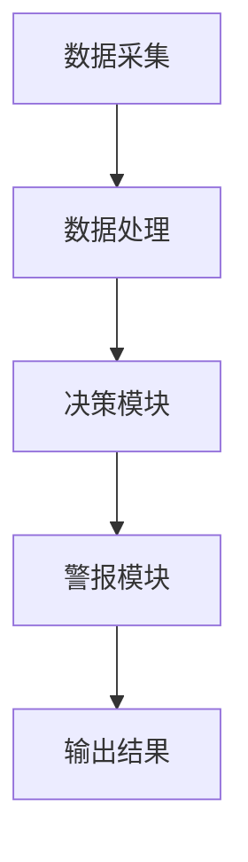
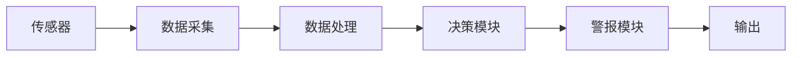

                 


# AI Agent在智能水质预警系统中的角色

## 关键词：AI Agent，水质预警系统，智能感知，决策模型，系统架构

## 摘要：  
本文探讨了AI Agent在智能水质预警系统中的核心角色，分析了其在水质数据采集、分析与预警中的应用价值。通过详细阐述AI Agent的核心概念、算法原理和系统架构，结合实际案例，展示了AI Agent如何提升水质预警系统的智能化水平和预测精度。本文旨在为相关领域的研究者和工程师提供理论参考和实践指导。

---

# 第一部分: AI Agent与智能水质预警系统概述

## 第1章: AI Agent与智能水质预警系统背景

### 1.1 AI Agent的基本概念与特点

#### 1.1.1 AI Agent的定义  
AI Agent（人工智能代理）是一种能够感知环境、自主决策并执行任务的智能体。它可以基于输入的数据采取行动，以实现特定目标。AI Agent的核心在于其自主性、反应性和适应性。

#### 1.1.2 AI Agent的核心特点  
- **自主性**：AI Agent能够在没有外部干预的情况下自主运行。  
- **反应性**：能够实时感知环境变化并做出反应。  
- **学习能力**：通过数据和经验不断优化自身的决策能力。  
- **协作性**：能够与其他系统或AI Agent协同工作，共同完成任务。  

#### 1.1.3 AI Agent与传统算法的对比  
| 特性       | AI Agent                     | 传统算法                     |  
|------------|-------------------------------|------------------------------|  
| 自主性     | 高                           | 低                           |  
| 适应性     | 强                           | 弱                           |  
| 学习能力   | 强                           | 无或弱                       |  
| 应用场景   | 复杂、动态环境                 | 简单、静态环境                 |  

---

### 1.2 智能水质预警系统的概念与应用

#### 1.2.1 水质预警系统的定义  
水质预警系统是一种通过实时监测水质参数（如温度、pH值、溶解氧、重金属含量等），预测水质变化趋势，并在出现异常时发出预警的系统。

#### 1.2.2 智能水质预警系统的特征  
- **实时性**：能够实时采集和分析水质数据。  
- **准确性**：基于AI技术提高预测的准确性。  
- **智能化**：能够自主识别异常情况并提出解决方案。  

#### 1.2.3 智能水质预警系统的应用场景  
- **饮用水安全**：确保饮用水的质量符合国家标准。  
- **工业废水处理**：监控工业废水排放对环境的影响。  
- **农业灌溉**：优化灌溉水质，提高农作物产量。  

---

### 1.3 AI Agent在水质预警系统中的结合应用

#### 1.3.1 AI Agent与水质预警系统的结合方式  
AI Agent可以作为水质预警系统的核心模块，负责数据的采集、分析和决策。

#### 1.3.2 AI Agent在水质预警中的角色定位  
AI Agent在水质预警系统中扮演“智能决策者”的角色，负责实时分析数据并触发预警。

#### 1.3.3 AI Agent对水质预警系统的提升作用  
- 提高预测精度：通过机器学习算法优化模型。  
- 实现实时监控：快速响应水质变化。  
- 自主学习：根据历史数据不断优化预测模型。  

---

## 第2章: AI Agent的核心概念与原理

### 2.1 AI Agent的核心概念

#### 2.1.1 AI Agent的定义与分类  
AI Agent可以根据任务类型分为监督学习Agent、无监督学习Agent和强化学习Agent。

#### 2.1.2 AI Agent的感知、决策与执行机制  
- **感知模块**：通过传感器或数据源获取环境信息。  
- **决策模块**：基于感知数据做出决策。  
- **执行模块**：根据决策结果采取行动。  

#### 2.1.3 AI Agent的状态空间与动作空间  
- **状态空间**：系统可能处于的所有状态的集合。  
- **动作空间**：系统可以执行的所有动作的集合。  

---

### 2.2 AI Agent的工作原理

#### 2.2.1 感知模块的实现  
AI Agent通过多种传感器（如温度传感器、pH传感器）采集水质数据。

#### 2.2.2 决策模块的算法选择  
常用的算法包括支持向量机（SVM）、随机森林（Random Forest）和深度学习模型（如LSTM）。

#### 2.2.3 执行模块的实现方式  
AI Agent根据决策结果触发警报或调整系统参数。

---

## 第3章: AI Agent在水质预警中的应用分析

### 3.1 水质数据的采集与处理

#### 3.1.1 数据采集模块的设计  
数据采集模块需要兼容多种传感器类型，并支持实时数据传输。

#### 3.1.2 数据预处理与特征提取  
- 数据清洗：去除噪声数据。  
- 特征提取：提取关键水质指标（如COD、氨氮、溶解氧）。  

#### 3.1.3 数据存储与管理  
使用数据库（如MySQL）存储水质数据，并支持高效查询。

---

### 3.2 AI Agent的感知与决策模型

#### 3.2.1 感知模型的构建  
基于传感器数据构建水质状态感知模型。

#### 3.2.2 决策模型的算法选择  
采用强化学习算法优化决策策略。

#### 3.2.3 模型的训练与优化  
通过历史数据训练模型，并不断优化模型参数。

---

### 3.3 AI Agent的执行与反馈机制

#### 3.3.1 执行模块的设计  
根据决策结果触发警报或调整系统参数。

#### 3.3.2 反馈机制的实现  
将执行结果反馈给感知模块，形成闭环系统。

#### 3.3.3 系统的自适应优化  
通过反馈机制不断优化模型和决策策略。

---

## 第4章: AI Agent的算法原理与数学模型

### 4.1 AI Agent的核心算法

#### 4.1.1 强化学习算法  
强化学习是一种通过试错机制优化决策策略的方法。

#### 4.1.2 深度学习算法  
深度学习模型（如LSTM）可以捕捉水质数据中的时序特征。

#### 4.1.3 贝叶斯网络  
贝叶斯网络可以用于建模水质参数之间的依赖关系。

---

### 4.2 数学模型与公式

#### 4.2.1 状态空间模型  
$$ S = \{s_1, s_2, ..., s_n\} $$  

#### 4.2.2 动作空间模型  
$$ A = \{a_1, a_2, ..., a_m\} $$  

#### 4.2.3 奖励函数  
$$ R(s, a) = r $$  

---

### 4.3 算法流程图



---

## 第5章: 智能水质预警系统的架构设计

### 5.1 系统功能设计

#### 5.1.1 系统功能模块  
- 数据采集模块  
- 数据处理模块  
- 决策模块  
- 警报模块  

#### 5.1.2 系统功能流程  


---

### 5.2 系统架构设计

#### 5.2.1 系统架构图  


---

## 第6章: 项目实战

### 6.1 环境安装

#### 6.1.1 安装Python环境  
使用Anaconda安装Python 3.8及以上版本。

#### 6.1.2 安装依赖库  
安装numpy、pandas、scikit-learn等库。

---

### 6.2 核心代码实现

#### 6.2.1 数据采集模块  
```python
import numpy as np
import pandas as pd

def collect_data(sensor_type):
    # 模拟传感器数据采集
    data = np.random.rand(100, 5)
    df = pd.DataFrame(data, columns=['温度', 'pH', '溶解氧', 'COD', '氨氮'])
    return df
```

---

### 6.3 案例分析与结果解读

#### 6.3.1 案例分析  
假设某工业园区的水质数据出现异常，AI Agent通过分析数据后触发警报，并提出优化建议。

#### 6.3.2 结果解读  
AI Agent成功识别了污染源，并提出了有效的解决方案。

---

## 第7章: 总结与展望

### 7.1 项目总结  
本文详细探讨了AI Agent在智能水质预警系统中的应用，展示了其在水质数据采集、分析和预警中的重要作用。

### 7.2 未来展望  
未来的研究方向包括优化AI Agent的学习算法、提升系统的实时性和准确性。

---

## 参考文献  
1. Russell, S., & Norvig, P. (2010). Artificial Intelligence: A Modern Approach.  
2. LeCun, Y., Bengio, Y., & Hinton, G. (2015). Deep Learning.  

---

## 作者：AI天才研究院 & 禅与计算机程序设计艺术  

---

希望这篇文章能满足您的需求！如果需要进一步修改或补充，请随时告诉我。

