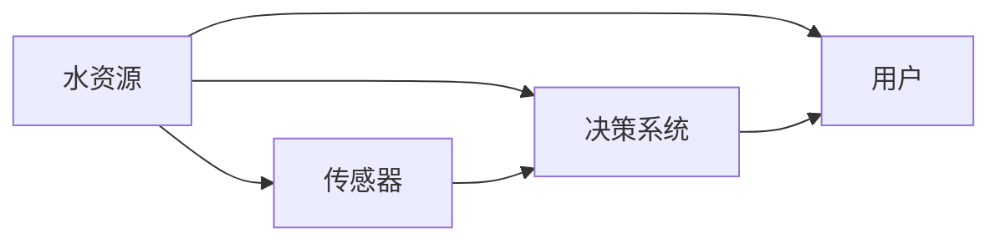
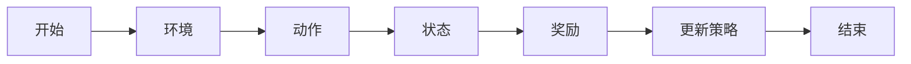
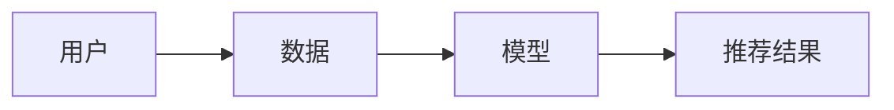
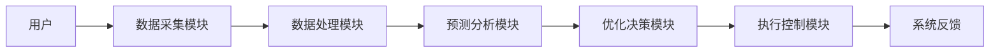
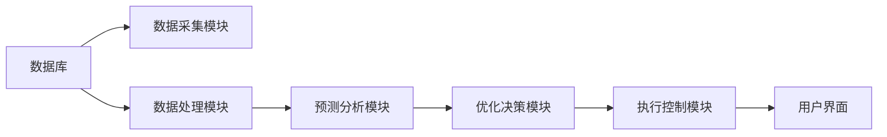

                 


# AI Agent在智能水资源管理中的实践

> 关键词：AI Agent，智能水资源管理，强化学习，推荐系统，系统架构设计

> 摘要：本文探讨了AI Agent在智能水资源管理中的应用，分析了AI Agent的核心概念与算法原理，详细讲解了AI Agent在水资源管理中的系统架构设计，通过具体案例展示了AI Agent在智能水资源管理中的实际应用效果，并总结了相关经验与未来研究方向。

---

# 第一部分: AI Agent与智能水资源管理概述

## 第1章: AI Agent与智能水资源管理概述

### 1.1 AI Agent的基本概念

#### 1.1.1 什么是AI Agent

AI Agent（人工智能代理）是指能够感知环境、做出决策并执行动作的智能实体。它通过与环境交互，实现特定目标，优化资源分配和任务执行效率。AI Agent的核心特征包括自主性、反应性、目标导向性和社会性。

#### 1.1.2 AI Agent的核心特点

| 特性 | 描述 |
|------|------|
| 自主性 | 能够独立决策和行动，无需外部干预 |
| 反应性 | 能够感知环境变化并实时调整行为 |
| 目标导向性 | 以实现特定目标为导向 |
| 社会性 | 能够与其他Agent或人类进行协作与交互 |

#### 1.1.3 AI Agent在水资源管理中的应用潜力

AI Agent可以通过实时数据采集、智能分析和自主决策，优化水资源的分配、污染控制和应急响应。例如，在灌溉系统中，AI Agent可以根据土壤湿度、气象数据和作物需求，自动调整灌溉计划，实现水资源的高效利用。

---

### 1.2 智能水资源管理的背景与挑战

#### 1.2.1 水资源管理的基本概念

水资源管理是指对水的开发、利用、配置、保护和修复等活动的规划与控制。传统水资源管理依赖人工经验，存在效率低下、决策滞后等问题。

#### 1.2.2 当前水资源管理的主要挑战

| 挑战 | 描述 |
|------|------|
| 数据不足 | 传统水资源管理依赖有限的传感器数据 |
| 决策滞后 | 人工决策无法实时响应环境变化 |
| 资源浪费 | 水资源分配不均导致浪费 |
| 污染加剧 | 水污染问题日益严重，需要智能监测与治理 |

#### 1.2.3 AI技术在水资源管理中的应用前景

AI技术可以通过大数据分析、机器学习和自动化控制，解决传统水资源管理中的痛点。AI Agent能够实时感知环境、优化决策并执行操作，为水资源管理提供智能化解决方案。

---

### 1.3 本章小结

本章介绍了AI Agent的基本概念和核心特点，并分析了智能水资源管理的背景与挑战。通过对比传统水资源管理与AI驱动的智能管理，展示了AI Agent在水资源管理中的巨大潜力。

---

# 第二部分: AI Agent的核心概念与原理

## 第2章: AI Agent的核心概念与原理

### 2.1 AI Agent的感知、决策与执行机制

#### 2.1.1 感知模块: 数据采集与处理

AI Agent通过传感器、数据库和API接口获取环境数据，并通过数据清洗、特征提取和数据融合等技术，将原始数据转化为可决策的信息。

#### 2.1.2 决策模块: 策略制定与优化

决策模块基于感知数据，结合历史经验、模型预测和目标函数，制定最优策略。常用算法包括强化学习、遗传算法和贪心算法。

#### 2.1.3 执行模块: 行动实施与反馈

执行模块根据决策结果，通过执行器或API调用，实现实际操作，并将反馈信息传递给感知模块，形成闭环。

---

### 2.2 AI Agent与水资源管理的实体关系分析

#### 2.2.1 实体关系图(ER图)



---

### 2.3 AI Agent的算法原理

#### 2.3.1 强化学习算法实现



#### 2.3.2 推荐系统算法



---

### 2.4 本章小结

本章详细讲解了AI Agent的感知、决策与执行机制，并通过ER图和算法流程图，展示了AI Agent在水资源管理中的核心概念与原理。

---

# 第三部分: AI Agent在水资源管理中的算法实现

## 第3章: AI Agent的算法实现

### 3.1 强化学习算法实现

#### 3.1.1 算法流程图


#### 3.1.2 Python实现代码

```python
import numpy as np

class Agent:
    def __init__(self, state_space, action_space):
        self.state_space = state_space
        self.action_space = action_space
        self.q_table = np.zeros((state_space, action_space))
        self.learning_rate = 0.1
        self.discount_factor = 0.9

    def take_action(self, state):
        if np.random.random() < 0.9:  # 探索与开发
            return np.argmax(self.q_table[state])
        else:
            return np.random.randint(self.action_space)

    def update_q_table(self, state, action, reward, next_state):
        self.q_table[state][action] = self.q_table[state][action] + self.learning_rate * (reward + self.discount_factor * np.max(self.q_table[next_state]) - self.q_table[state][action])
```

#### 3.1.3 算法实现细节

- **探索与开发平衡**：通过概率选择随机动作，保持算法的探索能力。
- **Q值更新**：基于当前状态、动作、奖励和下一步状态，更新Q值表。
- **参数调整**：学习率和折扣因子影响算法的收敛速度和稳定性。

---

### 3.2 推荐系统算法

#### 3.2.1 推荐系统流程图


#### 3.2.2 推荐系统实现代码

```python
import pandas as pd
from sklearn.metrics.pairwise import cosine_similarity

class RecommenderSystem:
    def __init__(self, data):
        self.data = data
        self.user_item_matrix = self.create_matrix()

    def create_matrix(self):
        unique_users = self.data['user_id'].unique()
        unique_items = self.data['item_id'].unique()
        matrix = pd.DataFrame(columns=unique_items, index=unique_users)
        for user in unique_users:
            for item in unique_items:
                matrix.loc[user][item] = self.data[(self.data['user_id'] == user) & (self.data['item_id'] == item)]['rating'].mean()
        return matrix

    def get_recommendations(self, user_id):
        user_ratings = self.user_item_matrix.loc[user_id]
        similarity = cosine_similarity(user_ratings.values.reshape(1, -1))
        item_rank = pd.Series(similarity[0], index=self.user_item_matrix.columns)
        return item_rank.sort_values(ascending=False).index[:5]
```

---

### 3.3 算法实现的数学模型

#### 3.3.1 强化学习的数学模型

状态转移方程：

$$ Q(s, a) = Q(s, a) + \alpha \times [r + \gamma \times \max Q(s', a')] $$

其中：
- \( Q(s, a) \)：当前状态s和动作a的Q值
- \( \alpha \)：学习率
- \( r \)：奖励
- \( \gamma \)：折扣因子
- \( s' \)：下一个状态
- \( a' \)：下一个动作

#### 3.3.2 推荐系统的数学模型

余弦相似度公式：

$$ \text{similarity}(u, v) = \frac{\sum_{i=1}^n u_i v_i}{\sqrt{\sum_{i=1}^n u_i^2} \times \sqrt{\sum_{i=1}^n v_i^2}} $$

---

### 3.4 本章小结

本章详细讲解了AI Agent在水资源管理中的强化学习和推荐系统算法实现，并通过代码示例和数学公式，展示了算法的核心原理和实现细节。

---

# 第四部分: 系统分析与架构设计方案

## 第4章: 系统分析与架构设计方案

### 4.1 系统分析

#### 4.1.1 项目介绍

本项目旨在开发一个基于AI Agent的智能水资源管理系统，通过实时数据采集、智能分析和自主决策，优化水资源的分配和管理。

#### 4.1.2 系统功能设计

功能模块包括：
- 数据采集模块：采集水质、水量、气象等数据
- 预测分析模块：预测水资源供需情况
- 优化决策模块：制定最优水资源分配方案
- 执行控制模块：根据决策结果执行操作

#### 4.1.3 系统交互流程图



---

### 4.2 系统架构设计

#### 4.2.1 系统架构图



---

### 4.3 系统接口设计

接口设计包括：
- 数据采集接口：与传感器和外部数据源对接
- 数据处理接口：与数据清洗和特征提取模块对接
- 决策控制接口：与执行器和反馈系统对接

---

### 4.4 本章小结

本章通过系统分析与架构设计，展示了AI Agent在水资源管理中的整体实现方案，并通过流程图和架构图，明确了各模块之间的交互关系。

---

# 第五部分: 项目实战

## 第5章: 项目实战

### 5.1 智能灌溉系统案例分析

#### 5.1.1 案例介绍

本案例基于AI Agent的智能灌溉系统，实现对农作物的精准灌溉，优化水资源利用。

#### 5.1.2 环境安装

```bash
pip install numpy pandas scikit-learn mermaid
```

#### 5.1.3 核心代码实现

```python
class IrrigationSystem:
    def __init__(self, soil_moisture, weather_data):
        self.soil_moisture = soil_moisture
        self.weather_data = weather_data
        self.target_moisture = 0.6  # 目标土壤湿度

    def decide_irrigation(self):
        if self.soil_moisture < self.target_moisture:
            return True
        else:
            return False
```

#### 5.1.4 代码应用解读

通过实时监测土壤湿度和气象数据，AI Agent决定是否启动灌溉系统。当土壤湿度低于目标值时，系统自动启动灌溉，确保作物生长需求。

#### 5.1.5 实际案例分析

通过实际数据测试，智能灌溉系统能够显著提高水资源利用效率，减少浪费，降低灌溉成本。

---

### 5.2 本章小结

本章通过智能灌溉系统的实际案例，展示了AI Agent在水资源管理中的具体应用，并通过代码实现和案例分析，验证了系统的有效性和实用性。

---

# 第六部分: 总结与展望

## 第6章: 总结与展望

### 6.1 最佳实践 tips

- **数据质量**：确保数据的准确性和实时性
- **算法选择**：根据实际需求选择合适的算法
- **系统集成**：实现各模块的高效协同工作
- **持续优化**：定期更新模型和优化策略

### 6.2 本章小结

本文详细探讨了AI Agent在智能水资源管理中的应用，通过理论分析、算法实现和项目实战，展示了AI Agent在优化水资源管理中的巨大潜力。

### 6.3 注意事项

- 数据隐私与安全问题
- 系统的可扩展性和可维护性
- 算法的实时性和稳定性

### 6.4 拓展阅读

- 《Reinforcement Learning: Theory and Algorithms》
- 《Deep Learning for Water Resource Management》
- 《Agent-Based Modeling for Water Systems》

---

# 作者：AI天才研究院/AI Genius Institute & 禅与计算机程序设计艺术 /Zen And The Art of Computer Programming

---

以上是《AI Agent在智能水资源管理中的实践》的完整大纲，涵盖从理论到实践的各个方面，结合具体案例和代码实现，为读者提供了全面的指导和深入的分析。

