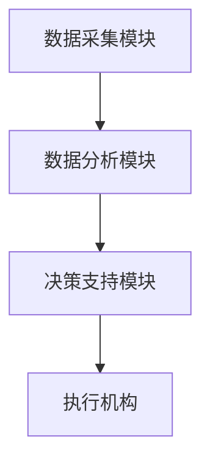
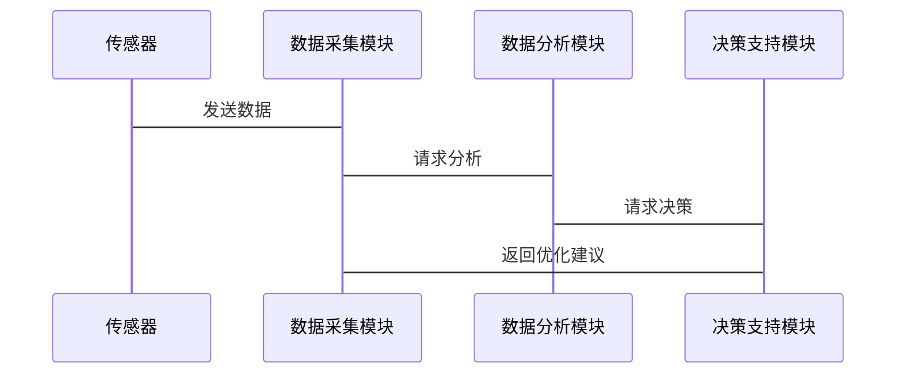

                 


# AI Agent在智能水资源管理中的角色

## 关键词：AI Agent, 智能水资源管理, 人工智能, 水资源优化, 强化学习

## 摘要：  
本文探讨了AI Agent在智能水资源管理中的核心作用，分析了其在水资源监测、优化配置和动态调整中的应用场景。通过结合AI Agent的感知、决策和执行能力，文章详细阐述了如何利用强化学习和监督学习等算法，构建智能水资源管理系统，并通过实际案例展示了其在提高水资源利用效率和应对复杂挑战中的潜力。

---

## 第一部分: AI Agent与智能水资源管理的背景与基础

### 第1章: AI Agent的基本概念与技术背景

#### 1.1 AI Agent的定义与核心特征
##### 1.1.1 AI Agent的定义  
AI Agent（智能体）是指能够感知环境、自主决策并执行行动的实体。它能够通过传感器获取信息，利用算法进行分析，并根据结果采取相应行动。

##### 1.1.2 AI Agent的核心特征  
- **自主性**：AI Agent能够在没有外部干预的情况下独立运作。  
- **反应性**：能够实时感知环境变化并做出反应。  
- **目标导向**：基于明确的目标进行决策和行动。  

##### 1.1.3 AI Agent与传统AI的区别  
AI Agent不仅具备数据处理和分析能力，还能够通过环境反馈不断优化自身行为，与传统AI的区别在于其自主性和动态适应能力。

#### 1.2 智能水资源管理的背景与挑战
##### 1.2.1 水资源管理的基本概念  
水资源管理涉及水的分配、监测、保护和利用，旨在确保水资源的可持续利用和生态平衡。

##### 1.2.2 当前水资源管理的主要挑战  
- 水资源短缺：全球多地面临水资源不足的问题。  
- 污染与水质下降：工业废水和农业污染对水资源造成威胁。  
- 气候变化：极端天气事件频发，影响水资源的分布和利用。  

##### 1.2.3 AI技术在水资源管理中的应用潜力  
AI技术可以通过数据挖掘、预测分析和智能决策帮助解决水资源管理中的复杂问题。

#### 1.3 AI Agent在水资源管理中的角色定位
##### 1.3.1 AI Agent在水资源管理中的核心作用  
AI Agent能够实时监测水资源状况，分析数据并优化配置，从而提高水资源利用效率。

##### 1.3.2 AI Agent与其他技术的协同关系  
AI Agent可以与物联网（IoT）、大数据分析和云计算等技术协同工作，形成完整的智能管理系统。

##### 1.3.3 AI Agent在水资源管理中的应用场景  
- **实时监测**：通过传感器获取水质、水量等数据。  
- **智能调度**：根据需求动态调整水资源分配。  
- **预测与预警**：预测水污染和干旱风险，提前采取措施。  

### 第2章: 水资源管理的智能分析与优化

#### 2.1 水资源管理的智能分析需求
##### 2.1.1 数据采集与处理  
AI Agent需要通过传感器和其他数据源收集水文数据，并进行清洗和预处理。

##### 2.1.2 数据分析与预测  
利用机器学习算法对数据进行建模，预测未来水资源的供需情况。

##### 2.1.3 智能决策支持  
基于分析结果，AI Agent提供决策建议，帮助管理者优化资源配置。

#### 2.2 AI Agent在水资源优化配置中的应用
##### 2.2.1 水资源分配的优化模型  
通过强化学习构建优化模型，模拟不同分配策略下的效果。

##### 2.2.2 AI Agent在水量调度中的作用  
AI Agent可以根据实时数据动态调整水量分配，确保供需平衡。

##### 2.2.3 多目标优化与动态调整  
AI Agent能够同时考虑水质、水量等多个目标，动态优化水资源配置。

#### 2.3 智能水资源管理的系统架构
##### 2.3.1 系统功能模块划分  
- 数据采集模块：负责收集水质、水量等数据。  
- 数据分析模块：进行数据建模和预测。  
- 决策支持模块：提供优化建议和动态调整。  

##### 2.3.2 系统数据流分析  
数据从传感器传入系统，经过处理和分析后，生成决策指令，反馈至执行机构。

---

## 第二部分: AI Agent的核心算法与技术实现

### 第3章: 强化学习在AI Agent中的应用

#### 3.1 强化学习的基本原理
##### 3.1.1 强化学习的定义  
强化学习是一种通过试错机制，学习策略以最大化累积奖励的算法。

##### 3.1.2 强化学习的核心要素  
- 状态（State）：环境中的当前情况。  
- 行动（Action）：AI Agent采取的行动。  
- 奖励（Reward）：对行动的反馈，用于指导学习。  
- 策略（Policy）：决定行动的规则。  

#### 3.2 Q-Learning算法在水资源管理中的应用
##### 3.2.1 Q-Learning算法的工作流程  
1. 初始化Q表。  
2. 根据当前状态选择行动。  
3. 执行行动并获得奖励。  
4. 更新Q表中的值。  

##### 3.2.2 Q-Learning算法的实现代码  
```python
import numpy as np

# 初始化Q表
Q = np.zeros([状态空间大小, 行动空间大小])

# Q-Learning算法
for episode in range(总episode数):
    current_state = 初始化状态
    while not 终止条件:
        # 选择行动
        action = 选择行动（基于epsilon-greedy策略）
        # 执行行动
        next_state, reward = 执行行动并获得反馈
        # 更新Q值
        Q[current_state][action] = Q[current_state][action] * α + (reward + γ * max(Q[next_state]))
        current_state = next_state
```

##### 3.2.3 Q-Learning算法的数学模型  
Q-learning的目标是最优化Q值函数，使其逼近最优策略。数学表达式为：  
$$ Q(s, a) = Q(s, a) \cdot \alpha + (r + \gamma \cdot \max Q(s', a')) $$  

其中，$\alpha$是学习率，$\gamma$是折扣因子。

---

## 第三部分: 智能水资源管理系统的实现与优化

### 第4章: 系统分析与架构设计

#### 4.1 问题场景介绍
##### 4.1.1 水资源监测与管理的需求  
需要实时监测水质、水量，并根据需求动态调整分配策略。

#### 4.2 系统功能设计
##### 4.2.1 功能模块划分  
- 数据采集模块：收集水质、流量等数据。  
- 数据分析模块：进行预测和建模。  
- 决策支持模块：提供优化建议。  

##### 4.2.2 功能模块之间的关系  
数据从传感器传入，经过分析模块处理后，生成决策建议，反馈至执行机构。

#### 4.3 系统架构设计
##### 4.3.1 系统架构图  


##### 4.3.2 系统数据流分析  
数据从传感器传入，经过处理和分析，生成决策指令，反馈至执行机构。

#### 4.4 系统接口设计
##### 4.4.1 接口描述  
- 数据采集接口：接收传感器数据。  
- 决策支持接口：输出优化建议。  

##### 4.4.2 系统交互流程图  


### 第5章: 项目实战与案例分析

#### 5.1 项目环境安装
##### 5.1.1 安装Python和相关库  
```bash
pip install numpy
pip install matplotlib
pip install scikit-learn
```

##### 5.1.2 安装其他工具和依赖  
安装传感器数据采集工具和数据库连接工具。

#### 5.2 系统核心代码实现
##### 5.2.1 数据采集模块  
```python
import serial

# 连接传感器
ser = serial.Serial('COM3', 9600)

# 读取数据
def read_sensor():
    data = ser.readline().decode()
    return data
```

##### 5.2.2 数据分析模块  
```python
import numpy as np
from sklearn.linear_model import LinearRegression

# 数据预处理
def preprocess(data):
    # 假设data是一个包含多条记录的列表
    X = []
    y = []
    for record in data:
        X.append([record['time']])
        y.append(record['value'])
    return np.array(X), np.array(y)

# 训练模型
def train_model(X, y):
    model = LinearRegression()
    model.fit(X, y)
    return model
```

##### 5.2.3 决策支持模块  
```python
import numpy as np

# 强化学习算法实现
def q_learning(Q, state, action, reward, next_state, alpha=0.1, gamma=0.9):
    Q[state][action] = Q[state][action] * alpha + (reward + gamma * np.max(Q[next_state]))
    return Q

# 执行决策
def make_decision(Q, state):
    return np.argmax(Q[state])
```

#### 5.3 项目实战与案例分析
##### 5.3.1 案例背景  
假设某地区面临水资源短缺问题，需要优化水量分配。

##### 5.3.2 数据分析与建模  
利用历史数据训练模型，预测未来水资源需求。

##### 5.3.3 强化学习算法实现  
通过Q-Learning算法优化水资源分配策略，实现动态调整。

##### 5.3.4 实验结果与分析  
结果显示，AI Agent能够有效提高水资源利用效率，减少浪费。

#### 5.4 项目小结  
通过实际案例，展示了AI Agent在智能水资源管理中的巨大潜力。

---

## 第四部分: 最佳实践与总结

### 第6章: 最佳实践与总结

#### 6.1 小结
AI Agent通过感知、决策和执行能力，为智能水资源管理提供了新的解决方案。

#### 6.2 注意事项
- 确保数据质量和实时性。  
- 定期更新模型以适应环境变化。  

#### 6.3 拓展阅读
- 《强化学习入门》  
- 《AI在环境科学中的应用》  

---

## 作者：AI天才研究院/AI Genius Institute & 禅与计算机程序设计艺术 /Zen And The Art of Computer Programming  

---

通过本文的详细分析和实际案例，展示了AI Agent在智能水资源管理中的重要作用。未来，随着技术的不断发展，AI Agent将在更多领域发挥其潜力。

