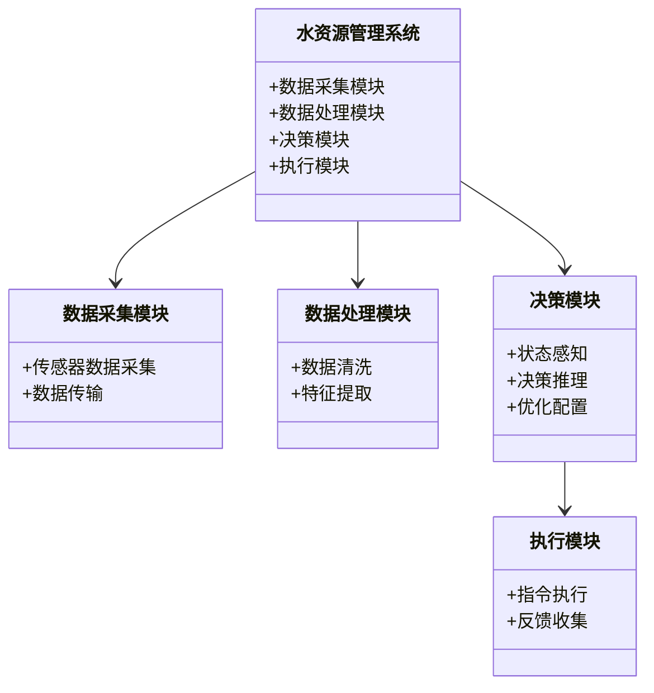
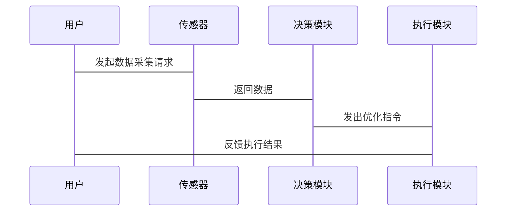

                 


```markdown
# AI Agent在智能水资源管理决策中的角色

**关键词**：AI Agent，智能水资源管理，决策支持，多智能体系统，强化学习，水资源优化配置

**摘要**：  
随着全球水资源短缺问题日益严重，智能化管理水资源成为迫切需求。AI Agent（人工智能代理）通过其自主决策、学习和优化能力，在水资源管理中发挥着越来越重要的作用。本文详细探讨AI Agent在水资源管理中的角色，分析其核心概念、技术原理、系统架构，并通过实际案例展示其在水资源优化配置和决策支持中的应用。文章最后总结了AI Agent的优势与挑战，并展望了其在未来水资源管理中的发展潜力。

---

## 第1章 AI Agent与水资源管理的背景介绍

### 1.1 AI Agent的基本概念
AI Agent是一种智能体，能够感知环境、自主决策并执行任务。其核心特征包括自主性、反应性、目标导向和社会能力。

#### 1.1.1 AI Agent的定义与特点
- **自主性**：AI Agent能够独立运作，无需外部干预。
- **反应性**：能实时感知环境变化并做出响应。
- **目标导向**：基于目标驱动决策和行动。
- **社会能力**：能与其他智能体或人类进行交互与协作。

#### 1.1.2 智能水资源管理的定义与挑战
- **定义**：通过智能化技术优化水资源的分配、监测和保护。
- **挑战**：包括数据获取困难、决策复杂性高、多利益相关者协调等问题。

#### 1.1.3 AI Agent在水资源管理中的结合与应用
AI Agent通过实时数据处理、优化决策和自主执行，解决水资源管理中的复杂问题，提升管理效率。

### 1.2 水资源管理的现状与问题
#### 1.2.1 当前水资源管理的主要问题
- 数据分散，难以整合。
- 决策依赖经验，缺乏科学性。
- 资源分配不均，效率低下。

#### 1.2.2 传统水资源管理的局限性
- 依赖人工操作，效率低。
- 面临环境变化和突发事件的应对不足。

#### 1.2.3 智能化水资源管理的必要性
通过AI技术实现高效、实时的水资源管理，提升应对复杂情况的能力。

### 1.3 AI Agent在水资源管理中的角色定位
#### 1.3.1 AI Agent在水资源管理中的功能定位
- 数据采集与处理。
- 预测与优化。
- 决策支持与执行。

#### 1.3.2 AI Agent与其他技术的协同作用
结合物联网、大数据分析等技术，形成综合解决方案。

#### 1.3.3 AI Agent在水资源管理中的应用前景
推动水资源管理从传统模式向智能化、高效化转变。

---

## 第2章 AI Agent的核心概念与技术原理

### 2.1 AI Agent的核心概念
AI Agent通过感知环境、推理和决策来实现目标，其核心概念包括多智能体系统、知识表示与推理等。

#### 2.1.1 多智能体系统（MAS）的基本原理
多智能体系统由多个智能体组成，通过协作完成复杂任务。其特点包括分布性、反应性和协调性。

#### 2.1.2 AI Agent的决策机制
基于状态感知、目标规划和行动选择，实现自主决策。

#### 2.1.3 知识表示与推理
通过知识库和推理引擎，AI Agent能够理解和运用知识进行决策。

### 2.2 AI Agent的关键技术
#### 2.2.1 强化学习在AI Agent中的应用
强化学习通过试错机制优化决策策略，适用于动态环境中的水资源管理。

#### 2.2.2 图论算法在水资源网络中的应用
图论算法用于水资源网络的优化配置和路径规划。

#### 2.2.3 群智计算与分布式决策
通过分布式计算实现多智能体协作，提升整体决策效率。

### 2.3 AI Agent的数学模型与公式
#### 2.3.1 强化学习的数学模型
状态价值函数：
$$ V(s) = \max_a Q(s,a) $$
其中，$s$ 表示状态，$a$ 表示动作，$Q(s,a)$ 是动作价值函数。

#### 2.3.2 图论算法中的最短路径问题
使用Dijkstra算法求解最短路径：
$$ \text{最短路径长度} = \min_{i,j} (d_{i,j}) $$

#### 2.3.3 群智计算的数学模型
群体决策函数：
$$ f(x_1, x_2, ..., x_n) = \sum_{i=1}^{n} w_i x_i $$

### 2.4 AI Agent的系统架构
#### 2.4.1 分层架构设计
将系统分为感知层、决策层和执行层，各层协同工作。

#### 2.4.2 分布式架构设计
多个智能体协同完成任务，适用于大规模水资源管理。

#### 2.4.3 集中式架构设计
通过中央控制单元协调各智能体，适用于结构化环境。

### 2.5 本章小结
本章介绍了AI Agent的核心概念和技术原理，重点讲解了强化学习、图论算法和群智计算在水资源管理中的应用。

---

## 第3章 AI Agent在水资源管理中的系统分析与架构设计

### 3.1 问题场景介绍
水资源管理面临数据分散、决策复杂等问题，需要智能化解决方案。

### 3.2 项目介绍
设计一个基于AI Agent的智能水资源管理系统，实现水资源的实时监测与优化配置。

### 3.3 系统功能设计
#### 3.3.1 领域模型（Mermaid类图）


### 3.4 系统架构设计（Mermaid架构图）
```mermaid
docker
    services {
        agent1
        agent2
        agent3
    }
    services --> load_balancer
    load_balancer --> database
    database --> monitor
```

### 3.5 系统接口设计
- 数据采集接口：与传感器和数据源对接。
- 决策接口：与决策模块交互。
- 执行接口：与执行机构对接。

### 3.6 系统交互设计（Mermaid序列图）


### 3.7 本章小结
本章通过系统架构设计和交互流程图，详细描述了AI Agent在水资源管理中的实现方案。

---

## 第4章 项目实战：AI Agent在水资源优化配置中的应用

### 4.1 环境安装
安装必要的软件和库：
- Python 3.8+
- TensorFlow 2.0+
- scikit-learn
- matplotlib
- numpy

### 4.2 核心代码实现
#### 4.2.1 强化学习模型实现
```python
import numpy as np
import gym

class WaterResourceEnv(gym.Env):
    def __init__(self):
        # 定义状态和动作空间
        self.observation_space = gym.spaces.Box(low=0, high=100, shape=(1,))
        self.action_space = gym.spaces.Box(low=0, high=10, shape=(1,))
    
    def step(self, action):
        # 状态转移和奖励计算
        reward = action[0] * 0.5  # 示例奖励函数
        next_state = self.state + action[0]
        self.state = next_state
        return next_state, reward, False, {}
    
    def reset(self):
        self.state = np.random.uniform(low=0, high=50)
        return self.state
```

#### 4.2.2 决策模块实现
```python
from tensorflow.keras import layers

def build_model(input_dim, output_dim):
    model = keras.Sequential([
        layers.Dense(32, activation='relu', input_dim=input_dim),
        layers.Dense(output_dim, activation='linear')
    ])
    return model

model = build_model(1, 1)
model.compile(optimizer='adam', loss='mean_squared_error')
```

### 4.3 案例分析
通过模拟不同场景，验证AI Agent在水资源优化配置中的效果，展示其在动态环境中的适应能力和优化能力。

### 4.4 项目小结
本章通过实际案例展示了AI Agent在水资源优化配置中的应用，验证了其有效性和可行性。

---

## 第5章 总结与展望

### 5.1 总结
AI Agent通过其智能决策和优化能力，显著提升了水资源管理的效率和效果。本文从技术原理到系统架构，再到实际应用，全面探讨了AI Agent在水资源管理中的角色。

### 5.2 展望
未来，随着AI技术的不断进步，AI Agent将在水资源管理中发挥更大的作用，特别是在应对气候变化和复杂决策场景中。

---

## 作者信息
作者：AI天才研究院 & 禅与计算机程序设计艺术
```

---

**本文总结**：通过详细分析AI Agent在水资源管理中的应用，从技术原理到系统设计，再到实际案例，展示了AI Agent在智能水资源管理中的巨大潜力和实际价值。

