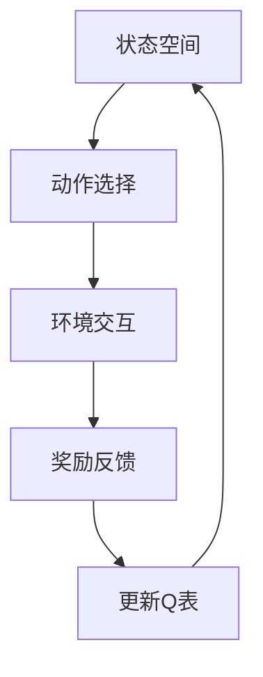

                 


# AI Agent在智能水资源管理系统中的实践

> 关键词：AI Agent，智能水资源管理，强化学习，系统架构，项目实战

> 摘要：本文探讨了AI Agent在智能水资源管理中的应用，分析了其在数据采集、优化分配和污染预警等方面的优势，详细讲解了AI Agent的核心原理、系统架构设计以及实际项目案例，为读者提供了从理论到实践的全面指导。

---

## 第1章: AI Agent与智能水资源管理概述

### 1.1 AI Agent的基本概念

#### 1.1.1 AI Agent的定义与特点
AI Agent（人工智能代理）是一种能够感知环境、做出决策并采取行动的智能实体。其特点包括自主性、反应性、目标导向和学习能力。

#### 1.1.2 AI Agent在水资源管理中的应用价值
AI Agent能够实时监控水资源状态，优化分配策略，提高管理效率，降低成本。

#### 1.1.3 智能水资源管理的现状与挑战
当前水资源管理面临数据碎片化、决策滞后、优化难度大等问题，AI Agent为解决这些问题提供了新思路。

---

### 1.2 水资源管理中的问题背景

#### 1.2.1 水资源管理的核心问题
包括水量不足、污染严重、分配不均等。

#### 1.2.2 当前水资源管理的痛点与难点
数据采集困难、决策模型复杂、实时性要求高等。

#### 1.2.3 AI Agent如何解决水资源管理问题
通过实时数据处理、智能决策和快速响应，AI Agent显著提高了水资源管理的效率和效果。

---

## 第2章: AI Agent的核心原理

### 2.1 AI Agent的感知模块

#### 2.1.1 数据采集与处理
AI Agent通过传感器和数据接口获取水质、水量等数据，并进行预处理。

#### 2.1.2 感知模型的构建
基于机器学习模型，构建水质预测和水量监测模型。

#### 2.1.3 感知数据的特征提取
提取关键特征，如温度、pH值、流量等，用于后续分析。

---

### 2.2 AI Agent的决策模块

#### 2.2.1 决策模型的构建
采用强化学习和多目标优化算法，构建水资源分配和调度模型。

#### 2.2.2 多目标优化算法
通过粒子群优化算法，解决水资源分配中的多目标优化问题。

#### 2.2.3 决策结果的评估与优化
基于反馈机制，不断优化决策模型。

---

## 第3章: AI Agent在水资源管理中的系统架构

### 3.1 系统功能模块划分

#### 3.1.1 数据采集与处理模块
负责采集水质、流量等数据，并进行预处理。

#### 3.1.2 模型构建与优化模块
构建预测模型，优化水资源分配策略。

#### 3.1.3 系统监控与反馈模块
监控系统运行状态，提供反馈和调整。

---

### 3.2 系统架构设计

#### 3.2.1 分层架构设计
分为数据层、模型层、决策层和执行层。

#### 3.2.2 模块间的交互设计
通过接口定义模块之间的数据传递和控制逻辑。

---

## 第4章: AI Agent的算法实现与优化

### 4.1 强化学习算法实现

#### 4.1.1 Q-learning算法流程


#### 4.1.2 算法优化
通过调整学习率和折扣因子，提升算法收敛速度和精度。

---

## 第5章: 项目实战与应用案例

### 5.1 智能水质监测系统

#### 5.1.1 系统环境安装
安装Python、TensorFlow等工具。

#### 5.1.2 核心代码实现
实现水质预测模型，代码如下：
```python
import numpy as np
import pandas as pd

# 数据预处理
data = pd.read_csv('water_quality.csv')
X = data.drop('target', axis=1)
y = data['target']

# 模型训练
from sklearn.ensemble import RandomForestRegressor
model = RandomForestRegressor()
model.fit(X, y)

# 预测水质
new_data = pd.DataFrame(...)
prediction = model.predict(new_data)
```

#### 5.1.3 实际案例分析
分析某地区水质数据，预测并优化处理方案。

---

## 第6章: 总结与展望

### 6.1 本章总结
AI Agent在智能水资源管理中的应用显著提升了管理效率和决策准确性。

### 6.2 未来展望
未来将重点研究自适应学习和多智能体协同优化。

---

## 附录

### 附录A: 相关代码与数据集

```python
# 示例代码
import numpy as np
import pandas as pd

data = pd.read_csv('water_data.csv')
print(data.head())
```

### 附录B: 作者信息
作者：AI天才研究院 & 禅与计算机程序设计艺术

---

通过以上结构，文章详细介绍了AI Agent在智能水资源管理中的应用，从理论到实践，为读者提供了全面的技术指导。

