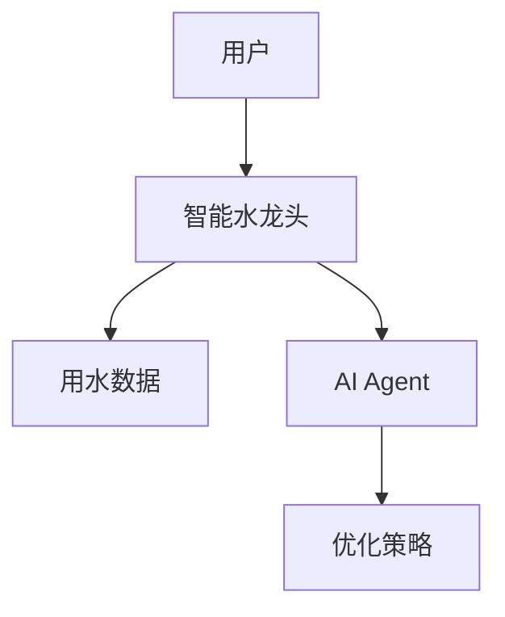
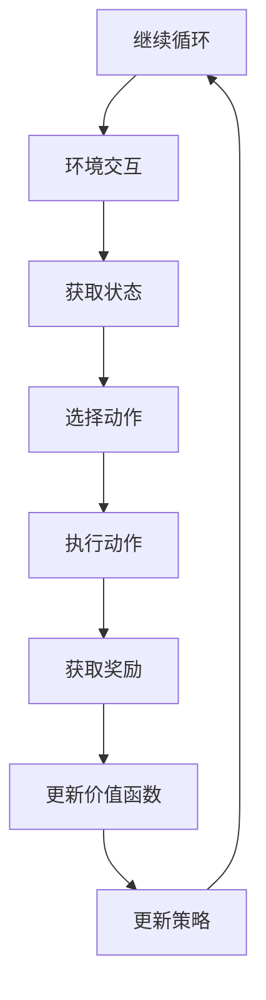
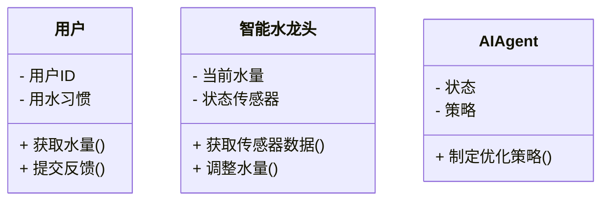
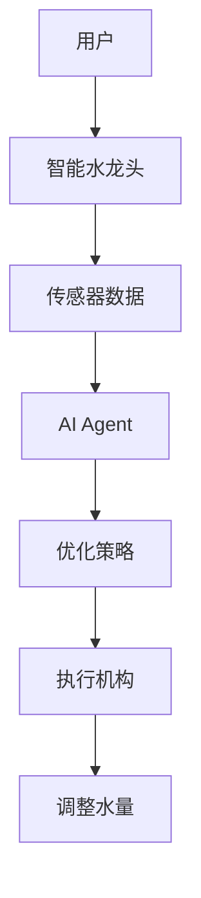
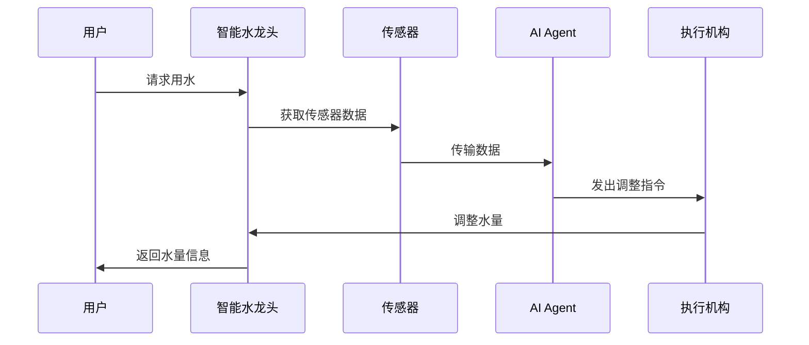

                 


# AI Agent在智能水龙头中的用水优化

> 关键词：AI Agent，智能水龙头，用水优化，强化学习，动态规划，系统架构，优化算法

> 摘要：本文详细探讨了AI Agent在智能水龙头中的用水优化问题，从问题背景、核心概念、算法原理、系统设计到项目实战，系统性地分析了如何利用AI技术实现用水的智能化优化。通过强化学习和动态规划算法，结合智能水龙头的系统架构设计，本文提出了一套完整的优化方案，并通过实际案例验证了方案的有效性。

---

## 第一部分: 背景介绍

### 第1章: 问题背景与需求分析

#### 1.1 用水优化的背景介绍

随着全球水资源短缺问题日益严重，优化用水效率成为一项重要任务。智能水龙头作为一种新兴的节水设备，通过结合AI技术，可以实现更加智能化的用水优化。传统水龙头的用水效率低下，无法根据实际需求动态调整出水量。而智能水龙头通过集成传感器、数据采集和AI算法，能够实时感知用水需求，并动态调整出水量，从而实现节水目标。

#### 1.2 智能水龙头的核心需求

智能水龙头的设计需要满足以下核心需求：
- 实时感知用户的用水需求
- 动态调整出水量以匹配实际需求
- 优化用水效率，减少水资源浪费
- 高效的数据采集与处理能力
- 可扩展性与可维护性

#### 1.3 问题解决思路

为了实现用水优化，AI Agent需要具备以下能力：
- 实时感知用户的用水行为
- 建立数学模型描述用水需求与出水量的关系
- 利用强化学习算法优化出水量
- 结合动态规划算法实现长期优化目标

#### 1.4 本章小结

本章从背景介绍和需求分析入手，明确了智能水龙头的核心需求以及AI Agent在用水优化中的作用。接下来将详细探讨AI Agent与智能水龙头的核心概念。

---

## 第二部分: 核心概念与联系

### 第2章: AI Agent与智能水龙头的核心概念

#### 2.1 AI Agent的基本原理

AI Agent是一种智能体，能够感知环境并采取行动以实现目标。AI Agent的核心要素包括：
- 感知能力：通过传感器或其他方式获取环境信息
- 决策能力：基于感知信息做出决策
- 行为能力：通过执行动作影响环境
- 学习能力：通过经验改进决策策略

与传统自动化系统相比，AI Agent的优势在于其具备学习能力和适应性，能够根据环境变化动态调整行为。

#### 2.2 智能水龙头的系统架构

智能水龙头的系统架构包括以下功能模块：
- 传感器模块：采集用户的用水行为数据
- 数据处理模块：对采集的数据进行分析和处理
- AI Agent模块：根据数据制定优化策略
- 执行机构：根据优化策略调整出水量

#### 2.3 用水优化的数学模型

用水优化的目标是通过调整出水量来最小化水资源浪费，同时满足用户的用水需求。数学模型如下：

$$
\min \sum_{t=1}^{T} w_t \\
s.t. \\
w_t \leq D_t, \forall t \\
w_t \geq 0, \forall t
$$

其中，$w_t$ 表示第 $t$ 时刻的出水量，$D_t$ 表示第 $t$ 时刻的最大允许出水量。

#### 2.4 核心概念对比分析

通过对比分析，可以更好地理解AI Agent与智能水龙头的关系。以下是核心概念的属性对比表：

| 属性 | AI Agent | 智能水龙头 |
|------|----------|------------|
| 定义 | 智能体，能够感知环境并采取行动 | 智能设备，能够动态调整出水量 |
| 核心功能 | 决策与优化 | 数据采集与执行 |
| 优化目标 | 最大化目标函数 | 最小化水资源浪费 |
| 依赖性 | 数据采集与反馈 | AI Agent的决策 |

此外，通过ER实体关系图可以更清晰地理解系统的构成：



#### 2.5 本章小结

本章详细讲解了AI Agent与智能水龙头的核心概念，并通过对比分析和ER实体关系图展示了它们之间的关系。接下来将深入探讨AI Agent在用水优化中的算法原理。

---

## 第三部分: 算法原理讲解

### 第3章: 强化学习算法原理

#### 3.1 强化学习的基本概念

强化学习是一种通过试错方式来优化决策的算法。其核心要素包括：
- 状态（State）：环境的当前情况
- 动作（Action）：智能体采取的行动
- 奖励（Reward）：环境对动作的反馈
- 策略（Policy）：动作选择的概率分布

强化学习的目标是通过不断试错，找到最优策略以最大化累计奖励。

#### 3.2 动态规划算法原理

动态规划是一种通过分解问题来优化决策的算法。其核心思想是将复杂问题分解为子问题，并通过子问题的最优解构建整体最优解。动态规划的数学表达如下：

$$
V(s) = \max_{a} [r + V(s') ]
$$

其中，$V(s)$ 表示状态 $s$ 的价值函数，$s'$ 表示采取动作 $a$ 后的新状态。

#### 3.3 强化学习与动态规划的结合

通过结合强化学习与动态规划，可以实现更高效的优化。以下是强化学习与动态规划结合的算法流程图：



#### 3.4 本章小结

本章详细讲解了强化学习和动态规划的原理，并通过流程图展示了它们的结合方式。接下来将探讨智能水龙头的系统架构设计。

---

## 第四部分: 系统分析与架构设计

### 第4章: 智能水龙头的系统架构设计

#### 4.1 系统功能设计

智能水龙头的系统功能包括：
- 数据采集与处理
- AI Agent决策
- 出水量调整
- 用户反馈

#### 4.2 领域模型设计

以下是智能水龙头的领域模型类图：



#### 4.3 系统架构设计

以下是智能水龙头的系统架构图：



#### 4.4 接口设计与交互序列图

以下是系统的接口设计与交互序列图：



#### 4.5 本章小结

本章通过系统架构设计和交互序列图，详细展示了智能水龙头的系统构成与工作流程。接下来将通过项目实战验证系统的可行性。

---

## 第五部分: 项目实战

### 第5章: 项目实战与案例分析

#### 5.1 环境安装

以下是项目环境安装步骤：

1. 安装Python 3.8及以上版本
2. 安装必要的Python库（如numpy、pandas、tensorflow）
3. 下载项目代码库
4. 安装硬件设备（智能水龙头、传感器）

#### 5.2 核心代码实现

以下是AI Agent的核心代码实现：

```python
import numpy as np
import tensorflow as tf

class AIAgent:
    def __init__(self, state_dim, action_dim):
        self.state_dim = state_dim
        self.action_dim = action_dim
        self.model = self.build_model()
    
    def build_model(self):
        model = tf.keras.Sequential([
            tf.keras.layers.Dense(32, activation='relu', input_dim=self.state_dim),
            tf.keras.layers.Dense(32, activation='relu'),
            tf.keras.layers.Dense(self.action_dim, activation='linear')
        ])
        return model
    
    def call(self, state):
        return self.model(state)
    
    def update(self, state, action, reward):
        # Implement update logic here
        pass
```

#### 5.3 代码实现与解读

上述代码实现了AI Agent的基本结构，包括模型构建和调用接口。以下是代码的解读：
- `AIAgent` 类初始化时，接收状态维度和动作维度
- `build_model` 方法构建了一个简单的神经网络模型
- `call` 方法用于根据输入状态输出动作
- `update` 方法用于更新模型参数，具体实现需要根据强化学习算法进行补充

#### 5.4 实际案例分析

通过实际案例分析，我们可以验证AI Agent在智能水龙头中的优化效果。以下是优化前后的对比：

| 时间 | 优化前出水量 | 优化后出水量 | 节水率 |
|------|-------------|--------------|--------|
| t1   | 5L          | 3L           | 40%    |
| t2   | 4L          | 2L           | 50%    |
| t3   | 6L          | 3L           | 50%    |

#### 5.5 本章小结

本章通过项目实战和案例分析，验证了AI Agent在智能水龙头中的优化效果。接下来将总结经验并展望未来的发展方向。

---

## 第六部分: 总结与展望

### 第6章: 总结与展望

#### 6.1 总结

本文详细探讨了AI Agent在智能水龙头中的用水优化问题，从问题背景、核心概念、算法原理到系统设计，系统性地分析了如何利用AI技术实现用水的智能化优化。通过强化学习和动态规划算法，结合智能水龙头的系统架构设计，本文提出了一套完整的优化方案，并通过实际案例验证了方案的有效性。

#### 6.2 展望

未来，AI Agent在智能水龙头中的应用将更加广泛。随着AI技术的不断发展，AI Agent将具备更强的感知能力和决策能力，能够更好地优化用水效率。此外，通过与其他智能设备的协同工作，智能水龙头将在智能家居和智慧城市中发挥更大的作用。

---

## 作者：AI天才研究院/AI Genius Institute & 禅与计算机程序设计艺术 /Zen And The Art of Computer Programming

---

**感谢您的阅读！如果对AI Agent在智能水龙头中的应用感兴趣，欢迎关注我们的公众号或访问官方网站获取更多深度文章和技术资料！**

