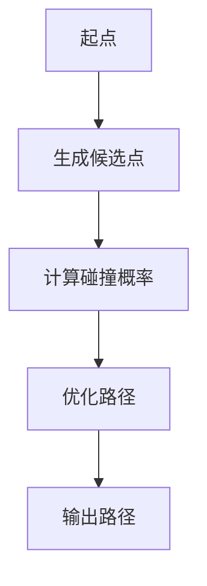
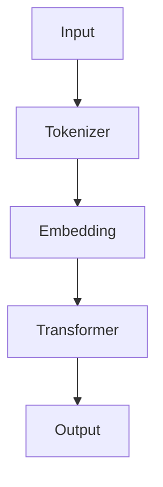
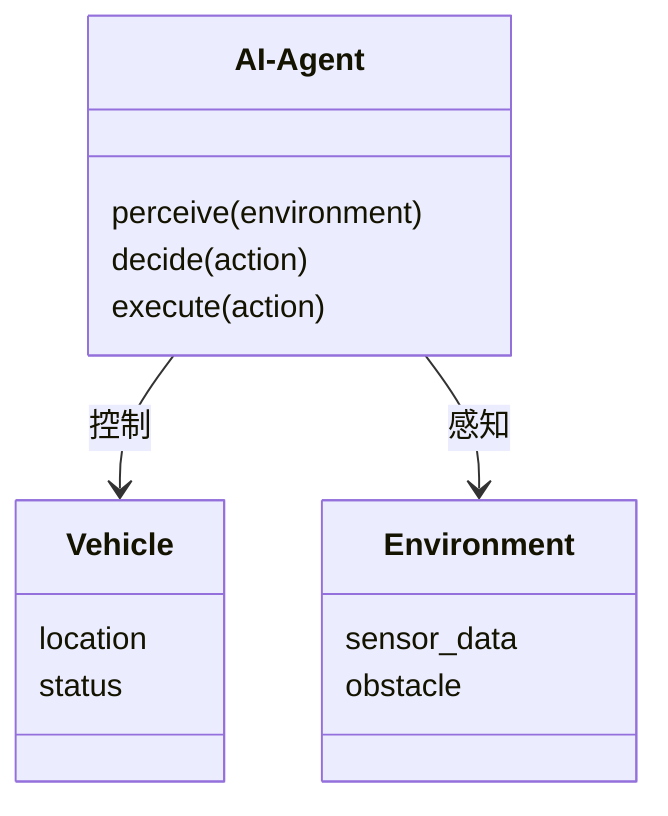
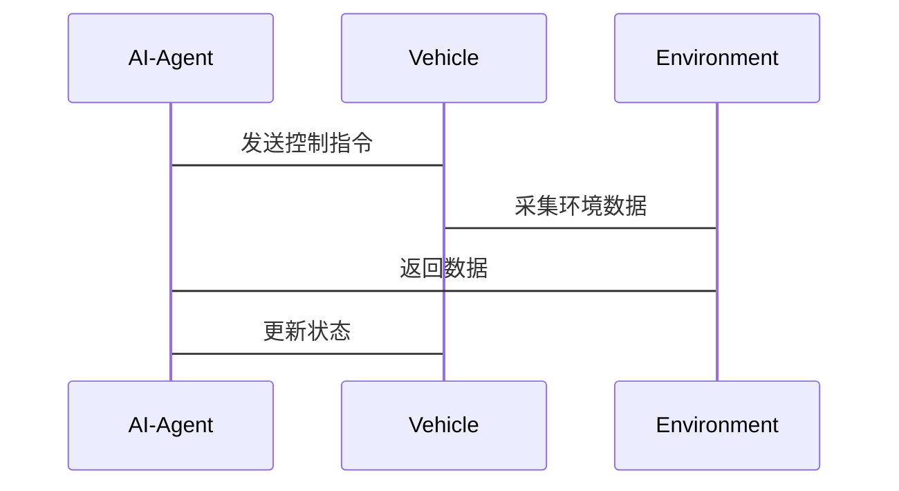

                 


# AI Agent在智能汽车中的应用：自动驾驶与车载助手

> 关键词：AI Agent, 智能汽车, 自动驾驶, 车载助手, 路径规划, 自然语言处理, 系统架构

> 摘要：本文深入探讨AI Agent在智能汽车中的应用，重点分析自动驾驶和车载助手两大核心领域。通过背景介绍、核心概念、算法原理、系统架构、项目实战等多维度展开，详细解析AI Agent的技术原理及其在智能汽车中的实际应用，最后总结其未来发展和最佳实践。

---

# 第一章: AI Agent与智能汽车的背景介绍

## 1.1 AI Agent的基本概念

### 1.1.1 AI Agent的定义与特点
AI Agent（人工智能代理）是指能够感知环境、自主决策并执行任务的智能实体。其特点包括：
- **自主性**：无需外部干预，自主完成任务。
- **反应性**：能实时感知环境变化并做出响应。
- **目标导向性**：基于目标驱动行动。
- **学习能力**：通过数据和经验提升性能。

### 1.1.2 AI Agent的核心要素与功能
AI Agent的核心要素包括感知、决策、执行和反馈。其功能涵盖数据处理、目标设定、路径规划、人机交互等。

### 1.1.3 AI Agent在智能汽车中的作用
在智能汽车中，AI Agent主要用于自动驾驶、路径规划、环境感知、人机交互和系统协同，极大提升了驾驶的安全性和舒适性。

---

## 1.2 智能汽车的发展现状

### 1.2.1 智能汽车的定义与分类
智能汽车是指通过先进传感器、计算平台和执行机构实现智能感知、决策和控制的汽车。根据自动化程度，可分为L1-L5级自动驾驶。

### 1.2.2 自动驾驶技术的演进历程
自动驾驶技术从早期的规则驱动发展到现在的深度学习驱动，经历了感知技术、决策算法和执行系统的逐步优化。

### 1.2.3 车载助手的典型应用案例
车载助手通过语音交互、信息查询、导航辅助等功能，为用户提供智能化服务，已成为智能汽车的重要组成部分。

---

## 1.3 本章小结
本章介绍了AI Agent的基本概念及其在智能汽车中的作用，梳理了智能汽车的发展现状，为后续章节奠定了基础。

---

# 第二章: AI Agent的核心原理与技术

## 2.1 AI Agent的基本原理

### 2.1.1 问题背景与目标分析
智能汽车中的AI Agent需解决复杂环境下的感知、决策和执行问题，目标是实现安全、高效的自动驾驶。

### 2.1.2 AI Agent的感知与决策机制
感知通过传感器获取环境数据，决策基于多目标优化和概率模型做出最优选择。

### 2.1.3 多智能体协同的基本原理
AI Agent通过通信协议实现协同，确保系统各部分高效配合。

---

## 2.2 AI Agent在智能汽车中的应用

### 2.2.1 自动驾驶中的AI Agent
自动驾驶AI Agent负责环境感知、路径规划和决策控制，确保车辆安全行驶。

### 2.2.2 车载助手中的AI Agent
车载助手通过NLP技术实现人机交互，提供信息查询、导航等服务。

### 2.2.3 AI Agent与其他系统（如V2X）的协同
AI Agent与车外系统协同，实现车路协同和智能交通管理。

---

## 2.3 核心概念对比与ER图

### 2.3.1 AI Agent与传统算法的对比分析
AI Agent具有更强的自主性和适应性，而传统算法依赖固定规则。

### 2.3.2 ER实体关系图：AI Agent在智能汽车中的角色关系
```mermaid
er
  entity AI-Agent {
    id
    function
    role
  }
  entity Vehicle {
    id
    status
    location
  }
  entity Environment {
    sensor_data
    obstacle
  }
  AI-Agent --> Vehicle: 控制
  AI-Agent --> Environment: 感知
```

---

# 第三章: 自动驾驶中的路径规划算法

## 3.1 路径规划的基本原理

### 3.1.1 A*算法与RRT算法的对比
- **A*算法**：基于启发式搜索，路径优化效果好。
- **RRT算法**：适用于非结构化环境，采样效率高。

### 3.1.2 基于深度学习的路径规划
深度学习通过端到端训练，实现复杂场景下的路径规划。

### 3.1.3 算法流程图（Mermaid）


## 3.2 数学模型与公式

### 3.2.1 A*算法的目标函数
$$f(n) = g(n) + h(n)$$
其中，$g(n)$是已遍历的路径成本，$h(n)$是启发函数。

### 3.2.2 深度学习模型的损失函数
$$\mathcal{L} = \mathcal{L}_\text{cls} + \mathcal{L}_\text{loc}$$
表示分类损失和定位损失的总和。

---

# 第四章: 车载助手中的自然语言处理

## 4.1 NLP算法的基本原理

### 4.1.1 Transformer模型的工作原理
- **自注意力机制**：通过全局上下文理解语义。
- **前馈网络**：实现非线性变换。

### 4.1.2 NLP流程图（Mermaid）


## 4.2 数学模型与公式

### 4.2.1 Transformer模型的注意力机制
$$\text{Attention}(Q,K,V) = \text{softmax}(\frac{QK^T}{\sqrt{d_k}})V$$

### 4.2.2 模型训练的损失函数
$$\mathcal{L} = -\sum_{i=1}^{n} y_i \log p(y_i|x_i)$$

---

# 第五章: 智能汽车的系统架构与接口设计

## 5.1 系统架构设计

### 5.1.1 系统功能设计（领域模型Mermaid类图）


### 5.1.2 系统架构图（Mermaid）


## 5.2 系统接口设计

### 5.2.1 接口设计
- **车辆控制接口**：接收AI Agent的控制指令。
- **环境感知接口**：提供传感器数据给AI Agent。

### 5.2.2 交互流程图（Mermaid）


---

# 第六章: 项目实战与代码实现

## 6.1 项目实战：基于深度学习的车道线检测

### 6.1.1 环境安装
```bash
pip install tensorflow numpy opencv-python
```

### 6.1.2 核心代码实现
```python
import tensorflow as tf
from tensorflow.keras import layers

model = tf.keras.Sequential([
    layers.Conv2D(32, (3,3), activation='relu', input_shape=(224, 224, 3)),
    layers.MaxPooling2D((2,2)),
    layers.Conv2D(64, (3,3), activation='relu'),
    layers.MaxPooling2D((2,2)),
    layers.Flatten(),
    layers.Dense(128, activation='relu'),
    layers.Dense(2, activation='softmax')
])

model.compile(optimizer='adam', loss='sparse_categorical_crossentropy', metrics=['accuracy'])
model.fit(x_train, y_train, epochs=10, validation_data=(x_val, y_val))
```

### 6.1.3 代码解读与分析
- **模型结构**：卷积层提取特征，全连接层进行分类。
- **损失函数**：交叉熵损失，优化器选择Adam。

---

## 6.2 项目小结
本项目展示了如何通过深度学习实现车道线检测，代码实现了从数据预处理到模型训练的完整流程。

---

# 第七章: 总结与展望

## 7.1 本章总结
本文全面介绍了AI Agent在智能汽车中的应用，涵盖自动驾驶和车载助手两大领域，详细分析了算法原理、系统架构和项目实战。

## 7.2 未来展望
未来，AI Agent在智能汽车中的应用将更加智能化和协同化，V2X技术的发展将进一步推动自动驾驶的进步。

---

## 7.3 最佳实践 tips

- **安全性**：自动驾驶的安全性是首要考虑。
- **隐私性**：保护用户数据隐私。
- **可解释性**：提升AI决策的透明度。

---

# 作者：AI天才研究院/AI Genius Institute & 禅与计算机程序设计艺术 /Zen And The Art of Computer Programming

