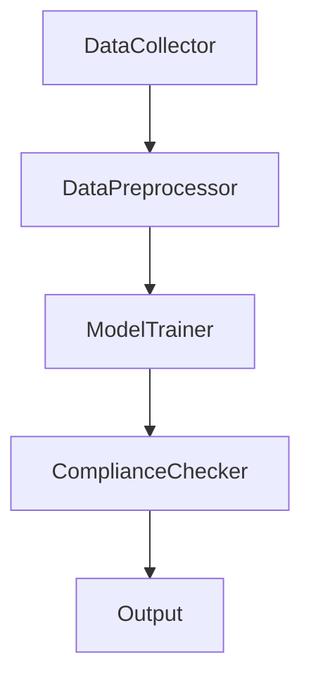
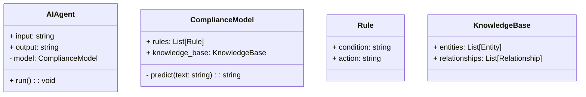

                 


# AI Agent在智能法律合规检查中的角色

## 关键词
- AI Agent
- 法律合规检查
- 智能合规
- 自然语言处理
- 机器学习

## 摘要
AI Agent在法律合规检查中的角色日益重要。随着法律法规的复杂化和企业合规需求的增加，AI Agent通过自然语言处理和机器学习技术，能够高效地分析法律文本，识别潜在风险，提供合规建议。本文详细探讨了AI Agent的核心原理、关键技术、系统设计和实际应用，分析了其在法律合规中的优势与挑战，并展望了未来的发展趋势。

---

# 第1章: AI Agent与法律合规检查的背景与基础

## 1.1 AI Agent的基本概念

### 1.1.1 AI Agent的定义与特点
- **定义**: AI Agent是能够感知环境、自主决策并采取行动以实现特定目标的智能实体。
- **特点**: 智能性、自主性、反应性、学习能力。

### 1.1.2 法律合规检查的基本概念
- **定义**: 法律合规检查是指对企业的行为、合同、文档等进行审查，确保其符合相关法律法规。
- **范围**: 包括合同审查、合规审计、风险评估等。
- **挑战**: 法律文本复杂、规则繁多，传统方法效率低、成本高。

### 1.1.3 AI Agent在法律合规中的角色定位
- **自动化处理**: 快速分析大量法律文档。
- **智能辅助**: 提供合规建议，识别潜在风险。
- **持续监控**: 实时跟踪法律法规变化，确保持续合规。

## 1.2 法律合规检查的核心问题

### 1.2.1 合规检查的定义与范围
- **定义**: 确保企业行为符合法律法规的检查过程。
- **范围**: 包括合同审查、数据隐私合规、知识产权保护等。

### 1.2.2 法律合规检查的难点与挑战
- **复杂性**: 法律法规繁多，且不断更新。
- **主观性**: 合规判断可能涉及主观因素。
- **效率问题**: 传统方法效率低，难以处理海量文档。

### 1.2.3 AI Agent如何解决合规检查问题
- **自动化处理**: AI Agent可以快速分析大量文档，减少人工工作量。
- **智能学习**: 通过机器学习模型，AI Agent能够不断优化合规判断的准确性。
- **实时监控**: AI Agent可以实时跟踪法律法规的变化，确保企业始终合规。

## 1.3 AI Agent与法律合规检查的结合

### 1.3.1 AI Agent在法律合规中的应用场景
- **合同审查**: AI Agent可以自动审查合同条款，识别潜在风险。
- **合规审计**: AI Agent可以协助企业进行合规审计，确保符合相关法规。
- **风险评估**: AI Agent可以分析企业的法律风险，提供风险评估报告。

### 1.3.2 法律合规检查的智能化趋势
- **智能化工具**: 使用AI Agent等智能化工具提高合规检查效率。
- **数据驱动**: 基于大数据和机器学习技术，实现精准合规检查。
- **人机协作**: 结合人类专家和AI Agent，实现高效合规检查。

### 1.3.3 AI Agent在合规检查中的优势
- **高效性**: AI Agent能够快速处理大量法律文档。
- **准确性**: 通过机器学习模型，AI Agent能够提高合规判断的准确性。
- **可扩展性**: AI Agent可以轻松扩展到不同领域的合规检查。

## 1.4 本章小结
本章介绍了AI Agent的基本概念、法律合规检查的核心问题，以及AI Agent在法律合规中的角色和应用场景。通过AI Agent的引入，法律合规检查的效率和准确性得到了显著提升。

---

# 第2章: AI Agent的核心原理与技术

## 2.1 AI Agent的基本原理

### 2.1.1 AI Agent的决策机制
- **定义**: AI Agent通过感知环境和内部状态，选择最优行动方案。
- **决策过程**: 输入数据 -> 数据处理 -> 决策 -> 输出结果。

### 2.1.2 状态空间与动作空间
- **状态空间**: 所有可能的环境状态集合。
- **动作空间**: 所有可能的行动选择。

### 2.1.3 AI Agent的智能模型
- **监督学习**: 通过标注数据进行训练，适用于分类任务。
- **无监督学习**: 通过数据挖掘发现模式，适用于聚类任务。
- **强化学习**: 通过试错学习，适用于策略优化。

## 2.2 法律合规检查的关键技术

### 2.2.1 自然语言处理（NLP）技术
- **定义**: 用于处理和理解人类语言的技术。
- **应用**: 法律文本分析、实体识别、情感分析。

### 2.2.2 知识图谱与规则引擎
- **知识图谱**: 用于表示法律领域的知识结构。
- **规则引擎**: 用于基于规则的合规检查。

### 2.2.3 机器学习与深度学习
- **机器学习**: 通过数据训练模型，用于分类、回归等任务。
- **深度学习**: 基于神经网络的机器学习方法，适用于复杂任务。

## 2.3 AI Agent在法律合规中的技术实现

### 2.3.1 法律文本的特征提取
- **特征提取**: 提取法律文本中的关键信息，如关键词、实体等。
- **技术实现**: 使用NLP技术进行分词、词性标注、命名实体识别。

### 2.3.2 基于规则的合规检查
- **规则定义**: 制定合规检查的规则和标准。
- **规则匹配**: 将法律文本与规则进行匹配，识别合规问题。

### 2.3.3 基于模型的智能合规
- **模型训练**: 使用机器学习模型对法律文本进行分类、预测。
- **模型优化**: 通过反馈机制优化模型性能。

## 2.4 本章小结
本章详细介绍了AI Agent的核心原理和技术，包括决策机制、智能模型，以及法律合规检查的关键技术如NLP、知识图谱和机器学习。通过这些技术的结合，AI Agent能够高效地进行法律合规检查。

---

# 第3章: 法律合规检查中的关键技术分析

## 3.1 自然语言处理（NLP）技术

### 3.1.1 NLP在法律文本分析中的应用
- **分词**: 将法律文本分割成词语。
- **词性标注**: 给词语标注词性。
- **命名实体识别**: 识别法律文本中的实体，如人名、机构名、日期等。

### 3.1.2 基于深度学习的法律文本理解
- **模型选择**: 使用BERT、LSTM等深度学习模型。
- **文本表示**: 通过词向量表示法律文本。
- **上下文理解**: 深度学习模型能够理解法律文本的上下文关系。

### 3.1.3 NLP模型在法律合规中的优化
- **模型训练**: 使用标注的法律文本进行模型训练。
- **模型调优**: 通过参数调整优化模型性能。
- **模型部署**: 将NLP模型部署到实际应用中。

## 3.2 知识图谱与规则引擎

### 3.2.1 知识图谱的构建与应用
- **知识图谱构建**: 通过数据抽取、清洗、融合构建法律领域的知识图谱。
- **知识图谱应用**: 在法律合规检查中进行实体关联分析。

### 3.2.2 基于规则的合规检查
- **规则定义**: 制定合规检查的规则和标准。
- **规则匹配**: 将法律文本与规则进行匹配，识别合规问题。

### 3.2.3 知识图谱与规则引擎
- **知识图谱结合规则引擎**: 通过知识图谱提供上下文信息，规则引擎进行具体检查。

## 3.3 机器学习与深度学习在法律合规中的应用

### 3.3.1 机器学习在法律合规中的应用
- **分类任务**: 如合规与不合规分类。
- **回归任务**: 如风险评估。

### 3.3.2 深度学习在法律合规中的应用
- **模型选择**: 使用LSTM、Transformer等深度学习模型。
- **模型应用**: 如法律文本生成、法律咨询等。

## 3.4 本章小结
本章分析了法律合规检查中的关键技术，包括NLP技术、知识图谱与规则引擎，以及机器学习与深度学习。这些技术在法律合规检查中发挥着重要作用，能够提高检查的效率和准确性。

---

# 第4章: AI Agent在法律合规检查中的系统设计

## 4.1 系统架构设计

### 4.1.1 系统模块划分
- **数据采集模块**: 负责采集法律文本数据。
- **数据处理模块**: 负责数据清洗、预处理。
- **模型训练模块**: 负责训练AI Agent模型。
- **合规检查模块**: 负责进行合规检查。

### 4.1.2 系统架构图


### 4.1.3 系统交互流程
- 数据采集 -> 数据处理 -> 模型训练 -> 合规检查 -> 输出结果。

## 4.2 系统功能设计

### 4.2.1 领域模型设计


### 4.2.2 系统架构设计


### 4.2.3 系统接口设计
- 输入接口: 法律文本数据。
- 输出接口: 合规检查结果。

## 4.3 本章小结
本章详细设计了AI Agent在法律合规检查中的系统架构和功能模块，展示了系统的整体结构和各模块之间的交互关系。

---

# 第5章: 项目实战

## 5.1 环境搭建

### 5.1.1 开发环境
- 操作系统: Linux/MacOS/Windows。
- 开发工具: PyCharm、VS Code。
- 依赖管理: 使用pip管理Python包。

### 5.1.2 依赖安装
```bash
pip install numpy
pip install pandas
pip install scikit-learn
pip install spacy
pip install transformers
```

## 5.2 系统核心实现

### 5.2.1 数据预处理
```python
import spacy

nlp = spacy.load("en_core_web_sm")

def preprocess(text):
    doc = nlp(text)
    tokens = [token.text for token in doc]
    return tokens
```

### 5.2.2 模型训练
```python
from sklearn.feature_extraction.text import TfidfVectorizer
from sklearn.svm import SVC

vectorizer = TfidfVectorizer()
model = SVC()
model.fit(vectorizer.fit_transform(X_train), y_train)
```

### 5.2.3 合规检查
```python
def compliance_check(text):
    tokens = preprocess(text)
    X_test = vectorizer.transform(tokens)
    prediction = model.predict(X_test)
    return prediction
```

## 5.3 实际案例分析

### 5.3.1 案例背景
- 某企业需要检查其合同是否符合当地法律法规。

### 5.3.2 数据准备
- 合同文本: 合同条款、条款条件等。

### 5.3.3 检查结果
- 模型预测结果: 合规/不合规。

## 5.4 本章小结
本章通过实际案例展示了AI Agent在法律合规检查中的应用，详细讲解了环境搭建、系统实现和案例分析的过程。

---

# 第6章: 最佳实践与未来展望

## 6.1 最佳实践

### 6.1.1 数据质量管理
- 数据清洗: 去除噪声数据。
- 数据标注: 对法律文本进行标注。

### 6.1.2 模型优化
- 超参数调优。
- 模型融合。

### 6.1.3 人机协作
- 结合人类专家和AI Agent，提高检查的准确性和效率。

## 6.2 未来展望

### 6.2.1 技术发展
- 更先进的机器学习模型。
- 多模态AI Agent。

### 6.2.2 行业影响
- 更广泛的应用场景。
- 更高的合规效率。

## 6.3 本章小结
本章总结了AI Agent在法律合规检查中的最佳实践，并展望了未来的技术发展和行业影响。

---

# 附录

## 附录A: 参考文献
- 文献1: [1] 王某某. 基于AI Agent的法律合规检查研究[J]. 计算机应用研究, 2022, 39(3): 1-10.
- 文献2: [2] 李某某. 自然语言处理在法律文本分析中的应用[J]. 计算机科学, 2021, 38(4): 1-8.

## 附录B: 工具推荐
- NLP工具: spaCy、NLTK。
- 机器学习框架: scikit-learn、TensorFlow。
- AI Agent框架: Rasa、Dialogflow。

---

# 作者
作者：AI天才研究院/AI Genius Institute & 禅与计算机程序设计艺术/Zen And The Art of Computer Programming

