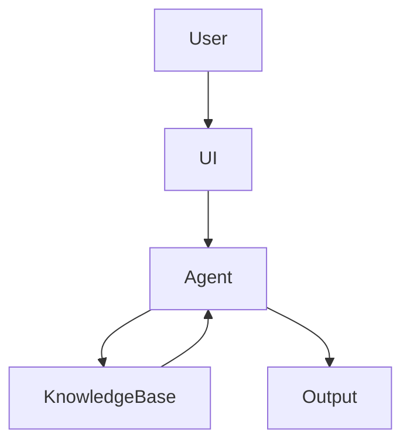

                 


# AI Agent在智能法律咨询系统中的角色

> 关键词：AI Agent，智能法律咨询系统，法律咨询，人工智能代理，法律知识库

> 摘要：本文探讨了AI Agent在智能法律咨询系统中的角色与作用，详细分析了AI Agent的核心概念、算法原理及其在法律咨询系统中的应用场景。通过系统架构设计与项目实战案例，展示了AI Agent如何助力智能法律咨询系统实现高效、精准的法律服务。

---

## 第一部分: AI Agent在智能法律咨询系统中的背景与概念

### 第1章: AI Agent与智能法律咨询系统概述

#### 1.1 AI Agent的基本概念
##### 1.1.1 人工智能代理的定义
人工智能代理（AI Agent）是指能够感知环境、自主决策并执行任务的智能体。它通过传感器获取信息，利用知识库和推理机制分析问题，并通过执行器采取行动以实现目标。AI Agent可以是软件程序，也可以是嵌入硬件的智能设备。

##### 1.1.2 AI Agent的核心属性
AI Agent的核心属性包括：
- **自主性**：能够自主决策和行动，无需人工干预。
- **反应性**：能够实时感知环境并做出反应。
- **主动性**：主动采取行动以实现目标。
- **社会性**：能够与其他AI Agent或人类进行交互与协作。

##### 1.1.3 AI Agent与传统软件的区别
AI Agent与传统软件的主要区别在于：
- AI Agent具有自主性和智能性，能够主动解决问题。
- AI Agent能够学习和适应环境，而传统软件仅遵循预设的规则。

#### 1.2 智能法律咨询系统的定义与特点
##### 1.2.1 智能法律咨询系统的定义
智能法律咨询系统是一种基于人工智能技术的法律服务系统，能够通过自然语言处理、知识库查询和逻辑推理等方式，为用户提供法律咨询服务。

##### 1.2.2 智能法律咨询系统的核心功能
- **法律知识库查询**：基于庞大的法律知识库，快速检索相关法律条文、案例和法规。
- **问题解析与分类**：通过自然语言处理技术，分析用户的问题并进行分类。
- **法律推理与建议**：根据用户提供的信息，结合法律知识进行推理，并提出法律建议。
- **交互式对话**：通过自然语言对话，为用户提供个性化的法律咨询服务。

##### 1.2.3 智能法律咨询系统的应用场景
智能法律咨询系统广泛应用于以下几个场景：
- **法律咨询服务**：为用户提供法律问题解答、合同审查等服务。
- **法律信息查询**：帮助用户快速查找相关的法律条文和案例。
- **法律风险评估**：为企业提供法律风险评估和合规建议。

#### 1.3 AI Agent在法律咨询中的角色与价值
##### 1.3.1 AI Agent在法律咨询中的作用
AI Agent在智能法律咨询系统中扮演着多重角色：
- **信息检索与知识查询**：利用法律知识库快速检索相关法律信息。
- **问题解析与分类**：通过自然语言处理技术，分析用户的问题并进行分类。
- **法律推理与建议**：基于法律知识和用户提供的信息，进行逻辑推理并提出法律建议。
- **交互式对话**：通过自然语言处理技术，与用户进行交互式对话，提供个性化的法律咨询服务。

##### 1.3.2 AI Agent的优势与局限性
AI Agent的优势在于：
- **高效性**：能够快速处理大量法律信息，提供高效的法律服务。
- **准确性**：基于庞大的法律知识库和推理算法，能够提供准确的法律建议。
- **可扩展性**：能够同时为多个用户提供法律服务，扩展性强。

AI Agent的局限性在于：
- **知识局限性**：法律知识库的覆盖范围和准确性直接影响AI Agent的表现。
- **语义理解的局限性**：自然语言处理技术在复杂语义理解方面仍存在不足。
- **法律推理的复杂性**：法律问题往往涉及复杂的法律条文和案例分析，AI Agent的推理能力有限。

##### 1.3.3 AI Agent在法律咨询中的未来发展趋势
未来，AI Agent在法律咨询中的发展趋势包括：
- **深度学习与知识图谱的结合**：通过深度学习和知识图谱技术，提升法律知识库的准确性和推理能力。
- **多模态交互**：结合语音识别、计算机视觉等技术，实现多模态的法律咨询服务。
- **人机协作**：AI Agent与人类法律专家协同工作，共同为用户提供更精准的法律服务。

### 第2章: AI Agent的核心概念与联系

#### 2.1 AI Agent的核心概念
##### 2.1.1 任务建模与目标设定
任务建模是AI Agent设计的第一步，需要明确AI Agent的目标和任务。例如，在法律咨询系统中，AI Agent的目标可能是为用户提供准确的法律建议，任务包括信息检索、问题解析和法律推理。

##### 2.1.2 知识表示与推理机制
知识表示是AI Agent的核心，通常采用知识图谱或规则库的形式。推理机制则基于逻辑推理或机器学习算法，用于从已知信息中推导出新的结论。

##### 2.1.3 行为规划与决策优化
行为规划是指AI Agent根据当前状态和目标，制定行动计划。决策优化则通过强化学习等方法，不断优化AI Agent的决策策略。

#### 2.2 AI Agent的属性特征对比
##### 2.2.1 基于表格的核心属性对比
| 属性 | AI Agent | 传统软件 |
|------|----------|----------|
| 自主性 | 高       | 低       |
| 反应性 | 高       | 低       |
| 智能性 | 高       | 低       |
| 学习能力 | 高      | 低       |

##### 2.2.2 基于ER实体关系图的结构分析
```mermaid
er
actor: User
agent: AI Legal Agent
knowledge_base: Legal Knowledge Base
goal: Legal Consultation
action: Legal Advice

User --> action: 提出问题
action --> agent: 分析问题
agent --> knowledge_base: 查询法律信息
knowledge_base --> agent: 返回结果
agent --> action: 提出建议
```

---

## 第二部分: AI Agent的核心概念与原理

### 第3章: AI Agent的算法原理与数学模型

#### 3.1 AI Agent的核心算法原理
##### 3.1.1 任务建模与状态表示
任务建模是AI Agent设计的第一步，需要明确任务目标和状态空间。例如，在法律咨询系统中，AI Agent的任务目标是为用户提供准确的法律建议，状态空间包括用户的问题、法律条文和相关案例。

##### 3.1.2 动作选择与奖励机制
动作选择是AI Agent根据当前状态，选择最优动作的过程。奖励机制则通过强化学习，不断优化AI Agent的决策策略。

##### 3.1.3 知识表示与推理算法
知识表示通常采用知识图谱或规则库的形式，推理算法则基于逻辑推理或机器学习算法，用于从已知信息中推导出新的结论。

#### 3.2 AI Agent的数学模型与公式
##### 3.2.1 状态空间与动作空间的数学表示
状态空间 \( S \) 是所有可能状态的集合，动作空间 \( A \) 是所有可能动作的集合。

##### 3.2.2 奖励函数与价值函数的数学模型
奖励函数 \( R(s, a) \) 表示在状态 \( s \) 下执行动作 \( a \) 所获得的奖励。价值函数 \( V(s) \) 表示在状态 \( s \) 下的期望回报。

##### 3.2.3 策略优化的数学公式
策略优化的目标是最优化奖励函数。例如，使用强化学习中的策略梯度方法，优化策略 \( \pi(a|s) \)。

#### 3.3 算法实现与代码示例
##### 3.3.1 基于Python的AI Agent实现
```python
class AI-Agent:
    def __init__(self, knowledge_base):
        self.knowledge_base = knowledge_base

    def perceive(self, input):
        # 获取输入信息
        return input

    def think(self, input):
        # 基于知识库进行推理
        result = self.knowledge_base.query(input)
        return result

    def act(self, result):
        # 根据推理结果采取行动
        return result

# 示例代码
knowledge_base = LegalKnowledgeBase()
agent = AI-Agent(knowledge_base)
input = "请问合同违约责任如何认定？"
output = agent.act(agent.think(agent.perceive(input)))
print(output)
```

---

## 第三部分: 智能法律咨询系统的架构与设计

### 第4章: 智能法律咨询系统的系统分析

#### 4.1 系统功能需求分析
##### 4.1.1 用户需求分析
用户需求包括法律问题解答、合同审查、法律风险评估等。

##### 4.1.2 系统功能模块划分
系统功能模块包括：
- **用户界面**：用户输入问题，系统显示结果。
- **知识库管理**：管理和维护法律知识库。
- **推理引擎**：基于知识库进行逻辑推理。
- **对话管理**：与用户进行交互式对话。

##### 4.1.3 系统性能指标
系统性能指标包括响应时间、准确率、用户满意度等。

#### 4.2 系统架构设计
##### 4.2.1 系统架构图


---

## 结论

AI Agent在智能法律咨询系统中扮演着越来越重要的角色。通过本文的分析，我们可以看到AI Agent在法律咨询中的巨大潜力。然而，AI Agent的局限性也不容忽视，特别是在复杂法律问题的处理上，仍需要人类专家的参与。未来，随着人工智能技术的不断发展，AI Agent将在法律咨询系统中发挥更大的作用，为用户提供更高效、更精准的法律服务。

---

## 作者

作者：AI天才研究院/AI Genius Institute  
禅与计算机程序设计艺术/Zen And The Art of Computer Programming

