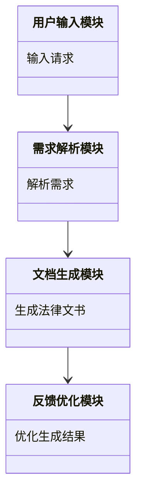
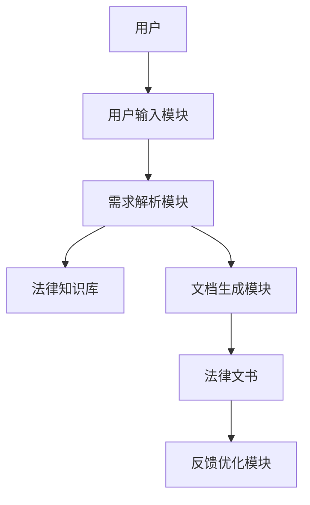
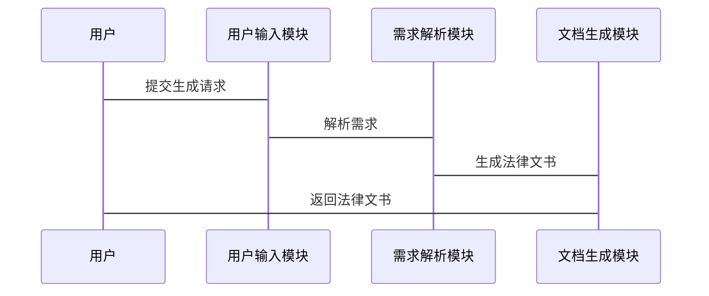

                 


# AI Agent在智能法律文书生成中的角色

> 关键词：AI Agent，智能法律文书生成，自然语言处理，法律知识库，法律文书生成模型

> 摘要：本文探讨了AI Agent在智能法律文书生成中的角色及其技术实现。从背景介绍、核心概念、算法原理到系统设计和项目实战，详细分析了AI Agent如何通过自然语言处理、强化学习和生成对抗网络等技术，实现高效、准确的法律文书生成。同时，本文还讨论了实际应用中的挑战和未来发展方向。

---

# 第一部分: AI Agent与智能法律文书生成的背景与概念

# 第1章: AI Agent与智能法律文书生成的背景介绍

## 1.1 问题背景与问题描述

### 1.1.1 法律文书生成的现状与挑战

法律文书的生成是法律实务中的重要环节，包括合同、起诉状、判决书等。传统上，法律文书的生成依赖于人工操作，效率低下且容易出错。律师和法律助理需要花费大量时间在文书 drafting 上，尤其是在处理大量相似案件时，重复劳动问题尤为突出。

### 1.1.2 AI Agent在法律领域的应用潜力

AI Agent（人工智能代理）是一种能够感知环境并采取行动以实现目标的智能体。在法律领域，AI Agent可以通过自然语言处理（NLP）、机器学习和知识图谱等技术，帮助生成、审查和优化法律文书。AI Agent的优势在于其能够快速处理大量数据，并提供个性化的法律建议。

### 1.1.3 智能法律文书生成的核心问题

智能法律文书生成的核心问题是如何将法律知识与自然语言处理技术相结合，实现自动化、智能化的文书生成。这涉及以下几个关键问题：
- **数据隐私**：法律文档通常包含敏感信息，如何确保数据安全？
- **模型准确率**：生成的法律文书需要高度准确，如何避免错误？
- **可解释性**：AI生成的文档需要符合法律逻辑，如何提高可解释性？

## 1.2 问题解决与边界

### 1.2.1 AI Agent在法律文书生成中的角色定位

AI Agent在法律文书生成中的角色可以是：
1. **助手**：帮助律师快速生成基础法律文书。
2. **自动生成器**：在某些简单场景下，完全自动化生成法律文书。
3. **智能顾问**：提供法律建议并自动生成相应文书。

### 1.2.2 智能法律文书生成的边界与外延

智能法律文书生成的边界在于其能力的限制。例如，复杂案件的文书生成仍需人工干预。其外延包括法律咨询、合同审查、法律数据分析等领域。

### 1.2.3 核心概念与关键要素的对比分析

| 概念 | 描述 |
|------|------|
| AI Agent | 具备自主决策能力的智能体 |
| 法律知识库 | 存储法律条文、案例和术语的数据库 |
| 自然语言处理 | 用于理解和生成人类语言的技术 |

## 1.3 本章小结

本章介绍了AI Agent在法律文书生成中的背景、核心问题和角色定位。AI Agent通过结合NLP和法律知识库，能够显著提升法律文书生成的效率和准确性。

---

# 第二部分: AI Agent的核心概念与技术原理

# 第2章: AI Agent的核心概念与技术原理

## 2.1 AI Agent的定义与特点

### 2.1.1 AI Agent的定义

AI Agent是一种能够感知环境、采取行动以实现目标的智能系统。在法律文书生成中，AI Agent可以理解用户需求，并自动生成相应的法律文书。

### 2.1.2 AI Agent的核心特点

1. **自主性**：能够独立决策。
2. **反应性**：能够根据输入调整输出。
3. **学习能力**：通过数据优化生成结果。

### 2.1.3 AI Agent与传统法律文书生成工具的对比

| 特性 | AI Agent | 传统工具 |
|------|----------|----------|
| 自动化 | 高 | 低 |
| 精准度 | 高 | 一般 |

## 2.2 AI Agent的分类与工作原理

### 2.2.1 基于规则的AI Agent

基于规则的AI Agent通过预定义的规则生成法律文书。例如，根据合同模板生成标准合同。

### 2.2.2 基于统计的AI Agent

基于统计的AI Agent利用大数据分析，预测法律文书的生成方式。例如，通过分析大量合同，生成相似的新合同。

### 2.2.3 基于深度学习的AI Agent

基于深度学习的AI Agent使用神经网络模型（如Transformer）生成法律文书。这种方法能够捕捉复杂的语言模式，生成更自然的文本。

## 2.3 AI Agent在法律文书生成中的应用

### 2.3.1 法律文书生成的流程

1. **用户输入**：用户输入需求，如“生成一份租赁合同”。
2. **需求解析**：AI Agent解析需求，提取关键信息。
3. **文档生成**：根据提取的信息，生成法律文书。
4. **反馈优化**：根据用户反馈优化生成结果。

### 2.3.2 AI Agent在法律文书生成中的具体角色

1. **信息抽取**：从用户需求中提取关键信息。
2. **模板匹配**：匹配合适的法律文书模板。
3. **内容生成**：根据模板生成具体法律文书。

## 2.4 本章小结

本章详细介绍了AI Agent的核心概念、分类及其在法律文书生成中的应用。基于深度学习的AI Agent在生成复杂法律文书时表现尤为突出。

---

# 第三部分: AI Agent的算法原理与数学模型

# 第3章: AI Agent的算法原理

## 3.1 基于自然语言处理的法律文书生成

### 3.1.1 自然语言处理技术在法律文书生成中的应用

自然语言处理（NLP）是AI Agent生成法律文书的核心技术。例如，使用BERT模型生成合同文本。

### 3.1.2 基于Transformer的法律文书生成模型

Transformer模型通过自注意力机制，捕捉文本中的长距离依赖关系。在法律文书生成中，这有助于生成更连贯的文本。

## 3.2 AI Agent的强化学习机制

### 3.2.1 强化学习的基本原理

强化学习（Reinforcement Learning）通过奖励机制，优化AI Agent的生成结果。例如，当生成的合同符合法律规范时，AI Agent会得到正向反馈。

### 3.2.2 强化学习在法律文书生成中的应用

通过强化学习，AI Agent能够逐步优化生成的法律文书，使其更加符合实际需求。

## 3.3 AI Agent的生成对抗网络（GAN）原理

### 3.3.1 GAN的基本原理

生成对抗网络（GAN）由生成器和判别器组成。生成器生成法律文书，判别器判断其真实性。通过不断迭代，生成器生成的文本越来越接近真实文本。

### 3.3.2 GAN在法律文书生成中的应用

GAN可以用于生成多样化的法律文书，确保生成结果的多样性和合理性。

## 3.4 本章小结

本章介绍了AI Agent在法律文书生成中的算法原理，包括NLP、强化学习和GAN等技术。这些技术的结合使得AI Agent能够生成高质量的法律文书。

---

# 第四章: 系统分析与架构设计

## 4.1 系统功能设计

### 4.1.1 系统模块划分

法律文书生成系统通常包括以下模块：
1. **用户输入模块**：接收用户的生成请求。
2. **需求解析模块**：解析用户需求，提取关键信息。
3. **文档生成模块**：根据需求生成法律文书。
4. **反馈优化模块**：根据用户反馈优化生成结果。

### 4.1.2 领域模型（Mermaid类图）



## 4.2 系统架构设计

### 4.2.1 系统架构图（Mermaid架构图）



### 4.2.2 系统接口设计

系统接口包括：
1. 用户输入接口。
2. 法律知识库接口。
3. 文档生成接口。

### 4.2.3 系统交互设计（Mermaid序列图）



## 4.3 本章小结

本章详细介绍了法律文书生成系统的功能设计、架构设计和交互设计。通过Mermaid图表，清晰展示了系统的模块划分和流程。

---

# 第五章: 项目实战

## 5.1 环境安装

### 5.1.1 安装Python环境

```bash
python --version
pip install --upgrade pip
```

### 5.1.2 安装必要的库

```bash
pip install transformers
pip install pymermaid
```

## 5.2 系统核心实现源代码

### 5.2.1 法律知识库的构建

```python
from transformers import AutoTokenizer, AutoModelForCausalLM
import torch

model_name = "facebook/legal-ramlm"
tokenizer = AutoTokenizer.from_pretrained(model_name)
model = AutoModelForCausalLM.from_pretrained(model_name)
```

### 5.2.2 文档生成模块的实现

```python
def generate_legal_document(prompt):
    inputs = tokenizer.encode(prompt, return_tensors="pt")
    outputs = model.generate(inputs, max_length=500, do_sample=True)
    return tokenizer.decode(outputs[0], skip_special_tokens=True)
```

## 5.3 代码应用解读与分析

### 5.3.1 法律知识库的构建

使用预训练模型facebook/legal-ramlm构建法律知识库，该模型专为法律文本生成设计。

### 5.3.2 文档生成模块的实现

通过调用生成模型，根据输入的提示生成法律文书。生成过程中，模型会利用自注意力机制，确保生成文本的连贯性和准确性。

## 5.4 实际案例分析

### 5.4.1 案例背景

用户需要生成一份租赁合同，输入提示为“生成一份为期一年的租赁合同”。

### 5.4.2 生成过程

1. 用户输入模块接收请求。
2. 需求解析模块解析需求，提取关键信息。
3. 文档生成模块调用预训练模型，生成租赁合同。
4. 反馈优化模块根据用户反馈优化生成结果。

## 5.5 本章小结

本章通过实际案例，详细展示了AI Agent在法律文书生成中的应用。从环境安装到代码实现，读者可以一步步体验AI Agent的强大能力。

---

# 第六章: 实际应用中的挑战与未来展望

## 6.1 挑战与解决方案

### 6.1.1 数据隐私问题

解决方案：采用数据脱敏技术，确保敏感信息不被泄露。

### 6.1.2 模型可解释性问题

解决方案：通过可视化工具，展示模型的生成过程，提高可解释性。

### 6.1.3 法律知识库的构建与维护

解决方案：定期更新法律知识库，确保其准确性和全面性。

## 6.2 未来展望

随着AI技术的不断进步，AI Agent在法律文书生成中的应用将更加广泛。未来，可以期待：
1. 更智能化的法律知识库。
2. 更高效的生成模型。
3. 更人性化的用户交互界面。

---

# 作者：AI天才研究院 & 禅与计算机程序设计艺术

---

通过以上结构，我们详细探讨了AI Agent在智能法律文书生成中的角色及其技术实现。从背景介绍到系统设计，再到项目实战，本文为读者提供了全面的视角，帮助他们更好地理解AI Agent在法律领域的应用潜力。

