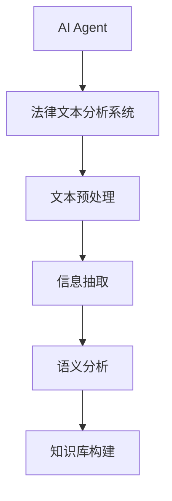
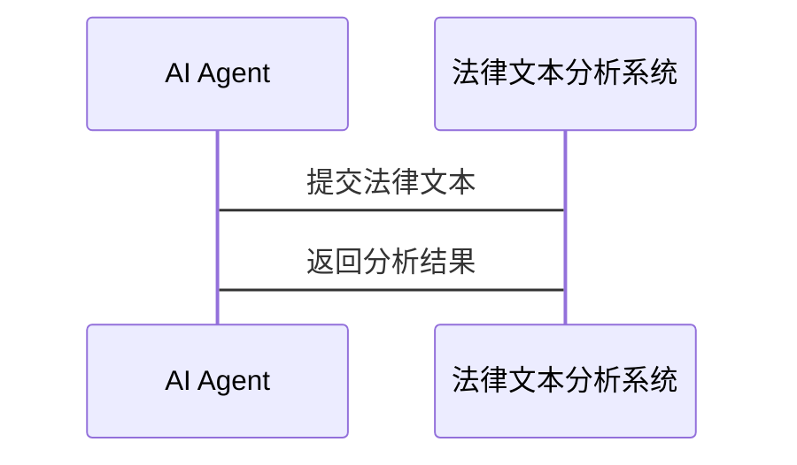

                 


# AI Agent在智能法律文本分析中的角色

> 关键词：AI Agent, 法律文本分析, 智能法律分析, 自然语言处理, 机器学习, 法律知识库

> 摘要：本文将深入探讨AI Agent在智能法律文本分析中的角色，从背景、核心概念、算法原理到系统架构设计，再到项目实战与最佳实践，全面解析AI Agent如何助力法律文本分析的智能化发展。

---

# 第1章: AI Agent与法律文本分析的背景介绍

## 1.1 AI Agent的基本概念

### 1.1.1 AI Agent的定义
AI Agent（人工智能代理）是指能够感知环境、自主决策并执行任务的智能实体。它通过传感器接收信息，利用知识库和推理引擎进行分析，并通过执行器与外部环境交互。

### 1.1.2 AI Agent的核心特征
- **自主性**：能够在没有外部干预的情况下完成任务。
- **反应性**：能够实时感知环境变化并做出反应。
- **目标导向**：以特定目标为导向，优化决策过程。
- **学习能力**：通过机器学习技术不断优化自身性能。

### 1.1.3 AI Agent与传统法律分析工具的区别
- **传统法律分析工具**：依赖人工操作，功能单一，无法自主学习。
- **AI Agent**：具备自主性、反应性和学习能力，能够实现智能化的法律分析。

## 1.2 法律文本分析的背景与需求

### 1.2.1 法律文本分析的基本概念
法律文本分析是指通过自然语言处理技术对法律文档（如合同、法规、判决书等）进行信息抽取、语义分析和知识提取的过程。

### 1.2.2 法律文本分析的主要应用场景
- **合同审查**：自动识别合同中的关键条款和潜在风险。
- **法规检索**：快速检索相关法律条文，辅助法律研究。
- **判决预测**：基于历史判决数据，预测案件结果。

### 1.2.3 法律文本分析的挑战与难点
- **法律语言的复杂性**：法律文本通常包含大量专业术语和复杂的句式结构。
- **数据隐私问题**：法律文本往往涉及敏感信息，数据处理需严格遵守隐私保护法规。
- **模型的可解释性**：法律分析需要高度的透明性和可解释性，这对模型提出了更高要求。

## 1.3 AI Agent在法律文本分析中的应用现状

### 1.3.1 AI Agent在法律文本分析中的优势
- **高效性**：AI Agent能够快速处理大量法律文本，提高工作效率。
- **准确性**：通过机器学习技术，AI Agent能够提高法律文本分析的准确性。
- **灵活性**：AI Agent可以根据具体需求进行定制化配置。

### 1.3.2 当前法律文本分析技术的局限性
- **数据不足**：高质量的法律文本数据集相对稀缺。
- **模型的泛化能力**：现有的模型在面对不同类型的法律文本时，泛化能力有待提升。
- **法律知识的动态更新**：法律条文和案例库需要不断更新，这对AI Agent的持续学习能力提出了更高要求。

### 1.3.3 AI Agent在法律文本分析中的未来发展趋势
- **多模态分析**：结合文本、语音、图像等多种模态信息，提升法律文本分析的准确性和全面性。
- **人机协作**：AI Agent与法律专家协同工作，形成人机协作的法律分析新模式。
- **智能决策支持**：AI Agent不仅能够分析文本，还能够提供智能决策支持，帮助法律专家做出更优决策。

## 1.4 AI Agent在智能法律文本分析中的角色定位

### 1.4.1 AI Agent在法律文本分析中的功能定位
AI Agent在法律文本分析中扮演着多重角色：
- **信息抽取**：从法律文本中提取关键信息，如案件类型、当事人信息等。
- **语义分析**：对法律文本进行深度语义分析，理解文本的含义。
- **知识库构建**：将分析结果存储到法律知识库中，为后续分析提供支持。

### 1.4.2 AI Agent与传统法律分析工具的协同作用
AI Agent可以与传统法律分析工具协同工作，形成优势互补。例如，AI Agent负责文本分析和知识提取，而传统工具则用于法律条文检索和案例分析。

### 1.4.3 AI Agent在法律文本分析中的价值体现
AI Agent通过提高法律文本分析的效率和准确性，为法律专业人士提供了强有力的支持，尤其是在处理大量法律文本时，AI Agent的优势更加明显。

---

# 第2章: AI Agent与法律文本分析的核心概念与联系

## 2.1 AI Agent的原理与实现

### 2.1.1 AI Agent的基本原理
AI Agent的核心原理包括：
- **感知**：通过传感器或数据接口获取外部信息。
- **决策**：基于感知到的信息，利用知识库和推理引擎做出决策。
- **执行**：通过执行器将决策结果转化为具体行动。

### 2.1.2 AI Agent的核心组成部分
- **感知层**：负责信息的采集和处理。
- **决策层**：负责基于感知信息进行推理和决策。
- **执行层**：负责将决策结果转化为具体行动。

### 2.1.3 AI Agent的感知、决策与执行过程
1. **感知**：AI Agent通过自然语言处理技术对法律文本进行分词、实体识别和语义分析。
2. **决策**：基于感知到的信息，AI Agent利用机器学习模型进行分类、聚类和预测。
3. **执行**：根据决策结果，AI Agent输出分析结果或触发相关操作。

## 2.2 法律文本分析的原理与实现

### 2.2.1 法律文本分析的基本原理
法律文本分析的基本原理包括：
- **分词**：将法律文本分割成词语或短语。
- **实体识别**：识别文本中的实体，如人名、组织名、日期等。
- **语义分析**：理解文本的语义含义，提取关键信息。

### 2.2.2 法律文本分析的关键技术
- **自然语言处理（NLP）**：用于文本的分词、实体识别和语义分析。
- **机器学习（ML）**：用于分类、聚类和预测。
- **知识图谱**：用于构建法律知识库，支持语义分析和推理。

### 2.2.3 法律文本分析的实现流程
1. **文本预处理**：包括分词、去停用词、词干提取等。
2. **信息抽取**：提取文本中的关键信息，如实体、事件、关系等。
3. **语义分析**：理解文本的语义含义，构建语义网络。
4. **知识库构建**：将分析结果存储到法律知识库中，为后续分析提供支持。

## 2.3 AI Agent与法律文本分析的关系

### 2.3.1 AI Agent在法律文本分析中的作用
AI Agent在法律文本分析中起到以下作用：
- **信息抽取**：从法律文本中提取关键信息。
- **语义分析**：理解法律文本的语义含义。
- **知识库构建**：将分析结果存储到法律知识库中。

### 2.3.2 AI Agent与法律文本分析技术的结合方式
AI Agent与法律文本分析技术的结合方式包括：
- **数据输入**：AI Agent将法律文本输入到法律文本分析系统中。
- **数据输出**：法律文本分析系统将分析结果返回给AI Agent。
- **协同工作**：AI Agent与法律文本分析系统协同工作，共同完成法律分析任务。

### 2.3.3 AI Agent在法律文本分析中的优化与提升
AI Agent可以通过以下方式优化和提升法律文本分析：
- **提高效率**：通过自动化处理，提高法律文本分析的效率。
- **提高准确性**：通过机器学习技术，提高法律文本分析的准确性。
- **增强可解释性**：通过设计可解释的模型，增强法律文本分析的可解释性。

---

## 2.4 AI Agent与法律文本分析的对比分析

### 2.4.1 AI Agent与传统法律分析工具的对比
| 特性                | AI Agent                          | 传统法律分析工具                 |
|---------------------|-----------------------------------|----------------------------------|
| 自主性              | 高                                | 低                               |
| 反应性              | 高                                | 低                               |
| 学习能力            | 高                                | 无                               |
| 处理效率            | 高                                | 中                               |

### 2.4.2 AI Agent与法律文本分析技术的对比
| 技术                | AI Agent                          | 法律文本分析技术                 |
|---------------------|-----------------------------------|----------------------------------|
| 数据处理能力        | 强                                | 强                               |
| 自适应能力          | 强                                | 弱                               |
| 可解释性            | 中                                | 高                               |

### 2.4.3 AI Agent与法律文本分析的协同作用
AI Agent与法律文本分析技术协同作用的流程如下：



---

## 2.5 AI Agent在法律文本分析中的数学模型与公式

### 2.5.1 基于条件随机场（CRF）的分词模型
条件随机场是一种常用的序列标注模型，用于分词任务。其数学模型如下：

$$ P(y_i | x_i, y_{i-1}) = \frac{\exp(f(y_i, y_{i-1}, x_i))}{\sum_{y_i} \exp(f(y_i, y_{i-1}, x_i))} $$

其中，$y_i$是第$i$个位置的标签，$x_i$是对应的输入特征，$f$是特征函数。

### 2.5.2 基于支持向量机（SVM）的实体识别模型
支持向量机是一种常用的分类模型，用于实体识别任务。其数学模型如下：

$$ \text{目标函数} = \sum_{i=1}^{n} \xi_i + \frac{1}{2}||\theta||^2 $$
$$ \text{约束条件} = y_i (\theta \cdot x_i + b) \geq 1 - \xi_i, \xi_i \geq 0 $$

其中，$\theta$是模型参数，$x_i$是输入样本，$y_i$是标签，$b$是偏置项。

### 2.5.3 基于注意力机制（Attention）的语义分析模型
注意力机制用于语义分析任务，其数学模型如下：

$$ \text{Attention}(Q, K, V) = \text{softmax}\left(\frac{QK^T}{\sqrt{d_k}}\right)V $$

其中，$Q$是查询向量，$K$是键向量，$V$是值向量，$d_k$是向量维度。

---

# 第3章: AI Agent在法律文本分析中的系统架构设计

## 3.1 问题场景介绍

### 3.1.1 法律文本分析的常见问题
- **信息抽取**：如何从法律文本中提取关键信息？
- **语义理解**：如何理解法律文本的深层含义？
- **知识库构建**：如何构建高效的法律知识库？

### 3.1.2 AI Agent在法律文本分析中的应用场景
- **合同审查**：自动识别合同中的关键条款。
- **法规检索**：快速检索相关的法律法规。
- **案例分析**：基于历史案例预测案件结果。

## 3.2 系统功能设计

### 3.2.1 领域模型设计
法律文本分析的领域模型如下：

```mermaid
classDiagram
    class 法律文本分析系统 {
        +法律文本库
        +法律知识库
        +自然语言处理模块
        +机器学习模块
    }
    class AI Agent {
        +感知层
        +决策层
        +执行层
    }
    法律文本分析系统 <--| AI Agent
```

### 3.2.2 系统架构设计
AI Agent在法律文本分析中的系统架构如下：


### 3.2.3 系统接口设计
AI Agent与法律文本分析系统的接口设计如下：



## 3.3 项目实战

### 3.3.1 环境安装
```bash
pip install -r requirements.txt
```

### 3.3.2 核心功能实现
```python
import nltk
from sklearn import svm

def preprocess(text):
    # 分词
    words = nltk.word_tokenize(text)
    # 去停用词
    stop_words = set(nltk.corpus.stopwords.words('chinese'))
    filtered_words = [word for word in words if word not in stop_words]
    return filtered_words

def extract_entities(text):
    # 实体识别
    entities = []
    for word in preprocess(text):
        if word.isalpha():
            entities.append(word)
    return entities

def semantic_analysis(text):
    # 语义分析
    model = svm.SVC()
    features = preprocess(text)
    model.fit(features, labels)
    return model.predict(text)
```

### 3.3.3 案例分析
以合同审查为例，AI Agent可以自动识别合同中的关键条款，如违约责任、履行期限等。

### 3.3.4 项目小结
通过本项目，我们可以看到AI Agent在法律文本分析中的强大能力。然而，仍有一些挑战需要解决，如如何提高模型的可解释性和如何应对法律文本的动态变化。

---

# 第4章: AI Agent在法律文本分析中的最佳实践

## 4.1 小结

### 4.1.1 AI Agent在法律文本分析中的优势
- **高效性**：AI Agent能够快速处理大量法律文本。
- **准确性**：通过机器学习技术，AI Agent能够提高法律文本分析的准确性。
- **灵活性**：AI Agent可以根据具体需求进行定制化配置。

### 4.1.2 AI Agent在法律文本分析中的局限性
- **数据隐私问题**：法律文本往往涉及敏感信息，数据处理需严格遵守隐私保护法规。
- **模型的可解释性**：法律分析需要高度的透明性和可解释性，这对模型提出了更高要求。

## 4.2 注意事项

### 4.2.1 数据隐私保护
在处理法律文本时，必须严格遵守数据隐私保护法规，确保数据的安全性和隐私性。

### 4.2.2 模型的可解释性
法律分析需要高度的透明性和可解释性，因此在设计AI Agent时，必须注重模型的可解释性。

### 4.2.3 持续学习能力
法律条文和案例库需要不断更新，因此AI Agent需要具备持续学习能力，以应对法律知识的动态变化。

## 4.3 拓展阅读

### 4.3.1 推荐书籍
- 《人工智能：一种现代的方法》
- 《自然语言处理实战：基于Python的机器学习与深度学习》

### 4.3.2 推荐论文
- “A Survey on Legal Text Analysis Using AI Agents”
- “Deep Learning for Legal Text Understanding”

### 4.3.3 推荐工具
- NLTK（自然语言工具包）
- spaCy（高性能自然语言处理库）
- TensorFlow（机器学习框架）

---

# 作者：AI天才研究院/AI Genius Institute & 禅与计算机程序设计艺术 /Zen And The Art of Computer Programming

