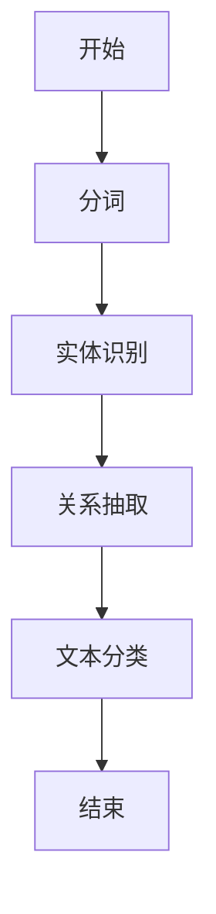
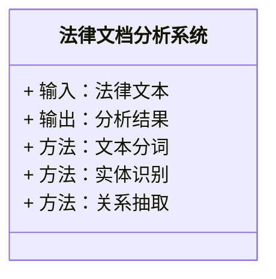
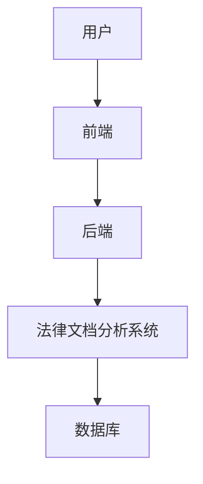
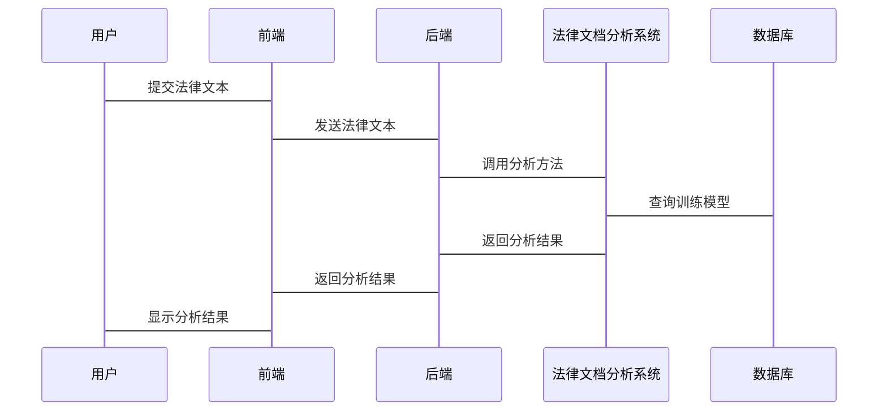
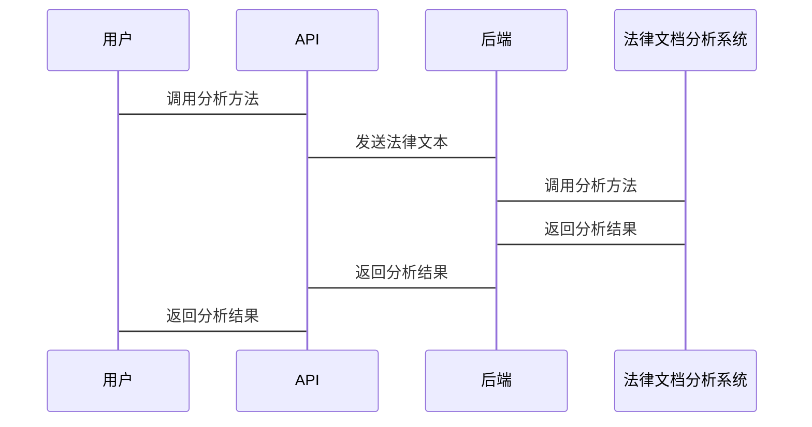

                 


# AI Agent在智能法律文档分析中的角色

> **关键词**：AI Agent，智能法律文档分析，自然语言处理，法律文本理解，深度学习，法律自动化

> **摘要**：本文探讨AI Agent在智能法律文档分析中的角色，结合法律文档分析的核心技术与AI Agent的感知、决策和执行能力，详细分析AI Agent在法律文档分析中的应用原理、算法实现、系统架构设计及实际案例。文章从背景介绍、核心概念、算法原理、系统设计、项目实战等多方面展开，深入剖析AI Agent在智能法律文档分析中的技术细节和实际应用价值。

---

## 第1章: AI Agent与法律文档分析的背景介绍

### 1.1 AI Agent的核心概念
#### 1.1.1 AI Agent的定义与特点
AI Agent（人工智能代理）是指能够感知环境、自主决策并执行任务的智能实体。其特点包括：
- **自主性**：能够在无外部干预的情况下独立运行。
- **反应性**：能够实时感知环境并做出反应。
- **目标导向性**：以特定目标为导向，优化决策和行动。
- **学习能力**：通过数据和经验不断优化自身能力。

#### 1.1.2 法律文档分析的基本概念
法律文档分析是指对法律文本（如合同、法规、判决书等）进行信息抽取、理解和自动化的技术。其核心目标包括：
- **信息抽取**：从法律文本中提取关键信息（如人名、机构名、日期等）。
- **文本理解**：理解法律文本的语义和逻辑关系。
- **自动化处理**：基于理解结果自动化完成特定任务（如合同审查、法律咨询等）。

#### 1.1.3 AI Agent在法律文档分析中的作用
AI Agent通过其感知、决策和执行能力，能够显著提升法律文档分析的效率和准确性。例如：
- **感知环境**：AI Agent能够从法律文档中提取关键信息。
- **决策优化**：基于提取的信息，AI Agent可以辅助律师做出最优决策。
- **自动化执行**：AI Agent可以自动完成文档审查、合同比对等任务。

### 1.2 问题背景与问题描述
#### 1.2.1 法律文档分析的传统方法与挑战
传统法律文档分析依赖人工操作，存在以下问题：
- **效率低下**：人工审查法律文档耗时长，成本高。
- **一致性差**：不同律师对同一文档的理解可能存在差异。
- **可扩展性受限**：难以应对大量法律文档的分析需求。

#### 1.2.2 AI Agent如何解决传统方法的不足
AI Agent通过自动化和智能化技术，能够有效解决传统方法的不足：
- **提高效率**：AI Agent可以快速处理大量法律文档。
- **确保一致性**：基于统一的算法模型，AI Agent能够保证分析结果的准确性。
- **增强可扩展性**：AI Agent可以轻松扩展到更大规模的法律文档分析任务。

#### 1.2.3 问题解决的边界与外延
AI Agent在法律文档分析中的应用并非无所不能。其边界包括：
- **数据质量**：AI Agent依赖高质量的训练数据，数据不足或不准确可能导致分析结果偏差。
- **模型限制**：当前深度学习模型对某些复杂语义关系的处理仍存在挑战。
- **法律专业知识**：AI Agent需要结合法律专业知识进行训练，否则可能无法准确理解法律文本。

---

## 第2章: AI Agent与法律文档分析的核心概念与联系

### 2.1 核心概念原理
#### 2.1.1 AI Agent的感知、决策与执行机制
AI Agent的核心机制包括：
- **感知**：通过传感器或数据输入接口获取环境信息。
- **决策**：基于感知信息，结合内部模型和知识库，做出最优决策。
- **执行**：通过执行器将决策转化为实际操作。

#### 2.1.2 法律文档分析的关键技术
法律文档分析的关键技术包括：
- **自然语言处理（NLP）**：用于文本的理解和信息提取。
- **信息抽取（IE）**：从法律文档中提取关键实体和关系。
- **文本分类**：对法律文本进行分类（如合同类型、法律领域等）。

### 2.2 核心概念属性特征对比
#### 2.2.1 AI Agent与传统法律分析工具的对比
| **特性**       | **AI Agent**             | **传统法律分析工具**         |
|-----------------|--------------------------|------------------------------|
| **自主性**       | 高                     | 低                          |
| **学习能力**     | 强                     | 无或弱                      |
| **处理效率**     | 高                     | 低                          |
| **适应性**       | 强                     | 较弱                        |

#### 2.2.2 法律文档分析的特征分析
- **领域特定性**：法律文档分析需要结合法律专业知识。
- **复杂性**：法律文本通常包含复杂的语义和逻辑关系。
- **准确性要求高**：法律分析结果需要高度准确，以避免法律风险。

### 2.3 ER实体关系图
#### 2.3.1 AI Agent在法律文档分析中的实体关系
以下是一个简单的法律文档分析的ER图：

```mermaid
er
    entity 法律文档
    entity 实体（如公司、个人）
    entity 关系（如合同条款）
    法律文档 --> 实体: 包含
    法律文档 --> 关系: 描述
    实体 --> 关系: 参与
```

#### 2.3.2 法律文档分析的实体识别与关系抽取
法律文档分析中的实体识别和关系抽取是AI Agent的重要任务。例如：
- **实体识别**：从合同中提取“甲方”、“乙方”等实体。
- **关系抽取**：识别“甲方与乙方之间的权利义务关系”。

---

## 第3章: AI Agent在法律文档分析中的算法原理

### 3.1 算法原理概述
#### 3.1.1 自然语言处理在法律文档分析中的应用
NLP技术在法律文档分析中的应用包括：
- **分词**：将法律文本分割成词语或短语。
- **实体识别**：识别法律文本中的关键实体。
- **文本分类**：对法律文本进行分类（如合同类型、法律领域等）。

#### 3.1.2 基于深度学习的法律文本理解
深度学习模型（如BERT、LSTM）在法律文本理解中的应用：
- **上下文理解**：深度学习模型能够捕捉法律文本的上下文信息。
- **语义分析**：模型能够理解法律文本的语义和逻辑关系。

### 3.2 算法流程图
以下是一个法律文档分析的算法流程图：



### 3.3 核心算法实现
#### 3.3.1 分词算法
分词算法用于将法律文本分割成词语或短语。例如，使用jieba进行中文分词：

```python
import jieba

text = "中华人民共和国合同法"
words = jieba.lcut(text)
print(words)  # 输出: ['中华人民共和国', '合同法']
```

#### 3.3.2 实体识别算法
实体识别算法用于识别法律文本中的关键实体。例如，使用spaCy进行实体识别：

```python
import spacy

nlp = spacy.load("zh_core_web_sm")
text = "甲方：张三；乙方：李四"
doc = nlp(text)
for ent in doc.ents:
    print(ent.text, ent.label_)
```

#### 3.3.3 情感分析算法
情感分析算法用于分析法律文本中的情感倾向。例如，使用 VaderSentiment 进行情感分析：

```python
from textblob import TextBlob
from textblob.sentiments import Sentiment

text = "该条款有利于保护甲方的权益"
blob = TextBlob(text)
sentiment = blob.sentiment
print(sentiment.polarity)  # 输出: 0.8
```

### 3.4 数学模型与公式
#### 3.4.1 基于概率论的文本分类模型
文本分类模型可以使用贝叶斯定理进行概率计算：

$$ P(y|x) = \frac{P(x|y)P(y)}{P(x)} $$

其中：
- \( P(y|x) \)：给定特征 \( x \) 的情况下，类标签 \( y \) 的概率。
- \( P(x|y) \)：类标签 \( y \) 下，特征 \( x \) 的概率。
- \( P(y) \)：类标签 \( y \) 的先验概率。
- \( P(x) \)：特征 \( x \) 的全概率。

#### 3.4.2 基于统计学的实体识别模型
实体识别可以使用隐马尔可夫模型（HMM）进行建模：

$$ P(y|x) = \sum_{h} P(y|h)P(h|x) $$

其中：
- \( y \)：输出标签。
- \( h \)：隐藏状态。
- \( P(y|h) \)：在隐藏状态 \( h \) 下，输出标签 \( y \) 的概率。
- \( P(h|x) \)：在输入特征 \( x \) 下，隐藏状态 \( h \) 的概率。

#### 3.4.3 深度学习中的损失函数
深度学习模型常用的损失函数包括交叉熵损失函数：

$$ \text{Loss} = -\frac{1}{N}\sum_{i=1}^{N} \sum_{j=1}^{C} y_{ij} \log(p_{ij}) $$

其中：
- \( N \)：样本数量。
- \( C \)：类别数量。
- \( y_{ij} \)：真实标签。
- \( p_{ij} \)：预测概率。

---

## 第4章: 系统分析与架构设计方案

### 4.1 问题场景介绍
#### 4.1.1 法律文档分析的典型场景
法律文档分析的典型场景包括：
- **合同审查**：自动审查合同中的条款，识别潜在风险。
- **法律咨询**：基于法律文档提供智能问答服务。
- **法律研究**：自动检索和分析相关法律案例。

#### 4.1.2 AI Agent在法律文档分析中的应用案例
AI Agent在法律文档分析中的应用案例包括：
- **智能合同审查**：AI Agent自动审查合同条款，识别潜在法律风险。
- **法律问答系统**：AI Agent基于法律文档提供智能问答服务。

### 4.2 系统功能设计
#### 4.2.1 领域模型设计
法律文档分析系统的领域模型如下：



#### 4.2.2 系统功能模块划分
法律文档分析系统的功能模块包括：
- **文本预处理模块**：负责文本的分词和清洗。
- **信息抽取模块**：负责实体识别和关系抽取。
- **文本理解模块**：负责法律文本的语义理解和分类。

### 4.3 系统架构设计
#### 4.3.1 系统架构图
法律文档分析系统的架构图如下：



#### 4.3.2 系统模块之间的交互关系
法律文档分析系统的模块交互关系如下：



### 4.4 系统接口设计
#### 4.4.1 API接口定义
法律文档分析系统的API接口定义如下：

```json
{
  "input": "法律文本",
  "method": "分析方法",
  "output": "分析结果"
}
```

#### 4.4.2 接口交互流程
接口交互流程如下：

1. 用户提交法律文本。
2. 系统调用API接口进行分析。
3. 系统返回分析结果。

### 4.5 系统交互序列图
法律文档分析系统的交互序列图如下：



---

## 第5章: 项目实战

### 5.1 环境安装
#### 5.1.1 安装Python环境
```bash
python --version
pip install --upgrade pip
```

#### 5.1.2 安装NLP库
```bash
pip install jieba
pip install spacy
pip install textblob
```

### 5.2 系统核心实现源代码
#### 5.2.1 法律文档分析系统代码
```python
import jieba
import spacy
from textblob import TextBlob

# 分词
text = "中华人民共和国合同法"
words = jieba.lcut(text)
print(words)

# 实体识别
nlp = spacy.load("zh_core_web_sm")
doc = nlp(text)
for ent in doc.ents:
    print(ent.text, ent.label_)

# 文本分类
blob = TextBlob(text)
sentiment = blob.sentiment
print(sentiment.polarity)
```

#### 5.2.2 API接口实现
```python
from flask import Flask
from flask_restful import Resource, Api

app = Flask(__name__)
api = Api(app)

class LegalDocAnalysis(Resource):
    def post(self):
        data = request.get_json()
        text = data['text']
        # 分析逻辑
        analysis_result = "Analysis result: " + text
        return {"result": analysis_result}

api.add_resource(LegalDocAnalysis, '/analyze')

if __name__ == '__main__':
    app.run(debug=True)
```

### 5.3 代码应用解读与分析
#### 5.3.1 分词代码解读
```python
words = jieba.lcut(text)
```
- 使用jieba库对输入文本进行分词。
- 输出结果为分词后的词语列表。

#### 5.3.2 实体识别代码解读
```python
nlp = spacy.load("zh_core_web_sm")
doc = nlp(text)
for ent in doc.ents:
    print(ent.text, ent.label_)
```
- 使用spaCy库对输入文本进行实体识别。
- 输出结果为识别出的实体及其标签。

#### 5.3.3 文本分类代码解读
```python
blob = TextBlob(text)
sentiment = blob.sentiment
print(sentiment.polarity)
```
- 使用TextBlob库对输入文本进行情感分析。
- 输出结果为文本的情感极性（正数为正面，负数为负面）。

### 5.4 实际案例分析
#### 5.4.1 案例背景
假设我们有一个法律合同文本，需要进行合同条款的自动审查。

#### 5.4.2 案例分析
```python
text = "本合同自签订之日起生效，有效期为一年。"
words = jieba.lcut(text)
print(words)  # 输出: ['本', '合同', '自', '签订', '之', '日起', '生效', '有效', '期', '为', '一年。']

nlp = spacy.load("zh_core_web_sm")
doc = nlp(text)
for ent in doc.ents:
    print(ent.text, ent.label_)  # 输出: ('合同', 'ORG'), ('一年', 'TIME')

# 情感分析
blob = TextBlob(text)
sentiment = blob.sentiment
print(sentiment.polarity)  # 输出: 0.0
```

### 5.5 项目小结
通过本章的项目实战，我们实现了法律文档分析系统的部分功能，包括分词、实体识别和情感分析。这些功能可以作为法律文档分析的基础模块，进一步扩展可以实现合同审查、法律咨询等高级功能。

---

## 第6章: 总结与展望

### 6.1 总结
本文详细探讨了AI Agent在智能法律文档分析中的角色，结合法律文档分析的核心技术与AI Agent的感知、决策和执行能力，分析了AI Agent在法律文档分析中的应用原理、算法实现、系统架构设计及实际案例。

### 6.2 展望
未来，随着AI技术的不断发展，AI Agent在法律文档分析中的应用将更加广泛和深入。可能的研究方向包括：
- **多语言支持**：支持多种语言的法律文档分析。
- **动态适应性**：AI Agent能够动态适应法律文档的变化。
- **法律知识图谱**：构建法律知识图谱，提升AI Agent的理解能力。

---

## 附录

### 附录A: 法律文档分析工具推荐
以下是一些常用的法律文档分析工具：
- **spaCy**：强大的实体识别和关系抽取工具。
- **jieba**：中文分词工具。
- **TextBlob**：文本情感分析工具。

### 附录B: 相关API与服务
以下是一些与法律文档分析相关的API和服务：
- **OpenAI API**：提供强大的文本生成和分析能力。
- **Google Cloud Natural Language API**：提供自然语言处理服务。
- **AWS Comprehend**：提供文本理解和分析服务。

---

**作者：AI天才研究院/AI Genius Institute & 禅与计算机程序设计艺术 /Zen And The Art of Computer Programming**

