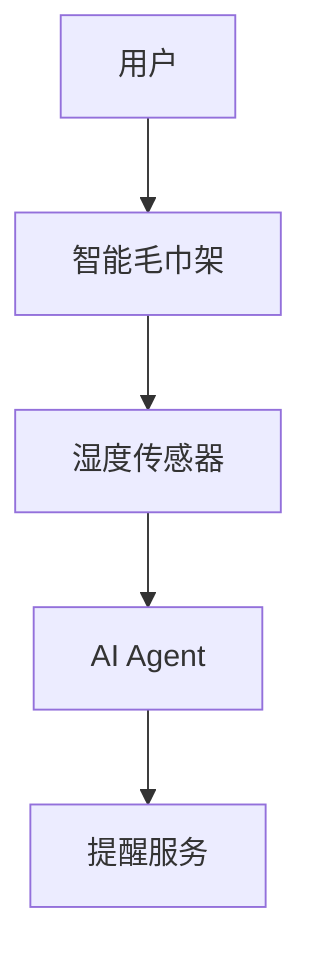
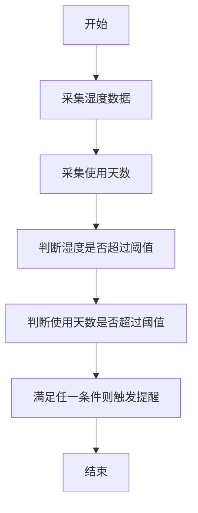
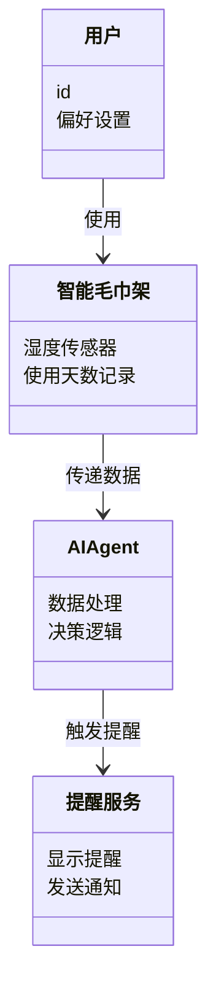
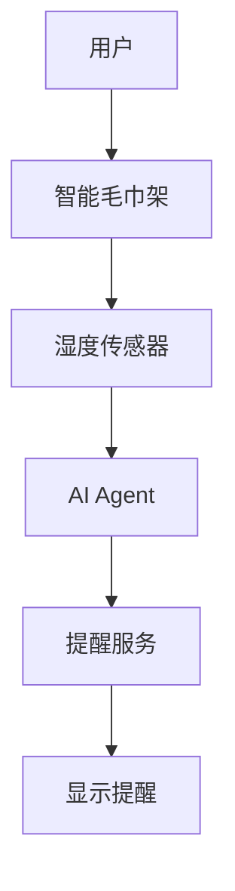
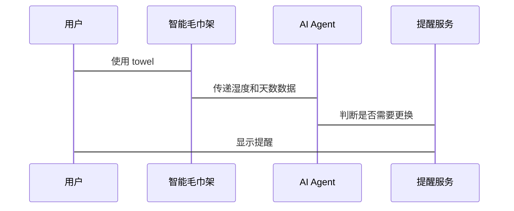

                 


---

# AI Agent在智能浴室毛巾架中的毛巾更换提醒

> **关键词**：AI Agent, 智能浴室, 物联网, 毛巾更换提醒, 系统架构, 项目实战

> **摘要**：  
本文探讨了AI Agent在智能浴室毛巾架中的应用，重点分析了毛巾更换提醒功能的设计与实现。文章从背景介绍、核心概念、算法原理、系统架构到项目实战，详细阐述了如何利用AI技术提升智能家居体验。通过Mermaid图和Python代码示例，深入解析了系统的设计思路和实现细节，为读者提供了一个完整的解决方案。

---

## 第1章: 背景介绍

### 1.1 问题背景

#### 1.1.1 智能浴室的发展现状  
随着智能家居的普及，浴室逐渐成为物联网技术的重要应用领域。智能浴室设备（如恒温器、马桶、镜子等）的普及率逐年增加，但毛巾架的智能化水平仍相对较低。

#### 1.1.2 毛巾更换提醒的必要性  
毛巾作为日常生活必需品，通常使用一段时间后需要更换。然而，用户常常因为忘记或疏忽导致使用过期或不干净的毛巾，影响健康和体验。

#### 1.1.3 当前毛巾管理的痛点与挑战  
- **痛点**：毛巾更换频率难以自动监测，用户手动管理效率低。  
- **挑战**：如何准确判断毛巾的使用状态（如湿度、使用天数等），并实现智能化提醒。

### 1.2 问题描述

#### 1.2.1 毛巾更换提醒的核心问题  
如何通过技术手段实时监测毛巾的使用状态，并在合适的时间提醒用户更换。

#### 1.2.2 用户需求分析  
用户希望毛巾架能够自动监测毛巾状态，提供智能化提醒服务，减少手动管理的麻烦。

#### 1.2.3 系统目标设定  
设计一个基于AI Agent的智能毛巾架系统，能够实时监测毛巾状态，提供智能化更换提醒服务。

### 1.3 问题解决

#### 1.3.1 AI Agent的引入  
AI Agent（智能体）能够通过传感器数据实时分析 towel 状态，自动触发提醒。

#### 1.3.2 物联网技术的应用  
通过物联网传感器（如湿度传感器）收集 towel 状态数据，AI Agent 进行分析并发送提醒。

#### 1.3.3 智能毛巾架的设计与实现  
设计一个集成传感器和AI Agent的智能毛巾架，实现毛巾状态监测和智能化提醒。

### 1.4 边界与外延

#### 1.4.1 系统边界定义  
系统仅关注 towel 状态监测和提醒功能，不涉及其他功能（如 towel 加热、消毒等）。

#### 1.4.2 功能的外延与扩展  
未来可以扩展功能，如 towel 加热、消毒提醒等。

#### 1.4.3 系统与其他设备的交互  
系统与其他智能家居设备（如智能音箱）联动，实现更丰富的交互体验。

### 1.5 概念结构与核心要素

#### 1.5.1 核心概念组成  
- **AI Agent**：负责数据处理和决策。  
- **传感器**：收集 towel 状态数据。  
- **提醒服务**：向用户发送更换提醒。

#### 1.5.2 系统模块划分  
- 数据采集模块：传感器收集 towel 状态。  
- 数据处理模块：AI Agent 分析数据。  
- 用户交互模块：显示提醒信息。

#### 1.5.3 功能流程概述  
传感器收集数据 → AI Agent 分析 → 提醒服务触发 → 用户收到提醒。

---

## 第2章: 核心概念与联系

### 2.1 AI Agent的基本原理

#### 2.1.1 AI Agent的定义  
AI Agent 是能够感知环境并采取行动以实现目标的智能体。

#### 2.1.2 AI Agent的核心特征  
- **自主性**：无需外部干预。  
- **反应性**：实时感知环境并做出反应。  
- **目标导向**：基于目标进行决策。  

#### 2.1.3 AI Agent与传统算法的区别  
| 特性        | AI Agent                     | 传统算法                     |
|-------------|------------------------------|------------------------------|
| 自主性       | 高                           | 低                           |
| 环境感知     | 强                           | 弱                           |
| 适应性       | 强                           | 一般                         |

### 2.2 物联网技术的基础知识

#### 2.2.1 物联网的概念  
物联网是通过传感器和互联网连接物理设备，实现智能化管理。

#### 2.2.2 物联网的关键技术  
- 传感器技术：采集数据。  
- 通信技术：数据传输。  
- 数据处理技术：分析数据。

#### 2.2.3 物联网在智能家居中的应用  
物联网广泛应用于智能家居设备，如智能灯泡、智能门锁等。

### 2.3 核心概念的联系

#### 2.3.1 AI Agent与物联网的结合  
AI Agent 处理物联网传感器数据，实现智能化决策。

#### 2.3.2 系统中各模块的交互关系  


---

## 第3章: 算法原理

### 3.1 算法概述

#### 3.1.1 算法的目标  
实时监测 towel 状态，判断是否需要更换。

#### 3.1.2 算法的输入与输出  
- **输入**：湿度数据、使用天数。  
- **输出**：是否需要更换的判断结果。

#### 3.1.3 算法的核心步骤  
1. 采集 towel 状态数据。  
2. 分析数据，判断是否需要更换。  
3. 触发提醒服务。

### 3.2 算法流程



### 3.3 算法实现

#### 3.3.1 Python代码实现  
```python
class AIAssistant:
    def __init__(self):
        self.humidity_threshold = 70  # 高湿度阈值
        self.days_threshold = 7       # 使用天数阈值

    def check_towel_condition(self, humidity, days):
        if humidity > self.humidity_threshold or days > self.days_threshold:
            return True
        else:
            return False

# 示例用法
assistant = AIAssistant()
humidity = 75
days = 8
need_replace = assistant.check_towel_condition(humidity, days)
print(f"是否需要更换毛巾：{need_replace}")
```

#### 3.3.2 算法优化  
- 使用机器学习模型预测 towel 更换时间。  
- 增加更多传感器（如温度传感器）以提高准确性。

---

## 第4章: 数学模型与公式

### 4.1 状态判断模型

#### 4.1.1 模型公式  
$$ \text{更换} = \begin{cases} 
\text{True} & \text{如果湿度} > 70\% \text{或使用天数} > 7 \\
\text{False} & \text{否则}
\end{cases} $$

### 4.2 公式推导

#### 4.2.1 湿度判断  
湿度超过 70%，则需要更换毛巾。  
$$ \text{湿度判断} = \begin{cases} 
\text{True} & \text{如果湿度} > 70 \\
\text{False} & \text{否则}
\end{cases} $$

#### 4.2.2 使用天数判断  
使用天数超过 7 天，则需要更换。  
$$ \text{天数判断} = \begin{cases} 
\text{True} & \text{如果天数} > 7 \\
\text{False} & \text{否则}
\end{cases} $$

#### 4.2.3 综合判断  
$$ \text{综合判断} = \text{湿度判断} \lor \text{天数判断} $$

---

## 第5章: 系统分析与架构设计

### 5.1 系统分析

#### 5.1.1 问题场景介绍  
用户希望在 towel 状态不佳时收到提醒，避免使用过期或不干净的毛巾。

#### 5.1.2 系统目标  
设计一个基于AI Agent的智能 towel 架，提供智能化更换提醒服务。

### 5.2 系统设计

#### 5.2.1 领域模型



#### 5.2.2 系统架构



#### 5.2.3 接口设计  
- **传感器接口**：采集湿度和使用天数数据。  
- **提醒服务接口**：显示提醒信息。

#### 5.2.4 交互流程



---

## 第6章: 项目实战

### 6.1 环境安装

#### 6.1.1 安装Python  
```bash
python --version
pip install requests
pip install mermaid
```

#### 6.1.2 安装依赖  
```bash
pip install numpy
pip install matplotlib
```

### 6.2 核心代码实现

#### 6.2.1 数据采集模块  
```python
import datetime

def get_humidity():
    # 模拟传感器数据
    return 75

def get_days_used():
    # 模拟使用天数
    return 8

# 示例运行
print("湿度:", get_humidity())
print("使用天数:", get_days_used())
```

#### 6.2.2 数据处理模块  
```python
class AIAssistant:
    def __init__(self):
        self.thresholds = {
            'humidity': 70,
            'days': 7
        }

    def check_towel(self, humidity, days):
        return humidity > self.thresholds['humidity'] or days > self.thresholds['days']

# 示例运行
assistant = AIAssistant()
print("是否需要更换:", assistant.check_towel(get_humidity(), get_days_used()))
```

#### 6.2.3 提醒服务模块  
```python
def send_notification(message):
    print("通知:", message)

send_notification("请更换毛巾。")
```

### 6.3 实际案例分析

#### 6.3.1 案例背景  
用户连续使用同一毛巾 8 天，湿度为 75%，超过阈值。

#### 6.3.2 系统反应  
AI Agent 判断需要更换，并通过提醒服务通知用户。

#### 6.3.3 用户反馈  
用户收到提醒后及时更换毛巾，提升了使用体验。

### 6.4 项目总结  
通过本项目，展示了如何利用AI Agent实现智能化毛巾更换提醒，提升了用户体验。

---

## 第7章: 最佳实践

### 7.1 小结  
本文详细介绍了AI Agent在智能浴室 towel 架中的应用，通过传感器数据和AI算法实现智能化提醒。

### 7.2 注意事项  
- 确保传感器数据的准确性。  
- 定期更新AI算法，提升判断准确率。

### 7.3 拓展阅读  
- 探索更多智能家居应用场景。  
- 深入学习AI Agent和物联网技术。

---

## 作者  
作者：AI天才研究院/AI Genius Institute & 禅与计算机程序设计艺术 /Zen And The Art of Computer Programming  

---

**感谢您的耐心阅读，希望本文对您有所帮助！**

