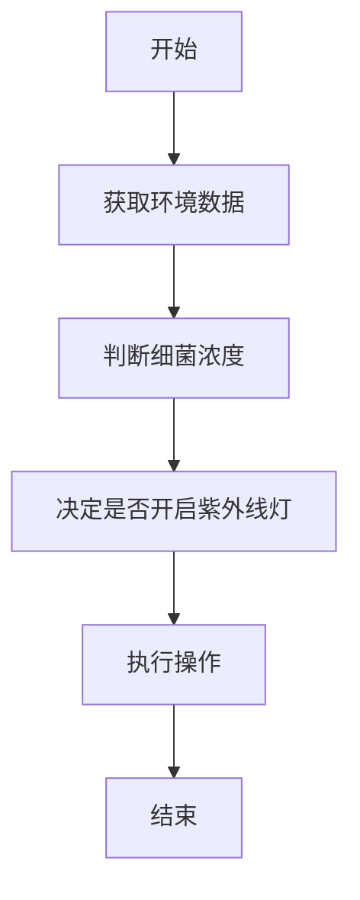
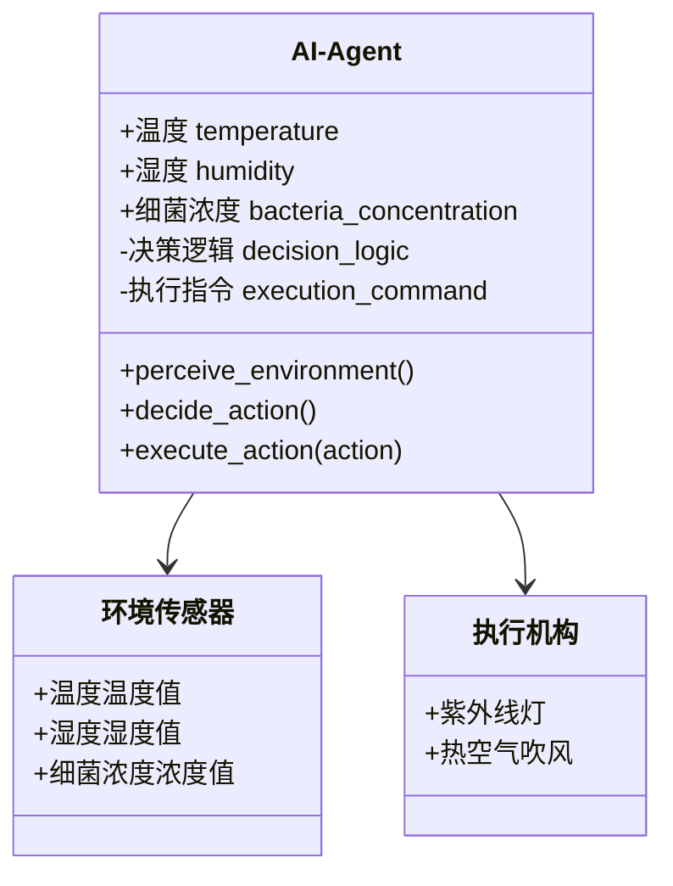
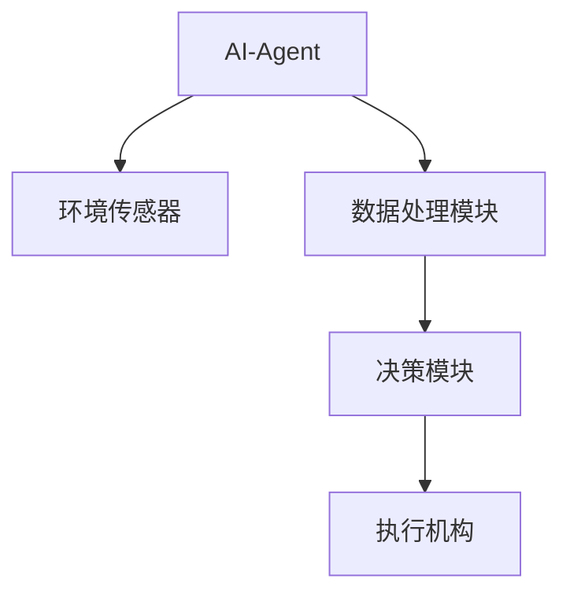

                 


# AI Agent在智能浴室毛巾架中的细菌控制

> 关键词：AI Agent, 智能浴室, 细菌控制, 物联网, 智能家居

> 摘要：本文探讨了AI Agent在智能浴室毛巾架中的应用，重点分析了如何通过AI技术实现对细菌的有效控制。文章从背景介绍、核心概念、算法原理、系统架构设计到项目实战，详细阐述了AI Agent在智能浴室环境中的工作原理和实现方法。通过数学建模和系统设计，本文为智能浴室毛巾架的细菌控制提供了一种创新的解决方案。

---

## 第1章: 背景介绍

### 1.1 问题背景
现代浴室环境潮湿且温暖，为细菌的繁殖提供了理想的条件。传统的浴室毛巾架缺乏智能感知和主动控制能力，难以有效抑制细菌的生长。随着物联网和人工智能技术的发展，智能浴室毛巾架逐渐成为智能家居的重要组成部分。然而，如何在智能浴室环境中实现高效的细菌控制，仍然是一个亟待解决的技术难题。

### 1.2 问题描述
智能浴室毛巾架需要具备以下功能：
1. 实时监测环境参数（如温度、湿度、光照强度）。
2. 感知毛巾上的细菌浓度。
3. 根据环境数据和细菌浓度，智能决策并执行相应的控制策略（如开启紫外线灯、调节空气流通等）。
4. 学习用户习惯，优化控制策略。

### 1.3 问题解决
AI Agent（人工智能代理）是一种能够感知环境、自主决策并执行任务的智能体。在智能浴室毛巾架中，AI Agent可以实时感知环境参数和细菌浓度，结合预设的控制策略，动态调整毛巾架的运行状态，从而实现细菌的有效控制。

### 1.4 系统边界与外延
智能浴室毛巾架细菌控制系统的边界包括：
- 输入：环境传感器数据、用户指令。
- 输出：控制指令（如紫外线灯开关、空气流通调节）。
- 外部交互：与智能家居系统（如智能灯、空调）联动。

### 1.5 核心概念与联系
AI Agent的核心属性包括：
- **感知能力**：通过传感器获取环境数据。
- **决策能力**：基于感知数据和预设策略，生成控制指令。
- **执行能力**：通过执行机构（如紫外线灯）实现控制目标。

以下是系统实体关系图：
```mermaid
entity AI Agent {
  id
  感知数据
  决策逻辑
  执行指令
}
entity 环境传感器 {
  温度
  湿度
  紫外线强度
}
entity 执行机构 {
  紫外线灯
  热空气吹风
}
```

---

## 第2章: 核心概念与原理

### 2.1 AI Agent的原理
AI Agent的工作流程如下：
1. **感知环境**：通过环境传感器获取数据。
2. **数据处理**：对传感器数据进行预处理和特征提取。
3. **决策推理**：基于数据和预设模型，生成控制指令。
4. **执行操作**：通过执行机构实现控制目标。

### 2.2 细菌控制的数学模型
细菌生长的数学模型可以表示为：
$$ 细菌增长速率 = k \cdot 细菌数量 \cdot (1 - 细菌数量/K) $$
其中，$k$ 是增长率常数，$K$ 是环境的最大细菌容量。

AI Agent的决策模型可以表示为：
$$ 决策结果 = f(输入数据, 状态, 目标函数) $$

### 2.3 系统架构图
以下是系统的架构图：
```mermaid
graph TD
    AI Agent --> 环境传感器
    AI Agent --> 数据处理模块
    数据处理模块 --> 决策模块
    决策模块 --> 执行机构
```

---

## 第3章: 算法原理与实现

### 3.1 数据采集与预处理
AI Agent通过环境传感器获取数据，包括温度、湿度和紫外线强度。数据预处理步骤包括：
1. 数据清洗：去除噪声数据。
2. 特征提取：提取关键特征（如温度、湿度）。

### 3.2 算法实现
以下是AI Agent的核心算法：
```python
class AI-Agent:
    def __init__(self):
        self.temperature = 0
        self.humidity = 0
        self.bacteria_concentration = 0

    def perceive_environment(self):
        # 获取环境数据
        self.temperature = get_temperature()
        self.humidity = get_humidity()
        self.bacteria_concentration = get_bacteria_concentration()

    def decide_action(self):
        # 根据细菌浓度决定是否开启紫外线灯
        if self.bacteria_concentration > threshold:
            return "开启紫外线灯"
        else:
            return "关闭紫外线灯"

    def execute_action(self, action):
        # 执行动作
        if action == "开启紫外线灯":
            turn_on_uv_light()
        else:
            turn_off_uv_light()
```

### 3.3 算法流程图


---

## 第4章: 系统分析与架构设计

### 4.1 问题场景介绍
智能浴室环境中的细菌控制是一个复杂的系统工程。系统需要实时感知环境参数，并根据这些参数动态调整控制策略。

### 4.2 系统功能设计
以下是系统功能设计的领域模型：


### 4.3 系统架构设计
以下是系统的架构图：


---

## 第5章: 项目实战

### 5.1 环境安装
需要安装以下环境：
1. Python 3.8+
2. TensorFlow 2.0+
3. Mermaid CLI
4. Node.js（用于运行智能浴室毛巾架系统）

### 5.2 核心代码实现
以下是AI Agent的核心代码：
```python
import numpy as np
from sklearn import linear_model

class AI-Agent:
    def __init__(self):
        self.model = linear_model.LinearRegression()
        self.temperature = []
        self.humidity = []
        self.bacteria_concentration = []

    def perceive_environment(self):
        # 获取环境数据
        self.temperature.append(get_temperature())
        self.humidity.append(get_humidity())
        self.bacteria_concentration.append(get_bacteria_concentration())

    def train_model(self):
        # 训练模型
        X = np.array([self.temperature, self.humidity]).T
        y = np.array(self.bacteria_concentration)
        self.model.fit(X, y)

    def predict_bacteria(self, new_temperature, new_humidity):
        # 预测细菌浓度
        X_new = np.array([[new_temperature, new_humidity]])
        return self.model.predict(X_new)[0]

    def decide_action(self, predicted_bacteria):
        # 决策动作
        if predicted_bacteria > threshold:
            return "开启紫外线灯"
        else:
            return "关闭紫外线灯"

    def execute_action(self, action):
        # 执行动作
        if action == "开启紫外线灯":
            turn_on_uv_light()
        else:
            turn_off_uv_light()
```

### 5.3 代码解读与分析
1. **数据获取**：通过环境传感器获取温度、湿度和细菌浓度数据。
2. **模型训练**：使用线性回归模型训练细菌浓度预测模型。
3. **决策推理**：根据预测的细菌浓度，决定是否开启紫外线灯。
4. **执行操作**：通过执行机构实现紫外线灯的开关控制。

### 5.4 实际案例分析
假设温度为25°C，湿度为60%，系统预测细菌浓度为1000 cfu/cm²。由于细菌浓度超过阈值，AI Agent会决定开启紫外线灯。

### 5.5 项目小结
通过AI Agent的实时感知和智能决策，智能浴室毛巾架能够有效控制细菌的生长，提升用户体验。

---

## 第6章: 最佳实践

### 6.1 小结
本文详细介绍了AI Agent在智能浴室毛巾架中的应用，重点讲解了系统的架构设计、算法实现和项目实战。

### 6.2 注意事项
1. 系统的实时性和稳定性是关键。
2. 数据安全和隐私保护需要高度重视。
3. 系统的可扩展性设计。

### 6.3 拓展阅读
1. 《AI in IoT: Principles and Applications》
2. 《Machine Learning for IoT Developers》

---

作者：AI天才研究院 & 禅与计算机程序设计艺术

