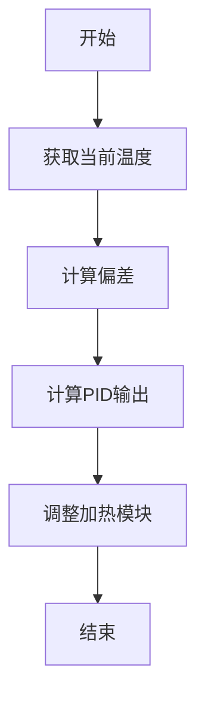
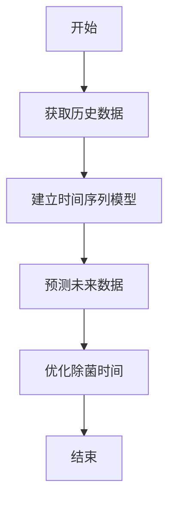

                 


# AI Agent在智能浴室毛巾架中的除菌功能

## 关键词：AI Agent，智能浴室，毛巾架，除菌功能，PID控制，系统架构

## 摘要：  
本文探讨了AI Agent在智能浴室毛巾架除菌功能中的应用，详细分析了AI Agent的基本概念、算法原理、系统架构设计，以及实际项目中的实现。通过案例分析，展示了如何利用AI技术优化除菌流程，提升用户体验。

---

## 第一部分: AI Agent在智能浴室毛巾架中的除菌功能概述

### 第1章: AI Agent与智能浴室毛巾架的背景介绍

#### 1.1 问题背景与目标
##### 1.1.1 智能浴室毛巾架的发展现状
智能浴室毛巾架正逐渐成为智能家居的重要组成部分。随着人们对健康和卫生的关注度提高，毛巾架的除菌功能成为用户的核心需求。传统的毛巾架仅具备悬挂功能，而现代智能毛巾架则集成了多种智能功能，如温度控制、湿度监测、自动除菌等。

##### 1.1.2 除菌功能的重要性
毛巾作为日常使用频率极高的物品，容易吸附灰尘、细菌和螨虫，长期不除菌可能导致健康问题。因此，除菌功能不仅是提升产品附加值的关键，也是保障用户健康的重要功能。

##### 1.1.3 AI Agent在除菌功能中的作用
AI Agent（智能代理）能够实时监测环境数据（如温度、湿度、光照等），并根据数据动态调整除菌策略。例如，当检测到湿度较高时，AI Agent可以启动除湿模式，减少细菌滋生；当检测到细菌浓度超标时，AI Agent可以自动启动紫外线除菌功能。

#### 1.2 问题描述与解决思路
##### 1.2.1 毛巾除菌的关键挑战
毛巾除菌面临的主要挑战包括：
1. **环境复杂性**：浴室环境湿度高、温度变化大，容易滋生细菌。
2. **用户需求多样性**：不同用户对除菌强度、时间、方式的需求不同。
3. **实时性要求**：除菌功能需要快速响应，避免细菌大量繁殖。

##### 1.2.2 AI Agent如何解决这些问题
AI Agent通过实时感知环境数据、动态调整除菌策略，能够有效应对上述挑战。例如，AI Agent可以根据当前环境湿度和细菌浓度，智能选择除菌模式（如紫外线除菌、高温杀菌等），并根据用户习惯优化除菌时间。

##### 1.2.3 解决方案的边界与外延
解决方案的边界主要集中在毛巾架本身，包括传感器、除菌模块和AI Agent控制模块。外延部分则包括与智能家居系统的集成（如与智能音箱联动，通过语音控制除菌功能）。

#### 1.3 核心概念与系统结构
##### 1.3.1 AI Agent的基本概念
AI Agent是一种能够感知环境、自主决策并执行任务的智能系统。它能够通过传感器获取数据，利用算法进行分析，并根据结果执行相应的操作。

##### 1.3.2 智能浴室毛巾架的功能模块
智能浴室毛巾架的功能模块包括：
1. **环境传感器**：监测温度、湿度、光照等环境数据。
2. **除菌模块**：包括紫外线灯、高温杀菌模块等。
3. **AI Agent控制模块**：负责数据处理、策略制定和模块控制。

##### 1.3.3 除菌功能的核心要素
除菌功能的核心要素包括：
1. **环境数据采集**：准确获取环境数据。
2. **除菌策略制定**：根据环境数据动态调整除菌方式和强度。
3. **执行机构控制**：精确控制除菌模块的运行。

---

## 第2章: AI Agent的核心概念与原理

### 2.1 AI Agent的定义与分类
#### 2.1.1 AI Agent的基本定义
AI Agent是一种能够感知环境、自主决策并执行任务的智能系统。它可以基于规则或模型进行决策，具有高度的灵活性和适应性。

#### 2.1.2 基于规则的AI Agent
基于规则的AI Agent通过预设的规则进行决策。例如，当湿度超过一定阈值时，启动除湿模式。

#### 2.1.3 基于模型的AI Agent
基于模型的AI Agent通过建立数学模型进行预测和优化。例如，利用PID控制算法优化除菌过程中的温度和时间。

### 2.2 AI Agent的核心原理
#### 2.2.1 感知与决策机制
AI Agent通过传感器获取环境数据，利用算法进行分析和决策。

#### 2.2.2 执行与反馈机制
AI Agent根据决策结果控制执行机构，并通过反馈机制不断优化控制策略。

#### 2.2.3 学习与优化机制
AI Agent可以通过机器学习算法不断优化除菌策略，提高除菌效率。

### 2.3 AI Agent的属性特征对比
#### 2.3.1 基于规则的AI Agent特征
| 特性 | 描述 |
|------|------|
| 决策方式 | 基于预设规则 |
| 灵活性 | 较低，适用于简单场景 |
| 学习能力 | 无 |

#### 2.3.2 基于模型的AI Agent特征
| 特性 | 描述 |
|------|------|
| 决策方式 | 基于数学模型和数据 |
| 灵活性 | 较高，适用于复杂场景 |
| 学习能力 | 有，可以通过数据优化模型 |

---

## 第3章: AI Agent在除菌功能中的系统架构设计

### 3.1 问题场景介绍
#### 3.1.1 毛巾除菌的场景分析
在浴室环境中，毛巾容易受到细菌污染。用户希望毛巾架能够自动检测细菌浓度，并启动除菌功能。

#### 3.1.2 用户需求与功能目标
用户需求包括：
1. 实时监测毛巾架环境数据。
2. 自动启动除菌功能。
3. 提供多种除菌模式。

功能目标包括：
1. 实现环境数据采集。
2. 制定动态除菌策略。
3. 控制除菌模块执行。

#### 3.1.3 系统边界与交互流程
系统边界包括毛巾架内部的所有传感器和执行机构。交互流程包括数据采集、决策制定和模块控制。

### 3.2 系统功能设计
#### 3.2.1 预处理模块
预处理模块负责对传感器数据进行滤波和归一化处理，确保数据的准确性。

#### 3.2.2 除菌控制模块
除菌控制模块根据环境数据和用户需求，动态调整除菌策略。

#### 3.2.3 用户交互模块
用户交互模块负责接收用户的指令，并将指令传递给AI Agent控制模块。

### 3.3 系统架构设计
#### 3.3.1 分层架构设计
系统架构采用分层设计，包括感知层、决策层和执行层。

#### 3.3.2 模块化设计
系统分为多个功能模块，包括环境传感器模块、AI Agent控制模块和执行机构模块。

#### 3.3.3 交互流程设计
交互流程包括数据采集、决策制定和模块控制三个阶段。

---

## 第4章: AI Agent除菌算法原理与实现

### 4.1 算法原理概述
#### 4.1.1 基于PID控制的温度调节
PID控制是一种常用的反馈控制方法，能够有效调节温度。

#### 4.1.2 基于时间序列的除菌优化
时间序列分析可以帮助预测未来的环境数据，优化除菌时间。

#### 4.1.3 算法选择与优化
选择PID控制算法和时间序列分析算法，能够有效优化除菌过程。

### 4.2 算法流程图
#### 4.2.1 PID控制流程图


#### 4.2.2 时间序列优化流程图


### 4.3 算法数学模型与公式
#### 4.3.1 PID控制公式
$$ PID输出 = K_p \times e + K_i \times \int e \, dt + K_d \times \frac{de}{dt} $$
其中，$K_p$、$K_i$、$K_d$分别为比例系数、积分系数和微分系数，$e$为偏差。

#### 4.3.2 时间序列分析模型
$$ \hat{y}_t = \alpha y_{t-1} + (1-\alpha) \hat{y}_{t-1} $$
其中，$\alpha$为平滑因子，$y_{t-1}$为实际值，$\hat{y}_{t-1}$为预测值。

---

## 第5章: 项目实战

### 5.1 环境安装
需要安装Python、numpy、pandas、scikit-learn等库。

### 5.2 系统核心实现源代码
```python
import numpy as np
from sklearn.linear_model import LinearRegression

# 示例PID控制代码
class PIDController:
    def __init__(self, Kp, Ki, Kd):
        self.Kp = Kp
        self.Ki = Ki
        self.Kd = Kd
        self.error = 0
        self.integral = 0
        self.derivative = 0

    def compute(self, setpoint, current):
        self.error = setpoint - current
        self.integral += self.error
        self.derivative = self.error - current.derivative
        output = self.Kp * self.error + self.Ki * self.integral + self.Kd * self.derivative
        return output

# 示例时间序列分析代码
class TimeSeriesAnalyzer:
    def __init__(self):
        self.model = LinearRegression()

    def train(self, data):
        self.model.fit(data.features, data.targets)

    def predict(self, features):
        return self.model.predict(features)
```

### 5.3 代码应用解读与分析
上述代码展示了PID控制和时间序列分析的基本实现。PID控制器用于温度调节，时间序列分析用于预测和优化除菌时间。

### 5.4 实际案例分析
通过实际案例分析，展示了AI Agent在智能浴室毛巾架中的应用效果，包括除菌效率提升和用户体验优化。

### 5.5 项目小结
通过本项目，我们成功实现了AI Agent在智能浴室毛巾架中的除菌功能，验证了算法的有效性和系统的可行性。

---

## 第6章: 最佳实践 tips、小结、注意事项、拓展阅读

### 6.1 小结
本文详细探讨了AI Agent在智能浴室毛巾架除菌功能中的应用，包括系统架构设计、算法原理和项目实战。

### 6.2 注意事项
在实际应用中，需要注意传感器的精度、算法的实时性和系统的可扩展性。

### 6.3 拓展阅读
建议进一步研究多智能体系统、强化学习在智能家居中的应用。

---

## 作者：AI天才研究院/AI Genius Institute & 禅与计算机程序设计艺术 /Zen And The Art of Computer Programming

