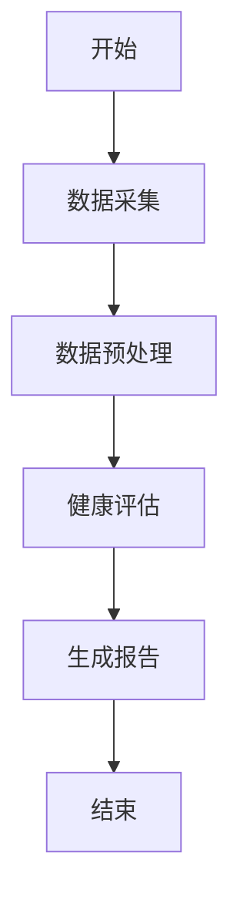
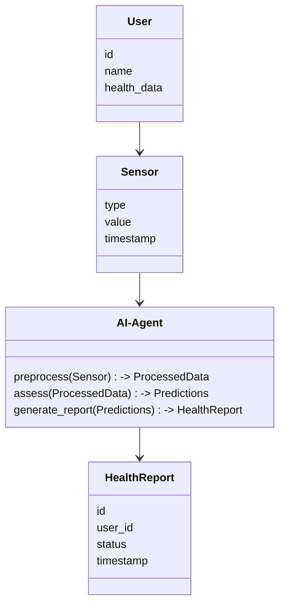
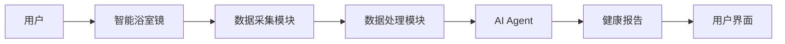
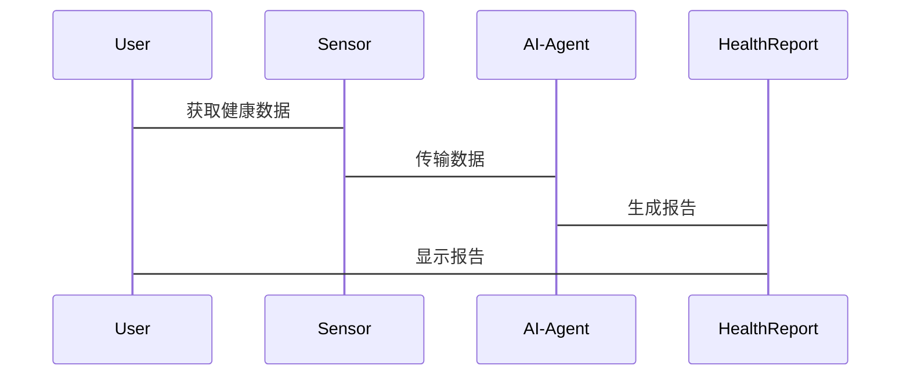

                 


# AI Agent在智能浴室镜中的每日健康报告

## 关键词：AI Agent, 智能浴室镜, 健康报告, 算法原理, 系统架构, 项目实战

## 摘要：本文详细探讨了AI Agent在智能浴室镜中的应用，重点分析了其每日健康报告的生成过程。通过背景介绍、核心概念解析、算法原理阐述、系统架构设计、项目实战演示及总结与展望，全面解析了AI Agent在智能浴室镜中的技术实现和应用价值。

---

## 第一章：AI Agent与智能浴室镜的背景

### 1.1 问题背景
智能浴室镜作为一种智能家居设备，正在逐渐成为人们日常生活的一部分。通过集成AI Agent，智能浴室镜能够实时监测用户的健康数据，并生成个性化的健康报告，帮助用户更好地管理健康。

#### 1.1.1 智能家居的发展趋势
智能家居设备的普及率逐年提高，浴室镜作为人们日常生活中使用频率较高的设备，具有巨大的潜力。

#### 1.1.2 健康监测的市场需求
随着人们对健康的关注增加，智能设备在健康监测方面的应用需求也在增长。智能浴室镜可以通过集成多种传感器，实时监测用户的健康数据。

#### 1.1.3 AI技术在健康领域的应用
AI技术在健康领域的应用越来越广泛，从疾病预测到健康建议，AI Agent在智能浴室镜中的应用为用户提供了便捷的健康监测方式。

### 1.2 问题描述
智能浴室镜需要能够实时采集用户的健康数据，并通过AI Agent生成个性化的健康报告。

#### 1.2.1 智能浴室镜的功能需求
智能浴室镜需要具备数据采集、数据处理和报告生成的功能。

#### 1.2.2 用户健康数据的实时监测
通过传感器实时采集用户的健康数据，如心率、体温、血压等。

#### 1.2.3 AI Agent在健康报告中的作用
AI Agent需要能够对采集到的数据进行分析，并生成个性化的健康报告。

### 1.3 问题解决
通过AI Agent和智能浴室镜的结合，实现健康数据的实时监测和个性化报告的生成。

#### 1.3.1 AI Agent如何生成健康报告
AI Agent通过分析用户的健康数据，生成个性化的健康建议和报告。

#### 1.3.2 智能浴室镜的数据采集与处理
智能浴室镜通过集成多种传感器，实时采集用户的健康数据，并通过AI Agent进行处理。

#### 1.3.3 健康报告的呈现方式
健康报告可以通过智能浴室镜的显示屏呈现，用户可以方便地查看自己的健康状况。

### 1.4 边界与外延
智能浴室镜的健康监测功能需要与智能家居系统和其他健康设备进行协同工作。

#### 1.4.1 系统的边界定义
智能浴室镜的健康监测功能需要与其他设备进行数据交互，如智能家居系统、手机APP等。

#### 1.4.2 外延功能的扩展可能性
未来可以通过引入更多的传感器和AI算法，进一步提升健康报告的准确性。

### 1.5 概念结构与核心要素
智能浴室镜的健康监测系统由多个核心要素组成，包括传感器、AI Agent、数据处理模块和用户界面。

#### 1.5.1 核心概念的组成
智能浴室镜的健康监测系统包括数据采集模块、数据处理模块、AI Agent和用户界面。

#### 1.5.2 各要素之间的关系
数据采集模块负责采集用户的健康数据，数据处理模块对数据进行预处理，AI Agent负责分析数据并生成健康报告，用户界面负责显示报告。

---

## 第二章：AI Agent的核心原理

### 2.1 AI Agent的定义与原理
AI Agent是一种能够自主决策和行动的智能体，能够在复杂环境中完成特定任务。

#### 2.1.1 AI Agent的基本定义
AI Agent是能够感知环境、做出决策并采取行动的智能体。

#### 2.1.2 基于强化学习的决策机制
AI Agent通过强化学习算法，根据环境反馈不断优化决策策略。

#### 2.1.3 多智能体协作的实现方式
在智能浴室镜中，多个AI Agent可以协作完成数据采集、分析和报告生成。

### 2.2 智能浴室镜的功能解析
智能浴室镜通过集成多种传感器，实时采集用户的健康数据，并通过AI Agent生成健康报告。

#### 2.2.1 数据采集模块
智能浴室镜通过传感器实时采集用户的健康数据，如心率、体温、血压等。

#### 2.2.2 交互界面设计
用户可以通过智能浴室镜的显示屏查看健康报告，并与AI Agent进行交互。

#### 2.2.3 云端数据存储
健康数据可以通过云端存储，用户可以在任何时间查看自己的健康报告。

---

## 第三章：AI Agent的算法实现

### 3.1 算法流程图
以下是AI Agent生成健康报告的算法流程图：



### 3.2 算法实现代码
以下是生成健康报告的核心代码：

```python
import numpy as np
from sklearn.metrics import accuracy_score

def preprocess(data):
    # 数据预处理
    processed_data = data.dropna()
    return processed_data

def assess(processed_data):
    # 健康评估
    model = load_model('health_assessment_model')
    predictions = model.predict(processed_data)
    return predictions

def generate_report(predictions):
    # 生成报告
    report = {}
    for i in range(len(predictions)):
        report[i] = {'status': predictions[i]}
    return report

def generate_health_report(data):
    processed_data = preprocess(data)
    predictions = assess(processed_data)
    report = generate_report(predictions)
    return report
```

### 3.3 数学模型与公式
以下是健康评估的数学模型：

$$健康指数 = \alpha \times 体温 + \beta \times 心率 + \gamma \times 血压$$

其中，α、β、γ为权重系数，需通过训练确定。

---

## 第四章：系统分析与架构设计方案

### 4.1 系统功能设计
智能浴室镜的健康监测系统需要具备以下功能：

1. 数据采集模块：实时采集用户的健康数据。
2. 数据处理模块：对采集到的数据进行预处理和分析。
3. AI Agent模块：生成个性化的健康报告。
4. 用户界面模块：显示健康报告并提供交互功能。

#### 4.1.1 领域模型类图
以下是系统功能设计的领域模型类图：



### 4.2 系统架构设计
以下是系统架构设计的Mermaid图：



### 4.3 接口设计
系统接口设计包括：

1. 数据采集接口：从传感器获取数据。
2. 数据处理接口：对数据进行预处理。
3. AI Agent接口：生成健康报告。
4. 用户界面接口：显示健康报告。

#### 4.3.1 系统交互序列图
以下是系统交互的序列图：



---

## 第五章：项目实战

### 5.1 环境安装
以下是项目实战所需的环境安装步骤：

1. 安装Python 3.8及以上版本。
2. 安装必要的库：numpy、scikit-learn、TensorFlow。

```bash
pip install numpy scikit-learn tensorflow
```

### 5.2 核心代码实现
以下是生成健康报告的核心代码：

```python
import numpy as np
from sklearn.metrics import accuracy_score

def preprocess(data):
    # 数据预处理
    processed_data = data.dropna()
    return processed_data

def assess(processed_data):
    # 健康评估
    model = load_model('health_assessment_model')
    predictions = model.predict(processed_data)
    return predictions

def generate_report(predictions):
    # 生成报告
    report = {}
    for i in range(len(predictions)):
        report[i] = {'status': predictions[i]}
    return report

def generate_health_report(data):
    processed_data = preprocess(data)
    predictions = assess(processed_data)
    report = generate_report(predictions)
    return report
```

### 5.3 代码应用解读与分析
以下是代码的解读与分析：

1. `preprocess`函数：对数据进行预处理，去除缺失值。
2. `assess`函数：使用训练好的模型对数据进行预测。
3. `generate_report`函数：根据预测结果生成健康报告。
4. `generate_health_report`函数：整合以上步骤，生成最终的健康报告。

### 5.4 实际案例分析
以下是实际案例的详细分析：

1. 数据采集：用户早晨使用智能浴室镜，系统采集用户的体温、心率和血压数据。
2. 数据处理：系统对数据进行预处理，去除缺失值。
3. 健康评估：AI Agent使用训练好的模型对数据进行预测，生成健康评估结果。
4. 生成报告：系统根据预测结果生成健康报告，并通过显示屏显示给用户。

### 5.5 项目小结
通过项目实战，我们实现了智能浴室镜的健康监测功能，验证了AI Agent在健康报告生成中的应用价值。

---

## 第六章：总结与展望

### 6.1 小结
本文详细探讨了AI Agent在智能浴室镜中的应用，分析了其在健康报告生成中的技术实现和应用价值。

### 6.2 注意事项
在实际应用中，需要注意数据隐私保护和系统稳定性。

### 6.3 拓展阅读
读者可以进一步阅读相关领域的书籍和论文，深入了解AI Agent和智能设备的结合应用。

---

## 作者：AI天才研究院/AI Genius Institute & 禅与计算机程序设计艺术 /Zen And The Art of Computer Programming

