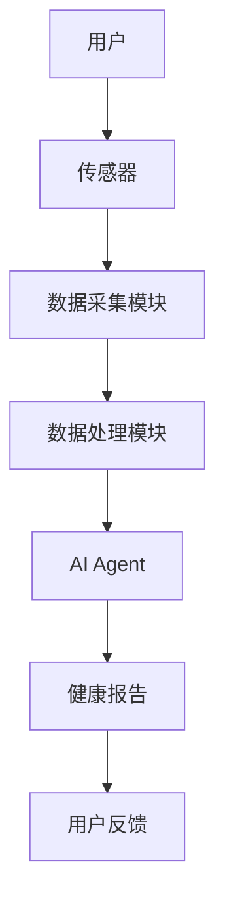
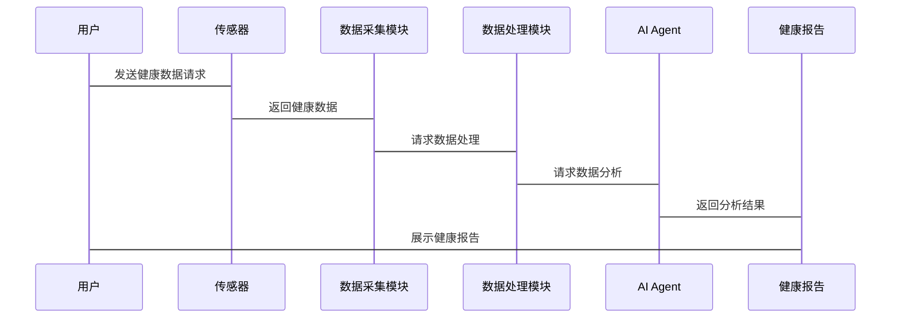

                 


# AI Agent在智能浴室镜中的每日健康检查

## 关键词：AI Agent、智能浴室镜、健康检查、机器学习、数据安全

## 摘要

本文将探讨AI Agent在智能浴室镜中的应用，特别是在每日健康检查方面的功能。通过结合AI技术与智能设备，我们能够实现个性化的健康监测与管理。文章将详细分析AI Agent的核心技术、健康数据的采集与分析方法，以及系统的架构设计与实现。同时，我们将提供实际的项目案例，展示如何将AI Agent应用于智能浴室镜的健康检查功能中，帮助用户更好地管理健康状况。

---

# 第一部分：背景与概述

## 第1章：AI Agent与智能浴室镜的概述

### 1.1 AI Agent的基本概念

#### 1.1.1 AI Agent的定义与特点

AI Agent（人工智能代理）是指能够感知环境、自主决策并执行任务的智能实体。它具备以下特点：

- **自主性**：能够自主决策，无需人工干预。
- **反应性**：能够实时感知环境变化并做出响应。
- **学习能力**：通过数据和反馈不断优化自身行为。
- **社交能力**：能够与其他系统或用户进行交互。

#### 1.1.2 AI Agent的核心功能与应用场景

AI Agent的核心功能包括数据采集、数据分析、决策支持和执行操作。它广泛应用于智能家居、医疗健康、金融投资等领域。

#### 1.1.3 AI Agent在智能设备中的作用

在智能设备中，AI Agent主要负责数据处理、任务执行和用户交互。例如，在智能浴室镜中，AI Agent可以实时监测用户的健康数据，并提供个性化的健康建议。

### 1.2 智能浴室镜的发展现状

#### 1.2.1 智能浴室镜的功能与技术基础

智能浴室镜集成了镜子的基本功能与智能设备的技术，具备以下功能：

- 显示天气信息
- 提供日历提醒
- 播放音乐
- 健康监测与分析

#### 1.2.2 当前市场上的智能浴室镜产品分析

当前市场上已有一些智能浴室镜产品，主要功能包括健康监测、天气显示、日历提醒等。这些产品大多通过传感器和AI算法实现基本的健康监测功能。

#### 1.2.3 智能浴室镜的未来发展趋势

未来，智能浴室镜将更加智能化，功能将更加多样化。AI Agent的应用将进一步提升其健康监测能力，实现更精准的健康管理和个性化服务。

### 1.3 AI Agent在智能浴室镜中的应用前景

#### 1.3.1 AI Agent与智能浴室镜的结合方式

AI Agent可以通过传感器采集用户的健康数据，如心率、体温、皮肤状况等，并通过算法进行分析，提供个性化的健康建议。

#### 1.3.2 AI Agent在健康检查中的潜在价值

AI Agent能够实时监测用户的健康数据，帮助用户及时发现潜在的健康问题，并提供相应的建议。这种实时监测和个性化服务将极大地提升用户的健康管理水平。

#### 1.3.3 智能浴室镜的健康检查功能对用户的影响

通过智能浴室镜的健康检查功能，用户可以更方便地获取健康数据，及时了解自己的身体状况，并根据系统提供的建议调整生活习惯，从而实现更健康的生活方式。

---

## 第二部分：核心概念与技术

## 第2章：AI Agent的核心技术

### 2.1 AI Agent的核心算法

#### 2.1.1 机器学习算法在AI Agent中的应用

机器学习算法是AI Agent的核心技术之一。通过机器学习，AI Agent能够从大量数据中学习模式，并做出预测和决策。例如，使用支持向量机（SVM）算法对健康数据进行分类，以识别用户的健康状况。

#### 2.1.2 自然语言处理技术在AI Agent中的应用

自然语言处理（NLP）技术使AI Agent能够理解和生成人类语言。在智能浴室镜中，用户可以通过语音指令与AI Agent交互，如询问健康建议或设置提醒。

#### 2.1.3 计算机视觉技术在AI Agent中的应用

计算机视觉技术使AI Agent能够识别图像中的信息。例如，通过摄像头采集用户的面部图像，AI Agent可以分析用户的面部特征，如肤色、表情等，以评估健康状况。

### 2.2 健康数据的采集与分析

#### 2.2.1 健康数据的采集方式与技术

健康数据可以通过多种方式采集，如心率传感器、温度传感器、摄像头等。AI Agent通过这些传感器获取数据，并进行预处理，如去噪、归一化等。

#### 2.2.2 数据分析的基本方法与流程

数据分析的基本流程包括数据清洗、特征提取、模型训练和结果分析。通过这些步骤，AI Agent能够从大量数据中提取有用的信息，并生成健康报告。

#### 2.2.3 数据分析的可视化与用户反馈

数据分析的结果需要以直观的方式展示给用户。例如，AI Agent可以通过图表或文字形式呈现健康数据，并根据分析结果提供个性化的健康建议。

### 2.3 数据安全与隐私保护

#### 2.3.1 数据安全的基本原则与技术

数据安全是AI Agent应用中的重要问题。通过加密技术、访问控制等手段，可以有效保护用户的健康数据不被泄露或篡改。

#### 2.3.2 隐私保护的法律与伦理要求

隐私保护不仅涉及技术手段，还需要遵守相关法律法规。AI Agent的设计和应用必须符合数据隐私保护的法律要求，确保用户数据的安全。

#### 2.3.3 数据加密与匿名化处理方法

通过加密技术和数据匿名化处理，可以有效保护用户的隐私。例如，使用哈希函数对敏感数据进行加密，确保数据的安全性。

---

## 第三部分：算法与数学模型

## 第3章：健康数据分析的算法原理

### 3.1 机器学习算法的数学模型

#### 3.1.1 线性回归模型的数学公式与推导

线性回归是一种常用的回归分析方法，其数学公式为：

$$ y = mx + b $$

其中，\( m \) 是斜率，\( b \) 是截距。通过最小化预测值与实际值之间的误差平方和，可以得到最佳的 \( m \) 和 \( b \)。

#### 3.1.2 支持向量机（SVM）的基本原理与数学公式

支持向量机是一种常用的分类算法，其基本原理是通过找到一个超平面，将数据分成两类。数学公式如下：

$$ max \sum_{i=1}^n y_i (w \cdot x_i + b) \geq 1 $$

其中，\( y_i \) 是标签，\( w \) 是权重向量，\( b \) 是偏置项。

#### 3.1.3 决策树算法的原理与信息增益计算

决策树是一种基于树状结构的分类算法。信息增益是决策树算法中的重要指标，用于选择最优的分割特征。信息增益的计算公式为：

$$ \text{信息增益} = H(\text{原始数据}) - H(\text{分割后的数据}) $$

其中，\( H \) 表示熵，用于度量数据的不确定性。

### 3.2 健康数据分类的算法实现

#### 3.2.1 K-近邻算法（KNN）的分类原理

K-近邻算法是一种基于实例的分类方法。其基本原理是通过计算待分类样本与已分类样本之间的距离，找到与之最近的K个样本，根据这些样本的类别进行投票，最终确定待分类样本的类别。

#### 3.2.2 神经网络在健康数据分类中的应用

神经网络是一种模拟人脑结构和功能的计算模型。在健康数据分类中，神经网络可以通过多层感知机（MLP）实现非线性分类。神经网络的训练过程包括正向传播和反向传播两个阶段。

---

## 第四部分：系统设计

## 第4章：智能浴室镜健康检查系统的架构设计

### 4.1 系统架构设计

#### 4.1.1 系统架构图

以下是一个简单的智能浴室镜健康检查系统架构图：



#### 4.1.2 系统功能设计

系统功能设计包括数据采集、数据处理、AI分析和用户反馈四个模块。每个模块的具体功能如下：

- **数据采集模块**：通过传感器采集用户的健康数据。
- **数据处理模块**：对采集到的数据进行预处理和特征提取。
- **AI分析模块**：使用机器学习算法对数据进行分类和预测。
- **用户反馈模块**：将分析结果以用户友好的方式展示给用户。

### 4.2 系统接口设计

#### 4.2.1 系统接口设计图

以下是系统接口设计图：



---

## 第五部分：项目实战

## 第5章：智能浴室镜健康检查系统的实现

### 5.1 环境搭建

#### 5.1.1 开发工具安装

- **Python**：安装Python 3.8或更高版本。
- **TensorFlow**：使用pip安装TensorFlow库。
- **Mermaid**：安装Mermaid CLI工具，用于生成图表。

#### 5.1.2 项目依赖管理

使用虚拟环境管理项目依赖，确保所有依赖版本一致。

### 5.2 系统核心实现

#### 5.2.1 数据采集模块的实现

以下是数据采集模块的代码实现：

```python
import numpy as np

def collect_data(samples=100):
    # 生成模拟健康数据
    heart_rate = np.random.normal(70, 5, samples)
    temperature = np.random.normal(36.5, 0.2, samples)
    return heart_rate, temperature
```

#### 5.2.2 数据处理模块的实现

以下是数据处理模块的代码实现：

```python
import pandas as pd

def preprocess_data(heart_rate, temperature):
    data = pd.DataFrame({
        'HeartRate': heart_rate,
        'Temperature': temperature
    })
    return data
```

#### 5.2.3 AI Agent的实现

以下是AI Agent的代码实现：

```python
from sklearn.svm import SVC

def train_model(data, labels):
    model = SVC()
    model.fit(data, labels)
    return model

# 示例数据
heart_rate, temperature = collect_data()
data = preprocess_data(heart_rate, temperature)
labels = np.random.randint(2, size=len(data))

model = train_model(data[['HeartRate', 'Temperature']], labels)
```

### 5.3 项目实战案例分析

#### 5.3.1 案例分析

通过实际案例分析，我们可以看到AI Agent在智能浴室镜中的应用效果。例如，假设用户的健康数据为心率75，体温36.7，AI Agent可以预测用户的健康状况，并提供相应的建议。

#### 5.3.2 代码实现与解读

以下是完整的代码实现：

```python
import numpy as np
import pandas as pd
from sklearn.svm import SVC
from sklearn.metrics import accuracy_score

def collect_data(samples=100):
    heart_rate = np.random.normal(70, 5, samples)
    temperature = np.random.normal(36.5, 0.2, samples)
    return heart_rate, temperature

def preprocess_data(heart_rate, temperature):
    data = pd.DataFrame({
        'HeartRate': heart_rate,
        'Temperature': temperature
    })
    return data

def train_model(data, labels):
    model = SVC()
    model.fit(data, labels)
    return model

# 示例数据
heart_rate, temperature = collect_data()
data = preprocess_data(heart_rate, temperature)
labels = np.random.randint(2, size=len(data))

model = train_model(data[['HeartRate', 'Temperature']], labels)
```

### 5.4 项目小结

通过本项目的实现，我们可以看到AI Agent在智能浴室镜中的应用潜力。通过机器学习算法，AI Agent能够实现健康数据的分类与预测，为用户提供个性化的健康建议。

---

## 第六部分：总结与展望

## 第6章：总结与展望

### 6.1 总结

本文详细介绍了AI Agent在智能浴室镜中的应用，特别是在健康检查方面的功能。通过结合AI技术与智能设备，我们可以实现个性化的健康监测与管理。

### 6.2 展望

未来，AI Agent在智能浴室镜中的应用将更加广泛。通过不断优化算法和提升数据处理能力，AI Agent将能够提供更精准的健康建议，并实现更智能化的健康管理。

### 6.3 注意事项

在实际应用中，需要注意数据安全和隐私保护，确保用户的健康数据不会被泄露或滥用。

### 6.4 最佳实践

建议在实际项目中，采用模块化设计，确保系统的可扩展性和可维护性。同时，定期更新算法模型，以提升系统的性能和准确性。

---

## 附录

### 附录A：工具安装指南

#### 1. 安装Python

```bash
python --version
```

#### 2. 安装TensorFlow

```bash
pip install tensorflow
```

#### 3. 安装Mermaid CLI

```bash
npm install -g mermaid-cli
```

### 附录B：术语表

- **AI Agent**：人工智能代理，能够自主决策并执行任务的智能实体。
- **健康数据**：包括心率、体温、血压等生理指标。
- **机器学习**：一种人工智能技术，通过数据训练模型，实现预测和分类。

### 附录C：参考文献

1. LeCun, Y., Bengio, Y., & Hinton, G. (2015). Deep learning. Nature, 521(7555), 436-444.
2. Bishop, C. M. (2006). Pattern recognition and machine learning. Springer.
3. 周志华. (2016). 机器学习. 清华大学出版社.

### 附录D：拓展阅读

1. [深度学习入门](https://zh-v1.d2l.ai/)
2. [机器学习实战](https://www.mooc.wang/courses/130)
3. [Mermaid图表教程](https://mermaid-js.github.io/mermaid-live-editor/)

---

作者：AI天才研究院/AI Genius Institute & 禅与计算机程序设计艺术 /Zen And The Art of Computer Programming

