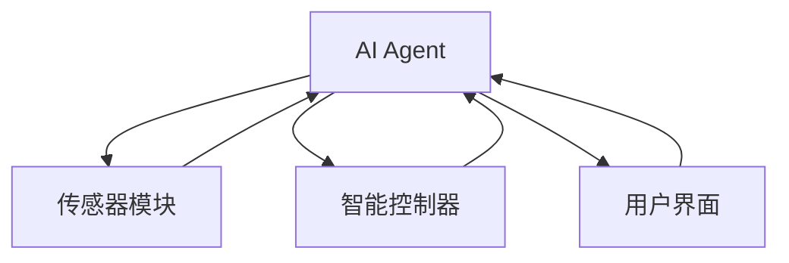
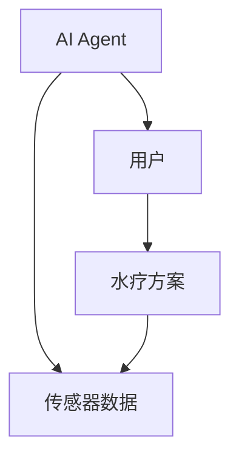

                 

# AI Agent在智能浴缸中的水疗养生定制系统

> 关键词：AI Agent, 智能浴缸, 水疗养生, 系统设计, 算法实现

> 摘要：本文探讨了AI Agent在智能浴缸中的应用，详细介绍了水疗养生系统的定制设计、核心算法原理、系统架构及实现方案。通过分析AI Agent的感知、决策与执行机制，结合实际应用场景，展示了如何通过技术创新提升用户体验。

---

# 第1章: 背景介绍

## 1.1 问题背景

### 1.1.1 水疗养生的现状与挑战
水疗养生作为一种传统的健康方式，近年来随着人们对健康关注度的提升而备受青睐。传统的水疗设备功能单一，无法根据用户的身体状况提供个性化的服务，且操作复杂，用户体验较差。

### 1.1.2 智能设备在水疗中的应用前景
随着物联网和人工智能技术的发展，智能设备逐渐渗透到水疗领域。智能浴缸通过集成传感器和智能控制系统，能够实时监测水温和水质，并根据用户的需求进行调整。

### 1.1.3 AI Agent在智能浴缸中的潜在价值
AI Agent（智能代理）能够通过感知用户的需求和环境的变化，自动调整浴缸的参数，为用户提供个性化的水疗体验。这种智能化的解决方案不仅提升了用户体验，还能够帮助用户更好地进行健康管理。

## 1.2 问题描述

### 1.2.1 水疗养生系统的需求分析
水疗养生系统需要具备以下功能：
- 实时监测水温、水质等参数。
- 根据用户的身体状况推荐合适的水疗方案。
- 提供个性化的健康建议。

### 1.2.2 智能浴缸用户的痛点与需求
用户在使用传统浴缸时，常常面临以下痛点：
- 缺乏智能化的健康监测功能。
- 无法根据个人健康状况调整水疗方案。
- 缺乏个性化的健康建议。

### 1.2.3 AI Agent在系统中的角色与功能
AI Agent在系统中扮演着关键的角色，负责：
- 感知用户的需求和环境的变化。
- 决策如何调整浴缸的参数。
- 执行相应的操作。

## 1.3 问题解决

### 1.3.1 AI Agent的核心功能与实现路径
AI Agent的核心功能包括：
- 感知：通过传感器获取水温和用户的身体数据。
- 决策：基于感知数据，推荐最佳的水疗方案。
- 执行：调整浴缸的温度和水流强度。

### 1.3.2 智能浴缸与AI Agent的交互设计
AI Agent与智能浴缸的交互设计需要考虑以下几个方面：
- 数据的采集与传输。
- 用户界面的交互设计。
- 系统的反馈与优化。

### 1.3.3 系统的边界与外延
系统的边界包括：
- 系统内部的传感器和智能控制器。
- 外部的用户和环境。

系统的外延包括：
- 第三方健康监测设备（如智能手环）。
- 云端健康数据管理系统。

## 1.4 核心概念与组成

### 1.4.1 AI Agent的基本概念与属性
AI Agent是一种能够感知环境、自主决策并执行任务的智能系统。其核心属性包括：
- 感知能力：通过传感器获取环境数据。
- 决策能力：基于感知数据做出决策。
- 执行能力：通过执行机构实现决策。

### 1.4.2 智能浴缸系统的组成与功能模块
智能浴缸系统主要由以下几个模块组成：
- 传感器模块：负责采集水温和用户的身体数据。
- AI Agent模块：负责处理数据并做出决策。
- 智能控制器：根据决策结果调整浴缸的参数。
- 用户界面：供用户与系统交互。

### 1.4.3 系统的核心要素与关系图

---

# 第2章: AI Agent的核心概念与原理

## 2.1 AI Agent的感知机制

### 2.1.1 感知模块的功能与实现
感知模块的主要功能是采集环境数据和用户数据。数据来源包括：
- 水温传感器：实时监测水温。
- 用户心率传感器：监测用户的心率变化。

### 2.1.2 多模态数据的采集与处理
AI Agent需要处理多种类型的数据，如温度、心率等。数据处理流程包括：
1. 数据采集：通过传感器获取数据。
2. 数据预处理：去除噪声，提取特征。
3. 数据融合：将多源数据进行融合，得到更准确的感知结果。

### 2.1.3 数据预处理与特征提取
数据预处理的主要步骤包括：
- 数据清洗：去除异常值。
- 数据归一化：将数据标准化。

特征提取的关键点在于选择能够反映用户状态的特征，如心率变异性和水温变化率。

## 2.2 AI Agent的决策机制

### 2.2.1 基于规则的决策系统
基于规则的决策系统通过预定义的规则来做出决策。例如，当水温低于37℃时，系统会自动加热。

### 2.2.2 基于机器学习的决策模型
机器学习模型可以通过历史数据训练，学习用户的偏好和健康状况，从而做出个性化的决策。

### 2.2.3 基于强化学习的优化策略
强化学习通过不断试错，优化决策策略。例如，AI Agent可以通过调整水流强度，找到最佳的水疗方案。

## 2.3 AI Agent的执行机制

### 2.3.1 动作规划与执行策略
AI Agent需要根据决策结果，规划具体的执行动作，如调整水温或水流强度。

### 2.3.2 系统反馈与状态更新
执行动作后，系统需要根据反馈信息更新状态。例如，调整水温后，系统会重新监测水温，并更新用户的状态。

### 2.3.3 执行过程中的异常处理
在执行过程中，系统需要处理可能出现的异常情况，如传感器故障或执行机构故障。

## 2.4 核心概念对比表

| 核心概念 | 定义 | 优缺点 | 示例 |
|----------|------|--------|------|
| 感知机制 | 数据采集与处理 | 实时性强，但依赖传感器精度 | 水温监测 |
| 决策机制 | 基于规则或机器学习 | 简单易实现，但可能不够灵活 | 自动加热 |
| 执行机制 | 动作规划与反馈 | 可靠性高，但可能响应较慢 | 调整水流强度 |

## 2.5 ER实体关系图

---

# 第3章: AI Agent的算法原理

## 3.1 感知模型

### 3.1.1 感知模型的输入与输出
输入：传感器数据（水温、心率）。
输出：用户状态（放松、紧张）。

### 3.1.2 数据预处理与特征提取
数据预处理步骤：
1. 去除噪声：使用滑动平均法。
2. 数据归一化：将数据标准化到0-1范围。

特征提取：提取心率变异性（HRV）和水温变化率（TR）。

### 3.1.3 感知模型的训练与优化
感知模型可以使用支持向量机（SVM）或随机森林（RF）进行训练。训练目标是将用户状态与传感器数据进行关联。

---

## 3.2 决策模型

### 3.2.1 决策树的构建与优化
决策树是一种常用的分类方法。通过训练数据构建决策树，可以实现对用户状态的分类。

### 3.2.2 基于强化学习的决策策略
强化学习通过不断试错，优化决策策略。例如，AI Agent可以通过调整水流强度，找到最佳的水疗方案。

---

## 3.3 执行模型

### 3.3.1 基于强化学习的动作规划
动作规划需要考虑多个因素，如用户偏好和环境条件。可以通过Q-learning算法实现。

---

# 总结

通过上述分析，我们可以看到AI Agent在智能浴缸中的应用前景广阔。通过感知、决策和执行机制的协同工作，AI Agent能够为用户提供个性化的水疗体验，提升健康管理水平。未来，随着技术的不断进步，AI Agent在水疗养生中的应用将会更加智能化和个性化。

---

作者：AI天才研究院/AI Genius Institute & 禅与计算机程序设计艺术 /Zen And The Art of Computer Programming

