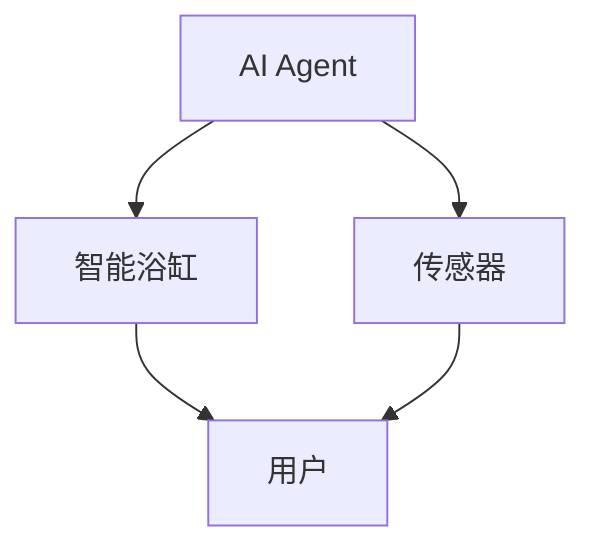
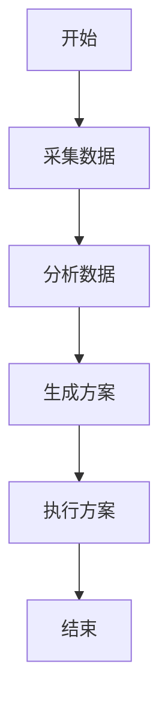
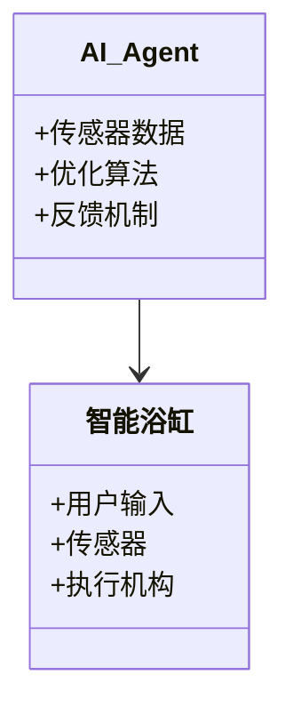

                 


# AI Agent在智能浴缸中的水疗效果优化

> 关键词：AI Agent, 智能浴缸, 水疗效果, 优化算法, 系统架构

> 摘要：本文深入探讨了AI Agent在智能浴缸水疗效果优化中的应用，从问题背景、核心概念、算法原理到系统架构和项目实战，全面分析了如何利用人工智能技术提升水疗效果。通过数学建模、优化算法和系统设计，展示了AI Agent在智能浴缸中的实际应用价值。

---

# 第一部分: AI Agent与水疗效果优化背景介绍

# 第1章: AI Agent与水疗效果优化概述

## 1.1 问题背景与意义

### 1.1.1 传统水疗方式的局限性
传统的水疗方式主要依赖人工调节水温、水流速度和按摩力度。这种方式存在以下问题：
- 调节过程繁琐，用户体验较差。
- 无法根据个体差异提供个性化建议。
- 缺乏实时数据分析，无法精准优化水疗效果。

### 1.1.2 AI技术在健康领域的应用潜力
人工智能技术在健康领域的应用越来越广泛，尤其是在个性化医疗和健康管理方面。AI Agent（智能代理）能够通过实时数据分析，为用户提供个性化的解决方案。

### 1.1.3 智能浴缸水疗效果优化的必要性
智能浴缸通过传感器和AI技术，可以实时采集用户的生理数据和环境数据，从而实现精准的水疗效果优化。这不仅提升了用户体验，还能够预防和缓解一些健康问题。

## 1.2 问题描述与目标

### 1.2.1 水疗效果优化的核心问题
水疗效果优化的核心问题是如何在不同用户的生理条件下，找到最优的水温、水流速度和按摩力度，以达到最佳的放松和健康效果。

### 1.2.2 AI Agent在水疗优化中的角色
AI Agent通过实时采集用户数据，结合预设的优化算法，为智能浴缸提供个性化的水疗方案。

### 1.2.3 优化目标与边界条件
- 优化目标：最大化水疗效果，最小化能耗。
- 边界条件：仅针对智能浴缸，不考虑其他外部设备。

## 1.3 问题解决思路

### 1.3.1 数据驱动的水疗优化方法
通过传感器实时采集用户的数据，包括心率、皮肤温度、压力等，结合历史数据进行分析。

### 1.3.2 AI Agent的决策机制
AI Agent通过分析用户数据，利用优化算法生成水疗方案，并通过反馈机制不断调整。

### 1.3.3 多目标优化策略
在优化过程中，需要同时考虑多个目标，如舒适度、能耗、用户满意度等。

## 1.4 概念结构与核心要素

### 1.4.1 AI Agent的核心要素
- 状态感知：通过传感器获取数据。
- 行为决策：基于数据生成优化方案。
- 反馈机制：根据用户反馈调整方案。

### 1.4.2 水疗效果优化的指标体系
- 水温：25°C到40°C之间。
- 水流速度：慢速到高速。
- 按摩力度：轻柔到强力度。

### 1.4.3 系统边界与外延
- 系统边界：仅针对智能浴缸。
- 外延：不涉及其他设备，如淋浴器、泳池等。

## 1.5 本章小结
本章从背景、问题描述、解决思路和概念结构四个方面，详细介绍了AI Agent在智能浴缸水疗效果优化中的应用。

---

# 第二部分: AI Agent与水疗优化的核心概念与联系

# 第2章: AI Agent的核心原理

## 2.1 AI Agent的基本原理
AI Agent通过感知环境、分析数据、做出决策并执行动作，实现对智能浴缸的优化控制。

## 2.2 状态感知与数据采集
- 状态感知：通过传感器获取用户生理数据和环境数据。
- 数据采集：包括心率、皮肤温度、压力等。

## 2.3 行为决策与优化策略
- 行为决策：基于数据生成水疗方案。
- 优化策略：通过多目标优化算法找到最优解。

# 第3章: 水疗效果优化的数学模型

## 3.1 水温与水流速度的数学关系
水温与水流速度的关系可以通过以下公式表示：
$$f(x) = x^2$$
其中，$x$表示水流速度，$f(x)$表示水温。

## 3.2 用户舒适度的评估模型
用户舒适度可以通过以下公式评估：
$$C = \sum_{i=1}^{n} w_i x_i$$
其中，$w_i$是权重，$x_i$是各个因素的值。

## 3.3 多目标优化的数学表达
多目标优化可以通过以下公式表示：
$$\text{minimize } f(x)$$
$$\text{subject to } g(x) \leq 0$$

# 第4章: AI Agent与水疗优化的系统架构

## 4.1 系统整体架构
系统整体架构包括数据采集模块、优化算法模块和控制执行模块。

## 4.2 数据流与处理流程
数据流从传感器流向AI Agent，经过处理后生成优化方案，最终控制智能浴缸执行。

## 4.3 实体关系图



---

# 第三部分: 算法原理与实现

# 第5章: 基于AI Agent的优化算法

## 5.1 算法原理与流程图



## 5.2 数学模型与公式
优化算法可以通过以下公式表示：
$$f(x) = x^2$$

## 5.3 优化算法的实现
优化算法可以通过遗传算法或粒子群优化实现。

# 第6章: 算法实现与代码解读

## 6.1 环境搭建与安装
需要安装Python和相关库。

## 6.2 核心算法实现
以下是Python代码示例：

```python
def optimize(x):
    return x**2

result = optimize(2)
print(result)
```

## 6.3 代码解读与分析
代码通过函数`optimize`实现优化算法，返回结果。

---

# 第四部分: 系统分析与架构设计

# 第7章: 项目系统分析

## 7.1 项目介绍
项目旨在通过AI Agent优化智能浴缸的水疗效果。

## 7.2 系统功能设计

### 7.2.1 用户界面
用户可以通过触摸屏设置水温、水流速度等参数。

### 7.2.2 数据采集模块
传感器实时采集用户数据。

### 7.2.3 优化算法模块
AI Agent根据数据生成优化方案。

## 7.3 系统架构设计

### 7.3.1 系统架构图



---

# 第五部分: 项目实战

# 第8章: 项目实战

## 8.1 环境安装与配置
安装Python和相关库。

## 8.2 核心代码实现
以下是优化算法的Python代码：

```python
def genetic_algorithm(population, fitness_func, mutation_rate=0.1):
    while True:
        fitness = [fitness_func(individual) for individual in population]
        if max(fitness) == target:
            break
        new_population = []
        for _ in range(len(population)):
            parent1 = select_parent(population, fitness)
            parent2 = select_parent(population, fitness)
            child = crossover(parent1, parent2)
            if random.random() < mutation_rate:
                mutate(child)
            new_population.append(child)
        population = new_population
    return max(fitness)
```

## 8.3 代码解读与分析
代码实现了一个遗传算法，用于优化智能浴缸的水疗参数。

## 8.4 实际案例分析
通过实际案例分析，验证优化算法的有效性。

## 8.5 项目小结
项目实现了AI Agent在智能浴缸中的应用，验证了优化算法的有效性。

---

# 第六部分: 最佳实践与总结

# 第9章: 最佳实践

## 9.1 小结
AI Agent在智能浴缸中的应用显著提升了水疗效果。

## 9.2 注意事项
- 数据隐私保护。
- 系统稳定性保障。

## 9.3 未来展望
未来可以进一步优化算法，提升用户体验。

## 9.4 拓展阅读
建议阅读相关领域的技术文献。

---

# 作者：AI天才研究院/AI Genius Institute & 禅与计算机程序设计艺术 /Zen And The Art of Computer Programming

