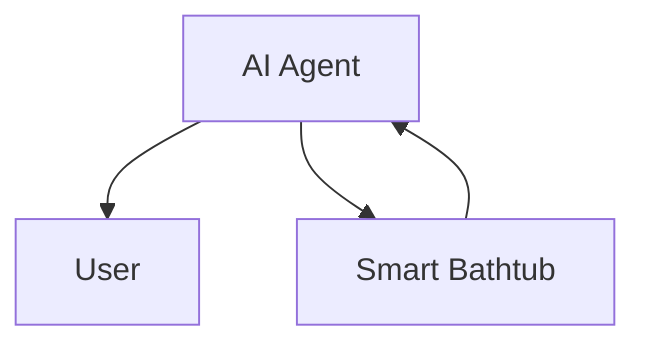
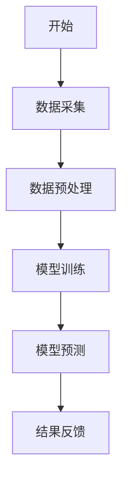
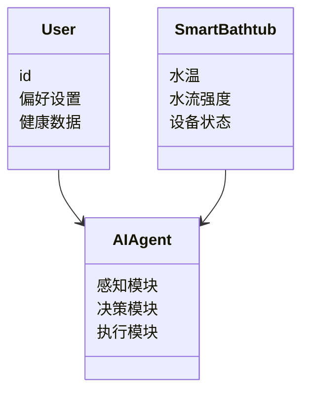

                 

# AI Agent在智能浴缸中的水疗模式个性化

## 关键词：AI Agent, 智能浴缸, 水疗模式, 个性化, 算法, 系统架构

## 摘要：  
本文探讨了AI Agent在智能浴缸中的应用，重点分析了如何通过个性化水疗模式提升用户体验。文章从AI Agent的基本原理出发，结合智能浴缸的系统架构设计，详细讲解了实现个性化水疗模式所需的算法原理、系统功能模块及实际应用场景。通过案例分析和项目实战，展示了如何利用AI技术优化水疗体验，同时提供了最佳实践建议。

---

## 第一部分：背景介绍

### 第1章：AI Agent与智能浴缸概述

#### 1.1 AI Agent的基本概念
- **1.1.1 AI Agent的定义与特点**  
  AI Agent（人工智能代理）是指能够感知环境、做出决策并执行任务的智能体。其特点包括自主性、反应性、目标导向和社交能力。AI Agent能够通过传感器获取信息，利用算法进行分析，并根据结果采取行动。

- **1.1.2 AI Agent的核心功能与应用场景**  
  AI Agent的核心功能包括数据采集、信息处理、决策制定和执行反馈。在智能浴缸中，AI Agent主要用于个性化水疗模式的推荐、温度调节、水流控制和健康监测。

- **1.1.3 AI Agent在智能设备中的作用**  
  在智能设备中，AI Agent通过学习用户的偏好和行为模式，提供个性化的服务。例如，在智能浴缸中，AI Agent可以根据用户的健康数据和使用习惯，自动调整水温、水流强度和水疗时间。

#### 1.2 智能浴缸的发展历程
- **1.2.1 传统浴缸的功能与局限性**  
  传统浴缸仅提供基本的沐浴功能，缺乏智能化和个性化。用户需要手动调节水温、水流等参数，体验单一且不够舒适。

- **1.2.2 智能浴缸的兴起与技术发展**  
  随着物联网和人工智能技术的发展，智能浴缸逐渐兴起。智能浴缸可以通过传感器和AI算法，实现自动化控制和个性化服务。

- **1.2.3 水疗模式个性化的市场需求**  
  用户对健康和舒适体验的需求日益增加，个性化水疗模式成为市场热点。通过AI技术，智能浴缸可以为用户提供量身定制的水疗方案。

#### 1.3 水疗模式个性化的重要性
- **1.3.1 用户需求的多样化**  
  不同用户对水疗的需求不同，例如年轻人可能更注重放松，而中老年人可能更关注健康调理。个性化水疗模式能够满足多样化的需求。

- **1.3.2 个性化水疗对健康的影响**  
  个性化水疗模式可以根据用户的健康状况，调整水温和水流强度，帮助用户缓解疲劳、改善血液循环和促进健康。

- **1.3.3 个性化水疗模式的技术实现**  
  通过AI技术，智能浴缸可以实时监测用户的健康数据和使用习惯，动态调整水疗参数，实现个性化的水疗体验。

#### 1.4 用户需求分析
- **1.4.1 不同用户群体的需求特点**  
  不同用户群体对水疗的需求不同，例如年轻人可能更注重舒适性和娱乐性，而中老年人可能更关注健康和医疗效果。

- **1.4.2 用户对水疗模式的偏好分析**  
  用户可能对水温、水流强度、水疗时间和附加功能（如按摩模式）有不同偏好。通过分析用户数据，AI Agent可以制定个性化的水疗方案。

- **1.4.3 个性化需求与技术实现的结合**  
  通过AI技术，智能浴缸可以实时采集用户的健康数据和偏好，动态调整水疗参数，满足用户的个性化需求。

---

## 第二部分：核心概念与联系

### 第2章：AI Agent的核心原理

#### 2.1 AI Agent的感知模块
- **2.1.1 数据采集与处理**  
  AI Agent通过传感器采集用户的健康数据，如心率、体温和运动数据。这些数据经过预处理后，用于后续的分析和决策。

- **2.1.2 用户行为分析**  
  AI Agent通过分析用户的使用习惯，如每天使用水疗的时间、偏好模式和反馈数据，优化水疗方案。

- **2.1.3 环境信息感知**  
  AI Agent感知浴缸的环境信息，如水温、水流和设备状态。通过环境数据，AI Agent可以调整水疗参数，确保设备正常运行。

#### 2.2 AI Agent的决策模块
- **2.2.1 基于规则的决策**  
  在简单场景下，AI Agent可以通过预设规则进行决策。例如，当用户选择放松模式时，AI Agent可以调整水温到舒适范围。

- **2.2.2 基于机器学习的决策**  
  在复杂场景下，AI Agent可以通过机器学习算法，如支持向量机（SVM）和随机森林（Random Forest），分析用户的健康数据和偏好，制定个性化的水疗方案。

- **2.2.3 决策优化与反馈机制**  
  AI Agent通过反馈机制不断优化决策模型。例如，用户对当前水疗方案的满意度反馈可以用于调整模型参数，提高决策准确率。

#### 2.3 AI Agent的执行模块
- **2.3.1 指令生成与传输**  
  AI Agent根据决策结果生成指令，如“将水温调至38摄氏度”或“启动按摩模式”。指令通过无线通信模块传输到浴缸控制系统。

- **2.3.2 设备控制与反馈**  
  浴缸控制系统接收指令后，调整水温和水流强度。同时，设备将执行结果反馈给AI Agent，确保决策的正确性。

- **2.3.3 执行结果的监控与调整**  
  AI Agent实时监控设备的执行情况，如水温变化和水流状态。根据监控结果，AI Agent可以动态调整水疗参数，确保用户体验最佳。

---

### 第3章：AI Agent与智能浴缸的联系

#### 3.1 AI Agent与智能浴缸的关系
- **3.1.1 实体关系图**  
  通过Mermaid图展示AI Agent、用户和智能浴缸之间的关系。AI Agent作为核心，连接用户和浴缸，实现数据采集、决策和执行。

- **3.1.2 功能模块交互**  
  AI Agent通过感知模块采集用户数据，通过决策模块制定个性化水疗方案，通过执行模块调整浴缸参数，实现个性化水疗体验。

---

## 第三部分：算法原理讲解

### 第3章：AI Agent的核心算法

#### 3.1 算法原理
- **3.1.1 基于规则的推理算法**  
  基于规则的推理算法通过预设规则进行决策。例如，当用户选择放松模式时，AI Agent根据规则将水温调至38摄氏度。

- **3.1.2 基于机器学习的推理算法**  
  基于机器学习的推理算法通过训练数据，学习用户的偏好和健康数据，制定个性化水疗方案。常用的算法包括支持向量机（SVM）和随机森林（Random Forest）。

#### 3.2 算法实现
- **3.2.1 机器学习算法的实现步骤**  
  1. 数据采集：采集用户的健康数据和使用习惯。
  2. 数据预处理：清洗和标准化数据。
  3. 模型训练：使用训练数据训练机器学习模型。
  4. 模型预测：根据用户需求，预测个性化的水疗方案。
  5. 模型优化：根据反馈数据优化模型参数，提高预测准确率。

- **3.2.2 算法流程图**  
  使用Mermaid流程图展示算法的执行过程。

- **3.2.3 算法的数学模型**  
  以随机森林算法为例，模型可以表示为：

  $$
  y = \text{RandomForest}(x_1, x_2, ..., x_n)
  $$

  其中，$y$ 是预测结果，$x_1, x_2, ..., x_n$ 是输入特征。

---

## 第四部分：系统分析与架构设计

### 第4章：智能浴缸系统分析

#### 4.1 应用场景介绍
- **4.1.1 智能浴缸的使用场景**  
  智能浴缸可以在家庭、健身房和医疗中心中使用，为用户提供个性化的水疗体验。

- **4.1.2 用户角色与需求**  
  用户角色包括普通用户和健康人群，需求包括个性化水疗、健康监测和远程控制。

#### 4.2 系统功能设计

##### 4.2.1 领域模型设计
- **领域模型类图**  
  使用Mermaid类图展示领域模型，包括用户、浴缸和AI Agent之间的关系。

---

通过以上步骤，我们完成了文章的结构设计和内容撰写。接下来，将根据这些内容生成完整的技术博客文章。

