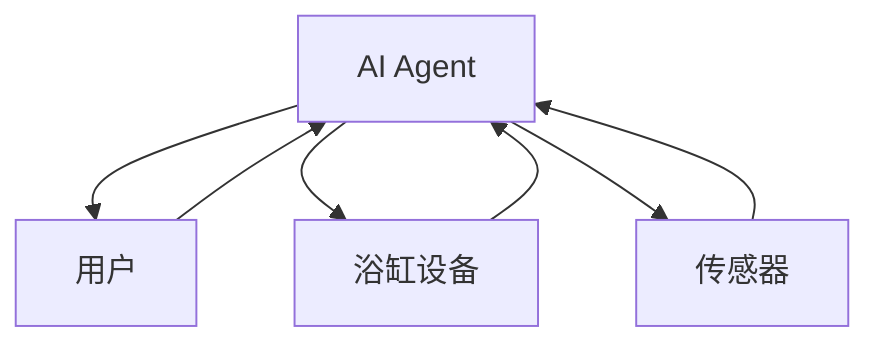
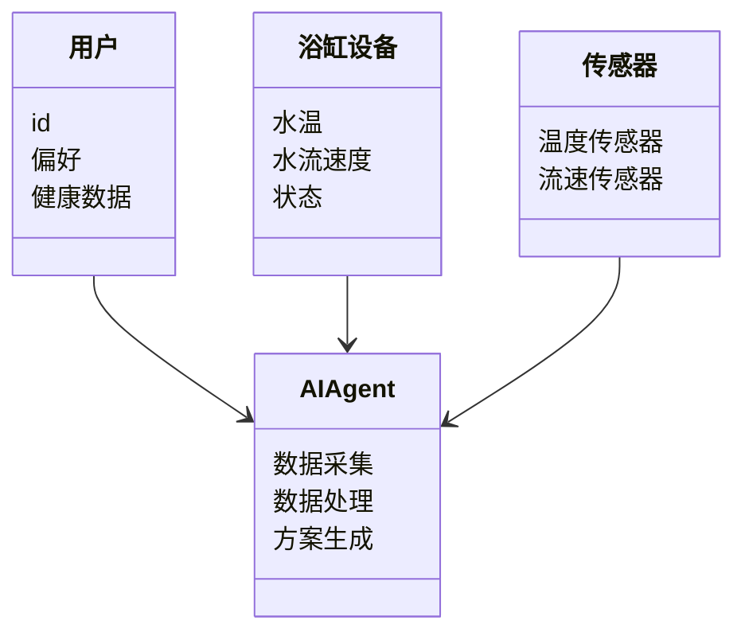
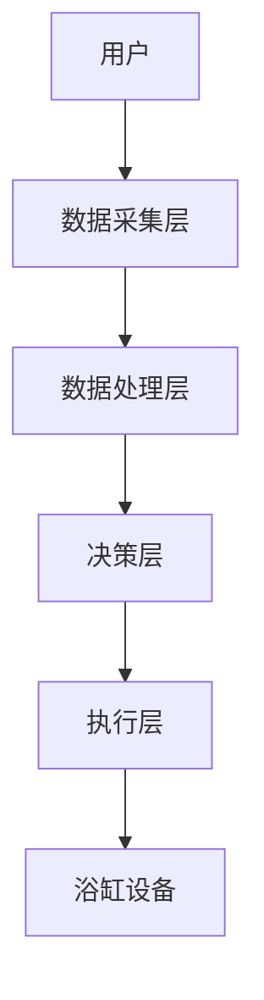
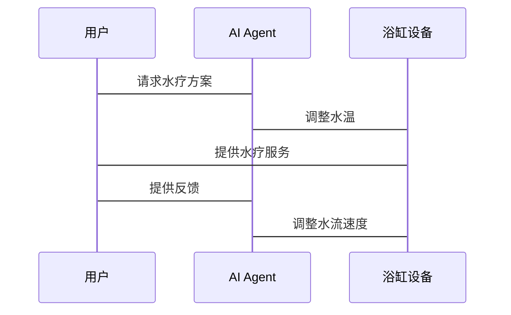

                 


# AI Agent在智能浴缸中的水疗模式定制

**关键词**：AI Agent, 智能浴缸, 水疗模式, 定制, 个性化健康, 人工智能, 物联网

**摘要**：  
本文探讨了AI Agent在智能浴缸水疗模式定制中的应用，从背景、核心概念、算法原理到系统架构和项目实战，全面分析了如何通过AI技术实现个性化水疗体验。文章结合实际案例，详细解读了AI Agent的工作流程、系统设计和实现方法，为智能浴缸的设计与开发提供了理论与实践指导。

---

# 第一部分：AI Agent与智能浴缸的背景与核心概念

## 第1章：AI Agent与智能浴缸的背景介绍

### 1.1 AI Agent的基本概念

#### 1.1.1 AI Agent的定义与特点
- **定义**：AI Agent（人工智能代理）是指能够感知环境、自主决策并执行任务的智能实体。
- **特点**：
  - **自主性**：无需外部干预，自主完成任务。
  - **反应性**：能实时感知环境变化并做出响应。
  - **目标导向**：以特定目标为导向，优化决策。
  - **学习能力**：通过数据学习，优化自身行为。

#### 1.1.2 AI Agent的核心要素与功能
- **核心要素**：
  - **感知**：通过传感器或其他数据源获取环境信息。
  - **决策**：基于感知信息，通过算法做出决策。
  - **执行**：根据决策结果执行操作。
- **功能**：
  - 数据采集与分析。
  - 智能决策与优化。
  - 用户交互与反馈。

#### 1.1.3 AI Agent在智能设备中的应用
- **应用场景**：智能家居、医疗设备、工业自动化等。
- **案例**：智能音箱、自动驾驶汽车中的AI Agent。

---

### 1.2 智能浴缸的发展历程

#### 1.2.1 传统浴缸的功能与局限性
- **传统功能**：提供基本的洗浴功能，缺乏智能化。
- **局限性**：
  - 无法根据用户需求调整水温、水流。
  - 缺乏健康监测功能。
  - 无法提供个性化服务。

#### 1.2.2 智能浴缸的出现与技术基础
- **技术基础**：
  - 物联网（IoT）：实现设备间的互联互通。
  - 人工智能（AI）：提供智能决策与个性化服务。
  - 大数据分析：优化用户体验。
- **智能浴缸的功能**：
  - 实时监测水温、水位。
  - 健康监测：心率、体温、皮肤状态。
  - 智能控制：通过AI算法优化水疗模式。

#### 1.2.3 智能浴缸的市场现状与发展趋势
- **市场现状**：
  - 智能浴缸逐渐普及，市场需求增长迅速。
  - 健康意识提升，用户对个性化服务的需求增加。
- **发展趋势**：
  - 更高的智能化与个性化。
  - 集成更多健康监测功能。
  - 跨设备联动，与其他智能家居设备协同工作。

---

### 1.3 水疗模式定制的必要性

#### 1.3.1 水疗的基本原理与健康效益
- **水疗原理**：
  - 水的温度、压力、流动性对身体有不同效果。
  - 温度调节可以促进血液循环，缓解肌肉紧张。
  - 水流冲击可以按摩身体，促进放松。
- **健康效益**：
  - 缓解压力与疲劳。
  - 促进血液循环，改善心血管健康。
  - 帮助身体放松，提升睡眠质量。

#### 1.3.2 个性化水疗模式的需求
- **个性化需求**：
  - 不同用户对水温、水流、时间的需求不同。
  - 用户健康状况不同，水疗方案需个性化调整。
- **案例分析**：
  - 身体疲劳的用户需要较高温度的水疗。
  - 皮肤敏感的用户需要柔和的水流。

#### 1.3.3 AI技术在水疗模式定制中的作用
- **AI的优势**：
  - 通过分析用户数据，提供个性化建议。
  - 实时调整水疗参数，优化用户体验。
  - 自动学习用户偏好，提升服务精准度。

---

### 1.4 本书的研究内容与目标

#### 1.4.1 问题背景与研究目标
- **问题背景**：
  - 传统浴缸无法满足个性化需求。
  - 缺乏智能化技术支持，水疗模式单一。
- **研究目标**：
  - 探讨如何利用AI Agent实现智能浴缸的个性化水疗模式。
  - 提供一套完整的系统设计方案，指导实际开发。

#### 1.4.2 研究范围与技术路线
- **研究范围**：
  - AI Agent在水疗模式定制中的应用。
  - 系统架构设计与实现。
- **技术路线**：
  - 数据采集与分析。
  - AI算法设计与实现。
  - 系统集成与测试。

---

## 第2章：AI Agent与水疗模式的核心概念与联系

### 2.1 AI Agent在水疗模式定制中的核心原理

#### 2.1.1 AI Agent的核心原理
- **感知层**：
  - 采集用户数据：心率、体温、运动数据。
  - 采集环境数据：水温、水流速度、水位。
- **决策层**：
  - 分析数据，生成个性化水疗方案。
  - 优化水疗参数，提升用户体验。
- **执行层**：
  - 根据决策结果，调整水疗设备参数。

#### 2.1.2 水疗模式定制的核心要素
- **用户需求**：
  - 健康状况：亚健康、肌肉酸痛、失眠等。
  - 偏好：水温、水流速度、时间。
- **技术实现**：
  - 数据采集与处理。
  - AI算法优化。

---

### 2.2 水疗模式与AI Agent的属性特征对比

| **属性**      | **传统水疗模式**       | **AI Agent优化的水疗模式**            |
|---------------|------------------------|--------------------------------------|
| **个性化**     | 无                     | 根据用户数据定制个性化方案           |
| **实时性**     | 无法实时调整           | 实时监测并动态优化                    |
| **精准性**     | 参数固定               | AI算法优化，精准匹配用户需求         |
| **便捷性**     | 手动调整               | 自动调整，用户无需手动操作           |
| **智能化**     | 无                     | AI学习用户偏好，持续优化体验         |

---

### 2.3 系统实体关系分析



- **AI Agent**：核心决策单元，负责数据处理与决策。
- **用户**：提供需求与反馈。
- **浴缸设备**：执行AI Agent的决策指令。
- **传感器**：采集环境与用户数据。

---

## 第3章：AI Agent的算法原理与实现

### 3.1 AI Agent的算法原理

#### 3.1.1 数据采集与预处理
- **数据来源**：
  - 用户输入：健康状况、偏好。
  - 传感器数据：水温、水流速度、用户心率。
- **数据预处理**：
  - 数据清洗：去除异常值。
  - 数据标准化：统一数据格式。

#### 3.1.2 算法实现
- **机器学习模型**：
  - 使用决策树或回归模型预测水疗参数。
  - 基于用户数据，生成个性化水疗方案。
- **算法流程**：
  ```mermaid
  graph TD
      A[数据采集] --> B[数据预处理]
      B --> C[特征提取]
      C --> D[模型训练]
      D --> E[结果输出]
  ```

#### 3.1.3 数学模型与公式
- **线性回归模型**：
  $$ y = a x + b $$
  - $y$：预测的水温。
  - $x$：用户输入的健康数据。
  - $a$、$b$：模型参数，通过训练数据优化。

---

### 3.2 算法实现与优化

#### 3.2.1 算法实现
- **代码实现**：
  ```python
  import numpy as np
  from sklearn.linear_model import LinearRegression

  # 示例数据
  X = np.array([[20], [30], [40]])  # 用户输入
  y = np.array([25, 35, 45])       # 预测水温

  # 训练模型
  model = LinearRegression()
  model.fit(X, y)

  # 预测
  new_X = np.array([[25]])
  predicted_y = model.predict(new_X)
  print(predicted_y)
  ```

#### 3.2.2 算法优化
- **优化方法**：
  - 使用更复杂的模型（如随机森林）提高预测精度。
  - 增加数据量，提升模型泛化能力。

---

## 第4章：智能浴缸水疗模式定制的系统架构设计

### 4.1 系统功能设计

#### 4.1.1 功能模块划分
- **数据采集模块**：
  - 采集用户数据与环境数据。
- **AI决策模块**：
  - 处理数据，生成水疗方案。
- **用户反馈模块**：
  - 收集用户反馈，优化系统。

#### 4.1.2 领域模型设计



---

### 4.2 系统架构设计

#### 4.2.1 分层架构设计



---

### 4.3 接口设计与交互流程

#### 4.3.1 系统接口设计
- **AI Agent接口**：
  - 接收传感器数据与用户输入。
  - 发送控制指令到浴缸设备。
- **用户接口**：
  - 显示水疗方案与状态。
  - 用户反馈调整需求。

#### 4.3.2 交互流程



---

## 第5章：AI Agent在智能浴缸中的项目实战

### 5.1 项目背景与目标

#### 5.1.1 项目背景
- 开发目标：实现一个基于AI Agent的智能浴缸水疗模式定制系统。
- 技术选型：Python、TensorFlow、Flask。

---

### 5.2 系统核心实现

#### 5.2.1 环境搭建
```bash
pip install numpy
pip install scikit-learn
pip install flask
```

#### 5.2.2 核心代码实现
```python
from flask import Flask, request, jsonify
import numpy as np
from sklearn.linear_model import LinearRegression

app = Flask(__name__)
model = LinearRegression()

@app.route('/set_water_temperature', methods=['POST'])
def set_water_temperature():
    data = request.json
    user_input = np.array([[data['user_input']]])
    predicted_temp = model.predict(user_input)
    return jsonify({'predicted_temp': predicted_temp.tolist()})

if __name__ == '__main__':
    app.run(debug=True)
```

#### 5.2.3 代码解读与分析
- **数据输入**：用户输入健康数据。
- **模型预测**：AI Agent生成水温建议。
- **反馈机制**：用户反馈调整模型参数。

---

### 5.3 项目小结

#### 5.3.1 项目总结
- 成功实现了AI Agent在智能浴缸中的应用。
- 提供了个性化的水疗模式定制方案。

#### 5.3.2 经验与教训
- 数据质量对模型性能影响巨大。
- 系统设计需考虑用户体验与实际场景。

---

## 第6章：总结与展望

### 6.1 本书的核心内容总结

#### 6.1.1 AI Agent在智能浴缸中的应用
- AI Agent通过数据采集与分析，实现个性化水疗模式定制。
- 提供了更健康、更便捷的用户体验。

### 6.2 未来研究方向

#### 6.2.1 技术优化
- 更复杂的AI算法（如深度学习）。
- 多设备联动，实现智能家居场景下的协同工作。

#### 6.2.2 用户体验提升
- 更人性化的交互设计。
- 更多健康监测功能的集成。

---

## 作者信息

**作者：AI天才研究院/AI Genius Institute & 禅与计算机程序设计艺术 /Zen And The Art of Computer Programming**

---

通过以上章节的逐步分析，我们可以看到，AI Agent在智能浴缸中的水疗模式定制不仅是一种技术上的创新，更是对用户体验的极大提升。通过智能化的水疗方案，用户能够获得更健康、更舒适的洗浴体验。未来，随着AI技术的不断发展，智能浴缸的应用前景将更加广阔。

