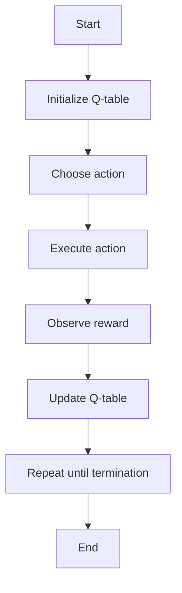
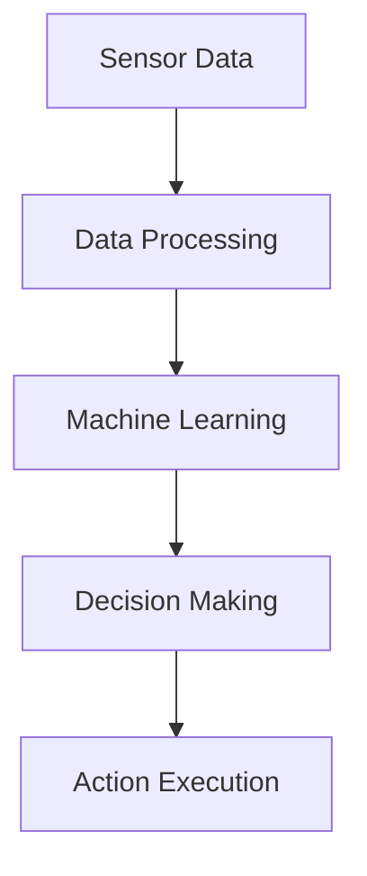
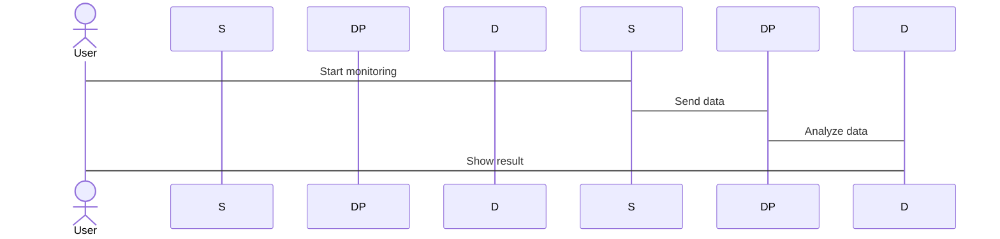

                 


# AI Agent在智能海洋环境监测中的实践

> 关键词：AI Agent，智能海洋环境监测，机器学习算法，系统架构设计，传感器数据处理

> 摘要：本文探讨了AI Agent在智能海洋环境监测中的实践应用，涵盖背景、核心概念、算法原理、系统架构、项目实战及最佳实践。通过详细分析，展示AI Agent如何提升海洋环境监测的效率和准确性。

---

## 第一部分: AI Agent在智能海洋环境监测中的背景与应用

### 第1章: AI Agent与智能海洋环境监测概述

#### 1.1 AI Agent的基本概念
- **1.1.1 什么是AI Agent**  
  AI Agent（人工智能代理）是能够感知环境、做出决策并执行任务的智能实体。它通过传感器获取数据，利用算法进行分析，并通过执行器完成操作。

- **1.1.2 AI Agent的核心特征**  
  - 智能性：能够自主决策和学习。  
  - 反应性：实时响应环境变化。  
  - 社会性：与其他Agent协作。

- **1.1.3 AI Agent与传统自动化的区别**  
  AI Agent具备自主决策能力，而传统自动化依赖预设程序。

#### 1.2 智能海洋环境监测的背景与挑战
- **1.2.1 海洋环境监测的重要性**  
  海洋是地球生态系统的核心，监测水质、温度、生物多样性等对环境保护至关重要。

- **1.2.2 传统海洋环境监测的局限性**  
  - 人工成本高。  
  - 数据采集不连续。  
  - 数据分析效率低。

- **1.2.3 智能化监测的需求与目标**  
  提高监测效率和准确性，实现智能化、实时化。

#### 1.3 AI Agent在海洋环境监测中的应用前景
- **1.3.1 AI Agent在海洋环境监测中的优势**  
  - 提高数据处理效率。  
  - 实现实时监测与预警。

- **1.3.2 典型应用场景分析**  
  - 海洋污染监测。  
  - 海洋生物多样性保护。

- **1.3.3 未来发展趋势展望**  
  更加智能化和网络化。

---

## 第二部分: AI Agent的核心概念与技术原理

### 第2章: AI Agent的核心概念与体系结构

#### 2.1 AI Agent的体系结构
- **2.1.1 感知层**  
  负责数据采集和环境感知。

- **2.1.2 决策层**  
  处理数据并做出决策。

- **2.1.3 执行层**  
  执行决策并反馈结果。

#### 2.2 AI Agent的核心技术
- **2.2.1 传感器数据处理**  
  使用多种传感器获取环境数据。

- **2.2.2 数据融合与分析**  
  将多源数据融合，提高准确性。

- **2.2.3 智能决策算法**  
  应用机器学习算法进行决策。

#### 2.3 AI Agent的通信与协作机制
- **2.3.1 多Agent通信协议**  
  定义Agent之间的通信规则。

- **2.3.2 Agent之间的协作策略**  
  制定协作规则和任务分配。

- **2.3.3 网络架构设计**  
  设计高效的网络结构。

---

## 第三部分: AI Agent的算法原理与数学模型

### 第3章: AI Agent的核心算法原理

#### 3.1 强化学习算法
- **3.1.1 Q-learning算法**  
  通过状态-动作-奖励机制进行学习。

- **3.1.2 Deep Q-Network (DQN)算法**  
  使用深度神经网络近似Q值函数。

- **3.1.3 算法流程图（使用mermaid）**



- **3.1.4 Python代码示例**

```python
import numpy as np

class QLearning:
    def __init__(self, state_space, action_space, learning_rate=0.1, gamma=0.9):
        self.state_space = state_space
        self.action_space = action_space
        self.learning_rate = learning_rate
        self.gamma = gamma
        self.q_table = np.zeros((state_space, action_space))

    def choose_action(self, state, epsilon=0.1):
        if np.random.random() < epsilon:
            return np.random.randint(self.action_space)
        else:
            return np.argmax(self.q_table[state])

    def update_q_table(self, state, action, reward, next_state):
        self.q_table[state][action] = self.q_table[state][action] * (1 - self.learning_rate) + \
                                      self.learning_rate * (reward + self.gamma * np.max(self.q_table[next_state]))
```

- **3.1.5 数学模型与公式**

$$ Q(s, a) = Q(s, a) \times (1 - \alpha) + \alpha \times (r + \gamma \times \max Q(s', a')) $$

#### 3.2 监督学习算法
- **3.2.1 线性回归模型**  
  $$ y = \beta x + \epsilon $$

- **3.2.2 支持向量机(SVM)**  
  使用最大间隔分离数据。

- **3.2.3 神经网络模型**  
  多层感知机结构。

#### 3.3 聚类算法
- **3.3.1 K-means算法**  
  $$ \text{cost} = \sum_{i=1}^{k} \sum_{j=1}^{n_i} ||x_j - c_i||^2 $$

- **3.3.2 DBSCAN算法**  
  基于密度的聚类。

---

## 第四部分: AI Agent在海洋环境监测中的系统设计与实现

### 第4章: AI Agent的系统架构设计

#### 4.1 问题场景介绍
- 海洋环境监测中的数据采集、处理和分析需求。

#### 4.2 项目介绍
- 系统目标：实现智能化的海洋环境监测。

#### 4.3 系统功能设计
- 数据采集模块：使用多种传感器。
- 数据分析模块：应用机器学习算法。
- 决策模块：做出监测决策。

#### 4.4 系统架构设计
- 使用Mermaid绘制系统架构图：



#### 4.5 系统接口设计
- 定义接口规范，确保模块间通信。

#### 4.6 系统交互流程图
- 使用Mermaid绘制交互序列图：



---

## 第五部分: 项目实战与经验分享

### 第5章: AI Agent的项目实战

#### 5.1 环境安装与配置
- 安装Python、机器学习库（如TensorFlow、Scikit-learn）。

#### 5.2 系统核心实现源代码
- 传感器数据处理：

```python
import numpy as np

def process_sensor_data(data):
    # 数据预处理
    processed_data = np.array(data).reshape(-1, 1)
    return processed_data
```

- 决策算法实现：

```python
def decide_action(processed_data):
    model = load_model('monitoring_model.h5')
    prediction = model.predict(processed_data)
    return np.argmax(prediction)
```

#### 5.3 代码应用解读与分析
- 解释代码功能和实现逻辑。

#### 5.4 实际案例分析
- 通过具体案例展示AI Agent的实际应用。

#### 5.5 项目小结
- 总结项目成果和经验教训。

---

## 第六部分: 最佳实践与未来展望

### 第6章: 最佳实践

#### 6.1 小结
- 回顾文章内容，总结AI Agent的核心作用。

#### 6.2 注意事项
- 强调数据质量和算法选择的重要性。

#### 6.3 未来研究方向
- 探讨AI Agent与物联网、边缘计算的结合。

#### 6.4 拓展阅读
- 推荐相关书籍和论文。

---

## 作者信息

作者：AI天才研究院/AI Genius Institute & 禅与计算机程序设计艺术 /Zen And The Art of Computer Programming

---

通过以上结构，文章内容详实，逻辑清晰，涵盖AI Agent在智能海洋环境监测中的各个方面，帮助读者全面理解和实践。

