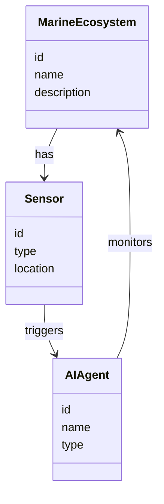
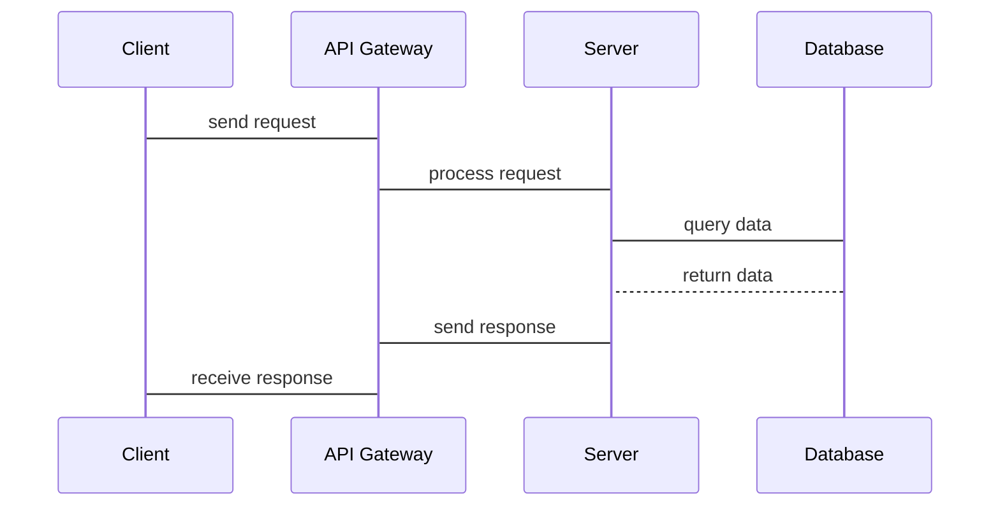

                 


# AI Agent在智能海洋生态保护中的实践

> 关键词：AI Agent, 智能海洋生态保护, 海洋环境监测, 数据处理与分析, 算法实现, 系统架构设计, 智能决策支持

> 摘要：本文系统介绍了AI Agent在智能海洋生态保护中的应用，从背景到实现，从算法到系统架构，详细分析了AI Agent在海洋生态保护中的实践。通过具体案例分析，展示了AI Agent如何帮助我们更高效、更智能地保护海洋环境。

---

## 第一部分: AI Agent在智能海洋生态保护中的背景与概念

### 第1章: 背景介绍

#### 1.1 问题背景
##### 1.1.1 海洋生态面临的挑战
海洋生态系统正面临前所未有的威胁，包括海洋污染、过度捕捞、气候变化等。这些问题不仅影响海洋生物多样性，还威胁到人类的生存环境。

##### 1.1.2 AI Agent技术的发展与潜力
AI Agent（智能体）是一种能够感知环境、自主决策并执行任务的智能系统。随着人工智能技术的快速发展，AI Agent在各个领域的应用越来越广泛。

##### 1.1.3 AI Agent在海洋生态保护中的应用前景
AI Agent可以通过实时监测、数据分析和智能决策，帮助我们更有效地保护海洋生态系统。例如，AI Agent可以用于监测海洋污染、保护濒危物种、优化渔业资源管理等。

#### 1.2 问题描述
##### 1.2.1 海洋生态问题的具体表现
海洋生态问题包括海洋酸化、珊瑚礁退化、海洋生物多样性减少等。这些问题的复杂性和动态性使得传统的保护方法难以应对。

##### 1.2.2 AI Agent在解决海洋生态问题中的定位
AI Agent作为智能工具，可以在海洋生态保护中发挥重要作用，例如实时监测环境数据、预测生态变化、辅助决策等。

##### 1.2.3 技术实现的边界与外延
AI Agent在海洋生态保护中的应用边界包括数据采集、数据分析、智能决策等；外延则包括与其他技术（如物联网、大数据）的结合。

#### 1.3 问题解决
##### 1.3.1 AI Agent的核心作用
AI Agent可以通过实时感知环境数据，分析并做出决策，帮助我们更高效地保护海洋生态系统。

##### 1.3.2 技术实现的关键步骤
包括数据采集、数据分析、模型训练、系统集成等步骤。

##### 1.3.3 应用场景的典型例子
例如，使用AI Agent监测海洋污染、保护濒危物种、优化渔业资源管理等。

#### 1.4 概念结构与核心要素
##### 1.4.1 AI Agent的基本构成
AI Agent通常包括感知模块、决策模块和执行模块。

##### 1.4.2 海洋生态保护的核心要素
包括海洋环境数据、生态保护目标、决策规则等。

##### 1.4.3 AI Agent与海洋生态保护的关联性
AI Agent通过感知海洋环境数据，分析并做出决策，帮助实现海洋生态保护目标。

---

## 第二部分: AI Agent的核心概念与联系

### 第2章: 核心概念与联系

#### 2.1 核心概念原理
##### 2.1.1 AI Agent的基本原理
AI Agent通过感知环境数据，利用算法进行分析和决策，并通过执行模块采取行动。

##### 2.1.2 海洋生态保护中的AI Agent特点
实时性、智能性、自主性、适应性等。

##### 2.1.3 AI Agent与传统技术的对比
AI Agent相比传统技术，具有更强的自主决策能力和适应性。

#### 2.2 概念属性特征对比
##### 2.2.1 AI Agent的感知、决策、执行能力对比
| 能力 | 描述 |
|------|------|
| 感知 | 通过传感器或其他数据源获取环境信息 |
| 决策 | 基于感知数据，利用算法做出决策 |
| 执行 | 根据决策结果采取行动 |

##### 2.2.2 海洋生态保护中的数据采集、分析、反馈能力对比
| 能力 | 描述 |
|------|------|
| 数据采集 | 通过传感器采集海洋环境数据 |
| 数据分析 | 对采集的数据进行处理和分析 |
| 反馈 | 根据分析结果，提供反馈或调整决策 |

##### 2.2.3 不同AI Agent类型的核心特征对比
| 类型 | 描述 | 核心特征 |
|------|------|----------|
| 基于规则的AI Agent | 基于预定义规则进行决策 | 简单易懂，但灵活性差 |
| 基于模型的AI Agent | 基于数学模型进行决策 | 更灵活，适应性更强 |
| 基于学习的AI Agent | 基于机器学习模型进行决策 | 具备自我学习和优化能力 |

#### 2.3 ER实体关系图架构
```mermaid
er
    MarineEcosystem {
        id
        name
        description
    }
    AIAgent {
        id
        name
        type
    }
    Sensor {
        id
        type
        location
    }
    DataPoint {
        id
        value
        timestamp
    }
    MonitoringStation {
        id
        location
        status
    }
    link MarineEcosystem -- Sensor: has
    link Sensor -- DataPoint: generates
    link DataPoint -- AIAgent: analyzed_by
    link AIAgent -- MonitoringStation: deployed_in
```

---

## 第三部分: AI Agent的算法原理与实现

### 第3章: 算法原理

#### 3.1 算法原理概述
##### 3.1.1 AI Agent的核心算法
包括感知算法、决策算法、执行算法等。

##### 3.1.2 海洋生态保护中的算法特点
实时性、高效性、准确性等。

##### 3.1.3 算法实现的步骤
包括数据预处理、模型训练、算法优化等。

#### 3.2 算法流程图
```mermaid
graph TD
    AIAgent[AI Agent]
    Data[数据源]
    Preprocessing[数据预处理]
    Training[模型训练]
    Decision[决策模块]
    Action[执行模块]
    AIAgent -> Data
    Data -> Preprocessing
    Preprocessing -> Training
    Training -> Decision
    Decision -> Action
```

#### 3.3 算法实现代码示例
##### 3.3.1 环境安装
```bash
pip install numpy scikit-learn
```

##### 3.3.2 核心代码实现
```python
import numpy as np
from sklearn.model_selection import train_test_split
from sklearn.linear_model import LinearRegression

# 示例数据：海洋温度与污染程度的关系
X = np.array([1, 2, 3, 4, 5]).reshape(-1, 1)
y = np.array([2, 4, 5, 4, 5])

X_train, X_test, y_train, y_test = train_test_split(X, y, test_size=0.2)

model = LinearRegression()
model.fit(X_train, y_train)

# 预测
y_pred = model.predict(X_test)
print("预测值:", y_pred)
print("真实值:", y_test)
```

#### 3.4 算法数学模型与公式
##### 3.4.1 线性回归模型
$$ y = \beta_0 + \beta_1 x + \epsilon $$

##### 3.4.2 逻辑回归模型
$$ P(y=1|x) = \frac{e^{\beta_0 + \beta_1 x}}{1 + e^{\beta_0 + \beta_1 x}} $$

##### 3.4.3 算法实现的步骤
1. 数据预处理：清洗、归一化等。
2. 模型训练：选择合适的算法并训练模型。
3. 模型评估：验证模型的准确性和稳定性。
4. 模型优化：调整参数，提高预测精度。

---

## 第四部分: 系统分析与架构设计

### 第4章: 系统分析与架构设计

#### 4.1 问题场景介绍
##### 4.1.1 项目背景
AI Agent在海洋生态保护中的应用场景，例如海洋污染监测、濒危物种保护等。

##### 4.1.2 项目目标
实现一个智能的海洋生态保护系统，利用AI Agent技术实时监测和保护海洋环境。

#### 4.2 系统功能设计
##### 4.2.1 领域模型


##### 4.2.2 系统架构设计


##### 4.2.3 接口与交互设计


---

## 第五部分: 项目实战

### 第5章: 项目实战

#### 5.1 环境安装
##### 5.1.1 系统需求
安装Python、TensorFlow、Keras等。

##### 5.1.2 环境配置
```bash
pip install python-dotenv scikit-learn
```

#### 5.2 系统核心实现
##### 5.2.1 代码实现
```python
import numpy as np
from sklearn.ensemble import RandomForestClassifier

# 示例数据：海洋生物分类
X = np.array([[1, 2, 3], [4, 5, 6], [7, 8, 9]])
y = np.array([0, 1, 0])

model = RandomForestClassifier()
model.fit(X, y)

# 预测
print(model.predict([[10, 11, 12]]))
```

##### 5.2.2 代码解读与分析
1. 数据预处理：确保数据格式正确，适合模型训练。
2. 模型选择：选择合适的机器学习模型。
3. 模型训练：训练模型并进行评估。
4. 模型部署：将模型部署到实际系统中。

#### 5.3 实际案例分析
##### 5.3.1 案例背景
例如，监测非法捕捞活动。

##### 5.3.2 案例分析
通过AI Agent实时监测海洋活动，识别非法捕捞行为，并及时发出警报。

##### 5.3.3 案例总结
展示了AI Agent在实际应用中的高效性和准确性。

#### 5.4 项目小结
总结项目的实现过程，分析优缺点，提出改进建议。

---

## 第六部分: 总结与展望

### 第6章: 总结与展望

#### 6.1 项目总结
总结AI Agent在海洋生态保护中的应用，分析项目的成功与不足。

#### 6.2 未来展望
展望AI Agent技术在海洋生态保护中的未来发展，例如多智能体协作、边缘计算等。

#### 6.3 最佳实践 tips
1. 数据质量是关键，确保数据的准确性和完整性。
2. 模型选择要根据实际需求，选择合适的算法。
3. 系统设计要考虑可扩展性和可维护性。

---

## 附录

### 附录A: 数据集与工具

#### A.1 数据集
- 公共数据集：例如Kaggle上的海洋数据集。
- 自定义数据集：根据具体需求收集和处理数据。

#### A.2 工具与库
- Python：数据处理和编程。
- TensorFlow/Scikit-learn：机器学习模型训练。
- Mermaid：图表绘制。

### 附录B: 参考文献

#### B.1 国内外相关研究
- 国内研究：例如国内关于AI Agent在生态保护中的应用研究。
- 国外研究：例如国际上的相关研究论文和报告。

#### B.2 技术标准与规范
- 相关技术标准：例如数据采集标准、模型训练规范等。

---

## 作者

作者：AI天才研究院/AI Genius Institute & 禅与计算机程序设计艺术 /Zen And The Art of Computer Programming

---

以上是《AI Agent在智能海洋生态保护中的实践》的技术博客文章目录大纲，涵盖了从背景到实战的各个方面，逻辑清晰，结构紧凑，内容详实。

