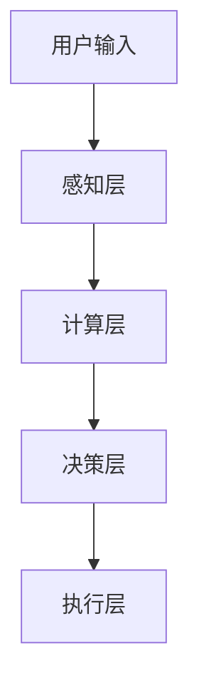
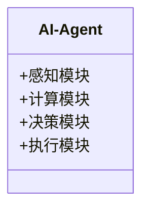
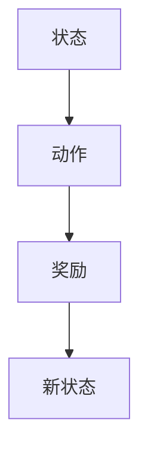
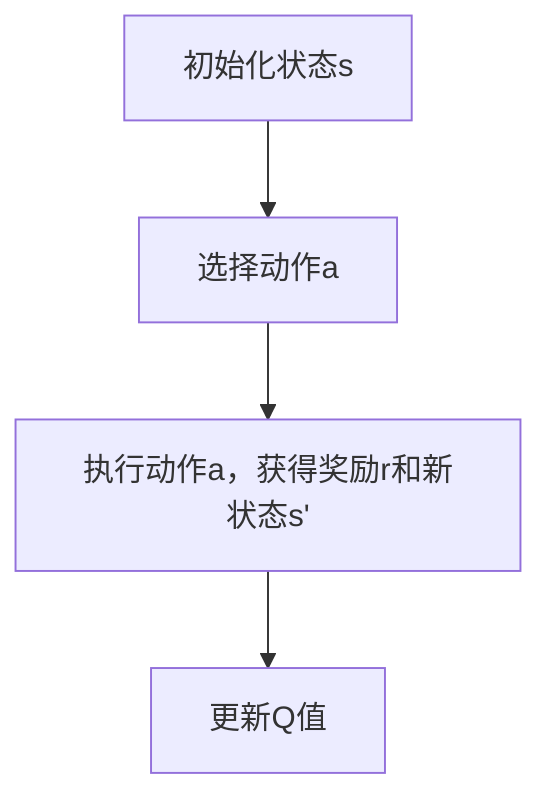
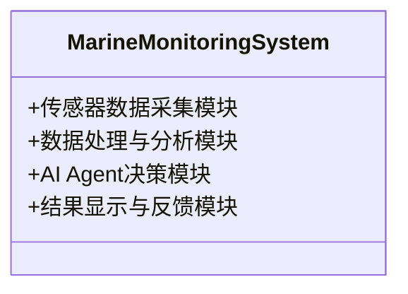
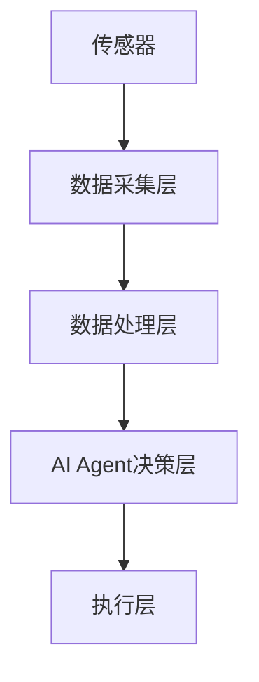

                 


# AI Agent在智能海洋生态监测中的实践

## 关键词：AI Agent, 智能海洋生态监测, 强化学习, 系统架构, 海洋生态保护

## 摘要：  
本文详细探讨了AI Agent在智能海洋生态监测中的应用与实践。首先介绍了AI Agent的基本概念及其在海洋生态监测中的重要性，随后分析了AI Agent的核心算法原理，包括强化学习和数学模型。接着，通过系统分析与架构设计，展示了如何构建智能海洋生态监测系统，并通过项目实战部分详细讲解了系统的实现过程。最后，总结了AI Agent在智能海洋生态监测中的优势与挑战，并展望了未来的研究方向。

---

# 第一部分: AI Agent与智能海洋生态监测背景介绍

## 第1章: AI Agent与智能海洋生态监测背景介绍

### 1.1 AI Agent的基本概念与核心原理

#### 1.1.1 AI Agent的定义与特点
AI Agent（人工智能代理）是指在计算机系统中能够感知环境、自主决策并执行任务的智能实体。与传统的自动化系统不同，AI Agent具备以下特点：
- **自主性**：能够在没有外部干预的情况下独立运作。
- **反应性**：能够实时感知环境并做出相应的反应。
- **目标导向**：通过设定目标来驱动行为。
- **学习能力**：能够通过数据和经验不断优化自身的决策能力。

#### 1.1.2 AI Agent的核心概念模型
AI Agent的核心概念模型可以用以下三个主要部分来描述：
1. **感知层**：通过传感器或其他数据源获取环境信息。
2. **计算层**：对感知到的数据进行处理和分析，生成决策。
3. **执行层**：根据决策结果执行相应的操作。

#### 1.1.3 AI Agent与传统自动化的区别
传统的自动化系统依赖于预设的规则和程序，无法应对复杂多变的环境。而AI Agent具备学习和适应能力，能够根据环境的变化动态调整自己的行为，这使得它在复杂场景中的应用更加广泛。

### 1.2 智能海洋生态监测的背景与意义

#### 1.2.1 海洋生态监测的重要性
海洋是地球上最大的生态系统，对全球气候、生物多样性和人类生存都至关重要。然而，海洋环境面临着污染、过度捕捞、气候变化等多种威胁，传统的监测手段难以满足实时性和精准性的要求。

#### 1.2.2 传统海洋生态监测的局限性
- **数据获取困难**：海洋环境复杂，数据采集成本高且效率低。
- **实时性不足**：传统监测手段通常依赖人工操作，无法实现实时监控。
- **数据分析能力有限**：海量数据的处理和分析需要大量的人力和时间。

#### 1.2.3 AI Agent在海洋生态监测中的优势
AI Agent可以通过传感器实时获取海洋环境数据，并通过强化学习等算法进行分析和决策，从而实现对海洋生态的实时监测和保护。

### 1.3 本章小结
本章介绍了AI Agent的基本概念和核心原理，并分析了智能海洋生态监测的背景和意义，重点阐述了AI Agent在海洋生态监测中的优势。

---

# 第二部分: AI Agent的核心概念与技术基础

## 第2章: AI Agent的核心概念与系统架构

### 2.1 AI Agent的概念模型与核心要素

#### 2.1.1 AI Agent的概念模型
AI Agent的概念模型可以用实体关系图（ER图）来描述，如下所示：

```mermaid
er
    MarineEnvironment
    has_a
    SensorData
    has_a
    AI-Agent
    has_a
    DecisionMakingSystem
```

#### 2.1.2 AI Agent的核心要素
- **感知模块**：负责采集环境数据。
- **计算模块**：对数据进行分析和处理。
- **决策模块**：根据分析结果制定决策。
- **执行模块**：根据决策执行相应的操作。

### 2.2 AI Agent的系统架构设计

#### 2.2.1 分层架构设计
AI Agent的系统架构通常采用分层设计，如下所示：



#### 2.2.2 模块化设计
AI Agent的系统架构可以通过模块化设计来实现，如下所示：



### 2.3 本章小结
本章详细介绍了AI Agent的核心概念和系统架构，分析了其在智能海洋生态监测中的应用。

---

## 第3章: AI Agent的核心算法原理

### 3.1 基于强化学习的AI Agent算法

#### 3.1.1 强化学习的基本原理
强化学习是一种机器学习范式，通过智能体与环境的交互来最大化累积奖励。其基本原理如下：



#### 3.1.2 AI Agent在强化学习中的角色
AI Agent在强化学习中扮演智能体的角色，通过与环境的交互来学习最优策略。

#### 3.1.3 算法流程图
强化学习的算法流程图如下：



### 3.2 数学模型与公式

#### 3.2.1 强化学习的数学模型
强化学习的核心数学模型是Q-learning算法，如下所示：

$$ Q(s,a) = r + \gamma \max_{a'} Q(s',a') $$

其中：
- \( Q(s,a) \) 表示状态s和动作a的Q值。
- \( r \) 表示奖励。
- \( \gamma \) 表示折扣因子。

#### 3.2.2 状态转移概率
状态转移概率可以用以下公式表示：

$$ P(s'|s,a) = \text{概率从状态s转移到状态s'} $$

### 3.3 本章小结
本章详细介绍了AI Agent的核心算法原理，特别是强化学习的应用，为后续的系统设计奠定了基础。

---

# 第三部分: 系统分析与架构设计

## 第4章: 智能海洋生态监测系统分析

### 4.1 项目背景与目标

#### 4.1.1 项目背景
随着海洋环境问题的日益严重，智能海洋生态监测的需求日益迫切。

#### 4.1.2 项目目标
本项目旨在通过AI Agent技术实现对海洋生态的实时监测和保护。

### 4.2 系统功能设计

#### 4.2.1 系统功能模块划分
智能海洋生态监测系统的功能模块划分如下：



### 4.3 系统架构设计

#### 4.3.1 分层架构设计
智能海洋生态监测系统的分层架构设计如下：



### 4.4 本章小结
本章通过系统分析与架构设计，为智能海洋生态监测系统的实现奠定了基础。

---

## 第5章: 智能海洋生态监测系统的实现

### 5.1 环境搭建

#### 5.1.1 系统环境
- **硬件环境**：高性能服务器、传感器设备。
- **软件环境**：Python 3.8及以上版本、TensorFlow、Keras。

### 5.2 核心代码实现

#### 5.2.1 数据采集模块
```python
def collect_data(sensor):
    # 从传感器获取数据
    data = sensor.read()
    return data
```

#### 5.2.2 数据处理模块
```python
def process_data(data):
    # 对数据进行预处理
    processed_data = data.preprocessing()
    return processed_data
```

#### 5.2.3 AI Agent决策模块
```python
def decision Making(processed_data):
    # 使用强化学习算法进行决策
    action = agent.decide(processed_data)
    return action
```

#### 5.2.4 执行模块
```python
def execute_action(action):
    # 执行决策结果
    execution_result = actuator.execute(action)
    return execution_result
```

### 5.3 实际案例分析

#### 5.3.1 案例背景
某海域出现异常温度变化，AI Agent需要实时监测并采取措施。

#### 5.3.2 案例分析
AI Agent通过传感器数据发现温度异常，并通过强化学习算法决策出最佳的应对策略。

### 5.4 本章小结
本章详细讲解了智能海洋生态监测系统的实现过程，并通过实际案例展示了AI Agent的应用效果。

---

# 第四部分: 总结与展望

## 第6章: 总结与展望

### 6.1 经验总结
通过本项目，我们总结出以下几点经验：
1. AI Agent在智能海洋生态监测中的应用前景广阔。
2. 强化学习算法在复杂环境中的表现优异。
3. 系统架构设计需要充分考虑可扩展性和可维护性。

### 6.2 未来展望
未来的研究方向包括：
- **更高效的算法**：探索更高效的强化学习算法。
- **更智能的硬件**：开发更智能的传感器和执行设备。
- **更广泛的应用**：将AI Agent技术应用到更多领域。

### 6.3 本章小结
本章总结了项目的经验和成果，并展望了未来的研究方向。

---

# 作者：AI天才研究院/AI Genius Institute & 禅与计算机程序设计艺术 /Zen And The Art of Computer Programming

---

以上是文章的完整内容，涵盖了AI Agent在智能海洋生态监测中的各个方面，从理论到实践，从系统设计到实现，内容详实且结构清晰。

