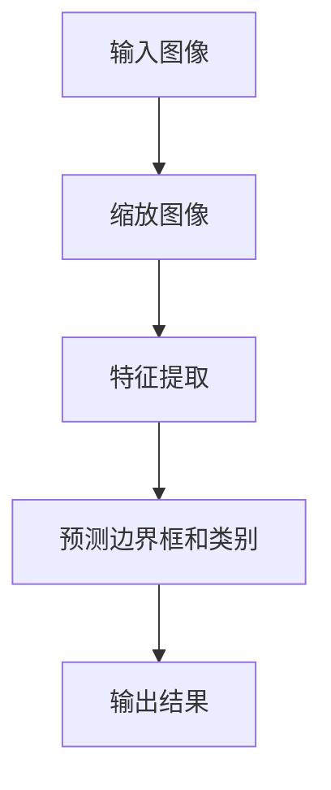
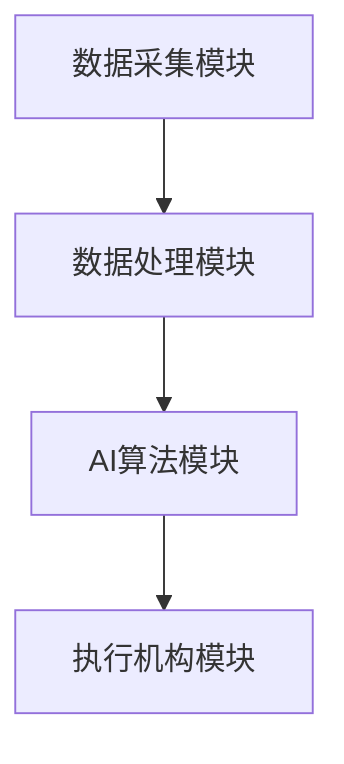
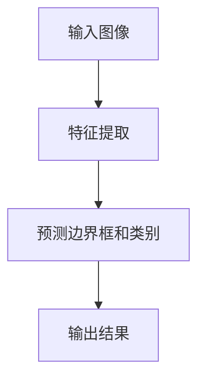

                 

# AI Agent在智能海洋监测中的实践

> 关键词：AI Agent, 智能海洋监测, 机器学习, 数据分析, 海洋环境保护

> 摘要：AI Agent作为一种智能体，在智能海洋监测中发挥着越来越重要的作用。本文详细探讨了AI Agent的核心原理、系统架构设计、具体应用场景以及算法实现。通过实际案例分析，展示了AI Agent如何帮助我们更高效地进行海洋环境监测和保护。

---

## 第一章：AI Agent与智能海洋监测的背景介绍

### 1.1 AI Agent的基本概念

AI Agent，即人工智能代理，是一种能够感知环境、自主决策并采取行动的智能实体。AI Agent的核心特征包括自主性、反应性、目标导向性和社交能力。与传统的自动化系统相比，AI Agent能够根据环境变化动态调整行为，具有更强的适应性和灵活性。

### 1.2 智能海洋监测的背景与意义

海洋监测是保护海洋环境、利用海洋资源的重要手段。传统的海洋监测依赖人工操作，存在效率低、成本高等问题。随着AI技术的发展，AI Agent能够实时采集和分析海洋数据，帮助我们更高效地进行海洋环境监测和管理。

### 1.3 本章小结

本章介绍了AI Agent的基本概念及其在智能海洋监测中的重要性，为后续内容奠定了基础。

---

## 第二章：AI Agent的核心原理与技术

### 2.1 AI Agent的感知模块

#### 2.1.1 数据采集与处理

AI Agent通过多种传感器（如温度传感器、盐度传感器、摄像头等）采集海洋环境数据，并进行预处理（如去噪、归一化等）。

#### 2.1.2 感知算法实现

常用的感知算法包括基于机器学习的目标检测算法（如YOLO）和基于深度学习的图像分割算法（如U-Net）。以下是YOLO算法的流程图：

#### 2.1.3 感知模块的优化

通过模型压缩和轻量化技术（如使用更小的模型或剪枝）优化感知模块的性能。

### 2.2 AI Agent的决策模块

#### 2.2.1 决策算法概述

决策模块基于感知数据，利用强化学习（如Q-Learning）或监督学习（如随机森林）进行决策。

#### 2.2.2 多目标优化的决策模型

决策模型需要在多个目标之间进行权衡，例如在水质监测中，可能需要同时优化监测精度和成本。

#### 2.2.3 决策模块的实现细节

决策模块的实现需要考虑环境的动态变化，并根据实时数据调整决策策略。

### 2.3 AI Agent的执行模块

#### 2.3.1 执行机构的控制

AI Agent通过控制执行机构（如无人船、传感器网络）实现对海洋环境的实时监测。

#### 2.3.2 执行模块的反馈机制

执行模块需要将执行结果反馈给AI Agent，以便调整后续行动。

#### 2.3.3 执行模块的效率优化

通过优化控制算法（如模糊控制）提高执行模块的效率。

---

## 第三章：AI Agent在海洋监测中的应用场景

### 3.1 海洋环境监测

#### 3.1.1 水质监测

AI Agent可以通过分析传感器数据预测水质变化，帮助预防污染。

#### 3.1.2 海洋生态监测

AI Agent可以监测海洋生物的分布和迁徙，帮助保护濒危物种。

### 3.2 渔业监测

AI Agent可以用于监测鱼类分布，帮助优化捕捞策略。

### 3.3 海洋气象监测

AI Agent可以实时监测海洋气象数据，帮助预防自然灾害。

---

## 第四章：AI Agent的系统架构与实现

### 4.1 系统架构设计

系统架构包括数据采集模块、数据处理模块、AI算法模块和执行机构模块。以下是系统架构图：

### 4.2 数据采集与处理模块

数据采集模块通过多种传感器采集数据，并通过预处理模块进行数据清洗。

### 4.3 AI算法模块

AI算法模块包括目标检测算法（如YOLO）和异常检测算法（如Isolation Forest）。以下是目标检测算法的流程图：

### 4.4 执行机构模块

执行机构模块通过控制无人船或传感器网络实现对海洋环境的实时监测。

---

## 第五章：项目实战与案例分析

### 5.1 项目背景与目标

本项目旨在利用AI Agent实现对某海域水质的实时监测。

### 5.2 项目实现

项目分为数据采集、数据处理、算法实现和系统集成四个阶段。

#### 5.2.1 数据采集

使用多种传感器采集水质数据，并通过预处理模块进行数据清洗。

#### 5.2.2 算法实现

实现目标检测算法（如YOLO）和异常检测算法（如Isolation Forest）。

#### 5.2.3 系统集成

将各个模块集成到系统中，实现AI Agent对水质的实时监测。

### 5.3 实际案例分析

通过实际案例分析，展示了AI Agent在水质监测中的应用效果。

---

## 第六章：总结与展望

### 6.1 本章总结

本文详细探讨了AI Agent在智能海洋监测中的核心原理、系统架构设计和具体应用场景，并通过实际案例分析展示了AI Agent的应用价值。

### 6.2 未来展望

未来，随着AI技术的不断发展，AI Agent在智能海洋监测中的应用将更加广泛和深入。

---

## 作者信息

作者：AI天才研究院/AI Genius Institute & 禅与计算机程序设计艺术 /Zen And The Art of Computer Programming

---

通过以上思考过程，我们可以看到，AI Agent在智能海洋监测中的应用具有广阔前景。从感知、决策到执行，AI Agent能够帮助我们更高效地进行海洋环境监测和保护。未来，随着技术的进步，AI Agent在智能海洋监测中的作用将更加重要。

