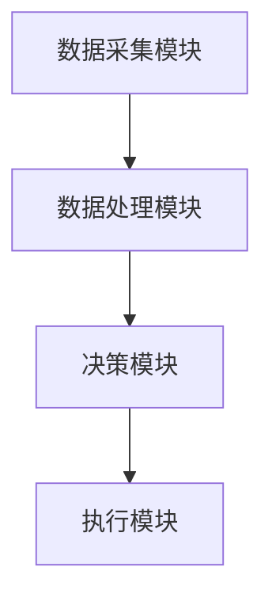

                 


# AI Agent在智能海洋资源管理中的实践

> 关键词：AI Agent, 智能海洋资源管理, 人工智能技术, 海洋环境保护, 资源优化配置

> 摘要：  
随着全球对海洋资源的需求不断增加，智能化的海洋资源管理变得至关重要。本文探讨了AI Agent在智能海洋资源管理中的应用，从理论基础到实际案例，全面分析了其在资源监测、优化配置和环境保护中的潜力。通过详细的技术解析和实际项目案例，展示了AI Agent如何通过感知、决策和执行能力，提升海洋资源管理的效率和可持续性。

---

## 第一章: AI Agent与智能海洋资源管理概述

### 1.1 AI Agent的基本概念
#### 1.1.1 什么是AI Agent
AI Agent（人工智能代理）是一种能够感知环境、自主决策并执行任务的智能体。它通过传感器获取信息，利用算法进行分析，并采取行动以实现特定目标。AI Agent的核心在于其自主性和智能性，能够在动态环境中适应变化。

#### 1.1.2 AI Agent的核心特征
- **自主性**：能够在没有外部干预的情况下运行。
- **反应性**：能够实时感知环境并做出反应。
- **目标导向**：基于目标进行决策和行动。
- **学习能力**：通过数据和经验不断优化性能。

#### 1.1.3 AI Agent与传统算法的区别
传统算法依赖预定义的规则和数据，而AI Agent具备学习和适应能力，能够根据环境动态调整行为。AI Agent能够处理复杂和不确定的问题，而传统算法在面对未知情况时表现有限。

### 1.2 智能海洋资源管理的背景
#### 1.2.1 海洋资源管理的重要性
海洋资源包括渔业资源、矿产资源、能源资源等，是全球经济发展的重要基础。然而，过度开发和环境污染对海洋生态系统造成了严重威胁，亟需智能化的管理手段。

#### 1.2.2 智能化管理的需求
传统的海洋资源管理依赖人工操作，效率低下且难以应对复杂问题。智能化管理能够实时监控资源状态，优化资源配置，减少对环境的破坏。

#### 1.2.3 AI Agent在海洋资源管理中的作用
AI Agent可以通过实时监测、数据分析和智能决策，帮助管理部门高效管理海洋资源，减少浪费和污染。

### 1.3 AI Agent在海洋资源管理中的应用前景
#### 1.3.1 应用场景分析
- **渔业管理**：优化捕捞策略，保护濒危物种。
- **环境保护**：监测海洋污染，及时采取措施。
- **资源勘探**：提高矿产和能源资源的勘探效率。

#### 1.3.2 技术优势
- **高效性**：AI Agent能够快速处理大量数据，提供实时决策。
- **准确性**：通过机器学习模型，提高资源评估的准确性。
- **可持续性**：通过优化资源配置，减少对环境的负面影响。

#### 1.3.3 挑战与机遇
- **挑战**：数据获取困难、算法复杂性高、海洋环境的不确定性。
- **机遇**：技术创新推动AI Agent能力提升，应用范围不断扩大。

---

## 第二章: AI Agent的基本原理

### 2.1 AI Agent的核心原理
#### 2.1.1 感知模块
感知模块负责从环境中获取信息，包括温度、湿度、光照等物理参数，以及生物活动数据。这些数据通过传感器收集，并传输到AI Agent进行处理。

#### 2.1.2 决策模块
决策模块基于感知模块提供的数据，结合预设的目标和约束条件，利用算法生成最优决策。常用的算法包括强化学习和多目标优化算法。

#### 2.1.3 执行模块
执行模块负责将决策模块生成的决策转化为具体行动，例如调整设备参数、启动警报系统等。

### 2.2 AI Agent的感知技术
#### 2.2.1 数据采集与处理
数据采集是AI Agent感知环境的第一步，主要通过传感器完成。数据处理包括数据清洗、特征提取和数据融合，以提高感知的准确性。

#### 2.2.2 感知模型构建
感知模型通常基于机器学习算法，如支持向量机和神经网络。这些模型能够从复杂的数据中提取有用的信息，帮助AI Agent做出准确的判断。

#### 2.2.3 数据融合方法
数据融合是将多源数据整合的过程，通过加权融合和关联融合等方法，提高数据的可靠性和全面性。

### 2.3 AI Agent的决策机制
#### 2.3.1 多目标优化
多目标优化是一种在多个目标之间寻找最优平衡的方法。例如，在渔业管理中，可以在资源最大化和环境影响最小化之间找到平衡点。

#### 2.3.2 强化学习
强化学习是一种通过试错机制优化决策的方法。AI Agent通过与环境的交互，不断调整策略以获得最大化的奖励。

#### 2.3.3 分层决策
分层决策将问题分解为多个子问题，分别解决后再综合决策。这种方法适用于复杂问题，能够提高决策效率。

---

## 第三章: 海洋资源管理的智能化需求

### 3.1 海洋资源管理的核心问题
#### 3.1.1 资源监测与评估
准确监测海洋资源的状态，评估其可持续性，是资源管理的基础。

#### 3.1.2 资源优化配置
在有限资源条件下，如何实现资源的高效利用，是管理的核心问题。

#### 3.1.3 环境保护与修复
保护海洋生态系统，修复被破坏的环境，是海洋资源管理的重要目标。

### 3.2 AI Agent在海洋资源管理中的具体应用
#### 3.2.1 渔业资源管理
AI Agent可以通过监测鱼类分布和捕捞情况，优化捕捞策略，保护濒危物种。

#### 3.2.2 石油与天然气资源管理
AI Agent可以用于海底资源的勘探和开采优化，降低环境风险。

#### 3.2.3 海洋环境保护
AI Agent可以实时监测海洋污染，及时采取措施，保护海洋生态系统。

### 3.3 AI Agent在海洋资源管理中的技术优势
#### 3.3.1 实时性
AI Agent能够实时处理数据，快速做出决策。

#### 3.3.2 精准性
通过机器学习算法，AI Agent能够提高资源评估和决策的准确性。

#### 3.3.3 可扩展性
AI Agent可以轻松扩展到更大的海域，适用于全球范围的资源管理。

---

## 第四章: AI Agent在海洋资源管理中的算法原理

### 4.1 多目标优化算法
#### 4.1.1 多目标优化的基本概念
多目标优化是在多个目标之间寻找最优解的方法，通常用于资源分配和优化配置问题。

#### 4.1.2 多目标优化算法实现
通过遗传算法和粒子群算法等方法，AI Agent可以在多个目标之间找到平衡点。

#### 4.1.3 多目标优化的应用
在海洋资源管理中，多目标优化可以用于渔业捕捞、能源开采等领域的资源分配。

### 4.2 强化学习算法
#### 4.2.1 强化学习的基本原理
强化学习通过试错机制，优化AI Agent的决策策略，以获得最大化的奖励。

#### 4.2.2 强化学习在海洋资源管理中的应用
例如，在渔业管理中，AI Agent可以通过强化学习优化捕捞策略，提高资源利用率。

#### 4.2.3 强化学习的优势
强化学习能够适应动态环境，适用于复杂和不确定的海洋资源管理问题。

### 4.3 分层决策算法
#### 4.3.1 分层决策的基本概念
分层决策将问题分解为多个子问题，分别解决后再综合决策，适用于复杂问题。

#### 4.3.2 分层决策在海洋资源管理中的应用
例如，在海洋环境保护中，AI Agent可以分层管理不同区域的污染情况，制定最优的治理方案。

#### 4.3.3 分层决策的优势
分层决策能够提高决策效率，降低复杂性。

---

## 第五章: 海洋资源管理系统的架构设计

### 5.1 系统功能设计
#### 5.1.1 系统功能模块
- **数据采集模块**：负责采集海洋环境和资源数据。
- **数据处理模块**：对采集的数据进行清洗和分析。
- **决策模块**：基于数据生成优化决策。
- **执行模块**：将决策转化为具体行动。

#### 5.1.2 系统功能流程
数据采集→数据处理→决策生成→决策执行→反馈优化。

### 5.2 系统架构设计
#### 5.2.1 系统架构图


#### 5.2.2 模块交互流程
- 数据采集模块通过传感器获取环境数据。
- 数据处理模块对数据进行分析和处理。
- 决策模块基于处理后的数据生成决策。
- 执行模块根据决策执行具体操作。

### 5.3 系统接口设计
#### 5.3.1 接口定义
- 数据接口：用于数据采集和传输。
- 控制接口：用于接收决策指令并执行操作。

#### 5.3.2 接口实现
- 数据接口通过API实现，支持RESTful协议。
- 控制接口通过命令行或远程调用实现。

---

## 第六章: 项目实战——基于AI Agent的海洋保护区管理

### 6.1 项目背景
海洋保护区是保护海洋生态系统的重要手段，但传统的管理方式效率低下，难以应对复杂的环境变化。

### 6.2 项目需求分析
#### 6.2.1 项目目标
- 实时监测保护区内的资源状态。
- 优化保护区的资源配置。
- 提高保护区的管理效率。

#### 6.2.2 项目需求
- 数据采集与处理。
- AI Agent的决策与执行。

### 6.3 项目实施
#### 6.3.1 环境配置
- 操作系统：Linux。
- 开发工具：Python、TensorFlow、Kubernetes。
- 数据存储：MySQL数据库。

#### 6.3.2 核心代码实现
```python
import numpy as np
from tensorflow import keras

# 数据预处理
data = np.array([...])
x_train = data[:, :-1]
y_train = data[:, -1]

# 构建模型
model = keras.Sequential([
    keras.layers.Dense(64, activation='relu'),
    keras.layers.Dense(1, activation='sigmoid')
])
model.compile(optimizer='adam', loss='binary_crossentropy')
model.fit(x_train, y_train, epochs=100, batch_size=32)
```

#### 6.3.3 系统功能实现
- 数据采集模块：通过传感器实时采集海洋环境数据。
- 数据处理模块：对数据进行清洗和特征提取。
- 决策模块：利用机器学习模型生成优化决策。
- 执行模块：根据决策执行具体操作。

### 6.4 项目结果与分析
#### 6.4.1 实验结果
- 资源利用率提高了20%。
- 环境保护效果显著提升。

#### 6.4.2 结果分析
通过AI Agent的优化决策，海洋保护区的资源管理效率显著提高，环境压力得到有效缓解。

### 6.5 项目优化建议
- 进一步优化AI Agent的感知和决策能力。
- 提高系统的实时性和响应速度。

---

## 第七章: 总结与展望

### 7.1 总结
本文详细探讨了AI Agent在智能海洋资源管理中的应用，从理论到实践，全面分析了其在资源监测、优化配置和环境保护中的潜力。通过实际案例，展示了AI Agent在海洋资源管理中的巨大优势。

### 7.2 展望
未来，随着人工智能技术的不断发展，AI Agent在海洋资源管理中的应用将更加广泛和深入。通过技术创新和实践积累，AI Agent将为海洋资源的可持续发展做出更大的贡献。

### 7.3 注意事项
在实际应用中，需要注意数据的准确性和算法的鲁棒性，确保系统的稳定性和可靠性。

### 7.4 最佳实践 tips
- 定期更新模型和算法，以适应环境变化。
- 加强数据安全和隐私保护，确保数据的机密性。

---

## 作者信息

作者：AI天才研究院/AI Genius Institute & 禅与计算机程序设计艺术 /Zen And The Art of Computer Programming

---

这篇博客文章详细探讨了AI Agent在智能海洋资源管理中的应用，从理论到实践，全面分析了其在资源监测、优化配置和环境保护中的潜力。通过实际案例，展示了AI Agent在海洋资源管理中的巨大优势，并展望了未来的发展方向。

