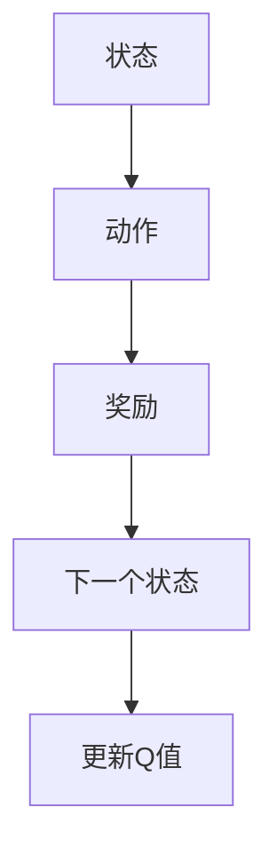
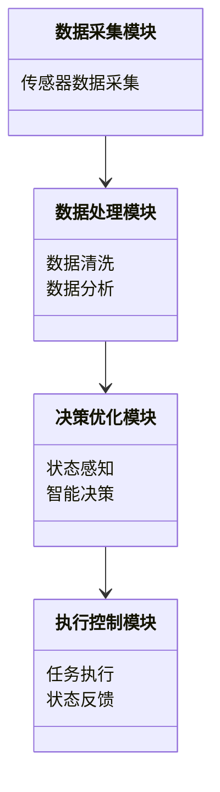
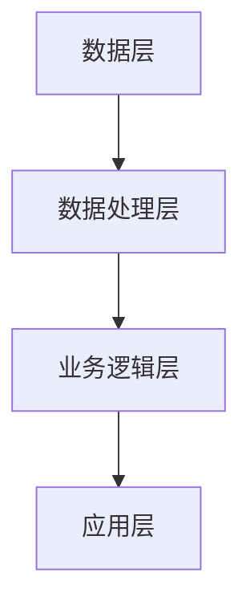

                 


# AI Agent在智能海洋资源管理中的应用

> 关键词：AI Agent，海洋资源管理，智能系统，资源监测，决策优化

> 摘要：本文探讨了AI Agent技术在海洋资源管理中的应用，分析了其在资源监测、优化管理、环境保护等方面的优势，并通过算法原理、系统架构设计和项目实战的详细讲解，展示了AI Agent在智能海洋资源管理中的潜力和实际应用价值。

---

# 第一部分: AI Agent在智能海洋资源管理中的应用概述

## 第1章: 引言

### 1.1 研究背景与意义
海洋资源管理是全球关注的重要议题，涉及渔业资源、海底矿产、海洋能等多种资源的可持续利用。传统管理方式依赖人工监测和经验判断，存在效率低下、覆盖面有限等问题。随着人工智能技术的快速发展，AI Agent（智能体）作为一种能够在复杂环境中自主感知、决策和执行的智能系统，为海洋资源管理提供了新的解决方案。

AI Agent的核心优势在于其能够实时感知环境、自主决策并执行任务，这使得其在海洋资源监测、资源分配优化、环境保护等方面具有广泛的应用潜力。通过AI Agent技术，可以显著提高海洋资源管理的效率和准确性，同时降低人工成本和时间成本。

### 1.2 本书的核心内容与结构
本书旨在系统介绍AI Agent在智能海洋资源管理中的应用，内容涵盖以下方面：
- **AI Agent的基本概念与原理**：介绍AI Agent的定义、分类及其在海洋资源管理中的应用优势。
- **海洋资源管理的核心问题**：分析海洋资源监测、资源分配与优化、环境保护等关键问题。
- **AI Agent的核心算法与数学模型**：详细讲解强化学习、监督学习等算法及其在海洋资源管理中的应用。
- **系统架构设计**：从系统功能设计、架构设计到接口设计，全面分析AI Agent在海洋资源管理中的实现方案。
- **项目实战**：通过实际案例展示AI Agent在海洋资源管理中的具体应用，包括环境监测、资源优化等场景。

---

## 第2章: AI Agent的基本概念与原理

### 2.1 AI Agent的定义与分类
AI Agent是一种能够感知环境、自主决策并执行任务的智能系统。根据应用场景的不同，AI Agent可以分为以下几类：
- **基于规则的AI Agent**：通过预定义的规则进行决策，适用于简单的任务。
- **基于知识的AI Agent**：利用知识库进行推理和决策，适用于复杂场景。
- **基于学习的AI Agent**：通过机器学习算法从数据中学习决策策略，适用于动态环境。

### 2.2 AI Agent的核心原理
AI Agent的核心原理包括感知、决策和执行三个阶段：
- **感知阶段**：通过传感器或数据源获取环境信息。
- **决策阶段**：基于感知信息，利用算法生成决策。
- **执行阶段**：通过执行机构将决策转化为实际操作。

### 2.3 AI Agent在海洋资源管理中的应用优势
- **高效性**：AI Agent能够快速处理大量数据，提高资源监测和管理效率。
- **智能性**：能够自主适应环境变化，优化资源分配策略。
- **实时性**：能够实时感知和响应环境变化，确保资源管理的及时性。

---

## 第3章: 海洋资源管理中的关键问题与挑战

### 3.1 海洋资源管理的核心问题
海洋资源管理面临以下核心问题：
- **资源监测与评估**：如何高效、准确地监测海洋资源的分布和状态。
- **资源分配与优化**：如何合理分配资源以实现最大效益。
- **环境保护与可持续发展**：如何在资源开发中平衡环境保护的需求。

### 3.2 AI Agent在海洋资源管理中的应用边界
尽管AI Agent具有诸多优势，但在实际应用中也存在一些限制：
- **技术限制**：AI Agent的性能依赖于算法和硬件的成熟度。
- **数据依赖性**：需要大量高质量的数据支持决策。
- **伦理与法律问题**：AI Agent的决策可能涉及伦理和法律风险。

---

## 第4章: AI Agent的核心算法与数学模型

### 4.1 强化学习算法
强化学习是一种通过试错机制优化决策的算法，广泛应用于资源分配和优化问题。

#### 4.1.1 Q-learning算法
Q-learning是一种经典的强化学习算法，适用于离散动作空间的问题。其核心思想是通过更新Q值表来学习最优策略。

**Q值更新公式**：
$$ Q(s, a) = Q(s, a) + \alpha \left[ r + \gamma \max Q(s', a') - Q(s, a) \right] $$

**流程图**：


### 4.2 监督学习算法
监督学习通过标签数据训练模型，适用于资源监测和分类问题。

#### 4.2.1 线性回归模型
线性回归是一种简单但有效的监督学习算法，适用于线性关系的预测。

**线性回归公式**：
$$ y = \beta x + \epsilon $$

---

## 第5章: 系统分析与架构设计

### 5.1 问题场景介绍
以海洋资源监测为例，AI Agent需要实时监测海洋环境参数（如水温、盐度、氧气含量等），并根据数据优化资源分配策略。

### 5.2 系统功能设计
系统功能设计包括数据采集、数据处理、决策优化和执行控制四个模块。

**领域模型类图**：


### 5.3 系统架构设计
系统架构采用分层设计，包括数据层、业务逻辑层和应用层。

**系统架构图**：


---

## 第6章: 项目实战

### 6.1 环境安装
需要安装以下工具和库：
- Python 3.8+
- TensorFlow
- Scikit-learn
- Mermaid工具

### 6.2 系统核心实现源代码
以下是一个基于强化学习的资源分配优化算法的Python实现：

```python
import numpy as np
from collections import deque

class AI_Agent:
    def __init__(self, state_space, action_space):
        self.state_space = state_space
        self.action_space = action_space
        self.q_table = deque()

    def sense(self, state):
        # 感知环境状态
        return state

    def decide(self, state):
        # 根据Q值表进行决策
        max_action = np.argmax(self.q_table[state])
        return max_action

    def act(self, action):
        # 执行动作
        pass

# 示例用法
state_space = 5
action_space = 3
agent = AI_Agent(state_space, action_space)
state = 2
action = agent.decide(state)
```

### 6.3 案例分析与解读
以海洋渔场资源监测为例，AI Agent可以根据水温、盐度等参数优化捕捞策略，避免过度捕捞和资源枯竭。

---

## 第7章: 总结与展望

### 7.1 总结
本文系统介绍了AI Agent在智能海洋资源管理中的应用，分析了其在资源监测、优化管理等方面的优势，并通过算法原理、系统架构设计和项目实战的详细讲解，展示了AI Agent在海洋资源管理中的潜力。

### 7.2 应用前景
随着AI技术的不断发展，AI Agent在海洋资源管理中的应用将更加广泛和深入。未来的研究方向包括优化算法、提高数据处理能力以及解决伦理和法律问题。

---

## 第8章: 附录

### 8.1 参考文献
1. Russell, S., & Norvig, P. (2010). Artificial Intelligence: A Modern Approach.
2. Goodfellow, I., Bengio, Y., & Courville, A. (2016). Deep Learning.

### 8.2 工具推荐
- Python编程语言
- TensorFlow和Keras框架
- Mermaid工具

### 8.3 术语表
- AI Agent：智能体，能够感知环境、自主决策并执行任务的智能系统。
- 强化学习：一种通过试错机制优化决策的机器学习算法。
- 资源监测：对海洋资源的状态和分布进行实时监测和评估。

---

## 作者信息

作者：AI天才研究院/AI Genius Institute & 禅与计算机程序设计艺术 /Zen And The Art of Computer Programming

---

以上是《AI Agent在智能海洋资源管理中的应用》的技术博客文章的完整目录大纲和部分具体内容。文章系统地介绍了AI Agent在海洋资源管理中的应用，从理论到实践，结合算法和系统设计，为读者提供了一套完整的解决方案。

