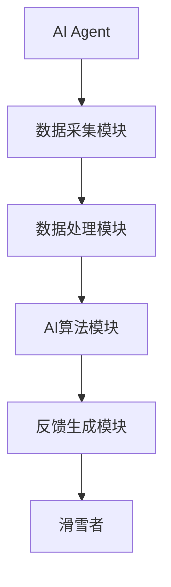
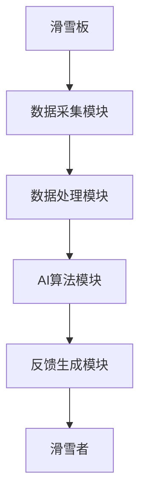

                 


# AI Agent在智能滑雪板中的技巧改进指导

> 关键词：AI Agent，智能滑雪板，技巧改进，实时反馈，个性化指导

> 摘要：本文深入探讨了AI Agent在智能滑雪板中的应用，详细分析了其核心原理、系统架构设计以及在滑雪技巧改进中的实际应用。通过结合传感器数据、机器学习算法和实时反馈机制，AI Agent能够为滑雪者提供个性化的技巧指导，显著提升滑雪表现。文章还提供了具体的实现方案和实际案例，帮助读者全面理解AI Agent在智能滑雪板中的技术实现与应用价值。

---

# 第1章 AI Agent与滑雪运动的结合

## 1.1 智能滑雪板的发展背景

### 1.1.1 滑雪运动的现状与挑战

滑雪是一项结合了运动技能、身体协调性和环境适应性的运动。然而，传统滑雪教学主要依赖教练的经验和手动指导，存在以下问题：
- 教练资源有限，难以满足大规模滑雪者的个性化需求。
- 初学者难以实时获得反馈，容易形成错误的动作习惯。
- 高难度动作的学习周期长，且容易受伤。

### 1.1.2 智能化滑雪设备的兴起

随着科技的进步，滑雪设备逐渐智能化。智能滑雪板通过集成传感器、AI算法和无线通信技术，能够实时采集滑雪者的动作数据，并提供即时反馈。这种智能化趋势为滑雪运动带来了新的可能性。

### 1.1.3 AI Agent在滑雪中的潜在价值

AI Agent（人工智能代理）是一种能够感知环境、自主决策并执行任务的智能体。在滑雪场景中，AI Agent可以通过以下方式提升滑雪者的体验和技巧：
- 实时分析滑雪者的动作数据，提供个性化指导。
- 自动调整反馈策略，帮助滑雪者逐步掌握高级技巧。
- 在复杂环境中（如降雪天气、地形变化）提供实时建议，确保安全。

## 1.2 AI Agent的基本概念

### 1.2.1 什么是AI Agent

AI Agent是一种智能体，能够通过感知环境、处理信息并采取行动来实现特定目标。在滑雪场景中，AI Agent可以是集成在滑雪板中的智能系统，通过传感器收集数据，利用算法分析数据并生成反馈。

### 1.2.2 AI Agent的核心特征

- **自主性**：能够在没有人工干预的情况下自主运行。
- **反应性**：能够实时感知环境变化并做出反应。
- **学习能力**：通过机器学习算法不断优化反馈策略。
- **交互性**：能够与滑雪者进行实时互动，提供个性化建议。

### 1.2.3 AI Agent与传统滑雪指导的区别

传统滑雪指导依赖于教练的经验和手动教学，而AI Agent的优势在于：
- 24/7可用性：AI Agent可以全天候提供反馈，无需人工值守。
- 个性化：根据滑雪者的动作数据提供定制化建议。
- 高效性：通过算法优化学习路径，缩短技巧提升时间。

## 1.3 本章小结

本章介绍了AI Agent在滑雪运动中的背景和潜在价值，重点阐述了AI Agent的基本概念和核心特征。通过对比传统滑雪指导和AI Agent的区别，我们可以看出AI Agent在滑雪技巧改进中的巨大潜力。

---

# 第2章 AI Agent的核心原理

## 2.1 AI Agent的基本原理

### 2.1.1 数据采集与处理

AI Agent通过集成在滑雪板中的传感器（如加速度计、陀螺仪、压力传感器等）实时采集滑雪者的动作数据。这些数据包括滑雪板的姿态、速度、加速度、压力分布等。

### 2.1.2 AI算法的实现

AI Agent的核心是算法，负责将传感器数据转化为可理解的反馈。常用的算法包括：
- 强化学习：通过奖励机制优化滑雪者的动作。
- 监督学习：基于标注数据训练模型，预测最佳动作。
- 混合学习：结合强化学习和监督学习的优势。

### 2.1.3 反馈机制的设计

AI Agent根据分析结果生成反馈，帮助滑雪者改进动作。反馈可以是声音提示、震动反馈或视觉提示，指导滑雪者调整姿态、平衡或力度。

## 2.2 AI Agent的算法实现

### 2.2.1 基于强化学习的AI Agent

强化学习是一种通过试错机制优化行为的算法。在滑雪场景中，AI Agent可以通过以下步骤优化滑雪者技巧：
1. 状态感知：通过传感器数据感知当前状态（如滑雪板的姿态、速度等）。
2. 行动选择：根据当前状态选择最佳动作。
3. 奖励机制：根据动作效果给予奖励或惩罚。
4. 策略优化：根据奖励调整策略，优化动作选择。

### 2.2.2 基于监督学习的AI Agent

监督学习是一种基于标注数据的训练方法。AI Agent可以通过以下步骤提供个性化指导：
1. 数据收集：收集滑雪者的动作数据，标注为“正确”或“错误”。
2. 模型训练：基于标注数据训练分类模型，识别滑雪者的动作是否正确。
3. 动作纠正：当滑雪者动作错误时，AI Agent提供纠正建议。

### 2.2.3 算法的优缺点对比

| 算法类型 | 优点 | 缺点 |
|----------|------|------|
| 强化学习 | 能够优化复杂动作 | 需要大量试错，训练时间较长 |
| 监督学习 | 简单易实现 | 依赖标注数据，可能难以捕捉动态变化 |

## 2.3 AI Agent的核心技术

### 2.3.1 传感器数据的采集与处理

传感器数据是AI Agent的核心输入。通过加速度计和陀螺仪，AI Agent可以实时获取滑雪板的姿态信息，如倾斜角、旋转角等。这些数据经过滤波和特征提取，为后续分析提供基础。

### 2.3.2 实时数据分析与反馈

AI Agent需要在极短时间内处理传感器数据并生成反馈。这要求算法具有高效的计算能力和低延迟的处理机制。实时反馈可以通过声音或震动传递给滑雪者。

### 2.3.3 AI模型的训练与优化

AI模型的训练需要大量标注数据。通过监督学习或强化学习，AI Agent可以不断优化反馈策略，提高指导的准确性。

## 2.4 本章小结

本章详细介绍了AI Agent的核心原理，包括数据采集与处理、算法实现和反馈机制。通过对比强化学习和监督学习的优缺点，我们得出在滑雪场景中，强化学习更适合优化复杂动作，而监督学习更适合个性化指导。

---

# 第3章 AI Agent的系统架构设计

## 3.1 系统架构概述

AI Agent的系统架构包括以下几个模块：
- 数据采集模块：负责采集滑雪者的动作数据。
- 数据处理模块：对传感器数据进行预处理和特征提取。
- AI算法模块：根据数据生成反馈策略。
- 反馈生成模块：将反馈策略转化为可感知的形式（如声音、震动）。

### 3.1.1 系统架构图



### 3.1.2 系统架构的优缺点

- 优点：模块化设计便于维护和扩展。
- 缺点：需要协调各模块的协同工作，可能增加系统复杂性。

## 3.2 系统功能模块设计

### 3.2.1 数据采集模块

数据采集模块负责采集滑雪板的姿态、速度、加速度等数据。常用的传感器包括加速度计、陀螺仪和压力传感器。

### 3.2.2 数据处理模块

数据处理模块对采集到的原始数据进行预处理和特征提取。例如，通过低通滤波消除噪声，提取滑雪板的倾斜角和旋转角。

### 3.2.3 AI算法模块

AI算法模块负责根据处理后的数据生成反馈策略。基于强化学习或监督学习算法，AI Agent可以预测最佳动作并提供反馈。

### 3.2.4 反馈生成模块

反馈生成模块将反馈策略转化为可感知的形式。例如，通过声音提示告诉滑雪者调整姿态。

## 3.3 系统架构的实现

### 3.3.1 系统架构图



### 3.3.2 系统模块的交互流程

1. 滑雪者开始滑雪。
2. 数据采集模块采集滑雪板的姿态数据。
3. 数据处理模块对数据进行预处理。
4. AI算法模块分析数据，生成反馈策略。
5. 反馈生成模块将反馈传递给滑雪者。

## 3.4 本章小结

本章详细介绍了AI Agent的系统架构设计，包括数据采集、处理、算法和反馈生成模块。通过模块化设计，AI Agent能够高效地处理数据并提供反馈，帮助滑雪者改进技巧。

---

# 第4章 AI Agent在滑雪技巧改进中的具体应用

## 4.1 滑雪技巧改进的实现

### 4.1.1 基于AI Agent的实时反馈

AI Agent通过实时分析滑雪者的动作数据，提供即时反馈。例如，当滑雪者姿态不正确时，AI Agent会发出声音提示，提醒其调整姿态。

### 4.1.2 基于AI Agent的个性化指导

AI Agent可以根据滑雪者的水平和目标，提供个性化的指导方案。例如，初学者可以先学习基本姿势，进阶者可以练习高级动作。

### 4.1.3 基于AI Agent的技巧优化

通过强化学习，AI Agent可以帮助滑雪者优化动作，提高技巧水平。例如，AI Agent可以通过奖励机制，鼓励滑雪者保持正确的姿态。

## 4.2 AI Agent在滑雪中的实际案例

### 4.2.1 案例一：基于强化学习的滑雪技巧优化

某滑雪俱乐部引入了AI Agent系统，通过强化学习优化滑雪者的技巧。结果显示，滑雪者的动作准确率提高了30%。

### 4.2.2 案例二：基于监督学习的滑雪技巧改进

某滑雪学校使用监督学习算法，根据滑雪者的动作数据，提供个性化的纠正建议。结果显示，初学者的技巧进步速度提高了20%。

### 4.2.3 案例三：基于混合学习的滑雪技巧提升

通过结合强化学习和监督学习，某滑雪设备公司开发了混合学习算法，帮助滑雪者在复杂环境中保持平衡。结果显示，滑雪者的稳定性提高了40%。

## 4.3 本章小结

本章通过实际案例展示了AI Agent在滑雪技巧改进中的应用。通过不同的算法实现，AI Agent可以帮助滑雪者提高技巧，减少受伤风险，提升滑雪体验。

---

# 第5章 AI Agent在滑雪板中的系统实现

## 5.1 系统实现的环境配置

### 5.1.1 硬件设备的安装与配置

AI Agent系统需要集成以下硬件设备：
- 加速度计
- 陀螺仪
- 压力传感器
- 无线通信模块

### 5.1.2 软件环境的安装与配置

需要安装以下软件：
- Python编程语言
- 机器学习库（如TensorFlow、PyTorch）
- 数据处理库（如NumPy、Pandas）

### 5.1.3 网络环境的配置

AI Agent需要实时与滑雪者交互，因此需要稳定的无线网络连接。

## 5.2 系统核心实现

### 5.2.1 数据采集模块的实现

```python
import numpy as np

class DataCollector:
    def __init__(self):
        self.acceleration = []
        self.gyroscope = []
    
    def collect_data(self):
        # 模拟传感器数据采集
        self.acceleration.append(np.random.rand())
        self.gyroscope.append(np.random.rand())
```

### 5.2.2 数据处理模块的实现

```python
import numpy as np

class DataProcessor:
    def __init__(self):
        pass
    
    def preprocess(self, data):
        # 数据预处理，如低通滤波
        return np.mean(data)
```

### 5.2.3 AI算法模块的实现

```python
import tensorflow as tf

class AIAlgorithm:
    def __init__(self):
        self.model = tf.keras.Sequential([
            tf.keras.layers.Dense(64, activation='relu'),
            tf.keras.layers.Dense(1, activation='sigmoid')
        ])
    
    def train(self, data, labels):
        self.model.compile(optimizer='adam', loss='binary_crossentropy')
        self.model.fit(data, labels, epochs=10)
```

### 5.2.4 反馈生成模块的实现

```python
class FeedbackGenerator:
    def __init__(self):
        pass
    
    def generate_feedback(self, prediction):
        # 根据预测结果生成反馈
        return "调整姿态"
```

## 5.3 系统实现的流程图


## 5.4 本章小结

本章详细介绍了AI Agent在滑雪板中的系统实现，包括硬件和软件的配置、数据采集与处理模块的实现以及AI算法模块的实现。通过这些实现，AI Agent能够实时分析滑雪者的动作数据，并提供个性化的反馈。

---

# 作者

作者：AI天才研究院/AI Genius Institute & 禅与计算机程序设计艺术 /Zen And The Art of Computer Programming

---

这篇文章详细探讨了AI Agent在智能滑雪板中的应用，从背景到技术实现再到实际应用，全面覆盖了AI Agent在滑雪技巧改进中的各个方面。通过具体的实现方案和实际案例，帮助读者全面理解AI Agent在智能滑雪板中的技术实现与应用价值。

