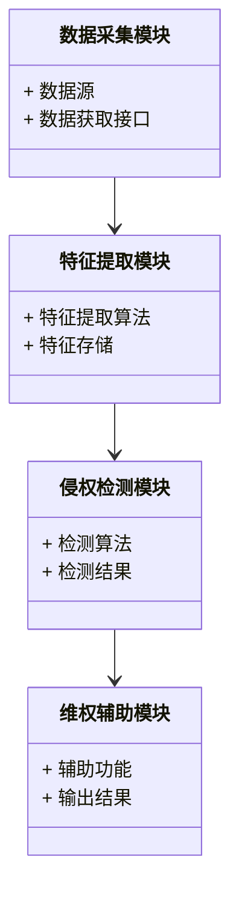
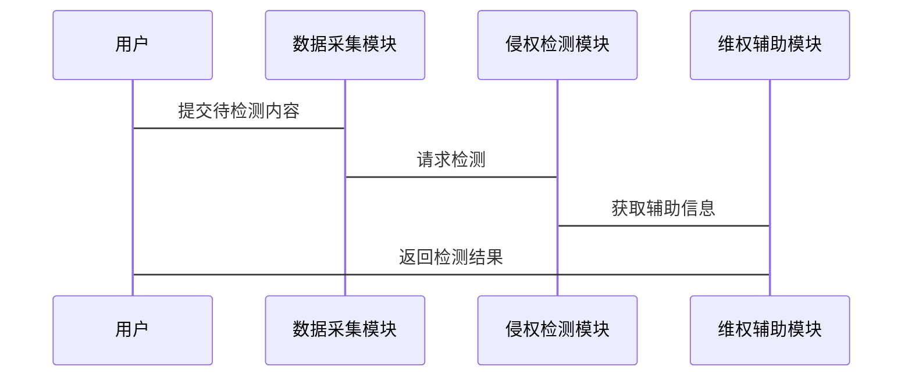

                 


# AI Agent在智能版权保护中的应用

> 关键词：AI Agent, 智能版权保护, 侵权检测, 版权追踪, 区块链, 机器学习

> 摘要：本文探讨AI Agent在智能版权保护中的应用，涵盖其基本原理、技术基础、核心应用、系统设计、项目实战以及优化方向，详细分析AI Agent在版权识别、追踪、维权等方面的作用，结合实际案例和系统架构，展望未来的发展趋势。

---

# 第一部分: AI Agent在智能版权保护中的应用概述

## 第1章: AI Agent与智能版权保护概述

### 1.1 AI Agent的基本概念

#### 1.1.1 AI Agent的定义
AI Agent（人工智能代理）是指能够感知环境并采取行动以实现目标的智能实体。它可以理解、学习和执行任务，帮助用户解决问题。

#### 1.1.2 AI Agent的核心特征
- **自主性**：能够自主决策和行动。
- **反应性**：实时感知环境变化并做出反应。
- **目标导向**：行为基于明确的目标。
- **学习能力**：通过数据优化自身性能。

#### 1.1.3 AI Agent与传统版权保护手段的对比
传统版权保护依赖法律和人工审核，效率低且成本高。AI Agent通过自动化技术提高效率，降低成本，实现实时监控和快速响应。

### 1.2 智能版权保护的背景与意义

#### 1.2.1 版权保护的现状与挑战
随着数字内容的爆炸式增长，侵权问题日益严重，传统手段难以应对海量数据和快速变化的网络环境。

#### 1.2.2 智能技术在版权保护中的应用价值
AI Agent能够高效识别侵权内容，追踪侵权行为，辅助维权，提升版权保护的效率和效果。

#### 1.2.3 AI Agent在版权保护中的独特优势
- **自动化**：无需人工干预，实时监控。
- **高精度**：利用深度学习提升识别准确率。
- **快速响应**：及时发现和处理侵权行为。

---

## 第2章: AI Agent的基本原理与技术基础

### 2.1 AI Agent的核心技术

#### 2.1.1 人工智能基础
AI Agent依赖于机器学习、自然语言处理等技术，通过数据训练模型，实现智能决策。

#### 2.1.2 机器学习算法
- **监督学习**：基于标注数据训练模型。
- **无监督学习**：发现数据中的隐藏结构。
- **强化学习**：通过奖励机制优化行为策略。

#### 2.1.3 自然语言处理技术
用于文本分析和理解，帮助识别侵权内容中的关键词和语义信息。

### 2.2 AI Agent的工作原理

#### 2.2.1 数据采集与处理
- **数据源**：从互联网获取文本、图像、视频等数据。
- **数据清洗**：去除噪声，提取有效信息。

#### 2.2.2 模型训练与优化
- **特征提取**：提取内容的关键特征。
- **模型训练**：使用训练数据优化模型参数。
- **性能评估**：通过测试数据评估模型效果。

#### 2.2.3 任务执行与反馈
- **任务分配**：根据需求分配不同的任务。
- **结果反馈**：将处理结果反馈给用户或系统。

---

## 第3章: 版权保护的传统手段与智能技术的结合

### 3.1 版权保护的传统手段

#### 3.1.1 版权登记与备案
通过官方机构登记版权信息，作为法律维权的依据。

#### 3.1.2 法律手段与维权途径
依赖法律诉讼和律师协助，成本高且周期长。

#### 3.1.3 技术手段如数字水印
在数字内容中嵌入标识，用于版权验证。

### 3.2 智能技术在版权保护中的应用

#### 3.2.1 AI在内容识别中的应用
- **图像识别**：使用卷积神经网络（CNN）识别图像内容。
- **文本分析**：利用NLP技术分析文本相似度。

#### 3.2.2 机器学习在侵权检测中的作用
训练分类模型，识别侵权内容。

#### 3.2.3 大数据在版权管理中的应用
通过大数据分析，优化版权管理和侵权监测策略。

---

# 第二部分: AI Agent在版权保护中的核心应用

## 第4章: AI Agent在版权内容识别中的应用

### 4.1 内容识别的基本原理

#### 4.1.1 特征提取
提取内容的关键特征，如文本的关键词、图像的纹理特征。

#### 4.1.2 内容相似度计算
通过计算内容之间的相似度，判断是否存在侵权行为。

#### 4.1.3 基于深度学习的内容识别模型
使用深度学习模型（如CNN、RNN）进行内容识别。

### 4.2 基于AI Agent的侵权检测

#### 4.2.1 侵权检测的流程
- **数据采集**：获取待检测内容。
- **特征提取**：提取内容特征。
- **模型匹配**：与已知版权内容进行匹配。
- **结果判断**：输出是否侵权。

#### 4.2.2 基于NLP的文本侵权检测
使用自然语言处理技术，分析文本相似度，识别侵权内容。

#### 4.2.3 基于计算机视觉的图像侵权检测
通过图像识别技术，检测图片侵权行为。

---

## 第5章: AI Agent在版权追踪与维权中的应用

### 5.1 版权追踪的技术实现

#### 5.1.1 区块链技术在版权追踪中的应用
利用区块链的不可篡改性，记录版权信息，确保信息真实可靠。

#### 5.1.2 去中心化存储
使用分布式存储技术，确保版权信息的安全和可追溯性。

### 5.2 基于AI Agent的维权辅助

#### 5.2.1 自动监测
实时监控网络，发现侵权内容后自动标记。

#### 5.2.2 侵权证据收集
自动记录侵权行为的证据，便于后续法律维权。

#### 5.2.3 法律建议
基于历史案例和法律知识，提供维权建议。

---

# 第三部分: AI Agent系统的架构与实现

## 第7章: AI Agent系统的架构设计

### 7.1 系统模块划分

- **数据采集模块**：负责采集版权内容和侵权数据。
- **特征提取模块**：提取内容特征，用于识别和匹配。
- **侵权检测模块**：基于特征进行侵权检测。
- **维权辅助模块**：提供维权支持，包括证据收集和法律建议。

### 7.2 系统功能设计

#### 7.2.1 领域模型
使用Mermaid图展示领域模型，明确各模块之间的关系。



### 7.3 系统交互设计

使用Mermaid序列图展示用户与系统之间的交互流程。



---

## 第8章: AI Agent系统的项目实战

### 8.1 项目环境搭建

- **安装Python**：3.8及以上版本。
- **安装库**：TensorFlow、Keras、Pillow、区块链框架（如Ethereum）。

### 8.2 核心代码实现

#### 8.2.1 特征提取代码

```python
import tensorflow as tf
from tensorflow.keras import layers

# 加载预训练模型
model = tf.keras.applications.VGG16(weights='imagenet', include_top=False)

# 定义特征提取函数
def extract_features(image):
    features = model.predict(tf.image.resize(image, (224, 224)))[0]
    return features.numpy()
```

#### 8.2.2 侵权检测代码

```python
from sklearn.metrics.pairwise import cosine_similarity

# 提取特征
features1 = extract_features(image1)
features2 = extract_features(image2)

# 计算相似度
similarity = cosine_similarity([features1], [features2])[0, 0]
if similarity > 0.8:
    print("可能存在侵权行为")
```

### 8.3 测试与优化

- **测试用例**：设计不同场景的测试用例，验证系统功能。
- **性能优化**：优化算法和系统架构，提升处理速度和准确性。

### 8.4 案例分析

分析一个实际案例，展示AI Agent在侵权检测和维权中的具体应用，详细说明实现步骤和结果。

---

# 第四部分: AI Agent在版权保护中的优化与展望

## 第9章: AI Agent的优化方向

### 9.1 技术优化

- **模型优化**：改进模型结构，提升识别准确率。
- **算法改进**：研究新的算法，提高处理效率。

### 9.2 法律与伦理问题

- **数据隐私**：确保数据处理符合隐私保护法规。
- **法律合规**：确保AI Agent的应用符合相关法律法规。

### 9.3 未来发展趋势

- **新技术应用**：如量子计算、边缘计算等技术的应用。
- **多领域结合**：AI Agent与其他技术的深度融合。

---

## 第10章: 总结与展望

### 10.1 全书总结

本文详细探讨了AI Agent在智能版权保护中的应用，分析了其在内容识别、侵权检测、版权追踪等方面的优势，展示了系统架构和实际案例。

### 10.2 未来展望

随着技术的进步，AI Agent将在版权保护中发挥更大作用，推动智能版权保护的发展。

---

# 作者：AI天才研究院 & 禅与计算机程序设计艺术

---

通过以上结构，文章系统地介绍了AI Agent在智能版权保护中的应用，从基本概念到实际应用，结合技术细节和案例分析，为读者提供了全面的知识和实践指导。

