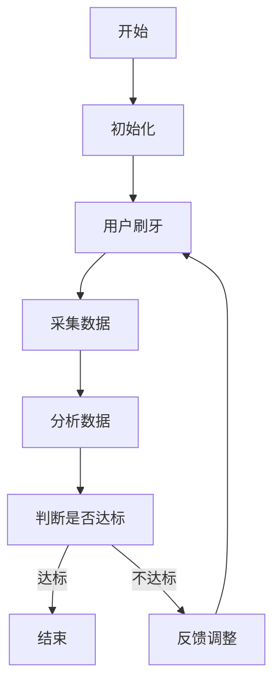
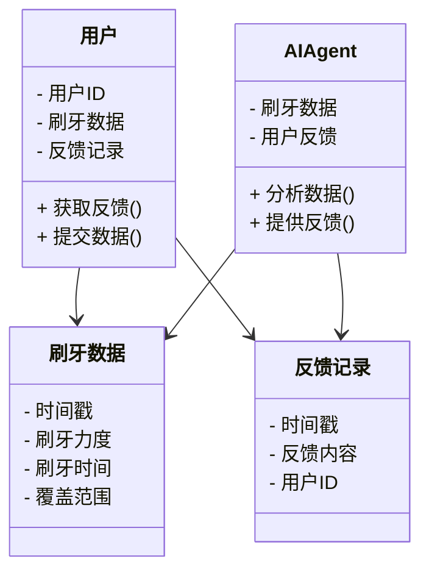
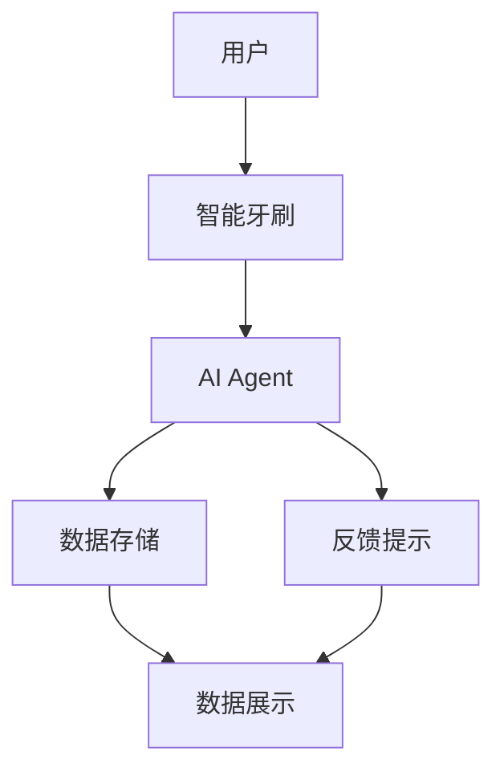
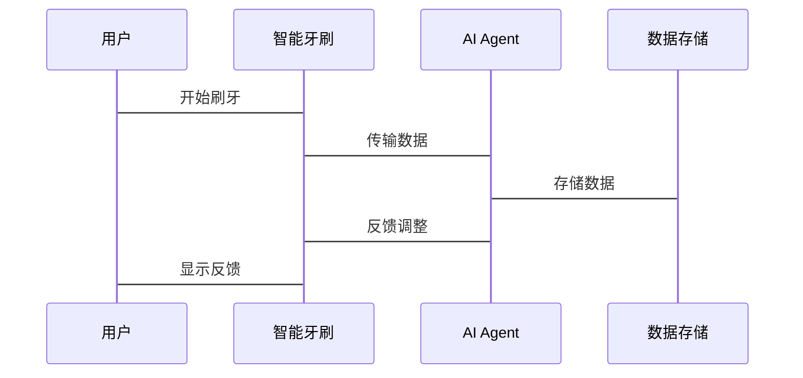

                 


# AI Agent在智能牙刷中的刷牙效果分析

> 关键词：AI Agent，智能牙刷，刷牙效果，数据分析，个性化推荐

> 摘要：本文探讨AI Agent在智能牙刷中的应用，分析其如何通过数据感知、智能决策和精准执行来优化用户的刷牙效果。文章从背景、核心概念、算法原理、系统架构到项目实战，全面解析AI Agent在智能牙刷中的作用及其带来的技术革新。

---

## 第1章: AI Agent与智能牙刷的背景介绍

### 1.1 问题背景

#### 1.1.1 牙齿健康的重要性
牙齿健康是整体健康的重要组成部分，直接影响咀嚼功能、消化健康以及个人形象。良好的刷牙习惯是维护牙齿健康的基础。

#### 1.1.2 刷牙效果的关键因素
刷牙效果受刷牙频率、力度、时间、覆盖范围等多种因素影响。传统牙刷难以提供实时反馈，导致用户难以有效改善刷牙习惯。

#### 1.1.3 AI技术在个人健康中的应用潜力
AI技术在医疗健康领域的广泛应用，为智能牙刷的智能化提供了技术支持。通过实时数据分析和个性化推荐，AI Agent能够帮助用户优化刷牙效果。

### 1.2 问题描述

#### 1.2.1 刷牙过程中的常见问题
- 刷牙力度过大或过小，导致牙龈出血或清洁不彻底。
- 刷牙时间不足，无法有效清除牙菌斑。
- 用户难以掌握正确的刷牙姿势和范围。

#### 1.2.2 用户刷牙习惯的分析需求
- 需要实时监测刷牙行为，提供即时反馈。
- 需要长期数据分析，识别不良习惯并提出改进建议。

#### 1.2.3 AI Agent在改善刷牙效果中的作用
AI Agent通过传感器数据采集、智能分析和个性化指导，帮助用户实现更有效的刷牙效果。

### 1.3 问题解决与AI Agent的应用

#### 1.3.1 AI Agent如何优化刷牙效果
AI Agent能够实时感知用户的刷牙行为，通过分析数据提供个性化建议，帮助用户避免错误动作，提高清洁效率。

#### 1.3.2 数据驱动的个性化刷牙建议
通过收集和分析用户的刷牙数据，AI Agent能够制定个性化的刷牙计划，如调整刷牙时间、力度和范围。

#### 1.3.3 提高用户参与度的策略
AI Agent可以通过游戏化设计、积分奖励等方式，提高用户的参与度和坚持度。

### 1.4 边界与外延

#### 1.4.1 AI Agent的功能限制
AI Agent的功能集中在刷牙效果分析和优化，不涉及其他健康领域。

#### 1.4.2 相关技术的边界（如传感器技术）
传感器技术用于数据采集，AI Agent处理数据并提供反馈，二者功能分离，互为补充。

#### 1.4.3 应用场景的扩展（如远程监控）
未来，AI Agent可扩展至远程监控，结合物联网技术，为用户提供更全面的口腔健康管理。

### 1.5 核心概念与要素

#### 1.5.1 AI Agent的基本构成
AI Agent由感知模块、决策模块和执行模块组成，分别负责数据采集、分析与反馈。

#### 1.5.2 智能牙刷的关键技术
智能牙刷配备压力传感器、加速度传感器和陀螺仪，用于实时监测用户的刷牙行为。

#### 1.5.3 用户反馈机制的作用
用户反馈机制通过振动或APP提示，实时指导用户调整刷牙姿势和力度。

---

## 第2章: AI Agent的核心原理

### 2.1 AI Agent的基本原理

#### 2.1.1 感知机制
AI Agent通过内置传感器采集用户的刷牙数据，如力度、时间、频率和覆盖范围。

#### 2.1.2 决策机制
基于机器学习算法，AI Agent分析数据，识别不良习惯并生成优化建议。

#### 2.1.3 执行机制
通过振动反馈或APP提示，AI Agent实时指导用户调整刷牙姿势和力度。

### 2.2 AI Agent的关键技术

#### 2.2.1 传感器数据采集
智能牙刷中的传感器实时采集刷牙数据，为AI分析提供基础。

#### 2.2.2 数据分析与处理
使用机器学习模型分析数据，识别用户行为模式，提供个性化建议。

#### 2.2.3 个性化推荐算法
基于用户数据，AI Agent制定个性化刷牙计划，优化清洁效果。

### 2.3 AI Agent与智能牙刷的结合

#### 2.3.1 实时数据分析
AI Agent实时分析刷牙数据，提供即时反馈，帮助用户调整行为。

#### 2.3.2 用户行为识别
通过传感器数据，AI Agent识别用户的刷牙姿势、力度和覆盖范围，优化清洁效果。

#### 2.3.3 自动调整
AI Agent根据分析结果，自动调整反馈策略，确保用户保持正确的刷牙习惯。

---

## 第3章: AI Agent的算法原理

### 3.1 算法选择与原理

#### 3.1.1 强化学习算法
强化学习通过奖励机制，引导用户形成良好的刷牙习惯。

#### 3.1.2 机器学习模型
使用监督学习算法训练模型，识别用户刷牙行为中的不良习惯。

#### 3.1.3 算法流程图
以下是强化学习算法的流程图：



### 3.2 算法实现与优化

#### 3.2.1 算法实现
以下是Python代码示例：

```python
import numpy as np
from sklearn import linear_model

# 示例数据：用户刷牙时间与牙菌斑数量
X = np.array([[2], [3], [4], [5], [6]])  # 刷牙时间
y = np.array([10, 8, 6, 4, 2])          # 牙菌斑数量

# 训练线性回归模型
model = linear_model.LinearRegression()
model.fit(X, y)

# 预测刷牙效果
print(model.predict([[4]]))  # 输出：[[6.]]
```

#### 3.2.2 算法优化
通过调整模型参数和数据预处理，提高算法的准确性和响应速度。

### 3.3 算法的数学模型

#### 3.3.1 线性回归模型
$$ y = \beta_0 + \beta_1x + \epsilon $$

其中，\( y \) 为目标变量（牙菌斑数量），\( x \) 为自变量（刷牙时间），\( \beta_0 \) 和 \( \beta_1 \) 为回归系数，\( \epsilon \) 为误差项。

#### 3.3.2 逻辑回归模型
$$ P(y=1|x) = \frac{1}{1 + e^{-(\beta_0 + \beta_1x)}} $$

用于分类问题，如判断用户是否正确覆盖所有牙齿区域。

---

## 第4章: 系统分析与架构设计

### 4.1 系统场景介绍

#### 4.1.1 系统构成
智能牙刷系统包括硬件部分（传感器、牙刷柄）和软件部分（AI Agent、用户APP）。

#### 4.1.2 功能需求
实时监测刷牙数据，分析用户行为，提供个性化反馈。

### 4.2 系统功能设计

#### 4.2.1 领域模型
以下是领域模型的Mermaid类图：



### 4.3 系统架构设计

#### 4.3.1 系统架构图
以下是系统架构的Mermaid图：



### 4.4 系统接口设计

#### 4.4.1 API接口
AI Agent通过REST API接收传感器数据，并返回反馈信息。

#### 4.4.2 交互流程
以下是交互流程的Mermaid图：



---

## 第5章: 项目实战

### 5.1 环境安装

#### 5.1.1 安装Python环境
使用Anaconda安装Python 3.8及以上版本。

#### 5.1.2 安装依赖库
安装numpy、scikit-learn和mermaid等库。

### 5.2 系统核心实现

#### 5.2.1 刷牙数据采集
通过传感器模拟器生成刷牙数据，并存储在CSV文件中。

#### 5.2.2 AI Agent实现
使用机器学习模型分析数据，生成反馈信息。

#### 5.2.3 用户界面设计
设计简单的GUI或移动APP，展示反馈信息。

### 5.3 实际案例分析

#### 5.3.1 数据分析
通过真实用户数据，分析刷牙习惯并提出改进建议。

#### 5.3.2 案例总结
AI Agent在改善用户刷牙效果中的实际应用效果。

### 5.4 项目小结

#### 5.4.1 项目总结
AI Agent在智能牙刷中的应用显著提升了用户的刷牙效果。

#### 5.4.2 经验教训
数据质量和模型选择对项目成功至关重要。

---

## 第6章: 最佳实践与注意事项

### 6.1 最佳实践

#### 6.1.1 数据隐私保护
确保用户数据的安全性和隐私性。

#### 6.1.2 持续优化模型
定期更新模型，提高分析精度。

### 6.2 小结

AI Agent在智能牙刷中的应用为用户提供了更智能化的刷牙体验，显著提升了口腔健康水平。

### 6.3 注意事项

#### 6.3.1 技术限制
当前技术条件下，AI Agent的功能仍需不断完善。

#### 6.3.2 用户教育
需要加强用户教育，帮助用户正确使用智能牙刷。

### 6.4 拓展阅读

#### 6.4.1 相关技术
推荐阅读关于AI在医疗健康领域的应用书籍。

#### 6.4.2 实战项目
参与开源项目，实践AI在智能硬件中的应用。

---

## 附录

### 附录A: 数据集
提供用于训练AI Agent的刷牙数据集。

### 附录B: 工具库
列出项目中使用的工具库及其版本。

### 附录C: 参考文献
提供相关文献和资料的引用。

---

作者：AI天才研究院（AI Genius Institute） & 禅与计算机程序设计艺术（Zen And The Art of Computer Programming）

