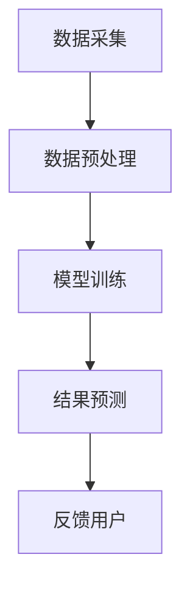
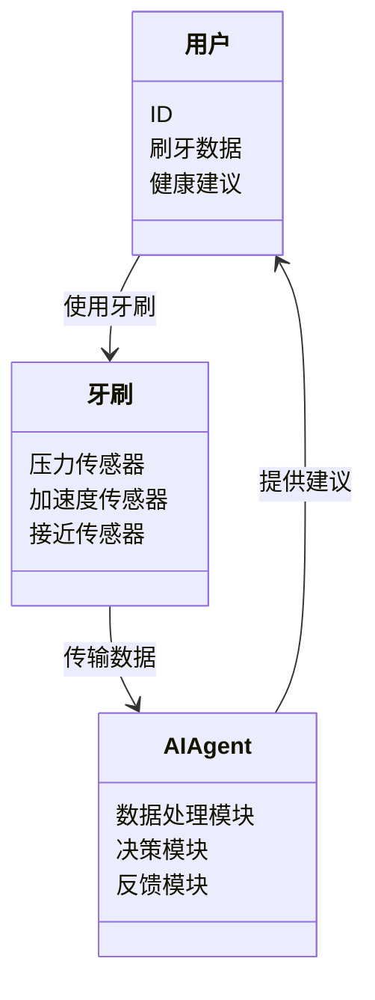
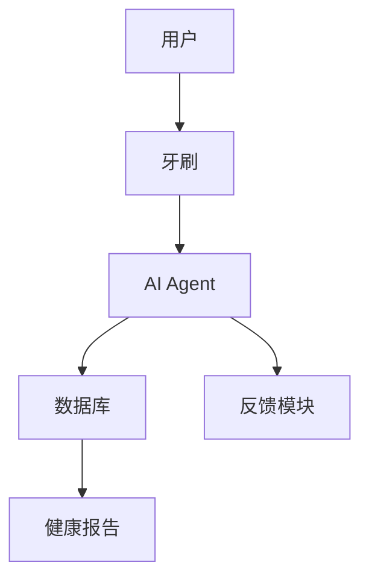
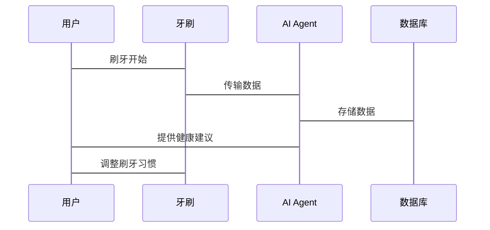

                 


# AI Agent在智能牙刷中的口腔健康分析

## 关键词：AI Agent，智能牙刷，口腔健康，数据分析，机器学习

## 摘要：  
本文探讨AI Agent在智能牙刷中的应用，分析其如何通过数据采集、算法处理和个性化反馈实现口腔健康监测。内容涵盖AI Agent的基本原理、算法实现、系统架构设计以及实际应用案例，为智能牙刷的设计和优化提供理论支持和实践指导。

---

# 第1章: AI Agent与智能牙刷的背景介绍

## 1.1 AI Agent的核心概念

### 1.1.1 AI Agent的定义与特点
AI Agent（人工智能代理）是指能够感知环境、自主决策并执行任务的智能实体。其特点包括：  
- **自主性**：无需外部干预，自主完成任务。  
- **反应性**：能够实时感知环境变化并做出反应。  
- **学习能力**：通过数据学习和优化算法，提升性能。  

### 1.1.2 AI Agent在智能牙刷中的应用背景
智能牙刷作为一种智能设备，通过集成传感器和AI技术，能够实时监测用户的口腔健康状况。AI Agent的作用在于处理这些数据，提供个性化的健康建议。

### 1.1.3 口腔健康分析的必要性与挑战
- **必要性**：口腔健康直接关系到全身健康，早期发现问题至关重要。  
- **挑战**：数据采集的准确性、算法的实时性以及用户行为的多样性是主要挑战。

## 1.2 智能牙刷的发展现状

### 1.2.1 智能牙刷的定义与功能
智能牙刷是一种结合了传感器和智能算法的牙刷，能够监测刷牙时的压力、时间、角度等参数，并通过蓝牙或Wi-Fi将数据传输到手机或其他终端设备。

### 1.2.2 当前市场上的主流智能牙刷产品
- **产品A**：通过压力传感器监测刷牙力度，预防牙龈出血。  
- **产品B**：结合加速度传感器，分析刷牙时间及覆盖区域。  
- **产品C**：支持语音交互，提供实时健康建议。  

### 1.2.3 智能牙刷的技术发展趋势
- **传感器技术的进步**：更高精度的传感器提升了数据采集的准确性。  
- **算法优化**：深度学习算法的应用使得健康分析更加精准。  
- **用户体验提升**：通过AI Agent实现个性化的健康指导。  

## 1.3 AI Agent在智能牙刷中的作用

### 1.3.1 AI Agent如何提升口腔健康分析能力
AI Agent通过实时分析传感器数据，识别刷牙习惯中的问题，并提出改进方案。

### 1.3.2 AI Agent与传统牙刷功能的对比
| 功能特性       | 传统牙刷             | 智能牙刷+AI Agent       |
|----------------|----------------------|--------------------------|
| 数据采集       | 无                   | 传感器实时采集           |
| 数据分析       | 无                   | AI算法处理               |
| 用户反馈       | 无                   | 个性化建议和提醒         |

### 1.3.3 AI Agent在智能牙刷中的实现方式
- **数据采集**：通过压力、加速度等传感器获取刷牙数据。  
- **数据处理**：AI Agent对数据进行分析，识别问题并生成反馈。  
- **用户反馈**：通过LED、声音或手机App通知用户。  

## 1.4 本章小结  
本章介绍了AI Agent的基本概念、智能牙刷的发展现状以及AI Agent在智能牙刷中的作用。通过对比传统牙刷与智能牙刷的功能差异，突出了AI Agent在口腔健康分析中的重要性。

---

# 第2章: AI Agent与口腔健康分析的核心概念

## 2.1 AI Agent的基本原理

### 2.1.1 AI Agent的感知层
AI Agent的感知层负责采集环境中的数据。在智能牙刷中，感知层主要由以下传感器组成：
- **压力传感器**：监测刷牙时的压力大小。  
- **加速度传感器**：测量刷牙的幅度和频率。  
- **接近传感器**：检测牙刷与牙齿的接触状态。  

### 2.1.2 AI Agent的决策层
决策层是AI Agent的核心，负责对感知层获取的数据进行分析和处理。  
- **数据预处理**：包括数据清洗、归一化等步骤。  
- **模型训练**：利用机器学习算法（如随机森林、支持向量机等）建立健康评估模型。  
- **决策制定**：根据模型结果生成健康建议。  

### 2.1.3 AI Agent的执行层
执行层负责根据决策层的指令执行具体操作。  
- **反馈用户**：通过牙刷的震动、LED灯或手机App通知用户。  
- **调整参数**：根据用户反馈优化算法模型。  

## 2.2 口腔健康分析的关键指标

### 2.2.1 口腔健康的主要评估指标
- **牙龈出血**：通过压力传感器监测刷牙时的压力变化。  
- **刷牙时间**：通过加速度传感器测量刷牙时长。  
- **覆盖区域**：通过接近传感器判断刷牙的覆盖面。  

### 2.2.2 数据采集的准确性与实时性
- **准确性**：传感器的精度直接影响数据的准确性。  
- **实时性**：AI Agent需要实时处理数据，以提供即时反馈。  

### 2.2.3 数据分析的深度与广度
- **深度分析**：利用深度学习模型分析长期数据，识别潜在问题。  
- **广度分析**：结合用户生活习惯，提供全面的健康评估。  

## 2.3 AI Agent与口腔健康分析的关联性

### 2.3.1 数据流的传递过程
从传感器数据采集到AI Agent处理，再到用户反馈，形成一个完整的数据闭环。

### 2.3.2 AI Agent的决策机制
AI Agent通过机器学习模型分析数据，识别异常情况并生成健康建议。

### 2.3.3 结果反馈的实现方式
通过牙刷的震动、LED灯或手机App将健康建议反馈给用户。

## 2.4 本章小结  
本章详细介绍了AI Agent的基本原理，以及其在口腔健康分析中的关键指标和决策机制。通过数据流的传递过程，突出了AI Agent在智能牙刷中的重要作用。

---

# 第3章: AI Agent在智能牙刷中的算法原理

## 3.1 数据采集与预处理

### 3.1.1 数据采集的传感器类型
- **压力传感器**：监测刷牙时的压力大小。  
- **加速度传感器**：测量刷牙的幅度和频率。  
- **接近传感器**：检测牙刷与牙齿的接触状态。  

### 3.1.2 数据预处理的方法
- **数据清洗**：去除噪声数据，确保数据的准确性。  
- **归一化处理**：将不同传感器的数据转换为统一的格式。  

### 3.1.3 数据清洗与标准化
- **数据清洗**：去除异常值，确保数据的完整性。  
- **标准化处理**：将数据转换为统一的尺度，便于后续分析。  

## 3.2 AI Agent的算法实现

### 3.2.1 算法选择
- **监督学习**：用于分类任务，如牙龈出血的识别。  
- **无监督学习**：用于聚类任务，如用户习惯的分类。  

### 3.2.2 算法流程
1. **数据采集**：通过传感器获取刷牙数据。  
2. **数据预处理**：清洗和归一化数据。  
3. **模型训练**：利用机器学习算法训练模型。  
4. **结果预测**：根据模型预测健康状况。  
5. **反馈用户**：通过牙刷或App提供个性化建议。  

### 3.2.3 算法流程图


## 3.3 数学模型与公式

### 3.3.1 机器学习模型
- **线性回归模型**：用于预测刷牙时间与口腔健康的关系。  
  $$ y = \beta_0 + \beta_1x + \epsilon $$
- **随机森林模型**：用于分类任务，如牙龈出血的识别。  
  $$ y = \text{classify}(X, \text{forest}) $$

### 3.3.2 算法优化
- **超参数调优**：通过网格搜索优化模型性能。  
- **模型集成**：通过投票法或加权法提升模型的准确性。  

## 3.4 本章小结  
本章详细介绍了AI Agent在智能牙刷中的算法实现，包括数据采集与预处理、算法选择与优化等内容。通过流程图和数学公式的结合，突出了算法的核心作用。

---

# 第4章: 系统分析与架构设计

## 4.1 问题场景介绍
智能牙刷系统需要实时监测用户的口腔健康状况，并提供个性化的健康建议。系统设计需要考虑数据采集、处理、反馈的实时性和准确性。

## 4.2 项目介绍
本项目旨在设计一个基于AI Agent的智能牙刷系统，实现口腔健康监测和个性化建议。

## 4.3 系统功能设计

### 4.3.1 领域模型设计


### 4.3.2 系统架构设计


### 4.3.3 系统接口设计
- **输入接口**：传感器数据输入。  
- **输出接口**：健康建议输出（震动、声音、App通知）。  

### 4.3.4 系统交互设计


## 4.4 本章小结  
本章通过系统分析与架构设计，明确了智能牙刷系统的各个模块及其交互关系。通过领域模型和系统架构图，突出了AI Agent的核心作用。

---

# 第5章: 项目实战

## 5.1 环境安装

### 5.1.1 安装Python环境
```bash
python --version
pip install --upgrade pip
```

### 5.1.2 安装传感器库
```bash
pip install adafruit-circuitpython
```

## 5.2 系统核心实现

### 5.2.1 数据采集代码
```python
import numpy as np
from sensors import PressureSensor, AccelerometerSensor, ProximitySensor

class Toothbrush:
    def __init__(self):
        self.pressure_sensor = PressureSensor()
        self accelerometer_sensor = AccelerometerSensor()
        self.proximity_sensor = ProximitySensor()

    def collect_data(self):
        pressure = self.pressure_sensor.read()
        acceleration = self.accelerometer_sensor.read()
        proximity = self.proximity_sensor.read()
        return pressure, acceleration, proximity
```

### 5.2.2 数据处理代码
```python
from sklearn.ensemble import RandomForestClassifier
import numpy as np

class AI-Agent:
    def __init__(self):
        self.model = RandomForestClassifier()

    def train_model(self, X, y):
        self.model.fit(X, y)

    def predict(self, X):
        return self.model.predict(X)
```

### 5.2.3 模型训练代码
```python
# 数据预处理
X = np.array([...])
y = np.array([...])

ai_agent = AI-Agent()
ai_agent.train_model(X, y)
```

## 5.3 代码应用解读与分析

### 5.3.1 数据采集模块
通过传感器采集刷牙时的压力、加速度和接近数据，为后续分析提供基础。

### 5.3.2 数据处理模块
对采集到的数据进行清洗、归一化处理，并利用随机森林模型进行分类或回归分析。

### 5.3.3 模型训练与优化
通过交叉验证优化模型参数，提升模型的准确性和鲁棒性。

## 5.4 实际案例分析

### 5.4.1 案例背景
用户A长期存在牙龈出血问题，使用智能牙刷并结合AI Agent进行健康监测。

### 5.4.2 数据分析
通过传感器数据发现，用户A在刷牙时用力过猛，导致牙龈出血。

### 5.4.3 健康建议
AI Agent建议用户A调整刷牙力度，采用 softer 的方式清洁牙齿。

## 5.5 本章小结  
本章通过实际案例展示了AI Agent在智能牙刷中的应用，从数据采集到模型训练，再到结果反馈，完整地实现了口腔健康分析的功能。

---

# 第6章: 最佳实践与注意事项

## 6.1 最佳实践

### 6.1.1 数据隐私保护
确保用户数据的安全性，避免数据泄露。

### 6.1.2 算法优化
通过超参数调优和模型集成提升算法的准确性和稳定性。

### 6.1.3 用户教育
通过App或语音提示教育用户正确的刷牙方式。

## 6.2 小结

### 6.2.1 系统设计的关键点
- 数据采集的准确性  
- 算法处理的实时性  
- 用户反馈的及时性  

## 6.3 注意事项

### 6.3.1 数据采集的可靠性
传感器的选择和校准至关重要，确保数据的准确性。

### 6.3.2 算法的泛化能力
模型需要具备良好的泛化能力，能够适应不同用户的刷牙习惯。

### 6.3.3 用户的使用习惯
用户可能需要一段时间适应AI Agent的反馈机制。

## 6.4 拓展阅读

### 6.4.1 推荐书籍
- 《机器学习实战》  
- 《深度学习》  

### 6.4.2 推荐论文
- "Deep Learning for Oral Health Analysis"  
- "Reinforcement Learning in Smart Toothbrush Design"  

## 6.5 本章小结  
本章总结了AI Agent在智能牙刷中的最佳实践，提出了系统设计的关键点和注意事项，为后续的研究和应用提供了参考。

---

# 作者：AI天才研究院 & 禅与计算机程序设计艺术

