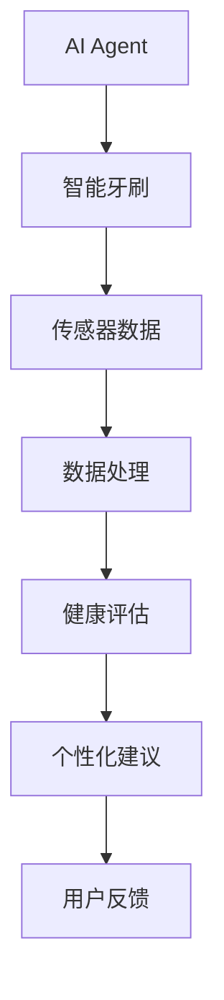
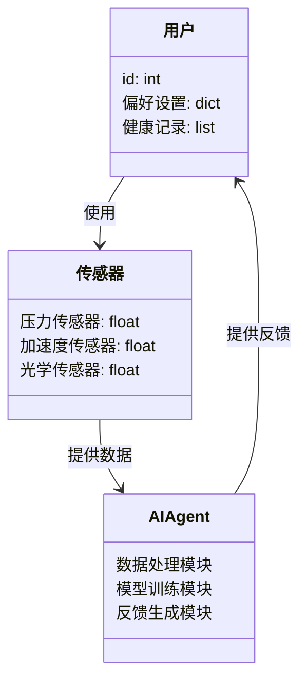
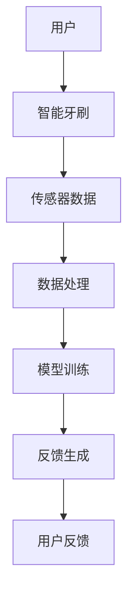

                 


# AI Agent在智能牙刷中的口腔健康追踪

## 关键词：AI Agent，智能牙刷，口腔健康，数据采集，机器学习，健康追踪

## 摘要：本文详细探讨了AI Agent在智能牙刷中的应用，重点分析了其在口腔健康追踪中的作用。文章从背景介绍、核心概念、算法原理、系统架构设计、项目实战到总结展望，全面解析了AI Agent如何通过数据采集、特征提取和机器学习模型实现对口腔健康的精准追踪，为智能牙刷的未来发展提供了理论支持和实践指导。

---

# 第1章: 背景介绍

## 1.1 问题背景

### 1.1.1 口腔健康的重要性
口腔健康是人体健康的重要组成部分，直接关系到整体健康状况。常见的口腔问题包括牙龈出血、龋齿、牙周病等，这些问题如果不及时发现和处理，可能会引发更严重的健康问题。因此，定期监测口腔健康状况至关重要。

### 1.1.2 智能牙刷的发展现状
随着科技的进步，智能牙刷已经从最初的简单计时功能发展到具备压力监测、刷牙时间记录、牙龈出血检测等多种功能。然而，现有的智能牙刷大多只能记录基础数据，缺乏深度分析和个性化建议。

### 1.1.3 AI Agent在智能牙刷中的应用价值
AI Agent（智能代理）能够通过机器学习算法对口腔健康数据进行深度分析，提供个性化的健康建议，帮助用户更好地管理口腔健康。AI Agent的应用可以显著提升智能牙刷的智能化水平，使其从单纯的记录工具升级为智能健康助手。

## 1.2 问题描述

### 1.2.1 口腔健康数据的采集与分析需求
用户在使用智能牙刷时，会产生大量的口腔健康数据，如刷牙压力、刷牙时间、牙龈出血情况等。如何有效地采集这些数据，并对其进行分析，以提供有意义的健康建议，是当前智能牙刷面临的主要挑战。

### 1.2.2 智能牙刷用户的痛点与需求
用户对智能牙刷的主要需求包括：实时监测口腔健康状况、获得个性化的刷牙建议、预防口腔疾病等。然而，现有的智能牙刷功能较为单一，无法满足用户的深度需求。

### 1.2.3 AI Agent在智能牙刷中的应用场景
AI Agent可以在智能牙刷中实现以下功能：
- **实时监测**：通过传感器采集数据，实时分析用户的口腔健康状况。
- **个性化建议**：根据分析结果，提供个性化的刷牙建议和健康指导。
- **疾病预警**：通过长期数据分析，预测潜在的口腔健康问题，并提前预警。

## 1.3 问题解决思路

### 1.3.1 AI Agent的核心功能设计
AI Agent需要具备以下核心功能：
- 数据采集与处理：通过传感器获取口腔健康数据，并进行预处理。
- 数据分析与建模：利用机器学习算法对数据进行分析，建立健康评估模型。
- 个性化建议生成：根据分析结果，生成个性化的健康建议。

### 1.3.2 数据采集与处理的实现方案
智能牙刷需要集成多种传感器，如压力传感器、加速度传感器等，以采集用户的刷牙数据。采集的数据需要经过预处理，提取关键特征，如刷牙压力、时间、频率等。

### 1.3.3 用户反馈与个性化建议的生成机制
AI Agent需要根据用户的口腔健康数据，生成个性化的反馈和建议。例如，如果用户刷牙压力过大，AI Agent会建议调整压力；如果发现牙龈出血，会提醒用户及时就医。

## 1.4 边界与外延

### 1.4.1 AI Agent的功能边界
AI Agent的主要功能集中在口腔健康监测和个性化建议生成，不涉及其他健康数据的处理，如心率、血压等。

### 1.4.2 与智能牙刷其他功能的交互边界
AI Agent需要与智能牙刷的传感器、用户界面等模块进行交互，但不直接控制刷牙过程，仅提供数据支持和反馈建议。

### 1.4.3 口腔健康数据的隐私与安全边界
用户的口腔健康数据需要严格保密，确保数据不被泄露或滥用。AI Agent需要设计严格的数据加密和访问控制机制，以保护用户隐私。

## 1.5 核心概念

### 1.5.1 AI Agent的定义与组成
AI Agent是一种智能代理系统，由数据采集模块、数据处理模块、模型训练模块和反馈生成模块组成。它能够通过传感器获取数据，利用机器学习算法进行分析，并生成相应的反馈建议。

### 1.5.2 口腔健康数据的核心要素
口腔健康数据的核心要素包括刷牙压力、刷牙时间、牙龈出血情况、口腔细菌种类等。这些数据能够反映用户的口腔健康状况，并为健康评估提供依据。

### 1.5.3 智能牙刷与AI Agent的关系
智能牙刷是AI Agent的应用载体，AI Agent通过智能牙刷的传感器获取数据，并利用这些数据进行分析和处理。智能牙刷则通过AI Agent的反馈为用户提供个性化的健康建议。

---

# 第2章: 核心概念与联系

## 2.1 AI Agent的核心原理

### 2.1.1 AI Agent的基本工作原理
AI Agent通过传感器获取用户的口腔健康数据，利用机器学习算法对数据进行分析，生成个性化的健康建议。整个过程包括数据采集、特征提取、模型训练和反馈生成四个阶段。

### 2.1.2 基于AI的口腔健康数据分析方法
AI Agent使用多种机器学习算法，如支持向量机（SVM）、随机森林（Random Forest）和深度学习模型（如CNN、RNN）来分析口腔健康数据。不同的算法适用于不同的数据类型和分析任务。

### 2.1.3 AI Agent与智能牙刷的协同工作模式
AI Agent与智能牙刷协同工作的模式包括数据传输与解析、模型训练与预测、用户反馈与个性化建议生成。AI Agent通过与智能牙刷的交互，实时获取数据并提供反馈。

## 2.2 口腔健康数据的采集与处理

### 2.2.1 智能牙刷传感器的类型与功能
智能牙刷通常配备多种传感器，如压力传感器、加速度传感器、光学传感器等。这些传感器能够采集用户的刷牙压力、刷牙时间、牙龈出血情况等数据。

### 2.2.2 数据采集的特征与属性
口腔健康数据的特征包括刷牙压力、刷牙时间、刷牙频率、牙龈出血情况、口腔细菌种类等。这些特征能够反映用户的口腔健康状况。

### 2.2.3 数据预处理与特征提取方法
数据预处理包括数据清洗、归一化、缺失值处理等。特征提取则通过主成分分析（PCA）或选择重要特征的方法，提取对健康评估最有价值的特征。

## 2.3 AI Agent与智能牙刷的交互机制

### 2.3.1 数据传输与解析流程
AI Agent通过蓝牙或Wi-Fi等通信协议与智能牙刷连接，接收传感器采集的数据，并对其进行解析和处理。

### 2.3.2 用户反馈的生成与推送机制
AI Agent根据分析结果生成健康建议，并通过智能牙刷的用户界面或手机APP向用户推送反馈。

### 2.3.3 系统的实时响应与自适应调整
AI Agent能够根据用户的反馈和新的数据，实时调整模型参数，优化健康评估结果，提高系统的自适应能力。

## 2.4 核心概念对比表

| 核心概念 | 定义 | 特点 |
|---------|------|------|
| AI Agent | 智能代理系统 | 能够自主学习和适应，提供个性化反馈 |
| 口腔健康数据 | 用户刷牙相关的数据 | 包括压力、时间、出血情况等 |
| 智能牙刷 | 集成传感器和AI Agent的牙刷 | 提供实时数据采集和健康反馈 |

### 2.4.1 核心概念的Mermaid流程图


---

# 第3章: 算法原理

## 3.1 数据预处理与特征提取

### 3.1.1 数据预处理流程
1. **数据清洗**：去除异常值和噪声数据。
2. **数据归一化**：将不同量纲的特征数据归一化处理。
3. **特征选择**：通过主成分分析（PCA）选择最重要的特征。

### 3.1.2 数据预处理的Python代码示例
```python
import pandas as pd
from sklearn.preprocessing import StandardScaler, PCA

# 假设data是原始数据集
# 1. 数据清洗
data_clean = data.dropna()

# 2. 数据归一化
scaler = StandardScaler()
data_normalized = scaler.fit_transform(data_clean)

# 3. 特征选择（PCA）
 pca = PCA(n_components=5)
data_pca = pca.fit_transform(data_normalized)
```

## 3.2 模型训练与预测

### 3.2.1 机器学习算法的选择与比较
常用的机器学习算法包括支持向量机（SVM）、随机森林（Random Forest）和深度学习模型（如CNN、RNN）。对于口腔健康数据，随机森林和XGBoost通常表现较好。

### 3.2.2 基于机器学习的健康评估模型
以随机森林为例，模型训练代码如下：
```python
from sklearn.ensemble import RandomForestClassifier

# 假设X是特征矩阵，y是标签
model = RandomForestClassifier(n_estimators=100, random_state=42)
model.fit(X, y)
```

### 3.2.3 模型评估与优化
模型评估指标包括准确率、召回率、F1分数等。通过交叉验证和网格搜索，可以优化模型参数，提高预测性能。

## 3.3 算法的数学模型与公式

### 3.3.1 随机森林算法
随机森林是一种集成学习算法，通过构建多个决策树，并将它们的结果进行投票或平均，最终得到预测结果。其数学公式可以表示为：
$$
\text{预测结果} = \text{多数投票}(\text{决策树预测结果})
$$

### 3.3.2 XGBoost算法
XGBoost是一种基于梯度提升的算法，通过构建多个弱分类器（如决策树）来提升整体预测性能。其数学公式可以表示为：
$$
\text{预测结果} = \sum_{i=1}^{n} \alpha_i h_i(x)
$$
其中，$\alpha_i$ 是弱分类器的权重，$h_i(x)$ 是弱分类器的预测结果。

---

# 第4章: 系统分析与架构设计

## 4.1 系统应用场景

### 4.1.1 用户日常使用场景
AI Agent在智能牙刷中的应用场景包括日常刷牙监测、定期健康评估、个性化建议生成等。

### 4.1.2 特殊场景与边界条件
特殊场景包括牙龈出血、口腔溃疡等，需要AI Agent能够识别并提供相应的健康建议。边界条件包括数据隐私保护、网络通信中断等。

## 4.2 系统功能设计

### 4.2.1 领域模型


### 4.2.2 系统架构


## 4.3 接口与交互设计

### 4.3.1 系统接口
AI Agent需要与智能牙刷的传感器、用户界面和手机APP进行交互。接口设计包括数据接口和反馈接口。

### 4.3.2 交互流程
1. 用户使用智能牙刷进行刷牙。
2. 传感器采集数据并传输给AI Agent。
3. AI Agent对数据进行分析，生成健康建议。
4. 用户通过智能牙刷或手机APP接收到反馈。

---

# 第5章: 项目实战

## 5.1 环境安装

### 5.1.1 Python环境安装
需要安装以下Python库：
- `numpy`、`pandas`：数据处理
- `scikit-learn`：机器学习算法
- `mermaid`：绘制图表
- `matplotlib`：数据可视化

安装命令：
```bash
pip install numpy pandas scikit-learn mermaid matplotlib
```

## 5.2 核心代码实现

### 5.2.1 数据处理代码
```python
import numpy as np
import pandas as pd
from sklearn.preprocessing import StandardScaler

# 读取数据
data = pd.read_csv('oral_health.csv')

# 数据清洗
data_clean = data.dropna()

# 数据归一化
scaler = StandardScaler()
data_normalized = scaler.fit_transform(data_clean)

# 特征选择（假设选择前5个特征）
X = data_normalized[:, :5]
y = data_clean['health_status'].values
```

### 5.2.2 模型训练代码
```python
from sklearn.ensemble import RandomForestClassifier
from sklearn.metrics import accuracy_score, confusion_matrix

# 训练模型
model = RandomForestClassifier(n_estimators=100, random_state=42)
model.fit(X, y)

# 预测
y_pred = model.predict(X)

# 评估
print(f'Accuracy: {accuracy_score(y, y_pred)}')
print('Confusion Matrix:\n', confusion_matrix(y, y_pred))
```

## 5.3 代码解读与分析

### 5.3.1 数据处理部分
数据处理部分包括数据清洗和归一化，确保数据质量并为后续分析做好准备。

### 5.3.2 模型训练部分
使用随机森林算法进行模型训练，通过调整参数优化模型性能。

### 5.3.3 模型评估部分
通过准确率和混淆矩阵评估模型的性能，找出模型的优势和不足。

## 5.4 实际案例分析

### 5.4.1 数据采集与分析
以一位用户为例，分析其口腔健康数据，生成健康评估报告。

### 5.4.2 系统反馈与建议
根据分析结果，AI Agent会生成个性化的健康建议，如调整刷牙压力、增加漱口水使用等。

## 5.5 项目小结

### 5.5.1 成功经验
AI Agent能够准确分析口腔健康数据，提供个性化的健康建议，帮助用户改善口腔健康状况。

### 5.5.2 问题与改进
目前的模型在处理复杂数据时表现一般，未来可以通过引入更复杂的深度学习模型（如LSTM）来提高预测精度。

---

# 第6章: 总结与展望

## 6.1 总结
AI Agent在智能牙刷中的应用显著提升了口腔健康监测的智能化水平。通过实时数据采集、深度分析和个性化建议生成，AI Agent能够帮助用户更好地管理口腔健康。

## 6.2 未来展望
未来，随着人工智能技术的不断进步，AI Agent在智能牙刷中的应用将更加广泛。例如，引入更复杂的深度学习模型、增强数据隐私保护、拓展更多健康监测功能等。

## 6.3 最佳实践 Tips

### 6.3.1 数据隐私保护
用户的数据必须严格加密和保护，防止数据泄露。

### 6.3.2 系统稳定性
确保系统的稳定性，避免因传感器故障或网络中断导致数据丢失或分析失败。

### 6.3.3 用户教育
加强对用户的健康教育，帮助用户理解AI Agent的分析结果，并积极采取健康建议。

---

# 作者：AI天才研究院/AI Genius Institute & 禅与计算机程序设计艺术 /Zen And The Art of Computer Programming

