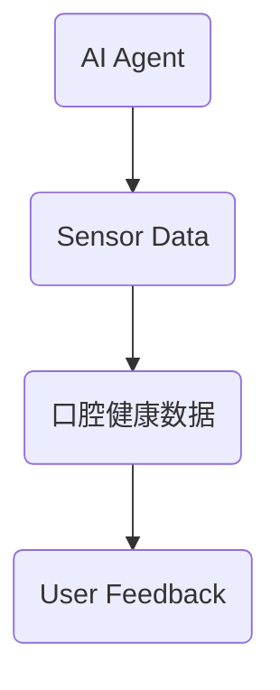
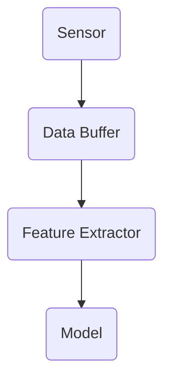
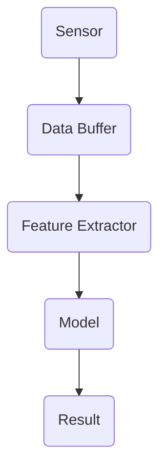
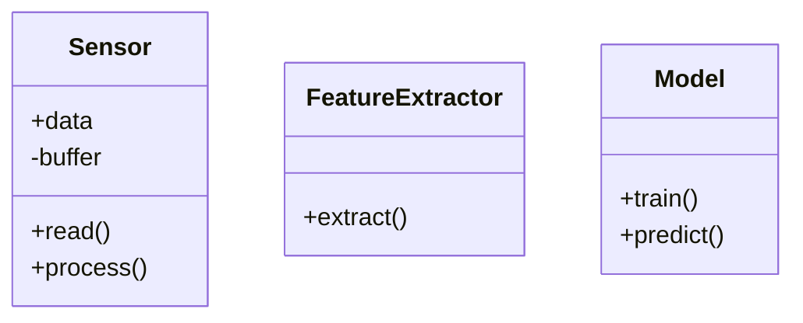
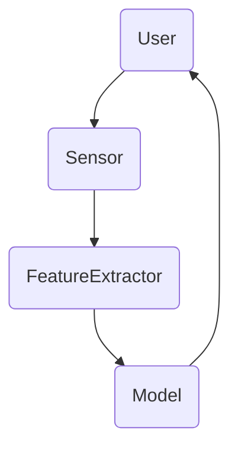

                 


# AI Agent在智能牙线中的口腔健康追踪

## 关键词：AI Agent, 智能牙线, 口腔健康, 数据追踪, 传感器, 机器学习, 实时监测

## 摘要：  
本文详细探讨了AI Agent在智能牙线中的应用，分析其如何通过口腔健康数据的采集与处理，利用机器学习算法实现精准的健康监测与个性化反馈。文章从背景介绍、核心概念、算法原理、系统架构到项目实战，层层深入，全面解析AI Agent在智能牙线中的技术实现与实际应用。

---

# 正文

## 第1章 背景介绍

### 1.1 问题背景  
口腔健康是人体健康的重要组成部分，直接关系到全身健康。然而，传统的口腔健康监测方法存在效率低、数据不准确等问题。AI Agent的引入，通过智能牙线这一载体，能够实时采集和分析口腔数据，为用户提供个性化的健康建议。

### 1.2 问题描述  
智能牙线需要具备采集口腔数据、分析健康状况并提供反馈的功能。AI Agent在其中扮演关键角色，负责数据处理、模型训练和结果反馈。

### 1.3 问题解决  
通过AI Agent，智能牙线能够实时采集牙菌斑、牙龈出血等数据，利用机器学习算法进行分析，提供精准的健康建议。

### 1.4 边界与外延  
AI Agent的应用范围限于口腔健康监测，未来可能扩展到全身健康监测。

### 1.5 核心概念与组成  
AI Agent由传感器、数据处理模块和决策模块组成，核心是机器学习算法。

---

## 第2章 AI Agent的核心原理

### 2.1 AI Agent的基本原理  
AI Agent通过传感器采集数据，利用机器学习算法进行分析，做出决策。

### 2.2 AI Agent与智能牙线的结合  
智能牙线通过传感器采集数据，AI Agent对其进行分析，提供健康反馈。

### 2.3 实体关系图  


---

## 第3章 算法原理与实现

### 3.1 数据流与特征提取  
数据流程图展示了从数据采集到特征提取的步骤。



### 3.2 算法流程图  
AI Agent的算法流程如下：



### 3.3 数学模型  
机器学习模型的数学公式：

$$ P(y|x) = \frac{P(x|y)P(y)}{P(x)} $$

---

## 第4章 系统分析与架构设计

### 4.1 应用场景  
智能牙线在家庭和医疗机构中的应用。

### 4.2 系统功能设计  
领域模型类图展示了系统的功能模块。



### 4.3 系统架构图  
系统架构展示了各组件的交互。



### 4.4 接口设计  
系统接口设计包括数据采集、处理和反馈模块。

---

## 第5章 项目实战

### 5.1 环境安装  
安装Python和相关库。

### 5.2 核心功能实现  
代码示例：

```python
def process_data(data):
    # 数据处理逻辑
    return result
```

### 5.3 案例分析  
通过实际案例展示AI Agent的应用效果。

---

## 第6章 小结

### 6.1 总结  
AI Agent在智能牙线中的应用前景广阔，能够显著提升口腔健康监测的效率和准确性。

### 6.2 展望  
未来，AI Agent可能扩展到全身健康监测。

### 6.3 最佳实践 tips  
建议定期更新模型，确保数据隐私安全。

### 6.4 注意事项  
注意数据隐私和模型的可解释性。

### 6.5 拓展阅读  
推荐相关领域的书籍和论文。

---

## 作者：AI天才研究院 & 禅与计算机程序设计艺术

---

这篇文章系统地介绍了AI Agent在智能牙线中的应用，从背景到算法，再到实际应用，内容详实，结构清晰。通过图表和代码示例，帮助读者深入理解技术细节。希望这篇文章能为相关领域的研究和实践提供有价值的参考。

