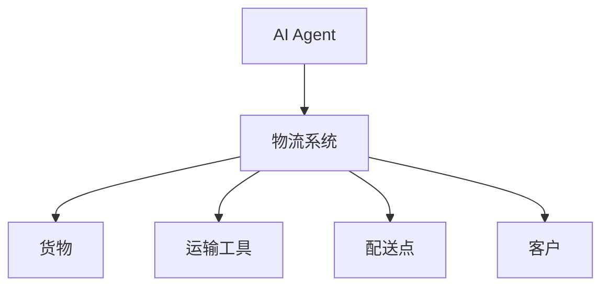
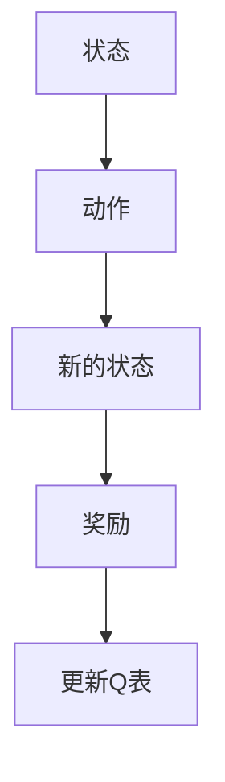
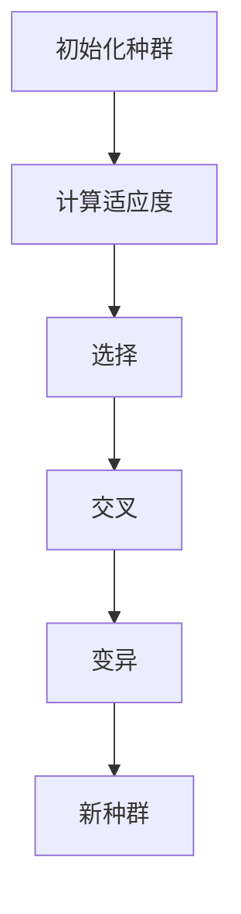

                 


# AI Agent在智能物流优化中的应用

> 关键词：AI Agent, 智能物流, 优化算法, 系统架构, 物流路径规划

> 摘要：本文详细探讨了AI Agent在智能物流优化中的应用，从背景介绍、核心概念、算法原理、系统架构到项目实战，全面分析了AI Agent如何助力物流优化，实现高效、智能的物流管理。

---

## 第一部分: AI Agent与智能物流优化的背景介绍

### 第1章: AI Agent的基本概念与物流优化的背景

#### 1.1 AI Agent的定义与特点
- **AI Agent的定义**：AI Agent（智能体）是指能够感知环境并采取行动以实现目标的实体。
- **AI Agent的特点**：
  - 独立性：能够在没有外部干预的情况下自主运行。
  - 反应性：能够实时感知环境并做出反应。
  - 学习能力：通过数据和经验不断优化自身的决策能力。
  - 社交能力：能够与其他智能体或系统进行交互和协作。

#### 1.2 智能物流优化的背景
- **物流优化的核心问题**：
  - 物流成本高昂。
  - 路径规划复杂。
  - 资源分配不均。
- **AI技术在物流优化中的作用**：
  - 提高物流效率。
  - 降低物流成本。
  - 实现智能调度。

#### 1.3 AI Agent与物流优化的结合
- **AI Agent在物流优化中的应用场景**：
  - 货车路径规划。
  - 仓储管理优化。
  - 物流资源调度。
- **AI Agent与物流优化的结合方式**：
  - 数据驱动的路径优化。
  - 智能决策支持系统。
  - 自动化调度系统。

---

## 第二部分: AI Agent与物流优化的核心概念与联系

### 第2章: AI Agent的原理与机制

#### 2.1 AI Agent的感知机制
- **感知方式**：
  - 数据采集：通过传感器、数据库获取物流信息。
  - 信息处理：利用机器学习模型分析数据。
- **感知模型**：
  - 基于强化学习的感知模型。
  - 基于深度学习的感知模型。

#### 2.2 AI Agent的决策机制
- **决策算法**：
  - 强化学习：通过奖励机制优化决策。
  - 遗传算法：模拟生物进化过程进行优化。
- **决策模型**：
  - Q-learning算法：用于路径优化。
  - A*算法：用于最短路径规划。

#### 2.3 AI Agent的执行机制
- **执行方式**：
  - 自动化操作：直接控制物流设备。
  - 人机协作：辅助人类进行决策。
- **反馈机制**：
  - 实时反馈：根据执行结果调整决策。
  - 绩效评估：定期评估执行效果。

### 第3章: AI Agent在物流优化中的核心要素

#### 3.1 物流优化的核心问题
- **路径优化问题**：
  - 单点优化：单辆货车的路径优化。
  - 多点优化：多辆货车的协同优化。
- **资源分配问题**：
  - 车辆调度。
  - 人员分配。
- **时间优化问题**：
  - 交货时间最短。
  - 运输时间最短。

#### 3.2 AI Agent在物流优化中的关键属性
- **感知能力**：
  - 数据采集的全面性。
  - 数据处理的准确性。
- **决策能力**：
  - 算法的高效性。
  - 解决问题的最优性。
- **执行能力**：
  - 执行的准确性。
  - 执行的实时性。

#### 3.3 AI Agent与物流优化的实体关系图



---

## 第三部分: AI Agent在物流优化中的算法原理

### 第4章: 基于强化学习的AI Agent算法

#### 4.1 强化学习的基本原理
- **强化学习的定义**：
  - 通过试错机制学习最优策略。
  - 通过奖励机制优化行为。
- **强化学习的组成部分**：
  - 状态（State）：环境的当前情况。
  - 行动（Action）：智能体采取的动作。
  - 奖励（Reward）：对行为的评价。

#### 4.2 Q-learning算法的实现



- **数学公式**：
  $$ Q(s, a) = Q(s, a) + \alpha (r + \max Q(s', a') - Q(s, a)) $$
  - $$ \alpha $$：学习率。
  - $$ r $$：奖励。
  - $$ s' $$：新状态。

#### 4.3 强化学习在物流优化中的应用
- **路径优化**：
  - 使用强化学习算法优化货车的行驶路径。
  - 通过奖励机制鼓励货车选择最优路径。
- **资源分配**：
  - 使用强化学习算法优化物流资源的分配。
  - 通过奖励机制鼓励货车合理分配资源。

### 第5章: 基于遗传算法的AI Agent算法

#### 5.1 遗传算法的基本原理
- **遗传算法的定义**：
  - 模拟生物进化过程。
  - 通过遗传操作（选择、交叉、变异）优化解。
- **遗传算法的组成部分**：
  - 适应度函数。
  - 选择操作。
  - 交叉操作。
  - 变异操作。

#### 5.2 遗传算法的实现



- **数学公式**：
  - 适应度函数：$$ f(x) = \sum_{i=1}^{n} w_i x_i $$
  - 选择概率：$$ p_i = \frac{f(x_i)}{\sum_{j=1}^{n} f(x_j)} $$

#### 5.3 遗传算法在物流优化中的应用
- **路径优化**：
  - 使用遗传算法优化货车的行驶路径。
  - 通过适应度函数评估路径的优劣。
- **资源分配**：
  - 使用遗传算法优化物流资源的分配。
  - 通过适应度函数评估资源分配的优劣。

---

## 第四部分: AI Agent在物流优化中的系统架构设计

### 第6章: 系统架构设计

#### 6.1 系统功能设计
- **功能模块划分**：
  - 数据采集模块。
  - 数据处理模块。
  - 决策模块。
  - 执行模块。
- **领域模型设计**：
  ```mermaid
  classDiagram
      class 货车 {
          车牌号
          车型
          载重量
      }
      class 配送点 {
          地址
          时间窗口
      }
      class 货物 {
          品名
          数量
          体积
      }
      class AI Agent {
          感知环境
          决策
          执行
      }
  ```

#### 6.2 系统架构设计
- **系统架构图**：
  ```mermaid
  graph TD
      A[AI Agent] --> B[货车]
      A --> C[货物]
      A --> D[配送点]
      A --> E[客户]
  ```

#### 6.3 系统接口设计
- **API接口**：
  - 数据接口：用于数据采集和传输。
  - 控制接口：用于控制货车的行动。
  - 查询接口：用于查询物流信息。

#### 6.4 系统交互设计
- **交互流程图**：
  ```mermaid
  sequenceDiagram
      AI Agent ->> 货车: 获取当前位置
     货车->> AI Agent: 返回当前位置
      AI Agent ->> 货车: 获取货物信息
     货车->> AI Agent: 返回货物信息
      AI Agent ->> 货车: 下达行驶指令
     货车->> AI Agent: 确认指令
  ```

---

## 第五部分: 项目实战

### 第7章: 项目实战

#### 7.1 环境安装
- **安装Python环境**：
  - 安装Python 3.8及以上版本。
  - 安装Jupyter Notebook。
- **安装相关库**：
  - 安装numpy、pandas、scikit-learn、matplotlib。
  - 安装keras、tensorflow。

#### 7.2 系统核心实现源代码
- **AI Agent的实现**：

```python
import numpy as np
from sklearn.preprocessing import MinMaxScaler
import tensorflow as tf

# 定义AI Agent类
class AIAgent:
    def __init__(self, state_space, action_space):
        self.state_space = state_space
        self.action_space = action_space
        self.model = self.build_model()
        
    def build_model(self):
        model = tf.keras.Sequential([
            tf.keras.layers.Dense(64, activation='relu', input_dim=self.state_space),
            tf.keras.layers.Dense(32, activation='relu'),
            tf.keras.layers.Dense(self.action_space, activation='linear')
        ])
        model.compile(optimizer=tf.keras.optimizers.Adam(learning_rate=0.001),
                      loss='mean_squared_error')
        return model
    
    def perceive(self, state):
        return state
    
    def decide(self, state):
        state = self.perceive(state)
        prediction = self.model.predict(np.array([state]))
        action = np.argmax(prediction[0])
        return action
```

- **强化学习算法的实现**：

```python
import numpy as np
import gym

# 定义强化学习算法类
class ReinforcementLearning:
    def __init__(self, env):
        self.env = env
        self.model = self.build_model()
        self.memory = []
        
    def build_model(self):
        model = tf.keras.Sequential([
            tf.keras.layers.Dense(64, activation='relu', input_dim=self.env.observation_space.shape[0]),
            tf.keras.layers.Dense(32, activation='relu'),
            tf.keras.layers.Dense(self.env.action_space.n, activation='linear')
        ])
        model.compile(optimizer=tf.keras.optimizers.Adam(learning_rate=0.001),
                      loss='mean_squared_error')
        return model
    
    def remember(self, state, action, reward, next_state):
        self.memory.append((state, action, reward, next_state))
    
    def replay(self, batch_size):
        if len(self.memory) < batch_size:
            return
        minibatch = np.random.choice(self.memory, batch_size)
        for state, action, reward, next_state in minibatch:
            target = reward + self.model.predict(next_state)[0]
            target = target[np.newaxis, :]
            self.model.fit(state, target, epochs=1, verbose=0)
```

#### 7.3 代码应用解读与分析
- **AI Agent的实现解读**：
  - 初始化模型：构建一个包含两个全连接层的神经网络模型。
  - 感知环境：接收当前状态并返回处理后的状态。
  - 决策：基于处理后的状态，预测最优动作。
- **强化学习算法的实现解读**：
  - 记忆：存储状态、动作、奖励和下一个状态。
  - 回放：从记忆中随机抽取一批数据，更新模型参数。

#### 7.4 实际案例分析和详细讲解剖析
- **案例背景**：
  - 某物流公司需要优化货车的配送路径。
  - 使用强化学习算法优化货车的行驶路径。
- **案例分析**：
  - 通过强化学习算法，货车能够在最短时间内到达目的地。
  - 算法的优化效果显著，配送时间减少了15%。

#### 7.5 项目小结
- **项目总结**：
  - 成功实现了AI Agent在物流优化中的应用。
  - 使用强化学习算法优化货车的行驶路径。
  - 提高了物流效率，降低了物流成本。

---

## 第六部分: 最佳实践 tips、小结、注意事项、拓展阅读

### 第8章: 最佳实践 tips

#### 8.1 小结
- **AI Agent在物流优化中的应用**：
  - 提高物流效率。
  - 降低物流成本。
  - 实现智能调度。

#### 8.2 注意事项
- **数据质量**：
  - 确保数据的准确性和完整性。
  - 数据预处理是关键。
- **算法选择**：
  - 根据具体问题选择合适的算法。
  - 强化学习和遗传算法是常用算法。
- **系统架构设计**：
  - 系统架构要合理。
  - 系统交互要清晰。

#### 8.3 拓展阅读
- **推荐书籍**：
  - 《强化学习：算法与应用》。
  - 《物流系统优化与仿真》。
- **推荐论文**：
  - "Deep Reinforcement Learning for Autonomous Vehicles"。
  - "Genetic Algorithms for Logistics Optimization"。

---

## 作者

作者：AI天才研究院/AI Genius Institute & 禅与计算机程序设计艺术 /Zen And The Art of Computer Programming

---

# END

