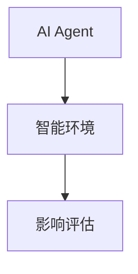
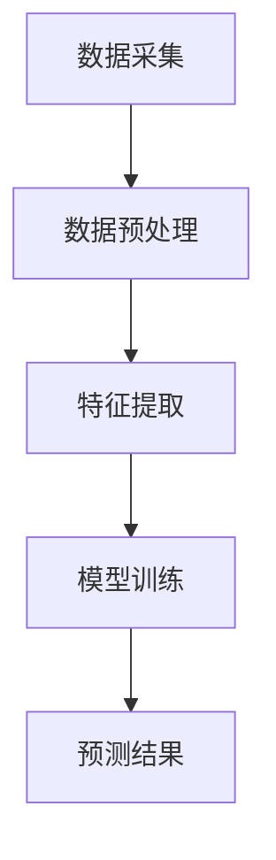
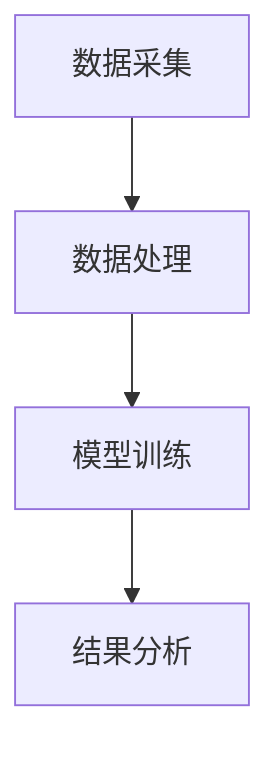
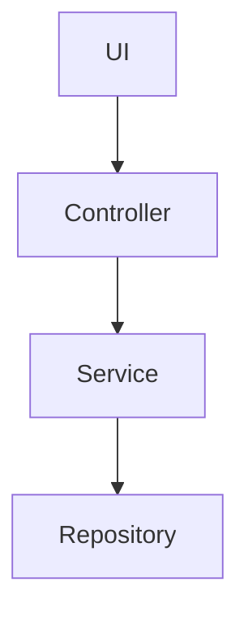
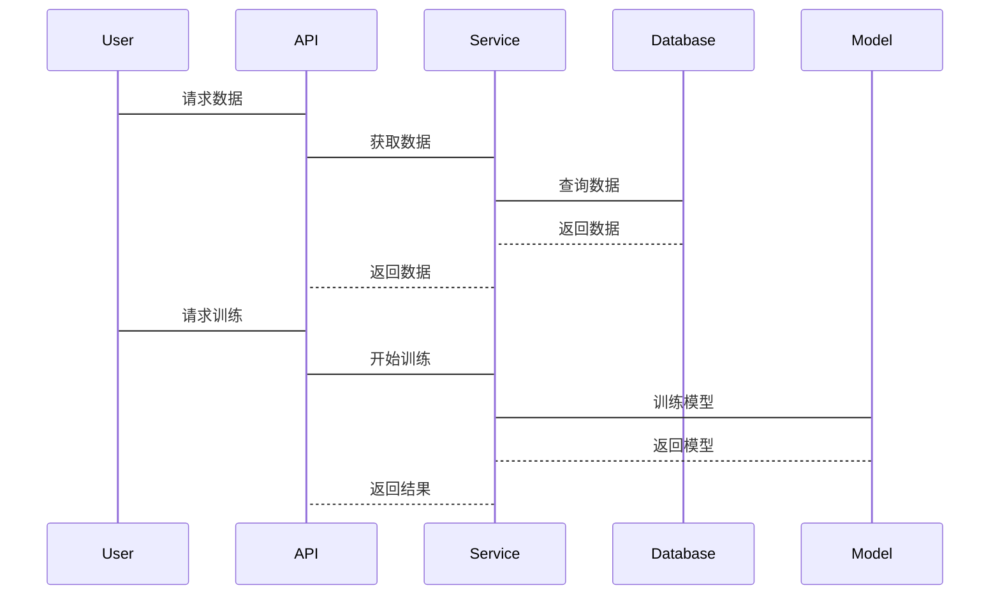

                 


# AI Agent在智能环境影响评估中的实践

## 关键词
AI Agent, 智能环境, 影响评估, 算法原理, 系统架构

## 摘要
本文深入探讨了AI Agent在智能环境影响评估中的应用实践。通过背景介绍、核心概念分析、算法原理解析、系统架构设计、项目实战和最佳实践等部分，系统阐述了AI Agent如何助力智能环境影响评估。文章结合理论与实践，配以丰富的图表和代码示例，为读者提供全面的技术指导。

---

# 第一部分: AI Agent与智能环境影响评估背景介绍

## 第1章: AI Agent的基本概念

### 1.1 AI Agent的定义与特点

#### 1.1.1 AI Agent的定义
AI Agent（人工智能代理）是一种智能实体，能够感知环境、自主决策并执行任务。它可以分为简单反射型、基于模型的反射型、目标驱动型和效用驱动型四种类型。

#### 1.1.2 AI Agent的核心特点
- **自主性**：无需外部干预，自主完成任务。
- **反应性**：实时感知环境并做出反应。
- **目标导向性**：基于目标驱动行为。
- **学习能力**：通过经验改进性能。

#### 1.1.3 AI Agent与传统AI的区别
| 特性 | AI Agent | 传统AI |
|------|-----------|---------|
| 自主性 | 高 | 低 |
| 反应性 | 强 | 弱 |
| 目标导向性 | 高 | 中 |

### 1.2 智能环境的基本概念

#### 1.2.1 智能环境的定义
智能环境是能够感知并适应用户需求的环境，通过传感器和执行器与用户交互，提供智能化服务。

#### 1.2.2 智能环境的组成要素
- **传感器**：感知环境数据。
- **执行器**：执行操作。
- **处理器**：处理数据并做出决策。
- **通信模块**：与其他系统交互。

#### 1.2.3 智能环境的分类
- **家居环境**：智能家居设备。
- **工作环境**：智能办公室。
- **公共环境**：智能城市设施。

### 1.3 AI Agent在智能环境影响评估中的应用

#### 1.3.1 数据采集与处理
AI Agent通过传感器收集环境数据，进行清洗和特征提取。

#### 1.3.2 模型构建与分析
基于机器学习模型，分析环境数据，评估影响。

#### 1.3.3 结果解释与反馈
将分析结果解释为可操作的反馈，优化环境性能。

---

## 第2章: 智能环境影响评估的背景

### 2.1 智能环境影响评估的定义
智能环境影响评估是通过AI Agent分析环境数据，评估环境对用户或系统的影响。

### 2.2 智能环境影响评估的背景与意义
- **背景**：智能环境的普及带来了复杂的影响评估需求。
- **意义**：通过AI Agent实现高效、精准的影响评估。

### 2.3 问题背景与问题描述

#### 2.3.1 智能环境中的主要问题
- 数据复杂性。
- 影响因素多样性。
- 评估结果的不确定性。

#### 2.3.2 智能环境影响评估的核心问题
- 如何高效采集和处理环境数据。
- 如何构建准确的影响评估模型。

---

## 第3章: AI Agent在智能环境影响评估中的应用

### 3.1 AI Agent在影响评估中的作用

#### 3.1.1 数据采集与处理
AI Agent通过传感器实时采集环境数据，并进行预处理。

#### 3.1.2 模型构建与分析
基于机器学习算法，构建影响评估模型，分析环境数据。

#### 3.1.3 结果解释与反馈
将分析结果转化为用户可理解的反馈，优化环境配置。

### 3.2 AI Agent与智能环境影响评估的关系

#### 3.2.1 AI Agent作为工具的作用
AI Agent提供数据采集、分析和优化功能，支持影响评估过程。

#### 3.2.2 AI Agent作为主体的可能
AI Agent可能在未来成为影响评估的主体，自主完成评估任务。

### 3.3 AI Agent在智能环境影响评估中的边界与外延

#### 3.3.1 AI Agent的适用范围
适用于数据驱动的环境影响评估任务。

#### 3.3.2 AI Agent的局限性
依赖数据质量和模型准确性。

#### 3.3.3 智能环境影响评估的其他方法
结合专家知识和模拟技术，提高评估精度。

---

## 第4章: 核心概念与联系

### 4.1 核心概念原理

#### 4.1.1 AI Agent的核心原理
AI Agent通过感知环境、决策并执行操作，实现影响评估。

#### 4.1.2 智能环境影响评估的原理
通过数据采集、模型构建和结果分析，评估环境影响。

#### 4.1.3 两者结合的机制
AI Agent作为工具，支持智能环境影响评估的全过程。

### 4.2 核心概念属性特征对比

| 特性 | AI Agent | 智能环境影响评估 |
|------|-----------|-------------------|
| 数据驱动 | 高 | 高 |
| 实时性 | 高 | 中 |
| 可解释性 | 低 | 高 |

### 4.3 概念结构与核心要素组成

#### 4.3.1 概念结构


#### 4.3.2 ER实体关系图
```mermaid
erd
    客体
    项目
    实体
```

---

## 第5章: 算法原理讲解

### 5.1 算法原理概述

#### 5.1.1 算法原理
影响评估算法基于机器学习模型，通过特征提取和模型训练，预测环境影响。

#### 5.1.2 算法流程


#### 5.1.3 数学模型
$$
y = f(x) + \epsilon
$$
其中，\(x\)是输入特征，\(y\)是输出结果，\(\epsilon\)是误差项。

### 5.2 算法实现

#### 5.2.1 数据预处理
```python
import pandas as pd
data = pd.read_csv('environment_data.csv')
data.dropna(inplace=True)
```

#### 5.2.2 特征提取
```python
from sklearn.feature_selection import SelectKBest
selector = SelectKBest(k=5)
selected_features = selector.fit_transform(data, labels)
```

#### 5.2.3 模型训练
```python
from sklearn.ensemble import RandomForestClassifier
model = RandomForestClassifier()
model.fit(selected_features, labels)
```

#### 5.2.4 结果解释
```python
importances = model.feature_importances_
print(importances)
```

---

## 第6章: 系统分析与架构设计

### 6.1 系统功能设计

#### 6.1.1 功能模块
- 数据采集模块
- 数据处理模块
- 模型训练模块
- 结果分析模块

#### 6.1.2 功能流程


### 6.2 系统架构设计

#### 6.2.1 架构类型
- 分层架构：数据层、业务逻辑层、表现层。

#### 6.2.2 系统架构图


### 6.3 系统接口设计

#### 6.3.1 接口定义
- 数据采集接口：`GET /api/data`
- 模型训练接口：`POST /api/train`

#### 6.3.2 交互流程


---

## 第7章: 项目实战

### 7.1 环境安装

#### 7.1.1 安装Python
```bash
python --version
```

#### 7.1.2 安装依赖
```bash
pip install numpy pandas scikit-learn
```

### 7.2 系统核心实现

#### 7.2.1 数据预处理
```python
import pandas as pd
data = pd.read_csv('environment.csv')
```

#### 7.2.2 模型训练
```python
from sklearn.ensemble import RandomForestClassifier
model = RandomForestClassifier()
model.fit(X_train, y_train)
```

#### 7.2.3 结果分析
```python
importances = model.feature_importances_
print(importances)
```

### 7.3 代码解读与分析

#### 7.3.1 核心代码
```python
def train_model(X, y):
    model = RandomForestClassifier()
    model.fit(X, y)
    return model
```

### 7.4 案例分析

#### 7.4.1 案例背景
评估某智能建筑的能源消耗影响。

#### 7.4.2 数据分析
```python
importances = model.feature_importances_
print(importances)
```

#### 7.4.3 结果解读
能源消耗主要受温度和设备使用情况影响。

### 7.5 项目小结

#### 7.5.1 项目总结
通过AI Agent实现智能环境影响评估，提高了评估效率和准确性。

#### 7.5.2 经验总结
- 数据质量对模型性能影响大。
- 模型选择需根据具体场景调整。

---

## 第8章: 最佳实践

### 8.1 小结

#### 8.1.1 核心内容总结
AI Agent在智能环境影响评估中的应用价值巨大。

### 8.2 注意事项

#### 8.2.1 数据安全
确保数据处理过程中的安全性。

#### 8.2.2 模型解释性
提高模型的可解释性，便于用户理解。

### 8.3 拓展阅读

#### 8.3.1 推荐书籍
- 《机器学习实战》
- 《人工智能：一种现代的方法》

#### 8.3.2 在线资源
- 官方文档：[scikit-learn](https://scikit-learn.org/)
- 课程推荐：[Coursera AI课程](https://www.coursera.org/)

---

## 作者
作者：AI天才研究院 & 禅与计算机程序设计艺术

