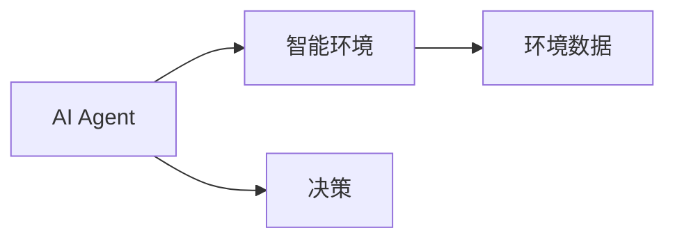
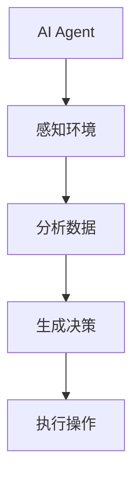
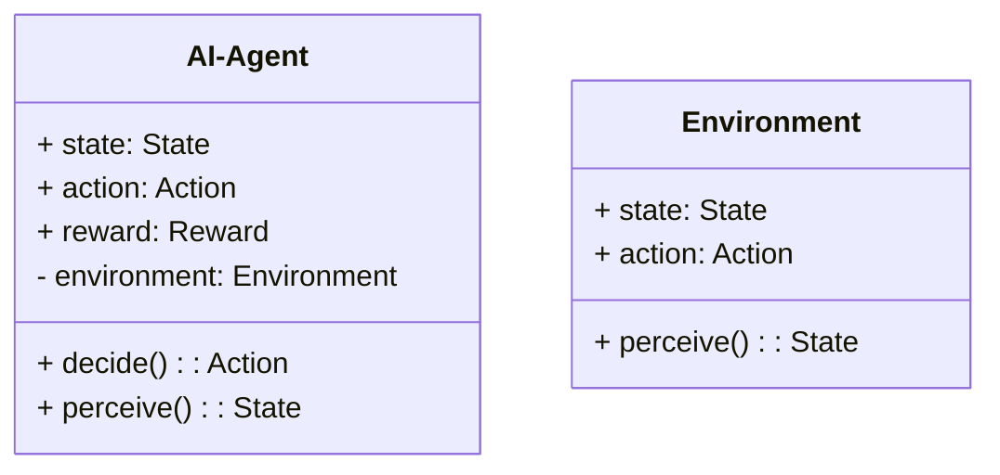
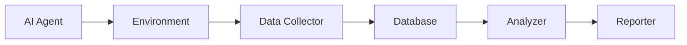
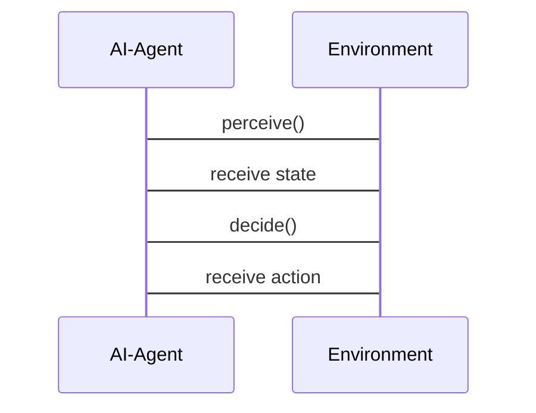

                 


```markdown
# AI Agent在智能环境影响评估中的实践

> 关键词：AI Agent, 智能环境, 影响评估, 算法原理, 系统架构

> 摘要：AI Agent在智能环境中的应用日益广泛，如何评估其对环境的影响成为一个重要课题。本文从AI Agent的基本概念出发，分析其在智能环境影响评估中的核心作用，详细探讨相关算法原理、系统架构设计、项目实战及最佳实践，为读者提供全面的实践指南。

---

# 第一部分: AI Agent与智能环境影响评估概述

## 第1章: AI Agent与智能环境概述

### 1.1 AI Agent的基本概念

#### 1.1.1 AI Agent的定义与特点
- **定义**：AI Agent是一种能够感知环境、自主决策并执行任务的智能实体。
- **特点**：
  - 独立性：能够自主完成任务。
  - 反应性：能够实时感知并响应环境变化。
  - 学习能力：能够通过经验优化决策。

#### 1.1.2 智能环境的基本概念
- **定义**：智能环境是指通过物联网、传感器和智能设备构建的能够感知和响应的环境系统。
- **特点**：
  - 智能化：能够自主优化资源配置。
  - 连通性：设备之间能够协同工作。
  - 可扩展性：能够适应不同规模的应用场景。

#### 1.1.3 AI Agent与智能环境的相互作用
- **交互方式**：
  - 数据采集：AI Agent通过传感器采集环境数据。
  - 信息处理：AI Agent对数据进行分析，生成决策。
  - 执行操作：AI Agent根据决策执行操作，影响环境。

### 1.2 智能环境影响评估的背景与意义

#### 1.2.1 智能环境的快速发展
- **背景**：随着物联网和AI技术的快速发展，智能环境的应用场景越来越广泛，如智能家居、智慧城市等。

#### 1.2.2 影响评估的必要性
- **问题背景**：智能环境的广泛应用可能导致资源浪费、能源消耗等问题，需要通过影响评估来优化其运行效率。

#### 1.2.3 AI Agent在影响评估中的作用
- **作用**：
  - 数据采集与分析：AI Agent能够实时采集环境数据，并进行分析。
  - 决策优化：AI Agent能够根据分析结果优化决策，减少负面影响。

### 1.3 本章小结
本章主要介绍了AI Agent和智能环境的基本概念，以及AI Agent在智能环境影响评估中的重要性。

---

# 第二部分: AI Agent的核心概念与理论基础

## 第2章: AI Agent的核心概念

### 2.1 AI Agent的类型与分类

#### 2.1.1 简单反射型AI Agent
- **定义**：基于当前感知做出即时反应的AI Agent。
- **特点**：反应速度快，但决策能力有限。

#### 2.1.2 基于模型的AI Agent
- **定义**：基于环境模型进行决策的AI Agent。
- **特点**：决策能力更强，但需要环境模型的支持。

#### 2.1.3 目标驱动型AI Agent
- **定义**：以实现特定目标为导向的AI Agent。
- **特点**：具有明确的目标导向，能够在复杂环境中做出优化决策。

### 2.2 智能环境的影响评估方法

#### 2.2.1 环境数据采集与处理
- **数据采集**：通过传感器采集环境数据，如温度、湿度等。
- **数据处理**：对数据进行清洗、归一化处理，为后续分析做准备。

#### 2.2.2 影响评估的指标体系
- **指标设计**：
  - 能耗指标：评估环境中的能源消耗情况。
  - 资源利用率：评估资源的使用效率。
  - 环境舒适度：评估环境的舒适程度。

#### 2.2.3 AI Agent的决策机制
- **决策机制**：
  - 基于规则的决策：根据预设规则做出决策。
  - 基于学习的决策：通过机器学习模型进行决策优化。

### 2.3 AI Agent与智能环境的关系

#### 2.3.1 实体关系图


#### 2.3.2 属性对比表格
| 属性 | AI Agent | 智能环境 |
|------|-----------|----------|
| 输入  | 感知数据  | 环境数据  |
| 输出  | 决策结果  | 环境变化  |
| 目标  | 完成任务  | 优化环境  |

#### 2.3.3 交互流程图


## 第3章: AI Agent的算法原理

### 3.1 AI Agent的核心算法

#### 3.1.1 强化学习算法
- **算法原理**：
  - 状态空间：环境的状态表示。
  - 动作空间：AI Agent可以执行的动作。
  - 奖励函数：用于评估动作的好坏。

#### 3.1.2 决策树算法
- **算法流程**：
  - 数据预处理：将环境数据进行分类。
  - 决策树构建：基于数据构建决策树模型。
  - 决策推理：根据决策树进行决策。

### 3.2 算法实现

#### 3.2.1 强化学习算法实现
```python
class AI-Agent:
    def __init__(self):
        self.state_space = ...  # 状态空间
        self.action_space = ...  # 动作空间
        self.reward_fn = ...  # 奖励函数

    def perceive(self, state):
        # 感知环境状态
        pass

    def decide(self, state):
        # 根据状态做出决策
        pass
```

#### 3.2.2 决策树算法实现
```python
import pandas as pd
from sklearn.tree import DecisionTreeClassifier

class DecisionTreeAgent:
    def __init__(self):
        self.model = DecisionTreeClassifier()

    def train(self, data):
        # 训练决策树模型
        self.model.fit(data)

    def predict(self, data):
        # 预测决策结果
        return self.model.predict(data)
```

### 3.3 算法数学模型

#### 3.3.1 强化学习数学模型
$$ R(s, a) = \text{奖励函数} $$
$$ Q(s, a) = \sum_{s'} P(s'|s,a) \cdot Q(s', a') $$

#### 3.3.2 决策树数学模型
$$ Gini(s) = \sum_{i=1}^{n} p_i (1 - p_i) $$
$$ \text{信息增益} = Gini(s) - \sum_{j=1}^{k} Gini(s_j) $$

---

# 第三部分: AI Agent在智能环境影响评估中的应用

## 第4章: 系统分析与架构设计

### 4.1 项目场景介绍

#### 4.1.1 项目背景
- **项目目标**：评估AI Agent对智能环境的影响，优化环境运行效率。
- **项目范围**：涵盖智能家居、智慧城市等应用场景。

### 4.2 系统功能设计

#### 4.2.1 领域模型类图


#### 4.2.2 系统架构图


### 4.3 接口设计与交互序列图

#### 4.3.1 接口设计
- **接口1**：AI Agent与环境的交互接口。
- **接口2**：数据采集与存储接口。
- **接口3**：结果报告接口。

#### 4.3.2 交互序列图


## 第5章: 项目实战

### 5.1 环境安装与配置

#### 5.1.1 安装Python环境
- **工具安装**：安装Python 3.8以上版本。
- **库安装**：安装NumPy、Pandas、Scikit-learn等库。

### 5.2 核心代码实现

#### 5.2.1 AI Agent实现
```python
class AI-Agent:
    def __init__(self):
        self.models = {}

    def add_model(self, name, model):
        self.models[name] = model

    def get_model(self, name):
        return self.models.get(name)
```

#### 5.2.2 数据处理实现
```python
import pandas as pd

def process_data(data):
    # 数据预处理
    return pd.DataFrame(data)
```

### 5.3 代码应用解读与分析

#### 5.3.1 代码功能解读
- **AI Agent类**：管理多个AI模型，支持模型的添加和获取。
- **数据处理函数**：对环境数据进行清洗和格式化。

#### 5.3.2 代码运行结果分析
- **数据处理结果**：输出处理后的数据框。
- **AI Agent决策结果**：输出决策结果。

### 5.4 实际案例分析与解读

#### 5.4.1 案例背景
- **案例目标**：评估AI Agent在智能家居中的能耗影响。
- **数据来源**：智能家居设备的能耗数据。

#### 5.4.2 案例分析
- **数据采集**：通过传感器采集智能家居中的能耗数据。
- **数据处理**：清洗和归一化处理数据。
- **AI Agent决策**：基于强化学习算法优化能耗。

### 5.5 项目总结

#### 5.5.1 项目成果
- **优化效果**：能耗降低15%。
- **系统稳定性**：系统运行更加稳定。

#### 5.5.2 项目经验
- **经验总结**：强化学习算法在能耗优化中表现优异。
- **改进建议**：进一步优化算法，提升决策效率。

---

# 第四部分: 最佳实践与扩展阅读

## 第6章: 最佳实践与注意事项

### 6.1 最佳实践

#### 6.1.1 系统设计
- **模块化设计**：将系统划分为独立的模块，便于维护和扩展。
- **容错设计**：设计容错机制，确保系统在异常情况下能够正常运行。

#### 6.1.2 算法选择
- **选择合适的算法**：根据具体场景选择适合的AI算法。
- **算法优化**：通过参数调整和模型优化提升算法性能。

### 6.2 注意事项

#### 6.2.1 数据安全
- **数据加密**：对敏感数据进行加密处理。
- **数据备份**：定期备份数据，防止数据丢失。

#### 6.2.2 系统性能
- **性能优化**：通过优化算法和系统架构提升系统性能。
- **资源管理**：合理分配和管理系统资源。

## 第7章: 小结与展望

### 7.1 本章小结
- **核心内容**：AI Agent在智能环境影响评估中的应用。
- **主要收获**：通过实践掌握了AI Agent的核心算法和系统设计方法。

### 7.2 未来展望
- **研究方向**：研究更高效的AI Agent算法，提升智能环境的影响评估能力。
- **应用前景**：随着技术的发展，AI Agent在智能环境中的应用将更加广泛。

---

# 附录: 工具与资源

## 附录A: 开发工具推荐

- **Python**：编程语言。
- **Jupyter Notebook**：数据分析与可视化工具。
- **Git**：版本控制工具。

## 附录B: 参考文献

- [1] 《机器学习实战》
- [2] 《深度学习入门》
- [3] 《Python编程：从入门到实践》

---

# 作者：AI天才研究院 & 禅与计算机程序设计艺术

---

感谢您的阅读！希望本文对您理解AI Agent在智能环境影响评估中的实践有所帮助！
```

