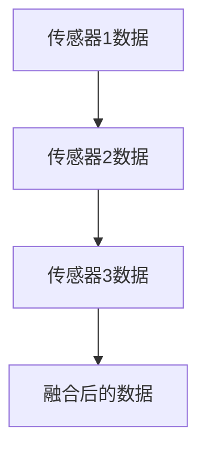
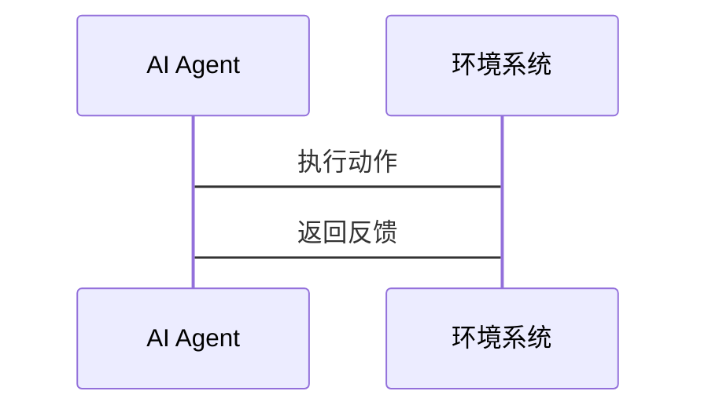
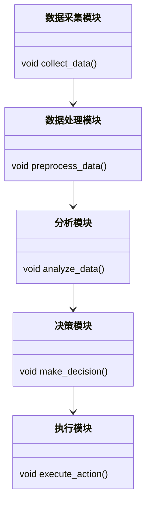
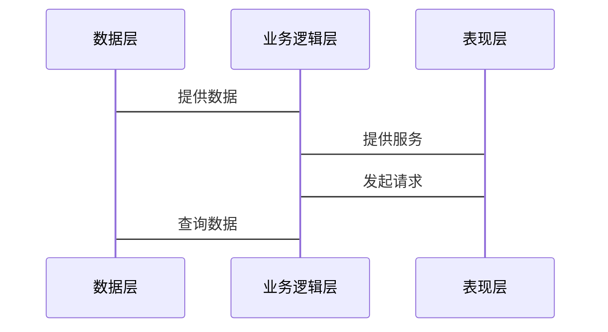

                 


# AI Agent在智能环境污染源追踪中的实践

## 关键词
AI Agent, 智能环境污染源追踪, 算法原理, 系统架构, 项目实战, 最佳实践

## 摘要
本文探讨了AI Agent在智能环境污染源追踪中的应用，从背景、核心概念、算法原理、系统架构到项目实战，详细介绍了如何利用AI技术实现高效的污染源追踪。文章结合理论与实践，通过实际案例分析和系统设计，展示了AI Agent在环境保护中的巨大潜力和实际价值。

---

# 第1章 AI Agent与智能环境污染源追踪概述

## 1.1 AI Agent的基本概念

### 1.1.1 AI Agent的定义与特点
AI Agent（人工智能代理）是一种能够感知环境、自主决策并执行任务的智能实体。其特点包括：
- **自主性**：无需外部干预，自主完成任务。
- **反应性**：能够实时感知环境变化并做出反应。
- **学习能力**：通过数据和经验不断优化自身性能。

### 1.1.2 AI Agent在环境监测中的应用
AI Agent在环境监测中的应用主要体现在：
- **实时数据采集与分析**：通过传感器网络实时采集环境数据，并利用机器学习算法进行分析。
- **污染源识别与定位**：基于AI算法，快速识别污染源并精确定位其位置。

### 1.1.3 智能环境污染源追踪的背景与意义
随着工业化进程的加快，环境污染问题日益严重，传统的污染源追踪方法效率低下，难以应对复杂的污染源追踪需求。AI Agent通过智能化手段，能够实时监测环境数据，分析污染物分布，辅助污染源追踪，为环境保护提供有力支持。

---

## 1.2 智能环境污染源追踪的定义与特点

### 1.2.1 污染源追踪的基本概念
污染源追踪是指通过技术手段，识别出污染物的来源、扩散路径及其影响范围的过程。其核心目标是快速、准确地找到污染源，为污染治理提供依据。

### 1.2.2 智能环境污染源追踪的核心要素
智能环境污染源追踪的核心要素包括：
- **实时监测**：通过传感器网络实时采集环境数据。
- **数据融合**：将多源数据进行融合，提高追踪精度。
- **智能分析**：利用AI算法快速分析数据，识别污染源。

### 1.2.3 AI Agent在污染源追踪中的作用
AI Agent在污染源追踪中的作用主要体现在：
- **数据采集与处理**：实时采集环境数据，并进行预处理。
- **智能分析与决策**：利用机器学习算法分析数据，识别污染源。
- **执行与反馈**：根据决策结果，执行相应的操作，并根据反馈不断优化追踪策略。

---

## 1.3 本章小结
本章介绍了AI Agent的基本概念及其在环境监测中的应用，并详细阐述了智能环境污染源追踪的定义、核心要素及其意义。通过本章内容，读者可以了解AI Agent在污染源追踪中的重要性及其潜在的应用价值。

---

# 第2章 AI Agent的核心技术

## 2.1 AI Agent的感知能力

### 2.1.1 数据采集与处理技术
AI Agent的感知能力主要依赖于数据采集与处理技术。通过传感器网络实时采集环境数据，并进行预处理，消除噪声，提取有用信息。

#### 代码示例
```python
import numpy as np

# 采集传感器数据
def collect_data(sensor_ids):
    data = []
    for id in sensor_ids:
        # 模拟传感器数据
        sensor_data = np.random.normal(0, 1, 100)
        data.append(sensor_data)
    return data

# 数据预处理
def preprocess_data(data):
    processed_data = []
    for d in data:
        # 去除异常值
        filtered = d[np.abs(d - np.mean(d)) < 2*np.std(d)]
        processed_data.append(filtered)
    return processed_data
```

### 2.1.2 多源数据融合技术
多源数据融合技术是指将来自不同传感器或数据源的数据进行融合，以提高感知精度。常用的方法包括加权融合和特征融合。

#### 图表


### 2.1.3 实时数据处理能力
AI Agent需要具备强大的实时数据处理能力，能够快速响应环境变化，及时做出决策。

---

## 2.2 AI Agent的决策能力

### 2.2.1 基于模型的决策算法
基于模型的决策算法通过建立数学模型，模拟环境变化，从而做出决策。常用的方法包括贝叶斯网络和马尔可夫链。

#### 数学模型
$$ P(A|B) = \frac{P(B|A)P(A)}{P(B)} $$

### 2.2.2 基于数据驱动的决策算法
基于数据驱动的决策算法通过机器学习模型，从历史数据中学习规律，从而做出决策。常用的方法包括随机森林和神经网络。

#### 代码示例
```python
from sklearn.ensemble import RandomForestClassifier

# 训练随机森林模型
def train_model(X_train, y_train):
    model = RandomForestClassifier(n_estimators=100)
    model.fit(X_train, y_train)
    return model

# 预测污染源
def predict_source(model, X_test):
    y_pred = model.predict(X_test)
    return y_pred
```

### 2.2.3 自适应决策机制
自适应决策机制是指AI Agent能够根据环境变化和反馈信息，动态调整决策策略，以提高决策的准确性和效率。

---

## 2.3 AI Agent的执行能力

### 2.3.1 动作规划与执行技术
动作规划与执行技术是指AI Agent根据决策结果，制定行动计划并执行。常用的方法包括基于规则的规划和基于强化学习的规划。

#### 图表


### 2.3.2 执行效果评估与反馈机制
执行效果评估与反馈机制是指AI Agent在执行动作后，评估执行效果，并根据反馈信息优化决策策略。

### 2.3.3 多Agent协作技术
多Agent协作技术是指多个AI Agent协同工作，共同完成复杂的任务。通过协作，可以提高系统的整体性能和效率。

---

## 2.4 本章小结
本章详细介绍了AI Agent的核心技术，包括感知能力、决策能力和执行能力。通过本章内容，读者可以了解AI Agent如何通过这些技术实现智能环境污染源追踪。

---

# 第3章 污染源追踪的算法原理与数学模型

## 3.1 污染源追踪的核心问题

### 3.1.1 污染源识别与定位
污染源识别与定位是污染源追踪的核心问题之一。通过传感器数据和数学模型，可以精确定位污染源的位置。

### 3.1.2 污染扩散模型
污染扩散模型是描述污染物在环境中的扩散过程的数学模型。常用的模型包括对流扩散模型和随机游走模型。

#### 数学模型
$$ \frac{\partial c}{\partial t} = D \frac{\partial^2 c}{\partial x^2} $$

### 3.1.3 数据关联与匹配
数据关联与匹配是指将多源数据进行关联，以提高污染源追踪的准确性。

---

## 3.2 基于模型的污染源追踪算法

### 3.2.1 模型建立与假设
基于模型的污染源追踪算法需要建立数学模型，并假设污染源的位置和扩散方式。

### 3.2.2 算法流程与步骤
基于模型的污染源追踪算法的流程包括数据输入、模型建立、求解和结果输出。

#### 代码示例
```python
import numpy as np

# 模拟污染扩散过程
def simulate_diffusion(x0, t_steps):
    x = np.linspace(0, 10, 100)
    c = np.zeros(len(x))
    c[x == x0] = 1
    for t in range(t_steps):
        c_new = np.zeros(len(x))
        for i in range(len(x)):
            c_new[i] = 0.5 * (c[i-1] + c[i+1])
        c = c_new
    return c
```

### 3.2.3 优缺点分析
基于模型的算法具有较高的准确性，但计算复杂度较高，难以应对大规模数据。

---

## 3.3 基于数据驱动的污染源追踪算法

### 3.3.1 数据采集与预处理
数据采集与预处理是基于数据驱动的算法的基础。需要采集多源数据，并进行清洗和特征提取。

### 3.3.2 数据特征提取与分类
数据特征提取与分类是基于数据驱动的算法的核心。通过特征提取，可以提高分类的准确性。

#### 代码示例
```python
from sklearn.svm import SVC

# 特征提取与分类
def feature_extraction(data):
    features = []
    for d in data:
        # 提取特征
        feature = [np.mean(d), np.std(d), np.max(d)]
        features.append(feature)
    return features

# 训练支持向量机模型
def train_classifier(X_train, y_train):
    model = SVC()
    model.fit(X_train, y_train)
    return model
```

### 3.3.3 机器学习模型训练与应用
机器学习模型训练与应用是基于数据驱动的算法的关键。通过训练模型，可以实现污染源的自动识别。

---

## 3.4 本章小结
本章详细介绍了污染源追踪的算法原理与数学模型，包括基于模型和基于数据驱动的算法。通过本章内容，读者可以了解不同算法的优缺点及其应用场景。

---

# 第4章 系统架构设计

## 4.1 系统总体架构

### 4.1.1 系统功能模块划分
系统功能模块包括数据采集模块、数据处理模块、分析模块、决策模块和执行模块。

### 4.1.2 系统数据流设计
系统数据流设计描述了数据在系统中的流动过程，包括数据采集、处理、分析、决策和执行。

### 4.1.3 系统性能指标
系统性能指标包括响应时间、处理能力、准确性和稳定性。

---

## 4.2 领域模型设计

### 4.2.1 领域模型类图
领域模型类图展示了系统中各模块之间的关系。

#### 图表


### 4.2.2 系统性能指标
系统性能指标是衡量系统性能的重要指标，包括响应时间、处理能力、准确性和稳定性。

---

## 4.3 系统架构设计

### 4.3.1 分层架构设计
分层架构设计将系统划分为数据层、业务逻辑层和表现层，各层之间通过接口进行交互。

### 4.3.2 组件间交互关系
组件间交互关系描述了系统中各组件之间的交互过程。

#### 图表


### 4.3.3 系统接口设计
系统接口设计包括接口定义和接口调用流程。

#### 接口定义
```python
# RESTful API接口
class API:
    def get_data(self):
        pass

    def process_data(self, data):
        pass
```

---

## 4.4 本章小结
本章详细介绍了系统架构设计，包括总体架构、领域模型设计和系统架构设计。通过本章内容，读者可以了解系统设计的关键点及其重要性。

---

# 第5章 项目实战

## 5.1 项目背景与需求分析

### 5.1.1 项目背景
本项目旨在利用AI Agent技术，实现工业园区污染源的智能追踪。

### 5.1.2 项目需求分析
项目需求包括实时监测、快速定位、高精度识别和智能决策。

---

## 5.2 系统实现

### 5.2.1 系统核心实现源代码
系统核心实现包括数据采集、处理、分析和决策模块。

#### 代码示例
```python
# 数据采集模块
def collect_data():
    # 模拟传感器数据
    data = np.random.normal(0, 1, 100)
    return data

# 数据处理模块
def preprocess_data(data):
    # 去除异常值
    filtered = data[np.abs(data - np.mean(data)) < 2*np.std(data)]
    return filtered

# 分析模块
def analyze_data(data):
    # 训练模型
    model = RandomForestClassifier(n_estimators=100)
    model.fit(data, labels)
    return model

# 决策模块
def make_decision(model, data):
    prediction = model.predict(data)
    return prediction
```

### 5.2.2 代码解读与分析
代码解读与分析包括对各模块功能的详细说明，以及对代码实现的分析。

---

## 5.3 实际案例分析

### 5.3.1 案例分析
以工业园区污染源追踪为例，详细分析系统的实现过程和测试结果。

### 5.3.2 测试结果与分析
测试结果表明，系统能够快速、准确地识别污染源，具有较高的实用价值。

---

## 5.4 本章小结
本章通过项目实战，详细介绍了系统实现和实际应用。通过本章内容，读者可以了解AI Agent在污染源追踪中的实际应用价值。

---

# 第6章 最佳实践与未来展望

## 6.1 最佳实践

### 6.1.1 数据质量管理
数据质量管理是确保系统性能的关键，需要重视数据的准确性和完整性。

### 6.1.2 模型优化
模型优化是提高系统性能的重要手段，需要定期更新和优化模型。

### 6.1.3 系统维护与优化
系统维护与优化是确保系统长期稳定运行的重要保障，需要定期检查和优化系统性能。

---

## 6.2 未来展望

### 6.2.1 技术发展趋势
随着技术的发展，深度学习和边缘计算将在污染源追踪中发挥越来越重要的作用。

### 6.2.2 挑战与机遇
污染源追踪技术的发展面临诸多挑战，但也存在着巨大的机遇。未来，随着AI技术的不断进步，污染源追踪将更加智能化和高效化。

---

## 6.3 本章小结
本章总结了最佳实践，并展望了未来技术的发展趋势。通过本章内容，读者可以了解污染源追踪技术的未来发展方向。

---

# 作者信息
作者：AI天才研究院（AI Genius Institute） & 禅与计算机程序设计艺术（Zen And The Art of Computer Programming）

