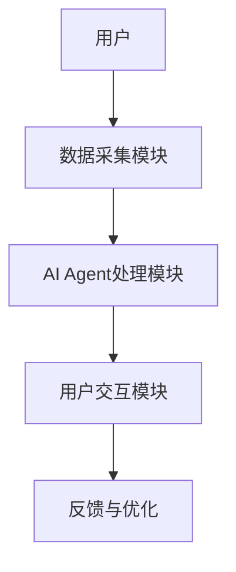
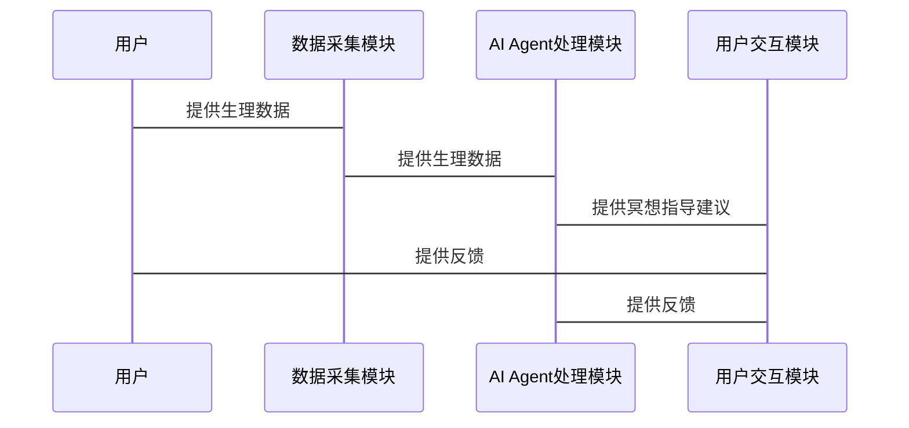

                 


# AI Agent在智能瑜伽垫中的冥想指导

---

## 关键词：
- AI Agent
- 冥想指导
- 智能瑜伽垫
- 机器学习
- 系统架构

---

## 摘要：
本文探讨AI Agent在智能瑜伽垫中的应用，重点分析AI Agent如何通过感知、决策和执行机制提供个性化的冥想指导。从背景介绍、核心原理到系统架构设计，再到项目实战，系统阐述了AI Agent在智能瑜伽垫中的实现过程。通过数学模型和算法实现，展示了如何利用AI技术提升冥想指导的效果和用户体验。

---

# 第1章: AI Agent与冥想指导的背景介绍

## 1.1 AI Agent的核心概念
### 1.1.1 AI Agent的定义与特点
人工智能代理（AI Agent）是一种能够感知环境、自主决策并执行任务的智能实体。AI Agent的核心特点包括：
- **自主性**：能够在没有外部干预的情况下独立运行。
- **反应性**：能够根据环境变化实时调整行为。
- **学习能力**：通过数据和反馈不断优化自身的决策模型。

### 1.1.2 AI Agent在健康领域的应用背景
健康领域是AI Agent的重要应用领域之一。AI Agent可以通过分析用户的生理数据、行为模式和环境信息，提供个性化的健康建议和干预。冥想作为一种有效的心理健康管理方法，结合AI Agent技术，能够实现智能化的冥想指导。

### 1.1.3 冥想与AI Agent的结合场景
冥想指导需要结合用户的心理状态、生理数据和环境信息。AI Agent可以通过以下方式实现冥想指导：
- **实时监测**：通过智能瑜伽垫的传感器，监测用户的呼吸、心率等生理数据。
- **个性化建议**：根据用户的生理数据和行为模式，提供个性化的冥想指导方案。
- **反馈优化**：通过实时反馈优化冥想指导策略，提升用户体验。

## 1.2 智能瑜伽垫的功能与技术基础
### 1.2.1 智能瑜伽垫的功能概述
智能瑜伽垫是一种结合了传感器和AI技术的智能设备，能够实时监测用户的动作、呼吸和心率等数据，并通过AI算法提供个性化的冥想指导。

### 1.2.2 瑜伽垫的传感器与数据采集技术
智能瑜伽垫通常配备以下传感器：
- **加速度传感器**：监测用户的动作和姿势。
- **心率传感器**：监测用户的心率变化。
- **压力传感器**：监测用户在瑜伽垫上的压力分布。

数据采集技术包括：
- **信号采集**：通过传感器采集用户的生理数据。
- **数据预处理**：对采集的数据进行清洗和标准化处理。
- **特征提取**：从原始数据中提取有用的特征，用于后续的分析和决策。

### 1.2.3 冥想指导的必要性与应用场景
冥想指导的必要性在于帮助用户放松身心、缓解压力。应用场景包括：
- **家庭冥想**：用户可以在家中使用智能瑜伽垫进行冥想练习。
- **办公室冥想**：用户可以在工作间隙使用智能瑜伽垫进行短暂的冥想练习。
- **健身中心**：智能瑜伽垫可以作为健身设备的一部分，提供个性化的冥想指导。

## 1.3 本章小结
本章介绍了AI Agent的核心概念、在健康领域的应用背景以及智能瑜伽垫的功能与技术基础。通过AI Agent与智能瑜伽垫的结合，能够实现个性化的冥想指导，提升用户体验。

---

# 第2章: AI Agent的核心原理

## 2.1 AI Agent的感知机制
### 2.1.1 数据采集与处理流程
AI Agent的感知机制包括以下步骤：
1. **数据采集**：通过智能瑜伽垫的传感器采集用户的生理数据。
2. **数据预处理**：对采集的数据进行清洗、标准化和特征提取。
3. **数据分析**：通过机器学习算法分析数据，识别用户的状态和行为模式。

### 2.1.2 用户行为识别与分析
AI Agent通过分析用户的生理数据和行为模式，识别用户的冥想状态。例如：
- **呼吸频率分析**：通过心率数据识别用户的呼吸频率，判断用户的放松程度。
- **动作分析**：通过加速度传感器数据识别用户的动作姿势，判断用户的冥想状态。

### 2.1.3 数据特征提取与分类
AI Agent通过特征提取和分类算法，将用户的生理数据和行为模式转化为可分析的特征。例如：
- **特征提取**：提取心率变异、呼吸频率等特征。
- **分类算法**：使用机器学习算法（如随机森林、支持向量机）对用户的状态进行分类。

## 2.2 AI Agent的决策与执行机制
### 2.2.1 决策算法的选择与实现
AI Agent的决策机制包括：
- **决策算法**：选择合适的机器学习算法（如随机森林、支持向量机）进行分类和回归分析。
- **决策逻辑**：根据用户的生理数据和行为模式，生成个性化的冥想指导策略。

### 2.2.2 冥想指导策略的制定
AI Agent根据用户的生理数据和行为模式，制定个性化的冥想指导策略。例如：
- **呼吸指导**：根据用户的呼吸频率，提供实时的呼吸调节建议。
- **姿势调整**：根据用户的动作姿势，提供姿势调整建议。

### 2.2.3 执行反馈与优化机制
AI Agent通过实时反馈优化冥想指导策略。例如：
- **反馈采集**：采集用户的反馈数据，评估冥想指导的效果。
- **策略优化**：根据反馈数据优化冥想指导策略，提升用户体验。

## 2.3 AI Agent的算法实现
### 2.3.1 基于机器学习的算法选择
AI Agent的核心算法包括：
- **监督学习**：用于分类和回归任务。
- **无监督学习**：用于聚类和异常检测。
- **强化学习**：用于动态决策和优化。

### 2.3.2 算法训练与模型优化
AI Agent的算法实现包括：
- **数据准备**：将数据划分为训练集和测试集。
- **模型训练**：使用训练数据训练机器学习模型。
- **模型优化**：通过交叉验证和超参数调优优化模型性能。

### 2.3.3 算法实现的代码框架
以下是AI Agent算法实现的代码框架：
```python
import numpy as np
import pandas as pd
from sklearn.model_selection import train_test_split
from sklearn.ensemble import RandomForestClassifier
from sklearn.metrics import accuracy_score

# 数据加载与预处理
data = pd.read_csv('meditation_data.csv')
X = data.drop('target', axis=1)
y = data['target']

# 数据划分
X_train, X_test, y_train, y_test = train_test_split(X, y, test_size=0.2)

# 模型训练
model = RandomForestClassifier()
model.fit(X_train, y_train)

# 模型预测
y_pred = model.predict(X_test)

# 模型评估
accuracy = accuracy_score(y_test, y_pred)
print(f'模型准确率：{accuracy}')
```

## 2.4 本章小结
本章详细介绍了AI Agent的核心原理，包括感知机制、决策机制和执行机制。通过机器学习算法实现AI Agent的决策功能，为智能瑜伽垫的冥想指导提供技术支持。

---

# 第3章: 冥想指导算法的数学模型与实现

## 3.1 数据预处理与特征工程
### 3.1.1 数据清洗与标准化
数据清洗是数据预处理的重要步骤，包括：
- **处理缺失值**：填充或删除缺失数据。
- **处理异常值**：识别并处理异常数据。

标准化是将数据转换为统一的尺度，例如：
$$
x_{\text{normalized}} = \frac{x - \mu}{\sigma}
$$
其中，$\mu$ 是均值，$\sigma$ 是标准差。

### 3.1.2 特征选择与降维技术
特征选择是通过选择重要的特征来提高模型性能。常用的方法包括：
- **基于统计的方法**：如卡方检验。
- **基于模型的方法**：如LASSO回归。

降维技术包括：
- **主成分分析（PCA）**：通过线性变换将数据降到低维空间。

### 3.1.3 数据特征的可视化分析
通过可视化工具（如Matplotlib、Seaborn）分析数据特征，例如绘制特征分布图、相关性热图等。

## 3.2 冥想指导模型的构建
### 3.2.1 基于监督学习的分类模型
常用的分类算法包括：
- **支持向量机（SVM）**：适用于小规模数据集。
- **随机森林**：适用于高维数据集。

### 3.2.2 模型训练的数学公式
随机森林的训练过程可以表示为：
$$
\text{损失函数} = \sum_{i=1}^{n} (y_i - \hat{y}_i)^2
$$
其中，$y_i$ 是真实标签，$\hat{y}_i$ 是预测标签。

### 3.2.3 模型评估与调优
模型评估指标包括准确率、召回率、F1分数等。模型调优包括：
- **超参数调优**：使用网格搜索或随机搜索优化模型参数。
- **交叉验证**：通过交叉验证评估模型性能。

## 3.3 算法实现的代码示例
以下是冥想指导模型的代码实现示例：
```python
import numpy as np
import pandas as pd
from sklearn.ensemble import RandomForestClassifier
from sklearn.metrics import accuracy_score
from sklearn.model_selection import GridSearchCV

# 数据加载与预处理
data = pd.read_csv('meditation_data.csv')
X = data.drop('target', axis=1)
y = data['target']

# 数据划分
X_train, X_test, y_train, y_test = train_test_split(X, y, test_size=0.2)

# 模型训练
model = RandomForestClassifier()
# 超参数调优
param_grid = {
    'n_estimators': [100, 200],
    'max_depth': [None, 10, 20],
    'min_samples_split': [2, 5]
}
grid_search = GridSearchCV(model, param_grid, cv=5)
grid_search.fit(X_train, y_train)

# 最佳模型预测
best_model = grid_search.best_estimator_
y_pred = best_model.predict(X_test)

# 模型评估
accuracy = accuracy_score(y_test, y_pred)
print(f'最佳模型准确率：{accuracy}')
```

## 3.4 本章小结
本章详细介绍了冥想指导算法的数学模型与实现，包括数据预处理、特征工程、模型构建和代码实现。通过数学公式和代码示例，展示了如何利用机器学习算法实现个性化的冥想指导。

---

# 第4章: 系统架构与交互设计

## 4.1 系统功能模块划分
智能瑜伽垫冥想指导系统的功能模块包括：
- **数据采集模块**：负责采集用户的生理数据。
- **AI Agent处理模块**：负责数据处理和决策。
- **用户交互模块**：负责与用户进行交互，提供冥想指导。

## 4.2 系统架构设计图
以下是系统的架构设计图：


## 4.3 系统接口设计
### 4.3.1 数据接口规范
- **输入接口**：接收用户的生理数据。
- **输出接口**：输出冥想指导建议。

### 4.3.2 AI Agent接口规范
- **输入接口**：接收用户的生理数据和行为模式。
- **输出接口**：输出冥想指导策略。

### 4.3.3 用户交互接口规范
- **输入接口**：接收用户的反馈。
- **输出接口**：输出冥想指导建议。

## 4.4 系统交互流程
以下是系统的交互流程：


## 4.5 本章小结
本章详细介绍了智能瑜伽垫冥想指导系统的系统架构与交互设计，包括功能模块划分、系统架构设计、系统接口设计和系统交互流程。

---

# 第5章: 项目实战

## 5.1 环境安装与配置
### 5.1.1 系统环境
- **操作系统**：Windows/Mac/Linux
- **Python版本**：Python 3.6+

### 5.1.2 工具安装
- **Python库**：安装必要的Python库，如numpy、pandas、scikit-learn。

### 5.1.3 数据集准备
- **数据集获取**：从公开数据集或自行采集数据。

## 5.2 系统核心实现
### 5.2.1 数据采集模块
实现数据采集模块，包括：
- **传感器数据采集**：通过智能瑜伽垫的传感器采集用户的生理数据。
- **数据预处理**：对采集的数据进行清洗和标准化处理。

### 5.2.2 AI Agent处理模块
实现AI Agent处理模块，包括：
- **数据分析**：通过机器学习算法分析用户的生理数据和行为模式。
- **决策制定**：根据分析结果生成个性化的冥想指导策略。

### 5.2.3 用户交互模块
实现用户交互模块，包括：
- **用户界面设计**：设计友好的用户界面。
- **反馈采集**：采集用户的反馈数据。

## 5.3 代码实现与分析
### 5.3.1 数据采集代码
以下是数据采集代码示例：
```python
import numpy as np
import pandas as pd
import time

# 模拟传感器数据采集
data = []
for _ in range(100):
    heart_rate = np.random.randint(60, 100)
    acceleration = np.random.uniform(0, 1)
    data.append([heart_rate, acceleration])
    
# 数据保存
pd.DataFrame(data, columns=['heart_rate', 'acceleration']).to_csv('meditation_data.csv', index=False)
```

### 5.3.2 AI Agent处理代码
以下是AI Agent处理代码示例：
```python
import numpy as np
import pandas as pd
from sklearn.ensemble import RandomForestClassifier
from sklearn.model_selection import train_test_split

# 数据加载与预处理
data = pd.read_csv('meditation_data.csv')
X = data.drop('target', axis=1)
y = data['target']

# 数据划分
X_train, X_test, y_train, y_test = train_test_split(X, y, test_size=0.2)

# 模型训练
model = RandomForestClassifier()
model.fit(X_train, y_train)

# 模型预测
y_pred = model.predict(X_test)

# 模型评估
accuracy = accuracy_score(y_test, y_pred)
print(f'模型准确率：{accuracy}')
```

### 5.3.3 用户交互代码
以下是用户交互代码示例：
```python
import tkinter as tk
from tkinter import messagebox

# 创建GUI界面
root = tk.Tk()
root.title('智能瑜伽垫冥想指导')

# 定义函数
def give_guidance():
    # 获取输入
    user_input = entry.get()
    # 提供指导
    guidance = f'根据您的输入，建议您进行{user_input}分钟的冥想。'
    messagebox.showinfo('指导建议', guidance)

# 创建组件
entry = tk.Entry(root)
button = tk.Button(root, text='获取指导', command=give_guidance)

# 布置组件
entry.pack()
button.pack()

# 运行GUI
root.mainloop()
```

## 5.4 测试与优化
### 5.4.1 系统测试
- **功能测试**：测试系统各功能模块是否正常运行。
- **性能测试**：测试系统的响应时间和处理能力。

### 5.4.2 系统优化
- **算法优化**：优化机器学习算法，提高模型准确率。
- **系统调优**：优化系统架构，提高系统性能。

## 5.5 本章小结
本章通过项目实战，详细介绍了智能瑜伽垫冥想指导系统的实现过程，包括环境安装、代码实现、测试与优化。通过代码示例展示了如何利用AI Agent技术实现个性化的冥想指导。

---

# 第6章: 总结与未来展望

## 6.1 项目总结
通过本项目，我们实现了基于AI Agent的智能瑜伽垫冥想指导系统。系统通过传感器数据采集、机器学习算法分析和个性化冥想指导，提升了用户体验。

## 6.2 未来展望
未来的研究方向包括：
- **算法优化**：进一步优化机器学习算法，提高模型准确率。
- **系统扩展**：扩展系统的功能，支持更多类型的冥想指导。
- **用户体验优化**：优化用户界面，提升用户体验。

## 6.3 注意事项
- **数据隐私**：注意保护用户的隐私数据。
- **系统稳定性**：确保系统的稳定性和可靠性。
- **用户教育**：对用户进行适当的教育，使其能够正确使用系统。

---

# 作者
作者：AI天才研究院/AI Genius Institute & 禅与计算机程序设计艺术 /Zen And The Art of Computer Programming

---

感谢您的阅读！希望本文对您理解AI Agent在智能瑜伽垫中的冥想指导有所帮助！

