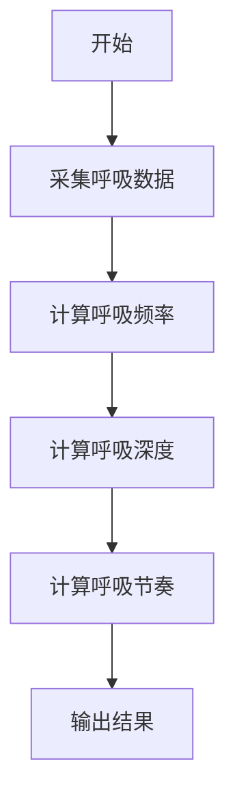
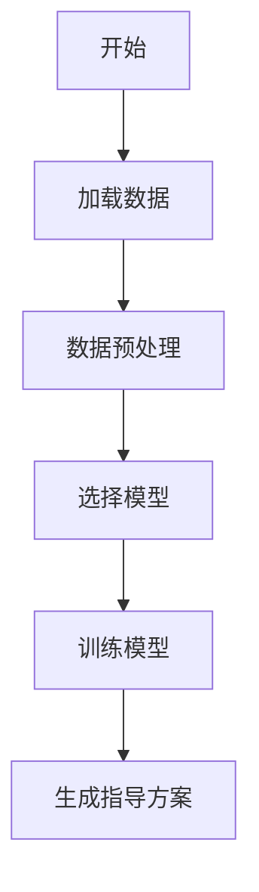
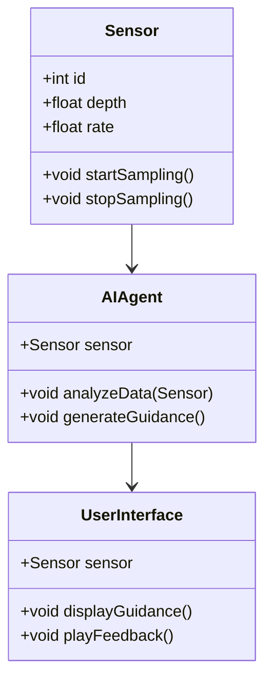
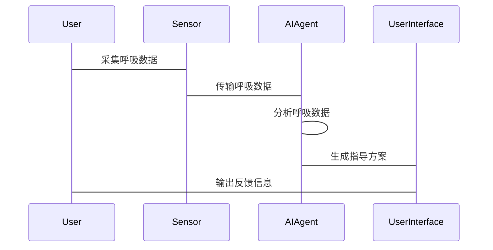

                 


# AI Agent在智能瑜伽垫中的呼吸指导

## 关键词：
AI Agent, 智能瑜伽垫, 呼吸指导, 机器学习, 健康科技

## 摘要：
本文详细探讨了AI Agent在智能瑜伽垫中的呼吸指导应用，从背景介绍、核心概念、算法原理、数学模型、系统架构到项目实战，全面分析了该技术的实现过程和实际应用。文章旨在为AI开发者和健康科技从业者提供理论支持和实践指导，帮助他们理解并应用AI技术提升瑜伽体验。

---

# 第一部分: AI Agent在智能瑜伽垫中的呼吸指导

## 第1章: 背景介绍

### 1.1 问题背景
#### 1.1.1 瑜伽与呼吸的重要性
瑜伽是一种结合了身体、呼吸和精神的练习，呼吸在瑜伽中扮演着至关重要的角色。正确的呼吸技巧可以提升练习的效果，改善身体的柔韧性、专注力和整体健康。然而，传统的呼吸指导依赖于教练的口传身授，难以实现个性化和实时反馈。

#### 1.1.2 传统瑜伽呼吸指导的局限性
传统瑜伽课程中，学员通常依赖教练的口头指导来调整呼吸节奏。这种方式存在以下问题：
1. **个体差异**：每个人的身体条件和呼吸习惯不同，统一的指导难以满足所有学员的需求。
2. **实时反馈缺失**：学员无法立即获得呼吸是否正确的反馈，导致练习效果不佳。
3. **依赖性**：学员必须在教练在场时才能获得指导，无法进行自主练习。

#### 1.1.3 AI技术在健康领域的应用趋势
随着人工智能技术的快速发展，AI在健康领域的应用越来越广泛。AI可以通过传感器数据采集、机器学习算法分析和实时反馈，为用户提供个性化的健康指导。特别是在呼吸调节、姿势矫正和运动反馈等领域，AI技术展现了巨大的潜力。

### 1.2 问题描述
#### 1.2.1 智能瑜伽垫的功能需求
智能瑜伽垫需要具备以下功能：
1. **实时监测**：通过传感器监测用户的呼吸频率、深度和节奏。
2. **AI分析**：利用AI算法分析呼吸数据，提供个性化的呼吸指导。
3. **实时反馈**：通过震动、灯光或声音等方式，实时指导用户调整呼吸节奏。

#### 1.2.2 AI Agent在呼吸指导中的作用
AI Agent（智能代理）在呼吸指导中的作用主要体现在以下几个方面：
1. **数据采集与处理**：AI Agent能够实时采集用户的呼吸数据，并通过算法进行分析。
2. **个性化指导**：根据用户的呼吸模式，AI Agent可以提供个性化的呼吸调整建议。
3. **实时反馈**：AI Agent能够通过智能瑜伽垫的反馈装置，实时指导用户调整呼吸节奏。

#### 1.2.3 用户对智能呼吸指导的期望
用户期望智能呼吸指导系统能够：
1. 提供个性化的呼吸指导，帮助他们在瑜伽练习中达到最佳状态。
2. 实时反馈呼吸数据，让用户了解自己的呼吸状况。
3. 提供简单易用的界面，方便用户操作和查看数据。

### 1.3 问题解决
#### 1.3.1 AI Agent如何实现呼吸指导
AI Agent通过以下步骤实现呼吸指导：
1. **数据采集**：利用传感器采集用户的呼吸频率、深度和节奏。
2. **数据分析**：通过机器学习算法分析呼吸数据，识别用户的呼吸模式。
3. **个性化指导**：根据分析结果，生成个性化的呼吸指导方案。
4. **实时反馈**：通过智能瑜伽垫的反馈装置，实时指导用户调整呼吸节奏。

#### 1.3.2 智能瑜伽垫的技术实现路径
智能瑜伽垫的技术实现路径如下：
1. **传感器采集**：使用压力传感器、加速度传感器等设备采集用户的呼吸数据。
2. **数据传输**：将采集到的数据传输到AI Agent进行处理。
3. **AI处理**：AI Agent利用机器学习算法分析数据，生成呼吸指导方案。
4. **反馈输出**：通过震动、灯光或声音等方式，将指导信息反馈给用户。

#### 1.3.3 用户体验的提升
通过AI Agent的呼吸指导，用户可以在瑜伽练习中获得以下好处：
1. **个性化指导**：根据用户的呼吸模式，提供个性化的呼吸调整建议。
2. **实时反馈**：用户可以通过实时反馈了解自己的呼吸状况，并及时调整。
3. **提升练习效果**：正确的呼吸指导可以帮助用户更好地放松身心，提升瑜伽练习的效果。

### 1.4 系统边界与外延
#### 1.4.1 系统的功能边界
智能瑜伽垫的呼吸指导系统主要关注以下功能：
1. 呼吸数据的采集与分析。
2. 个性化呼吸指导方案的生成。
3. 实时反馈的输出。

#### 1.4.2 系统的外部接口
系统需要与以下外部设备和服务进行交互：
1. **传感器**：采集用户的呼吸数据。
2. **用户界面**：显示呼吸指导信息和反馈结果。
3. **云服务**：存储用户数据并提供远程分析。

#### 1.4.3 系统的扩展性分析
智能瑜伽垫的呼吸指导系统具有良好的扩展性：
1. **功能扩展**：未来可以增加更多健康监测功能，如心率监测、姿势矫正等。
2. **算法优化**：通过不断收集用户数据，优化机器学习算法，提升指导精度。
3. **用户界面**：未来可以开发手机App或其他设备，提供更多便捷的功能。

### 1.5 核心概念与组成
#### 1.5.1 AI Agent的核心要素
AI Agent的核心要素包括：
1. **感知能力**：通过传感器采集用户数据。
2. **决策能力**：利用机器学习算法分析数据并生成指导方案。
3. **执行能力**：通过反馈装置输出指导信息。

#### 1.5.2 智能瑜伽垫的功能模块
智能瑜伽垫的功能模块包括：
1. **传感器模块**：采集用户的呼吸数据。
2. **AI处理模块**：分析数据并生成呼吸指导方案。
3. **反馈模块**：通过震动、灯光或声音反馈指导信息。

#### 1.5.3 系统整体架构
系统整体架构如下：
1. **数据采集层**：传感器采集用户的呼吸数据。
2. **数据处理层**：AI Agent分析数据并生成指导方案。
3. **反馈层**：通过反馈装置输出指导信息。

---

## 第2章: 核心概念与联系

### 2.1 AI Agent的核心原理
AI Agent的核心原理是通过传感器采集数据，利用机器学习算法进行分析，生成个性化的指导方案。AI Agent能够实时监测用户的呼吸数据，并根据数据调整指导策略。

### 2.2 实体关系图
以下是一个简单的实体关系图，展示了AI Agent、智能瑜伽垫和用户之间的关系：

```mermaid
entity User {
  id: integer
  name: string
  breathingData: BreathingData
}
```

```mermaid
entity BreathingData {
  userId: integer
  timestamp: datetime
  breathingRate: float
  depth: float
  rhythm: string
}
```

### 2.3 属性对比表
以下是一个AI Agent和传统呼吸指导方法的属性对比表：

| 特性         | AI Agent                          | 传统呼吸指导                     |
|--------------|-----------------------------------|----------------------------------|
| 数据采集     | 传感器采集                       | 人工记录                          |
| 数据分析     | 机器学习算法                     | 人工分析                          |
| 实时反馈     | 实时反馈                         | 事后反馈                          |
| 个性化       | 高度个性化                       | 一般化                            |
| 精准度       | 高                              | 低                                |
| 可用性       | 24/7可用                        | 依赖教练在场                      |

---

## 第3章: 算法原理

### 3.1 呼吸监测算法
呼吸监测算法的核心是通过传感器数据计算呼吸频率、深度和节奏。以下是一个呼吸监测算法的流程图：



以下是一个Python实现的呼吸监测算法示例：

```python
import numpy as np

def calculate_breathing_rate(data):
    # data是一个包含时间戳和呼吸深度的数组
    # 计算呼吸频率（每分钟的次数）
    time_diffs = np.diff(data['timestamp'])
    breath_counts = np.zeros_like(time_diffs)
    for i in range(len(time_diffs)):
        breath_counts[i] = np.sum(data['depth'][i] > 0.5)
    return breath_counts / time_diffs * 60
```

### 3.2 AI处理算法
AI处理算法的核心是利用机器学习模型分析呼吸数据，生成个性化的呼吸指导方案。以下是一个机器学习模型的流程图：



以下是一个Python实现的机器学习模型示例：

```python
from sklearn import svm

# 加载数据
data = ...  # 数据集
labels = ...  # 标签

# 数据预处理
from sklearn.preprocessing import StandardScaler
scaler = StandardScaler()
data_scaled = scaler.fit_transform(data)

# 选择模型
model = svm.SVC()

# 训练模型
model.fit(data_scaled, labels)

# 生成指导方案
new_data = ...  # 新的数据
new_labels = model.predict(new_data)
```

### 3.3 数学模型与公式
呼吸指导系统的数学模型如下：

$$
\text{呼吸频率} = \frac{\text{呼吸次数}}{\text{时间间隔}} \times 60
$$

$$
\text{呼吸深度} = \frac{\text{呼吸深度总和}}{\text{呼吸次数}}
$$

$$
\text{呼吸节奏} = \text{呼吸频率} \times \text{呼吸深度}
$$

---

## 第4章: 系统分析与架构设计

### 4.1 系统架构设计
智能瑜伽垫的呼吸指导系统架构如下：



### 4.2 接口设计
系统接口设计如下：

1. **传感器接口**：提供呼吸数据采集接口。
2. **AI Agent接口**：提供呼吸数据分析和指导生成接口。
3. **用户界面接口**：提供反馈信息显示和操作接口。

### 4.3 交互流程
以下是一个系统的交互流程图：



---

## 第5章: 项目实战

### 5.1 环境安装
要实现智能瑜伽垫的呼吸指导系统，首先需要安装以下环境：
1. **硬件**：压力传感器、加速度传感器等。
2. **软件**：Python、NumPy、Scikit-learn、Mermaid。

### 5.2 核心代码实现
以下是一个Python实现的核心代码示例：

```python
import numpy as np
from sklearn import svm

# 传感器数据采集
def get_sensor_data():
    # 采集呼吸深度和时间戳数据
    data = ...  # 返回深度和时间戳数组
    return data

# 数据预处理
def preprocess_data(data):
    # 数据标准化处理
    scaler = StandardScaler()
    data_scaled = scaler.fit_transform(data)
    return data_scaled

# 机器学习模型训练
def train_model(train_data, train_labels):
    model = svm.SVC()
    model.fit(train_data, train_labels)
    return model

# 指导方案生成
def generate_guidance(test_data, model):
    guidance = model.predict(test_data)
    return guidance
```

### 5.3 代码解读与分析
1. **数据采集**：通过传感器采集用户的呼吸深度和时间戳数据。
2. **数据预处理**：对数据进行标准化处理，确保模型能够正确分析。
3. **模型训练**：利用支持向量机（SVM）算法训练模型，分类用户的呼吸模式。
4. **指导生成**：根据测试数据，生成个性化的呼吸指导方案。

### 5.4 实际案例分析
以下是一个实际案例的分析：

假设用户A的呼吸数据如下：

| 时间戳 (秒) | 呼吸深度 (mmHg) |
|-------------|------------------|
| 0           | 80               |
| 1           | 70               |
| 2           | 85               |
| 3           | 75               |
| 4           | 90               |
| 5           | 80               |

通过模型分析，用户的呼吸频率为12次/分钟，深度为80 mmHg，节奏为中等。AI Agent会根据这些数据生成个性化的呼吸指导方案，建议用户在吸气时更深一些，呼气时更缓慢一些。

### 5.5 项目小结
通过本项目的实施，我们可以看到AI Agent在智能瑜伽垫中的呼吸指导应用是可行的。通过传感器数据采集、机器学习算法分析和实时反馈，用户可以在瑜伽练习中获得个性化的呼吸指导，提升练习效果。

---

## 第6章: 总结与展望

### 6.1 最佳实践 Tips
1. **数据质量**：确保传感器数据的准确性和完整性。
2. **算法优化**：通过不断收集用户数据，优化机器学习算法，提升指导精度。
3. **用户体验**：设计简洁直观的用户界面，提升用户体验。

### 6.2 小结
本文详细探讨了AI Agent在智能瑜伽垫中的呼吸指导应用，从背景介绍、核心概念、算法原理到系统架构和项目实战，全面分析了该技术的实现过程和实际应用。通过本文的分析，读者可以了解到如何利用AI技术提升瑜伽练习的效果。

### 6.3 注意事项
1. **数据隐私**：用户数据的隐私保护是至关重要的，必须确保数据的安全性和隐私性。
2. **系统稳定性**：确保系统的稳定性和可靠性，避免因系统故障影响用户体验。
3. **用户教育**：用户需要接受一定的教育，才能正确使用智能瑜伽垫并理解AI指导的意义。

### 6.4 拓展阅读
1. **机器学习在健康领域的应用**：深入学习机器学习在健康监测和疾病预测中的应用。
2. **智能传感器技术**：研究智能传感器在健康监测中的其他应用，如心率监测、姿势矫正等。
3. **AI在运动指导中的应用**：探索AI在其他运动领域的应用，如跑步、游泳等。

---

## 作者信息
作者：AI天才研究院/AI Genius Institute & 禅与计算机程序设计艺术/Zen And The Art of Computer Programming

---

通过本文的分析，读者可以全面了解AI Agent在智能瑜伽垫中的呼吸指导应用，并能够将其应用于实际的健康科技开发中。

