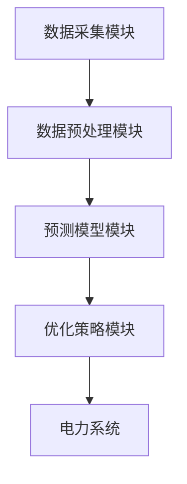

                 


# AI Agent在智能电力负载预测中的应用

> **关键词**：AI Agent、智能电力系统、负载预测、机器学习、深度学习、能源管理、智能电网

> **摘要**：  
本文探讨了AI Agent在智能电力负载预测中的应用，分析了AI Agent的基本概念及其在电力系统中的作用，详细阐述了基于AI Agent的电力负载预测算法原理，结合系统架构设计和项目实战，展示了如何利用AI Agent优化电力负载预测的效率和准确性。文章还总结了AI Agent在智能电力负载预测中的优势、挑战及未来发展方向。

---

# 第1章: AI Agent与智能电力负载预测的背景

## 1.1 AI Agent的基本概念

### 1.1.1 AI Agent的定义
AI Agent（人工智能代理）是一种能够感知环境并采取行动以实现目标的智能实体。它具备自主性、反应性、目标导向和社会能力等特征，能够通过数据处理、推理和决策优化复杂系统的行为。

### 1.1.2 AI Agent的核心特征
- **自主性**：AI Agent能够独立执行任务，无需外部干预。
- **反应性**：能够实时感知环境变化并做出响应。
- **目标导向**：基于目标驱动行为，优化决策。
- **学习能力**：通过机器学习算法不断优化性能。

### 1.1.3 AI Agent与传统算法的区别
传统算法通常基于固定的规则和数据处理流程，而AI Agent具备学习和适应能力，能够根据环境反馈动态调整行为，更加灵活和高效。

---

## 1.2 电力负载预测的背景与挑战

### 1.2.1 电力系统的基本概念
电力系统包括发电、输电、配电和用电四个环节，其核心目标是保证电力供应的稳定性和可靠性。电力负载预测是电力系统运行管理的重要组成部分。

### 1.2.2 电力负载预测的重要性
准确的电力负载预测能够帮助电力公司合理安排发电计划、优化电网运行、降低能源浪费，并提高电力系统的整体效率。

### 1.2.3 传统电力负载预测方法的局限性
传统方法通常基于统计模型（如ARIMA）或简单的机器学习算法，存在以下问题：
- 预测精度有限。
- 对异常数据和突变事件的处理能力不足。
- 需要大量人工干预。

---

## 1.3 AI Agent在电力负载预测中的应用前景

### 1.3.1 AI Agent的优势
AI Agent能够实时处理海量数据，利用深度学习和强化学习算法提高预测精度，同时具备自适应能力，能够应对复杂多变的电力需求。

### 1.3.2 电力系统中AI Agent的应用场景
- **实时负载预测**：基于历史数据和实时数据，预测未来电力需求。
- **异常检测与处理**：识别电力系统中的异常情况并采取措施。
- **动态优化**：根据预测结果优化电力分配和设备运行。

### 1.3.3 未来发展趋势
随着AI技术的不断进步，AI Agent在电力负载预测中的应用将更加广泛，预测精度和实时性将显著提高。

---

## 1.4 本章小结
本章介绍了AI Agent的基本概念及其在电力负载预测中的重要性，分析了传统方法的局限性和AI Agent的应用优势，为后续内容奠定了基础。

---

# 第2章: AI Agent与电力负载预测的核心概念

## 2.1 AI Agent在电力系统中的角色

### 2.1.1 数据采集与处理
AI Agent通过传感器和数据采集系统获取电力系统的实时数据，包括负载、电压、电流等信息。

### 2.1.2 预测模型构建
AI Agent利用机器学习和深度学习算法构建预测模型，分析数据中的模式和趋势，生成预测结果。

### 2.1.3 优化策略执行
基于预测结果，AI Agent制定优化策略，调整电力分配和设备运行，确保系统高效稳定。

---

## 2.2 电力负载预测的数学模型

### 2.2.1 时间序列分析模型
- **ARIMA模型**：基于历史数据的线性回归模型，适用于平稳时间序列。
- **LSTM模型**：长短期记忆网络，能够捕捉时间序列中的长依赖关系。
- **Prophet模型**：Facebook开源的时间序列预测模型，适合具有周期性数据的预测。

### 2.2.2 机器学习模型
- **线性回归**：适用于简单的线性关系。
- **随机森林**：基于决策树的集成学习方法，适合复杂非线性关系。
- **XGBoost**：梯度提升树模型，预测精度高。

### 2.2.3 深度学习模型
- **神经网络**：多层感知机，适用于复杂的非线性关系。
- **Transformer**：基于注意力机制的模型，适合处理序列数据。

---

## 2.3 AI Agent与电力负载预测的结合

### 2.3.1 数据流的处理流程
1. 数据采集：通过传感器获取实时数据。
2. 数据预处理：清洗、归一化、特征提取。
3. 模型训练：利用机器学习或深度学习算法训练预测模型。
4. 预测与优化：生成预测结果，并根据结果优化电力分配。

### 2.3.2 AI Agent的决策机制
AI Agent通过预测模型生成预测结果，并结合实时数据和历史数据，制定优化策略，调整电力系统的运行参数。

### 2.3.3 系统的实时性要求
电力负载预测需要高实时性，AI Agent需要在短时间内完成数据处理和预测，确保预测结果能够及时应用。

---

## 2.4 核心概念对比分析

### 2.4.1 AI Agent与传统预测模型的对比
| 对比维度       | AI Agent                         | 传统预测模型                   |
|----------------|----------------------------------|------------------------------|
| 自适应能力     | 强                                | 弱                             |
| 预测精度       | 高                                | 中                             |
| 实时性          | 高                                | 中                             |
| 可扩展性        | 高                                | 低                             |

### 2.4.2 不同预测模型的性能对比
| 模型类型       | ARIMA         | LSTM          | Prophet        | XGBoost       |
|----------------|---------------|---------------|----------------|---------------|
| 预测精度       | 中            | 高            | 中            | 高            |
| 计算复杂度     | 低            | 高            | 中            | 高            |
| 处理数据类型   | 时间序列      | 时间序列      | 时间序列      | 时间序列      |

### 2.4.3 系统架构的优劣分析
- **优点**：系统架构清晰，模块化设计便于维护和扩展。
- **缺点**：对硬件要求较高，需要高性能计算能力。

---

## 2.5 本章小结
本章详细阐述了AI Agent在电力系统中的角色，分析了电力负载预测的数学模型，并对比了不同预测模型的性能和优缺点。

---

# 第3章: AI Agent在电力负载预测中的算法原理

## 3.1 基于时间序列的预测算法

### 3.1.1 ARIMA模型
ARIMA（自回归积分滑动平均模型）适用于平稳时间序列数据的预测。其数学公式为：
$$ ARIMA(p, d, q) = \phi(B) \cdot (1 - B)^d \cdot \theta(B) $$
其中，$p$为自回归阶数，$d$为差分阶数，$q$为滑动平均阶数。

### 3.1.2 LSTM模型
LSTM（长短期记忆网络）通过引入记忆单元和遗忘门，能够捕捉时间序列中的长依赖关系。其核心公式包括遗忘门、输入门和输出门：
$$ f_t = \sigma(W_f \cdot [h_{t-1}, x_t] + b_f) $$
$$ i_t = \sigma(W_i \cdot [h_{t-1}, x_t] + b_i) $$
$$ o_t = \sigma(W_o \cdot [h_{t-1}, x_t] + b_o) $$
$$ c_t = f_t \cdot c_{t-1} + i_t \cdot tanh(W_c \cdot [h_{t-1}, x_t] + b_c) $$
$$ h_t = o_t \cdot tanh(c_t) $$

### 3.1.3 Prophet模型
Prophet模型由Facebook开源，适用于具有周期性数据的预测。其数学公式包括增长趋势、周期性成分和噪声：
$$ y(t) = g(t) + f(t) + \epsilon_t $$
其中，$g(t)$为增长趋势，$f(t)$为周期性成分，$\epsilon_t$为噪声。

---

## 3.2 基于机器学习的预测算法

### 3.2.1 线性回归
线性回归模型适用于简单的线性关系，其数学公式为：
$$ y = \beta_0 + \beta_1 x_1 + \beta_2 x_2 + \dots + \beta_n x_n $$

### 3.2.2 随机森林
随机森林是一种集成学习方法，通过构建多个决策树并取其平均值来提高预测精度。

### 3.2.3 XGBoost
XGBoost是一种基于梯度提升的算法，通过不断优化损失函数来提高预测精度。

---

## 3.3 基于深度学习的预测算法

### 3.3.1 神经网络
神经网络通过多层感知机模拟人类神经网络的结构，适用于复杂的非线性关系。

### 3.3.2 Transformer
Transformer模型基于注意力机制，适用于处理序列数据，已被广泛应用于时间序列预测。

---

## 3.4 算法实现与优化

### 3.4.1 算法实现
以下是一个基于LSTM的时间序列预测模型的Python代码示例：

```python
import numpy as np
from tensorflow.keras.models import Sequential
from tensorflow.keras.layers import LSTM, Dense

# 数据准备
X_train = np.random.randn(1000, 1, 1)
y_train = np.random.randn(1000, 1)

# 模型构建
model = Sequential()
model.add(LSTM(64, input_shape=(1, 1)))
model.add(Dense(1))
model.compile(loss='mean_squared_error', optimizer='adam')

# 训练
model.fit(X_train, y_train, epochs=10, batch_size=32)
```

### 3.4.2 算法优化
通过超参数调优、模型集成和数据增强等方法可以进一步提高预测精度。

---

## 3.5 本章小结
本章详细介绍了基于时间序列、机器学习和深度学习的预测算法，并通过Python代码示例展示了算法实现过程。

---

# 第4章: 系统架构设计与实现

## 4.1 电力负载预测系统的总体架构

### 4.1.1 系统功能模块
- **数据采集模块**：负责采集电力系统的实时数据。
- **数据预处理模块**：对数据进行清洗和归一化处理。
- **预测模型模块**：基于AI Agent构建预测模型。
- **优化策略模块**：根据预测结果优化电力分配。

### 4.1.2 系统架构图
以下是一个电力负载预测系统的Mermaid架构图：



---

## 4.2 系统功能设计

### 4.2.1 数据采集与预处理
数据采集模块通过传感器获取电力系统的实时数据，并通过数据预处理模块进行清洗和归一化处理。

### 4.2.2 预测模型实现
预测模型模块基于LSTM或XGBoost等算法构建预测模型，并生成预测结果。

### 4.2.3 优化策略设计
优化策略模块根据预测结果优化电力分配，确保系统高效稳定运行。

---

## 4.3 系统接口设计

### 4.3.1 数据接口
系统通过API接口与外部数据源和电力系统进行数据交互。

### 4.3.2 用户接口
用户可以通过图形界面查看预测结果和优化策略。

---

## 4.4 本章小结
本章详细描述了电力负载预测系统的总体架构和功能设计，为后续的系统实现奠定了基础。

---

# 第5章: 项目实战与案例分析

## 5.1 项目环境安装

### 5.1.1 安装Python和相关库
需要安装Python 3.8及以上版本，并安装以下库：
- numpy
- pandas
- tensorflow
- xgboost
- matplotlib

### 5.1.2 安装说明
```bash
pip install numpy pandas tensorflow xgboost matplotlib
```

---

## 5.2 系统核心代码实现

### 5.2.1 数据采集与预处理
```python
import pandas as pd
import numpy as np

# 数据采集
data = pd.read_csv('电力数据.csv')

# 数据预处理
data = data.dropna()
data = (data - data.mean()) / data.std()
```

### 5.2.2 基于LSTM的预测模型实现
```python
from tensorflow.keras.models import Sequential
from tensorflow.keras.layers import LSTM, Dense

# 模型构建
model = Sequential()
model.add(LSTM(64, input_shape=(1, 1)))
model.add(Dense(1))
model.compile(loss='mean_squared_error', optimizer='adam')

# 训练
model.fit(X_train, y_train, epochs=10, batch_size=32)
```

---

## 5.3 案例分析

### 5.3.1 数据分析与可视化
使用Matplotlib对数据进行可视化分析，识别数据中的趋势和异常。

### 5.3.2 模型训练与评估
通过训练数据和测试数据评估模型的预测精度，计算均方误差（MSE）和R²系数。

### 5.3.3 优化策略实现
根据预测结果优化电力分配，减少能源浪费和提高系统效率。

---

## 5.4 本章小结
本章通过项目实战展示了AI Agent在电力负载预测中的具体应用，详细讲解了系统核心代码的实现和优化策略。

---

# 第6章: 总结与展望

## 6.1 本章总结
本文详细探讨了AI Agent在智能电力负载预测中的应用，分析了AI Agent的基本概念和电力负载预测的数学模型，结合系统架构设计和项目实战，展示了如何利用AI Agent优化电力负载预测的效率和准确性。

## 6.2 未来展望
随着AI技术的不断进步，AI Agent在电力负载预测中的应用将更加广泛，预测精度和实时性将显著提高。未来的研究方向包括更复杂的模型优化、多模态数据融合以及边缘计算的应用。

---

# 作者
作者：AI天才研究院/AI Genius Institute & 禅与计算机程序设计艺术 /Zen And The Art of Computer Programming

