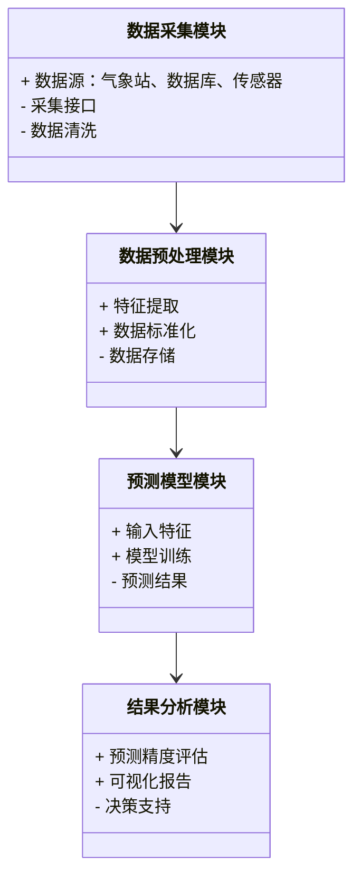
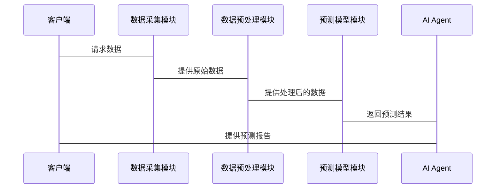

                 


# AI Agent在智能电力需求预测中的应用

## 关键词：AI Agent, 智能电力需求预测, 电力系统, 人工智能, 预测模型

## 摘要：  
随着电力系统复杂性和不确定性的增加，传统的电力需求预测方法逐渐暴露出精度不足、实时性差等问题。本文深入探讨了AI Agent（人工智能代理）在智能电力需求预测中的应用，分析了其核心概念、算法原理、系统架构以及实际应用场景。通过对比传统预测方法，本文展示了AI Agent在提高预测精度、实时调整和优化电力系统运行效率方面的独特优势。文章还结合具体案例，详细阐述了AI Agent在电力需求预测中的实现过程，为电力系统智能化转型提供了理论支持和实践指导。

---

# 第一部分: AI Agent与智能电力需求预测的背景与基础

# 第1章: AI Agent与电力需求预测概述

## 1.1 电力需求预测的背景与重要性

### 1.1.1 电力需求预测的基本概念

电力需求预测是指通过分析历史用电数据、气象数据、经济指标等多种因素，预测未来电力负荷的需求量。它是电力系统规划、运行和管理的基础，直接关系到电力系统的安全性和经济性。

电力需求预测的目标是：  
1. 确保电力供应的稳定性，避免电力短缺或过剩。  
2. 优化电力资源的配置，降低发电成本。  
3. 支持电网规划和投资决策。  
4. 提高电力系统的灵活性，应对可再生能源的波动性。  

电力需求预测的挑战：  
1. 数据的复杂性：需求受天气、经济、用户行为等多种因素影响。  
2. 时间序列的非线性：电力需求随时间呈现复杂的变化趋势。  
3. 数据的实时性：需要快速响应电网的动态变化。  
4. 模型的可解释性：复杂的预测模型需要能够被电网专家理解和调整。  

---

### 1.1.2 电力需求预测的挑战与机遇

#### 挑战  
1. **数据质量**：电力数据可能存在缺失、噪声或偏差。  
2. **模型选择**：不同场景下需要选择合适的预测模型。  
3. **计算资源**：高精度预测需要大量计算资源。  
4. **动态变化**：电力需求受政策、经济和用户行为影响，具有动态性。  

#### 机遇  
1. **大数据技术**：海量数据的收集和分析为预测提供了新的可能性。  
2. **人工智能技术**：深度学习、强化学习等技术为提高预测精度提供了新工具。  
3. **可再生能源的接入**：AI Agent能够帮助电网更好地适应可再生能源的波动性。  
4. **智能电网的发展**：智能电网的建设为AI Agent的应用提供了良好的环境。  

---

### 1.1.3 AI在电力需求预测中的应用前景

人工智能技术在电力需求预测中的应用前景广阔。通过AI Agent，可以实现以下目标：  
1. **实时预测**：AI Agent能够实时采集数据并快速生成预测结果。  
2. **自适应调整**：AI Agent可以根据电网的动态变化自动调整预测模型。  
3. **多因素分析**：AI Agent能够同时考虑多种影响因素，提高预测精度。  
4. **决策支持**：AI Agent可以为电网调度提供实时决策支持。  

---

## 1.2 AI Agent的基本概念与特点

### 1.2.1 AI Agent的定义与分类

AI Agent是指具备感知环境、做出决策、执行动作能力的智能体。根据功能和应用场景的不同，AI Agent可以分为以下几类：  
1. **简单反射型Agent**：基于当前输入做出简单反应，适用于规则明确的任务。  
2. **基于模型的反射型Agent**：基于内部模型和外部环境信息进行决策，适用于复杂任务。  
3. **目标驱动型Agent**：以特定目标为导向，主动规划和执行任务。  
4. **效用驱动型Agent**：以最大化效用函数为目标，适用于多目标优化问题。  

---

### 1.2.2 AI Agent的核心能力与优势

AI Agent的核心能力包括：  
1. **感知能力**：通过传感器、数据库等获取环境信息。  
2. **决策能力**：基于感知信息，选择最优行动方案。  
3. **执行能力**：通过执行器对外界产生影响。  
4. **学习能力**：通过经验不断优化自身的决策策略。  

AI Agent的优势：  
1. **智能化**：能够自主完成复杂任务。  
2. **自适应性**：能够根据环境变化调整行为。  
3. **高效性**：能够在短时间内完成大量计算和决策。  
4. **可扩展性**：适用于多种应用场景。  

---

### 1.2.3 AI Agent与传统预测方法的区别

| **对比维度** | **传统预测方法** | **AI Agent** |
|--------------|------------------|--------------|
| 数据处理能力 | 基于简单统计或机器学习模型，处理能力有限。 | 具备强大的数据处理能力，能够实时分析多源数据。 |
| 模型更新频率 | 模型更新周期较长，难以适应动态变化。 | 能够实时更新模型，适应环境变化。 |
| 预测精度 | 受模型假设限制，精度有限。 | 通过深度学习和强化学习，能够实现高精度预测。 |
| 实时性 | 通常不具备实时预测能力。 | 支持实时预测，能够快速响应需求变化。 |

---

## 1.3 AI Agent在电力需求预测中的应用价值

### 1.3.1 提高预测精度的潜力

AI Agent通过整合多种数据源（如天气数据、用户行为数据、历史负荷数据等）进行综合分析，能够显著提高预测精度。例如，强化学习算法可以通过不断调整预测策略，优化预测结果。

---

### 1.3.2 实时调整与自适应能力

AI Agent能够实时感知电网状态，动态调整预测模型。这种自适应能力使得电力需求预测更加灵活，能够应对可再生能源波动和用户需求变化。

---

### 1.3.3 优化电力系统运行效率的作用

通过AI Agent的优化决策，电力系统可以实现资源的最优配置，降低发电成本，提高电网运行效率。例如，AI Agent可以优化电力调度策略，减少电力浪费。

---

## 1.4 本章小结

本章介绍了电力需求预测的基本概念、挑战与机遇，以及AI Agent的核心概念和特点。通过对比传统预测方法，展示了AI Agent在电力需求预测中的独特优势和应用价值。下一章将深入探讨电力需求预测的核心概念与模型。

---

# 第2章: 电力需求预测的核心概念与模型

## 2.1 电力需求预测的基本原理

### 2.1.1 需求预测的输入变量与输出结果

#### 输入变量  
电力需求预测的输入变量包括：  
1. **气象数据**：温度、湿度、风速等。  
2. **时间因素**：日期、时间、季节等。  
3. **经济指标**：GDP、工业用电量等。  
4. **用户行为数据**：用户用电模式、负荷曲线等。  
5. **电网状态数据**：电压、电流、功率等。  

#### 输出结果  
电力需求预测的输出结果包括：  
1. **负荷预测值**：未来某时刻的电力需求量。  
2. **不确定性分析**：预测结果的置信区间。  
3. **趋势分析**：负荷变化的长期趋势。  

---

### 2.1.2 预测模型的分类与选择

电力需求预测模型可以根据不同的分类标准进行划分：  
1. **按数据类型**：时间序列模型、回归模型、分类模型。  
2. **按算法类型**：统计模型（ARIMA）、机器学习模型（随机森林、支持向量机）、深度学习模型（LSTM）。  
3. **按应用场景**：短期预测、中长期预测、实时预测。  

选择合适的预测模型需要考虑以下因素：  
1. **数据特征**：数据的时序性、周期性、波动性。  
2. **预测目标**：是否需要实时预测、是否需要解释性。  
3. **计算资源**：模型的复杂度与计算能力是否匹配。  

---

### 2.1.3 数据特征与模型性能的关系

数据特征对模型性能有直接影响：  
1. **时间序列性**：时间序列模型（如LSTM）更适合处理时序数据。  
2. **周期性**：如果数据具有明显的周期性，可以采用周期性模型或引入周期性特征。  
3. **波动性**：数据波动较大时，需要选择具有较强拟合能力的模型（如随机森林）。  
4. **相关性**：变量之间的相关性影响模型的性能和稳定性。  

---

## 2.2 AI Agent在预测中的角色与功能

### 2.2.1 数据采集与处理能力

AI Agent需要具备以下数据采集与处理能力：  
1. **多源数据采集**：从气象站、数据库、传感器等获取数据。  
2. **数据清洗**：处理缺失值、异常值和噪声。  
3. **特征提取**：从原始数据中提取有意义的特征（如时间特征、天气特征）。  

### 2.2.2 模型选择与优化能力

AI Agent需要能够根据数据特征和预测目标选择合适的预测模型，并通过训练优化模型参数。例如，可以通过强化学习算法动态调整模型结构。

### 2.2.3 预测结果的解释与反馈能力

AI Agent需要能够解释预测结果，并根据实际负荷与预测负荷的偏差，调整预测模型或优化决策策略。

---

## 2.3 电力需求预测的核心模型对比

### 2.3.1 时间序列分析模型

时间序列分析模型是电力需求预测中最常用的模型之一。常见的模型包括：  
1. **ARIMA模型**：适用于线性时序数据。  
2. ** Holt-Winter模型**：适用于具有趋势和季节性的数据。  

**ARIMA模型公式**：  
$$ ARIMA(p, d, q) $$  
其中，$p$ 表示自回归阶数，$d$ 表示差分阶数，$q$ 表示移动平均阶数。  

### 2.3.2 机器学习模型

机器学习模型通过训练数据学习特征与目标之间的关系，适用于复杂非线性关系的预测。常见的模型包括：  
1. **随机森林**：适用于特征较多的情况。  
2. **支持向量机（SVM）**：适用于小样本数据。  

### 2.3.3 增强学习模型

增强学习模型（如Q-learning）通过与环境的交互优化预测策略。例如，AI Agent可以根据预测误差调整预测模型的参数。

**Q-learning公式**：  
$$ Q(s, a) = r + \gamma \max Q(s', a') $$  
其中，$s$ 是当前状态，$a$ 是动作，$r$ 是奖励，$\gamma$ 是折扣因子，$s'$ 是下一个状态。  

---

## 2.4 本章小结

本章介绍了电力需求预测的基本原理、模型分类与选择，以及AI Agent在预测中的角色与功能。通过对比不同模型的优缺点，为后续的算法实现提供了理论基础。下一章将深入探讨AI Agent的算法原理与数学模型。

---

# 第3章: AI Agent的算法原理与数学模型

## 3.1 AI Agent的核心算法原理

### 3.1.1 强化学习的基本原理

强化学习是一种通过试错机制优化决策策略的方法。AI Agent通过与环境的交互，不断优化自身的策略，以实现预测目标的最优。

**强化学习的基本步骤**：  
1. **状态感知**：AI Agent感知当前状态 $s$。  
2. **选择动作**：根据当前状态选择动作 $a$。  
3. **执行动作**：执行动作 $a$，观察新的状态 $s'$ 和奖励 $r$。  
4. **更新策略**：根据奖励更新策略，优化 Q 值。  

---

### 3.1.2 深度学习在预测中的应用

深度学习通过多层神经网络提取数据的特征，适用于复杂非线性关系的预测。例如，长短时记忆网络（LSTM）可以有效捕捉时间序列数据的长程依赖关系。

**LSTM网络结构**：  
LSTM由输入门（Input Gate）、遗忘门（Forget Gate）和输出门（Output Gate）组成，能够有效处理时间序列数据。  

---

### 3.1.3 贝叶斯网络的预测优势

贝叶斯网络通过概率推理进行预测，适用于需要考虑不确定性的情况。贝叶斯网络能够提供预测结果的概率分布，为决策提供更全面的信息。

**贝叶斯网络公式**：  
$$ P(A|B) = \frac{P(B|A)P(A)}{P(B)} $$  

---

## 3.2 AI Agent的数学模型与公式

### 3.2.1 强化学习的Q-learning公式

$$ Q(s, a) = r + \gamma \max Q(s', a') $$  
其中，$Q(s, a)$ 表示状态 $s$ 和动作 $a$ 的 Q 值，$\gamma$ 是折扣因子，$r$ 是奖励。  

---

### 3.2.2 深度学习的神经网络模型

$$ y = \sigma(Wx + b) $$  
其中，$W$ 是权重矩阵，$b$ 是偏置项，$\sigma$ 是激活函数（如ReLU、Sigmoid）。  

---

### 3.2.3 时间序列模型的ARIMA公式

$$ \phi(\theta) = 1 - \phi_1B - \phi_2B^2 - ... - \phi_pB^p $$  
其中，$B$ 是后移算子，$\phi_i$ 是自回归系数。  

---

### 3.2.4 贝叶斯网络的概率公式

$$ P(A|B) = \frac{P(B|A)P(A)}{P(B)} $$  
其中，$P(A|B)$ 是在 $B$ 发生的情况下 $A$ 发生的概率。  

---

## 3.3 本章小结

本章详细介绍了AI Agent的核心算法原理和数学模型，包括强化学习、深度学习和贝叶斯网络等。这些算法为电力需求预测提供了强大的工具。下一章将结合具体场景，分析AI Agent在电力需求预测中的系统架构与实现方案。

---

# 第4章: 系统分析与架构设计方案

## 4.1 电力需求预测的场景介绍

电力需求预测的场景包括：  
1. **短期预测**：未来24小时的负荷预测。  
2. **中长期预测**：未来一周、一个月的负荷预测。  
3. **实时预测**：实时负荷预测，用于电网调度。  

---

## 4.2 电力需求预测系统介绍

电力需求预测系统包括以下功能模块：  
1. **数据采集模块**：采集气象数据、用户数据、电网数据等。  
2. **数据预处理模块**：清洗、特征提取、数据标准化。  
3. **预测模型模块**：选择和训练预测模型。  
4. **结果分析模块**：评估预测精度，生成预测报告。  

---

## 4.3 系统功能设计（领域模型）



---

## 4.4 系统架构设计（系统架构图）


---

## 4.5 系统接口设计

系统接口设计包括：  
1. **数据接口**：与数据源（气象站、数据库）的接口。  
2. **模型接口**：与预测模型的交互接口。  
3. **用户接口**：与电网调度人员的交互界面。  

---

## 4.6 系统交互设计（交互流程图）



---

## 4.7 本章小结

本章通过系统分析与架构设计，展示了电力需求预测系统的整体框架和各模块的功能。下一章将通过具体案例，详细阐述AI Agent在电力需求预测中的实现过程。

---

# 第5章: 项目实战——AI Agent电力需求预测系统实现

## 5.1 项目背景与目标

### 5.1.1 项目背景

本项目旨在开发一个基于AI Agent的电力需求预测系统，通过实时数据采集和智能预测，优化电力系统的运行效率。

### 5.1.2 项目目标

1. 实现电力需求的实时预测。  
2. 提高预测精度，降低预测误差。  
3. 提供决策支持，优化电力调度。  

---

## 5.2 系统核心实现

### 5.2.1 环境安装

```bash
pip install numpy pandas scikit-learn keras tensorflow
```

---

### 5.2.2 核心代码实现

#### 数据采集模块

```python
import pandas as pd
import requests

def get_weather_data():
    # 模拟从气象站获取数据
    response = requests.get("http://气象站地址/数据接口")
    data = response.json()
    return pd.DataFrame(data)
```

---

#### 数据预处理模块

```python
from sklearn.preprocessing import StandardScaler

def preprocess_data(data):
    # 特征提取
    features = data[['温度', '湿度', '负荷']]
    # 标准化
    scaler = StandardScaler()
    features_scaled = scaler.fit_transform(features)
    return features_scaled
```

---

#### 预测模型模块

```python
from keras.models import Sequential
from keras.layers import LSTM, Dense

def build_lstm_model(input_shape):
    model = Sequential()
    model.add(LSTM(64, input_shape=input_shape))
    model.add(Dense(1, activation='linear'))
    model.compile(loss='mean_squared_error', optimizer='adam')
    return model
```

---

#### AI Agent实现

```python
class AIAgent:
    def __init__(self):
        self.model = build_lstm_model((None, 3))
        self.scaler = StandardScaler()
    
    def predict(self, input_data):
        # 数据预处理
        input_scaled = self.scaler.transform(input_data)
        # 预测
        prediction = self.model.predict(input_scaled)
        return prediction
```

---

## 5.3 项目小结

本章通过具体案例展示了AI Agent在电力需求预测中的实现过程。从环境安装到核心代码实现，详细说明了系统开发的每一步。通过本项目，读者可以掌握AI Agent的基本开发流程和应用场景。

---

# 第6章: 最佳实践与未来展望

## 6.1 最佳实践 tips

1. **数据质量**：确保数据的完整性和准确性，必要时进行数据增强。  
2. **模型选择**：根据数据特征和预测目标选择合适的模型。  
3. **实时性优化**：优化算法和数据结构，提高预测的实时性。  
4. **可解释性**：确保预测结果可解释，便于电网专家理解和调整。  
5. **安全性**：确保系统的安全性和数据的隐私性。  

---

## 6.2 小结

通过本文的分析与实践，我们深入了解了AI Agent在电力需求预测中的应用价值和实现方法。AI Agent的强大能力为电力系统的智能化转型提供了有力支持。

---

## 6.3 注意事项

1. **数据隐私**：电力数据涉及用户隐私，需遵守相关法律法规。  
2. **模型鲁棒性**：确保模型在极端情况下的稳定性和准确性。  
3. **计算资源**：根据预测目标选择合适的计算资源。  
4. **团队协作**：开发过程中需要数据工程师、算法工程师和电网专家的协作。  

---

## 6.4 拓展阅读

1. 《Deep Learning for Time Series Forecasting》  
2. 《Reinforcement Learning: Theory and Algorithms》  
3. 《电力系统分析与优化》  

---

# 结语

电力需求预测是电力系统智能化发展的重要组成部分。通过AI Agent的应用，我们可以实现更精确、更实时、更智能的预测，为电力系统的优化运行提供有力支持。未来，随着人工智能技术的不断发展，AI Agent在电力需求预测中的应用将更加广泛，电力系统将朝着更加智能化、高效化的方向发展。

---

# 作者

作者：AI天才研究院/AI Genius Institute  
& 禅与计算机程序设计艺术/Zen And The Art of Computer Programming  

--- 

*本文内容基于公开信息整理，如有侵权请联系删除*

