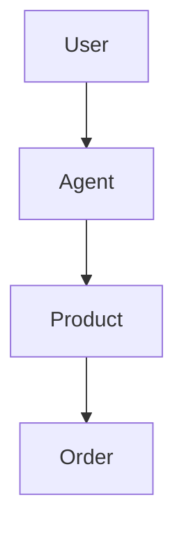
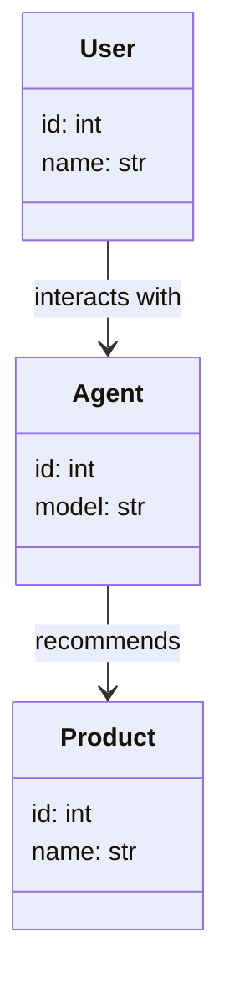
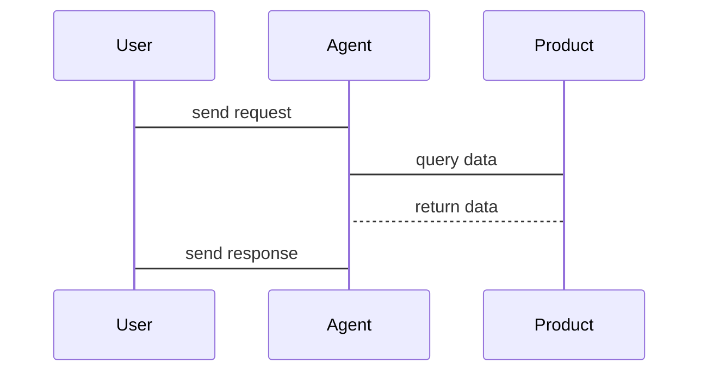

                 


---

# AI Agent在智能电子商务中的应用

> 关键词：AI Agent, 智能电子商务, 强化学习, 系统架构设计, 项目实战

> 摘要：本文系统地介绍了AI Agent在智能电子商务中的应用，从基本概念、核心原理、算法实现、系统架构设计到实际项目案例，逐步展开分析。文章首先阐述了AI Agent的基本概念与背景，然后深入探讨了其核心概念与技术原理，接着通过强化学习算法的实现与数学模型的推导，进一步分析了AI Agent的系统架构设计。最后，结合实际项目案例，详细讲解了AI Agent在智能电子商务中的具体应用，给出了代码实现与实际案例分析。

---

# 第一部分: AI Agent 在智能电子商务中的应用概述

# 第1章: AI Agent 的基本概念与背景介绍

## 1.1 AI Agent 的定义与核心要素
### 1.1.1 AI Agent 的基本概念
AI Agent（人工智能代理）是指能够感知环境并采取行动以实现目标的智能体。它能够通过传感器接收输入信息，经过内部处理和决策，输出动作以影响环境。AI Agent 的核心在于其智能性，能够根据环境反馈不断优化自身行为。

### 1.1.2 AI Agent 的核心属性与特征
AI Agent 的特征包括：
1. **自主性**：能够在没有外部干预的情况下自主运行。
2. **反应性**：能够实时感知环境并做出反应。
3. **目标导向**：通过设定目标来指导行为。
4. **学习能力**：能够通过经验优化自身策略。

### 1.1.3 AI Agent 的边界与外延
AI Agent 的边界在于其智能性和自主性，外延则包括从简单的行为决策到复杂的多智能体协同。

## 1.2 AI Agent 在智能电子商务中的问题背景
### 1.2.1 传统电子商务的局限性
传统电子商务主要依赖人工客服和固定推荐算法，难以满足用户个性化需求，且效率较低。

### 1.2.2 智能化需求的驱动因素
随着用户需求的多样化和市场竞争的加剧，企业需要更智能的解决方案来提升用户体验和效率。

### 1.2.3 AI Agent 在电商中的应用场景
AI Agent 可以应用于智能客服、个性化推荐、自动化交易、库存管理等领域。

## 1.3 AI Agent 解决问题的核心思路
### 1.3.1 从问题描述到解决方案
通过分析具体问题，设计 AI Agent 的目标函数和策略。

### 1.3.2 AI Agent 的任务分解与实现路径
将问题分解为感知、决策、执行三个阶段，并分别设计实现路径。

### 1.3.3 AI Agent 的目标与价值
通过优化用户交互和提升效率，实现企业价值最大化。

## 1.4 本章小结
本章从基本概念出发，分析了 AI Agent 的核心属性和在智能电子商务中的应用场景，为后续章节奠定了基础。

---

# 第二部分: AI Agent 的核心概念与技术原理

# 第2章: AI Agent 的核心概念与联系

## 2.1 AI Agent 的核心概念原理
### 2.1.1 感知层：信息采集与处理
AI Agent 通过传感器或API接口采集环境数据，并进行预处理和特征提取。

### 2.1.2 决策层：策略制定与优化
基于感知层的数据，AI Agent 使用强化学习等算法制定最优策略。

### 2.1.3 执行层：动作输出与反馈
根据决策层的策略，AI Agent 输出动作并接收环境反馈，形成闭环。

## 2.2 AI Agent 核心概念的属性对比
### 2.2.1 感知层与决策层的对比分析
感知层关注数据输入，决策层关注策略输出。

### 2.2.2 决策层与执行层的对比分析
决策层负责制定策略，执行层负责具体动作。

### 2.2.3 实体关系特征对比表格

| 属性 | 感知层 | 决策层 | 执行层 |
|------|--------|--------|--------|
| 输入  | 环境数据 | 策略 | 动作 |
| 输出 | 特征提取 | 动作 | 环境反馈 |
| 目标 | 数据处理 | 优化策略 | 输出动作 |

## 2.3 AI Agent 的实体关系架构
### 2.3.1 实体关系图（ER 图）设计



### 2.3.2 实体之间的关系分析
用户与 Agent 交互，Agent 与商品信息交互，商品与订单相关联。

### 2.3.3 实体关系图的 Mermaid 描述
如上图所示，用户与 Agent 交互，Agent 处理商品信息并生成订单。

---

# 第三部分: AI Agent 的算法原理与数学模型

# 第3章: AI Agent 的算法原理

## 3.1 AI Agent 的核心算法
### 3.1.1 强化学习（Reinforcement Learning）在 AI Agent 中的应用
强化学习是一种通过试错机制优化策略的算法，适用于动态环境中的决策问题。

### 3.1.2 Q-learning 算法的实现原理
Q-learning 是一种经典的强化学习算法，通过更新 Q 表来优化策略。

### 3.1.3 DQN（Deep Q-Network）算法的改进与优化
DQN 将 Q-learning 与深度学习结合，通过神经网络近似 Q 函数。

## 3.2 AI Agent 的数学模型

### 3.2.1 状态空间与动作空间
$$ S = \{s_1, s_2, ..., s_n\} $$
$$ A = \{a_1, a_2, ..., a_m\} $$

### 3.2.2 Q 值更新公式
$$ Q(s, a) = Q(s, a) + \alpha (r + \gamma \max Q(s', a') - Q(s, a)) $$

### 3.2.3 动作选择策略
ε-贪心策略：
$$ p(a) = \epsilon \cdot \frac{1}{|A|} + (1-\epsilon) \cdot \frac{\max Q(s, a)}{\sum Q(s, a)} $$

## 3.3 算法实现步骤
### 3.3.1 环境初始化
```python
class Environment:
    def __init__(self):
        self.state = None
    def reset(self):
        self.state = initial_state
    def step(self, action):
        # 返回新的状态和奖励
        return next_state, reward
```

### 3.3.2 Agent 类实现
```python
class Agent:
    def __init__(self, env):
        self.env = env
        self.Q = defaultdict(int)
    def act(self):
        # 选择动作
        action = self.choose_action()
        next_state, reward = self.env.step(action)
        self.update_Q(self.env.state, action, reward, next_state)
    def choose_action(self):
        # ε-贪心策略
        if random.random() < self.epsilon:
            return random.choice(self.env.actions)
        else:
            return np.argmax(self.Q[self.env.state])
    def update_Q(self, state, action, reward, next_state):
        self.Q[(state, action)] += self.learning_rate * (reward + self.gamma * max(self.Q[next_state, :]) - self.Q[(state, action)])
```

### 3.3.3 训练与测试
```python
env = Environment()
agent = Agent(env)
for episode in range(1000):
    env.reset()
    while not episode_done:
        agent.act()
```

## 3.4 本章小结
本章详细介绍了强化学习算法在 AI Agent 中的应用，包括 Q-learning 和 DQN 的实现原理，以及数学模型的推导。

---

# 第四部分: AI Agent 的系统架构设计

# 第4章: AI Agent 的系统架构设计

## 4.1 问题场景介绍
以智能客服系统为例，设计一个基于 AI Agent 的解决方案。

## 4.2 系统功能设计
### 4.2.1 领域模型设计



### 4.2.2 系统架构设计


## 4.3 系统接口设计
### 4.3.1 API 接口定义
```python
interface AgentInterface:
    def perceive(self, data):
        pass
    def decide(self, action):
        pass
```

### 4.3.2 API 实现
```python
class AgentImpl(AgentInterface):
    def perceive(self, data):
        # 处理数据
        pass
    def decide(self, action):
        # 制定决策
        pass
```

## 4.4 系统交互设计
### 4.4.1 序列图设计



## 4.5 本章小结
本章从系统架构设计的角度，详细介绍了 AI Agent 在智能电子商务中的实现方案。

---

# 第五部分: AI Agent 的项目实战

# 第5章: AI Agent 的项目实战

## 5.1 项目介绍
以智能推荐系统为例，设计一个基于 AI Agent 的推荐算法。

## 5.2 项目环境搭建
### 5.2.1 安装依赖
```bash
pip install numpy tensorflow pandas
```

## 5.3 项目核心实现
### 5.3.1 数据预处理
```python
import pandas as pd
data = pd.read_csv('products.csv')
```

### 5.3.2 模型训练
```python
import tensorflow as tf
model = tf.keras.Sequential([
    tf.keras.layers.Dense(64, activation='relu'),
    tf.keras.layers.Dense(1, activation='sigmoid')
])
model.compile(optimizer='adam', loss='binary_crossentropy')
model.fit(data, labels, epochs=10)
```

### 5.3.3 模型部署
```python
def recommend(user_id):
    user_data = data[data['user_id'] == user_id]
    predictions = model.predict(user_data)
    return user_data[predictions > 0.5]
```

## 5.4 实际案例分析
### 5.4.1 数据分析与建模
通过对用户行为数据进行分析，构建用户画像。

### 5.4.2 模型训练与优化
通过不断迭代优化模型参数，提升推荐准确率。

### 5.4.3 案例分析与结果解读
展示具体推荐结果，并分析模型效果。

## 5.5 项目小结
本章通过实际项目案例，详细讲解了 AI Agent 在智能推荐系统中的实现过程。

---

# 第六部分: 总结与展望

# 第6章: 总结与展望

## 6.1 本章总结
AI Agent 在智能电子商务中的应用前景广阔，能够显著提升用户体验和企业效率。

## 6.2 未来展望
随着技术进步，AI Agent 将向多智能体协同、边缘计算等方向发展。

## 6.3 最佳实践 tips
- 数据安全与隐私保护
- 模型的可解释性
- 多场景下的通用性

## 6.4 小结
AI Agent 的应用将推动电子商务进入智能化新时代。

---

# 作者

作者：AI天才研究院/AI Genius Institute & 禅与计算机程序设计艺术/Zen And The Art of Computer Programming

