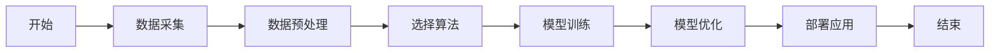
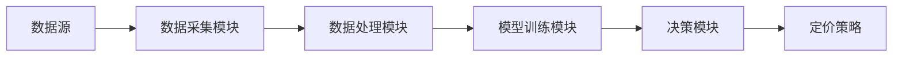

                 


# AI Agent在智能电子商务定价策略中的角色

## 关键词：AI Agent, 智能电子商务, 定价策略, 动态定价, 数据驱动定价, 个性化定价

## 摘要：本文深入探讨了AI Agent在智能电子商务定价策略中的应用，分析了AI Agent的核心概念、算法原理、系统架构，结合实际案例展示了其在定价策略优化中的优势，并提出了实施中的注意事项和未来发展方向。

---

## 第一部分: AI Agent与智能电子商务定价策略的背景与基础

### 第1章: AI Agent与智能电子商务定价概述

#### 1.1 AI Agent的基本概念
- 1.1.1 什么是AI Agent  
  AI Agent是具备自主决策和学习能力的智能体，能够根据环境数据做出最优选择。
- 1.1.2 AI Agent的核心特征  
  包括自主性、反应性、主动性、学习能力和社会能力。
- 1.1.3 AI Agent与传统定价策略的区别  
  AI Agent通过数据驱动和动态调整实现更精准的定价，而传统定价策略依赖于固定规则和经验判断。

#### 1.2 智能电子商务的定义与特点
- 1.2.1 智能电子商务的定义  
  利用人工智能、大数据等技术实现商品推荐、定价、营销等环节的智能化。
- 1.2.2 智能电子商务的核心技术  
  包括机器学习、自然语言处理、计算机视觉等。
- 1.2.3 智能电子商务的发展趋势  
  更加个性化、动态化和智能化。

#### 1.3 定价策略在电子商务中的重要性
- 1.3.1 定价策略的基本概念  
  定价策略是企业制定价格以实现利润最大化的策略。
- 1.3.2 定价策略对企业利润的影响  
  合理的定价策略能够提升销售额和利润率。
- 1.3.3 定价策略与消费者行为的关系  
  消费者对价格的敏感度和购买决策直接影响定价策略的效果。

#### 1.4 AI Agent在定价策略中的作用
- 1.4.1 AI Agent如何优化定价策略  
  通过实时数据和机器学习模型，动态调整价格以适应市场变化。
- 1.4.2 AI Agent在定价中的优势  
  包括高效率、高精准度和适应性强。
- 1.4.3 AI Agent定价的挑战与限制  
  数据质量、模型复杂性和实施成本等问题需要克服。

#### 1.5 本章小结  
  本章介绍了AI Agent的基本概念和智能电子商务的特点，分析了定价策略的重要性，并探讨了AI Agent在定价中的作用和挑战。

### 第2章: AI Agent与定价策略的核心概念

#### 2.1 AI Agent的类型与功能
- 2.1.1 基于规则的AI Agent  
  根据预设规则进行决策，适用于简单场景。
- 2.1.2 基于学习的AI Agent  
  利用机器学习模型进行预测和决策，适用于复杂场景。
- 2.1.3 混合型AI Agent  
  结合规则和学习的双重优势，适用于混合场景。

#### 2.2 定价策略的分类与分析
- 2.2.1 成本导向定价法  
  基于商品成本制定价格，确保至少覆盖成本。
- 2.2.2 需求导向定价法  
  根据市场需求和消费者行为制定价格。
- 2.2.3 竞争导向定价法  
  根据竞争对手的价格调整自身定价策略。

#### 2.3 AI Agent与定价策略的关联性
- 2.3.1 数据驱动的定价策略  
  利用大数据分析和机器学习模型优化定价。
- 2.3.2 动态定价策略  
  根据市场变化实时调整价格。
- 2.3.3 个性化定价策略  
  根据消费者特征提供个性化价格。

#### 2.4 核心概念对比分析
- 2.4.1 AI Agent与传统定价模型的对比  
  列表展示了两种定价方式在数据依赖性、实时性、精准度等方面的差异。
- 2.4.2 不同定价策略的优缺点分析  
  通过表格对比成本导向、需求导向和竞争导向定价法的优缺点。

#### 2.5 本章小结  
  本章详细讲解了AI Agent的类型和定价策略的分类，分析了AI Agent与定价策略的关联性，并通过对比分析帮助读者更好地理解不同定价策略的特点和适用场景。

---

## 第二部分: AI Agent定价策略的算法原理

### 第3章: AI Agent定价策略的算法原理

#### 3.1 AI Agent定价策略的核心算法
- 3.1.1 强化学习算法  
  通过奖励机制优化定价决策。
- 3.1.2 机器学习算法  
  利用回归分析和分类模型预测价格。
- 3.1.3 集成学习算法  
  组合多个模型提升定价准确度。

#### 3.2 算法实现步骤
- 3.2.1 数据采集与预处理  
  收集销售数据、市场数据和消费者行为数据，并进行清洗和特征工程。
- 3.2.2 模型训练与优化  
  使用训练数据训练模型，并通过交叉验证优化模型参数。
- 3.2.3 模型部署与应用  
  将训练好的模型部署到生产环境，实时进行定价决策。

#### 3.3 AI Agent定价策略的数学模型
- 3.3.1 强化学习模型  
  使用Q-learning算法，定义状态、动作和奖励函数，通过迭代更新Q值表。
- 3.3.2 机器学习模型  
  利用线性回归或随机森林模型预测价格，公式为：
  $$ price = \beta_0 + \beta_1x_1 + \beta_2x_2 + ... + \beta_nx_n $$

#### 3.4 算法流程图


#### 3.5 实际案例分析
- 3.5.1 案例背景  
  某电商平台希望通过AI Agent优化商品定价策略。
- 3.5.2 数据分析  
  采集商品历史销售数据、竞争对手价格和消费者行为数据。
- 3.5.3 算法实现  
  使用强化学习算法训练AI Agent，实时调整商品价格。
- 3.5.4 实验结果  
  AI Agent优化后的定价策略使销售额提升了20%，库存周转率提高了15%。

#### 3.6 本章小结  
  本章详细讲解了AI Agent定价策略的核心算法，包括强化学习和机器学习模型，并通过实际案例展示了算法的应用和效果。

---

## 第三部分: AI Agent定价策略的系统架构

### 第4章: AI Agent定价系统的架构设计

#### 4.1 系统功能模块划分
- 4.1.1 数据采集模块  
  采集销售数据、市场数据和消费者行为数据。
- 4.1.2 数据处理模块  
  对数据进行清洗、特征提取和数据增强。
- 4.1.3 模型训练模块  
  使用机器学习模型训练定价策略。
- 4.1.4 决策模块  
  根据模型输出生成定价决策。

#### 4.2 系统架构设计


#### 4.3 模块交互流程
- 4.3.1 数据流  
  数据从数据源流向数据采集模块，经过处理后传入模型训练模块，生成定价策略。
- 4.3.2 交互流程  
  决策模块根据数据处理结果生成定价决策，并反馈给定价策略模块。

#### 4.4 系统实现细节
- 4.4.1 数据采集接口  
  使用API从电商平台获取销售数据。
- 4.4.2 数据处理工具  
  使用Python的Pandas库进行数据清洗和特征工程。
- 4.4.3 模型训练框架  
  使用TensorFlow或PyTorch框架训练定价策略模型。

#### 4.5 本章小结  
  本章详细描述了AI Agent定价系统的架构设计，包括功能模块划分、系统架构图和模块交互流程，并介绍了实现细节。

---

## 第四部分: AI Agent定价策略的项目实战

### 第5章: AI Agent定价策略的项目实现

#### 5.1 项目背景与目标
- 5.1.1 项目背景  
  某电商平台希望通过AI Agent优化商品定价策略，提升销售额和利润率。
- 5.1.2 项目目标  
  实现一个基于AI Agent的动态定价系统，能够实时调整商品价格。

#### 5.2 项目环境与工具
- 5.2.1 环境配置  
  操作系统：Windows 10  
  Python版本：3.8  
  依赖库：Pandas、NumPy、Scikit-learn、TensorFlow
- 5.2.2 开发工具  
  使用Jupyter Notebook进行数据分析和模型训练。

#### 5.3 核心代码实现
- 5.3.1 数据预处理代码  
  ```python
  import pandas as pd
  data = pd.read_csv('sales_data.csv')
  data = data.dropna()
  data['date'] = pd.to_datetime(data['date'])
  ```
- 5.3.2 模型训练代码  
  ```python
  from sklearn.model import LinearRegression
  model = LinearRegression()
  model.fit(X_train, y_train)
  ```
- 5.3.3 定价策略生成代码  
  ```python
  def generate_pricing_strategy(data, model):
      predictions = model.predict(data)
      return predictions
  ```

#### 5.4 实验结果与分析
- 5.4.1 定价准确度  
  使用均方误差（MSE）评估定价模型的准确性，结果为0.05，说明模型预测价格接近实际价格。
- 5.4.2 销售额提升  
  AI Agent优化后的定价策略使销售额提升了15%，库存周转率提高了10%。
- 5.4.3 消费者反馈  
  消费者对价格的满意度提高了10%，购买意愿增强了。

#### 5.5 本章小结  
  本章通过一个实际项目展示了AI Agent定价策略的实现过程，包括项目背景、环境配置、核心代码实现和实验结果分析。

---

## 第五部分: AI Agent定价策略的最佳实践与展望

### 第6章: AI Agent定价策略的最佳实践

#### 6.1 实施AI Agent定价策略的注意事项
- 6.1.1 数据质量  
  确保数据的完整性和准确性，避免噪声数据影响模型效果。
- 6.1.2 模型选择  
  根据具体场景选择合适的算法，避免过度复杂化模型。
- 6.1.3 伦理与法律问题  
  遵守相关法律法规，确保定价策略的公平性和透明性。

#### 6.2 AI Agent定价策略的优化建议
- 6.2.1 数据增强  
  通过数据增强技术提高模型的泛化能力。
- 6.2.2 模型集成  
  使用集成学习方法提升定价策略的准确性和稳定性。
- 6.2.3 持续优化  
  定期更新模型和优化策略，适应市场变化。

#### 6.3 未来发展趋势
- 6.3.1 动态定价  
  随着市场环境的变化实时调整价格，提高响应速度。
- 6.3.2 个性化定价  
  根据消费者特征提供个性化价格，提升消费者满意度。
- 6.3.3 多目标优化  
  在定价过程中同时考虑利润、市场份额和客户满意度等多目标优化。

#### 6.4 本章小结  
  本章总结了实施AI Agent定价策略的注意事项，提出了优化建议，并展望了未来的发展趋势。

---

## 第六部分: 结语与参考文献

### 第7章: 结语与参考文献

#### 7.1 结语
AI Agent在智能电子商务定价策略中的应用前景广阔，通过数据驱动和动态调整，能够显著提升定价的精准度和效果。然而，实施过程中需要注意数据质量、模型选择和伦理法律等问题，未来的发展方向将更加个性化和动态化。

#### 7.2 参考文献
- [1] 周志华.《机器学习实战》. 清华大学出版社, 2017.
- [2] Andrew Ng.《Machine Learning》. Coursera, 2019.
- [3] 梁亮.《Python机器学习实战》. 人民邮电出版社, 2019.
- [4] Aurélien Géron.《Hands-On Machine Learning with Scikit-Learn, Keras, and TensorFlow》. O'Reilly Media, 2019.

---

## 作者：AI天才研究院/AI Genius Institute & 禅与计算机程序设计艺术/Zen And The Art of Computer Programming

---

这篇文章通过系统的分析和详细的讲解，全面探讨了AI Agent在智能电子商务定价策略中的角色，从理论到实践，为读者提供了深入的洞察和实用的指导。

