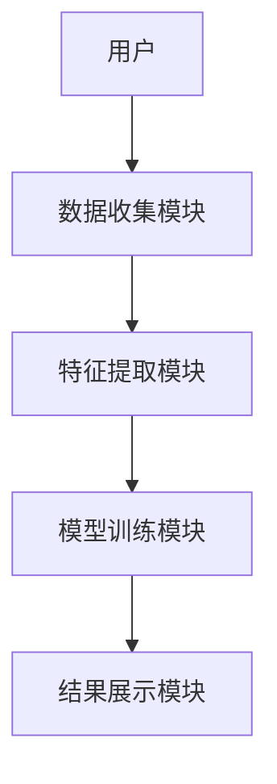
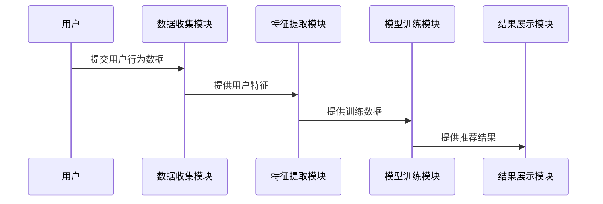

                 


# AI Agent在智能电子商务推荐中的角色

## 关键词：AI Agent, 智能推荐系统, 电子商务, 机器学习, 用户行为分析

## 摘要：  
本文探讨了AI Agent在智能电子商务推荐系统中的核心角色。随着电子商务的快速发展，推荐系统已成为提升用户体验和提高转化率的重要工具。AI Agent通过分析用户行为、偏好和实时数据，实现个性化推荐，从而优化用户购物体验。本文从AI Agent的基本概念、算法原理、系统架构、项目实战等多个角度进行深入分析，为读者提供全面的理解和实际应用指导。

---

# 第一部分: AI Agent与智能电子商务推荐概述

## 第1章: AI Agent在智能电子商务推荐中的背景与意义

### 1.1 智能电子商务推荐的发展历程  
电子商务推荐系统经历了从简单到复杂的演变。早期的推荐系统主要依赖于规则和统计方法，而如今，AI Agent的引入使得推荐更加智能化和个性化。  
- **传统推荐系统**：基于简单的规则（如“买过同类商品的用户也购买了该商品”）进行推荐，但缺乏灵活性和实时性。  
- **智能推荐系统**：利用机器学习和自然语言处理技术，结合用户行为、商品属性和实时数据，提供精准推荐。  

### 1.2 AI Agent的基本概念与特点  
AI Agent是一种智能代理，能够感知环境、执行任务并做出决策。在推荐系统中，AI Agent通过以下方式实现推荐：  
- **用户行为分析**：实时收集和分析用户的浏览、点击、购买等行为数据。  
- **偏好预测**：基于历史数据和实时行为，预测用户的潜在需求。  
- **动态调整**：根据用户的反馈和市场变化，动态优化推荐策略。  

### 1.3 本章小结  
本章介绍了智能电子商务推荐的发展历程和AI Agent的基本概念，强调了AI Agent在提升推荐精准性和实时性中的重要作用。

---

# 第二部分: AI Agent的核心概念与原理

## 第2章: AI Agent的核心概念与联系

### 2.1 AI Agent的实体关系分析  
AI Agent在推荐系统中涉及多个实体，包括用户、商品、推荐算法和反馈机制。通过ER图分析，我们可以清晰地看到各实体之间的关系：  
- **用户**：用户是推荐系统的核心，AI Agent通过分析用户行为和偏好生成推荐。  
- **商品**：商品是推荐的对象，AI Agent需要理解商品的属性和关联性。  
- **推荐算法**：算法是AI Agent的核心，负责生成推荐结果。  
- **反馈机制**：用户对推荐的反馈（如点击、购买）用于优化推荐算法。  

### 2.2 AI Agent的属性特征对比  
AI Agent与其他推荐方法（如协同过滤和基于内容的推荐）在以下方面存在差异：  
- **实时性**：AI Agent能够实时分析用户行为，提供动态推荐。  
- **个性化**：AI Agent结合用户行为、历史数据和实时反馈，提供高度个性化的推荐。  
- **复杂性**：AI Agent需要处理大量数据和复杂算法，但推荐结果更精准。  

### 2.3 AI Agent的核心算法流程  
AI Agent的推荐流程可以分为以下步骤：  
1. **数据收集**：收集用户行为、商品信息和市场数据。  
2. **特征提取**：提取用户和商品的特征，构建推荐模型。  
3. **模型训练**：利用机器学习算法训练推荐模型。  
4. **结果生成**：根据模型预测结果生成推荐列表。  
5. **反馈优化**：根据用户反馈优化推荐模型。  

---

# 第三部分: AI Agent的算法原理与数学模型

## 第3章: AI Agent的核心算法原理

### 3.1 协同过滤算法  
协同过滤是一种经典的推荐算法，通过用户之间的相似性进行推荐。  
- **基于用户的协同过滤**：找到与目标用户行为相似的用户群体，推荐他们购买的商品。  
- **基于商品的协同过滤**：找到与目标商品相似的商品，推荐给目标用户。  
- **混合协同过滤**：结合用户和商品的特征，进行综合推荐。  

### 3.2 基于深度学习的推荐算法  
深度学习在推荐系统中的应用越来越广泛。  
- **基于神经网络的推荐模型**：通过神经网络提取用户和商品的高维特征，生成推荐结果。  
- **基于Transformer的推荐模型**：利用Transformer结构捕捉商品之间的关系，提升推荐精度。  

### 3.3 算法实现代码示例  
以下是一个基于协同过滤的推荐算法示例：  
```python
def collaborative_filtering(user_matrix):
    similarity = user_matrix.T.dot(user_matrix)
    similarity[np.diag_indices(similarity.shape)] = 0
    top_matches = np.argmax(similarity, axis=1)
    return top_matches
```

### 3.4 数学模型与公式  
- **协同过滤的数学模型**：  
$$相似度 = \frac{\sum_{i=1}^{n}(x_i - \mu_u)(x_i - \mu_v)}{\sqrt{\sum_{i=1}^{n}(x_i - \mu_u)^2} \cdot \sqrt{\sum_{i=1}^{n}(x_i - \mu_v)^2}}$$  
- **深度学习模型的数学公式**：  
$$P(y|x) = \text{softmax}(Wx + b)$$  

---

# 第四部分: AI Agent的系统架构与实现

## 第4章: AI Agent的系统架构设计

### 4.1 问题场景介绍  
AI Agent在电子商务推荐中的应用场景包括：  
- **实时推荐**：根据用户的实时行为推荐商品。  
- **个性化推荐**：基于用户历史行为推荐商品。  
- **动态优化**：根据市场变化和用户反馈动态调整推荐策略。  

### 4.2 系统功能设计  
- **数据收集模块**：收集用户行为、商品信息和市场数据。  
- **特征提取模块**：提取用户和商品的特征，构建推荐模型。  
- **模型训练模块**：利用机器学习算法训练推荐模型。  
- **结果展示模块**：将推荐结果展示给用户。  

### 4.3 系统架构图  
以下是系统架构图：  


### 4.4 接口设计与交互图  
以下是接口交互图：  


---

# 第五部分: AI Agent的项目实战

## 第5章: AI Agent的项目实战

### 5.1 环境安装与配置  
- **安装Python和相关库**：如NumPy、Pandas、Scikit-learn等。  
- **安装推荐系统开发框架**：如Surprise或LightFM。  

### 5.2 系统核心实现  
以下是一个基于协同过滤的推荐系统实现：  
```python
from surprise import SVD
from surprise.dataset import Dataset
from surprise.model_selection import train_test_split

# 加载数据集
data = Dataset.load_from_df(train, reader)
trainset, testset = train_test_split(data, train_size=0.8)

# 训练模型
model = SVD()
model.fit(trainset)

# 预测结果
predictions = model.test(testset)
```

### 5.3 案例分析与效果评估  
通过实际案例分析推荐系统的准确性和召回率，评估模型的性能。  
- **准确率**：预测的推荐结果中有多少是用户真正感兴趣的商品。  
- **召回率**：预测的推荐结果中包含了多少用户感兴趣的商品。  

---

# 第六部分: 案例分析与优化

## 第6章: AI Agent在电子商务推荐中的案例分析

### 6.1 案例背景  
以某电商平台为例，分析AI Agent在推荐系统中的应用。  

### 6.2 系统优化  
- **数据优化**：引入实时数据和用户画像，提升推荐精准度。  
- **算法优化**：结合协同过滤和深度学习，提升推荐效果。  

---

# 第七部分: 总结与展望

## 第7章: 总结与展望

### 7.1 本章总结  
AI Agent通过分析用户行为和实时数据，实现精准的个性化推荐，显著提升了电子商务的用户体验和转化率。  

### 7.2 未来展望  
随着AI技术的不断发展，AI Agent在电子商务推荐中的应用将更加广泛和深入。未来的研究方向包括：  
- **多模态推荐**：结合图像、文本等多种数据源进行推荐。  
- **实时推荐**：利用实时数据流实现毫秒级推荐。  
- **联邦学习**：在保护用户隐私的前提下，实现跨平台推荐。  

---

# 作者：AI天才研究院 & 禅与计算机程序设计艺术  

---

**本文通过系统性地分析AI Agent在智能电子商务推荐中的角色，从理论到实践，为读者提供了全面的视角。希望本文能为相关领域的研究者和开发者提供有价值的参考。**

