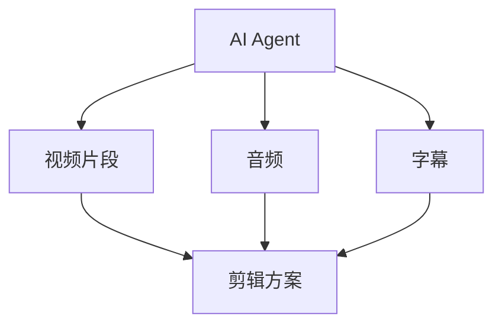
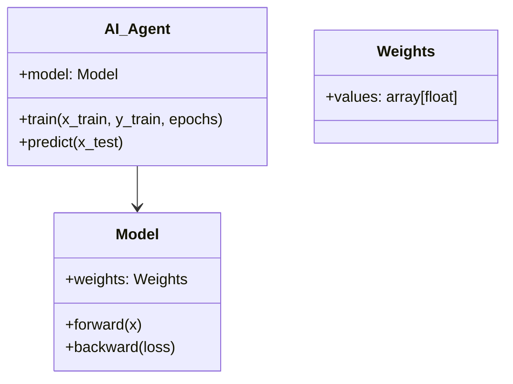
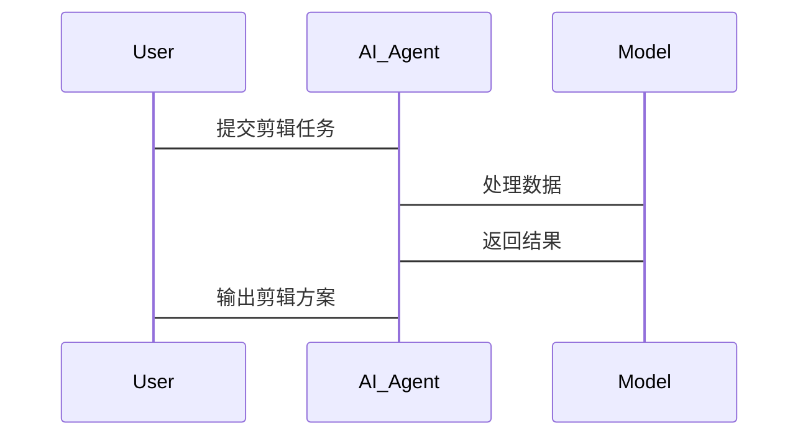

                 


# AI Agent在智能电影剪辑中的实践

## 关键词：
AI Agent, 智能电影剪辑, 机器学习, 深度学习, 自动化剪辑, 视频处理

## 摘要：
本文探讨了AI Agent在智能电影剪辑中的应用，通过分析传统电影剪辑的流程与挑战，结合AI技术的核心概念，详细阐述了AI Agent在电影剪辑中的核心原理、算法实现、系统架构设计以及实际项目中的应用。文章从背景介绍、核心概念、算法原理、系统分析、项目实战到最佳实践，层层深入，为读者提供了一套完整的AI Agent在智能电影剪辑中的实践方案。

---

## 第一部分: AI Agent与智能电影剪辑的背景与概念

### 第1章: AI Agent的基本概念与电影剪辑的结合

#### 1.1 AI Agent的定义与核心功能
##### 1.1.1 AI Agent的基本概念
AI Agent（人工智能代理）是一种能够感知环境并采取行动以实现目标的智能体。在电影剪辑中，AI Agent可以作为辅助工具，帮助剪辑师快速处理视频素材、优化剪辑流程并生成高质量的剪辑内容。

##### 1.1.2 AI Agent的核心功能与特点
AI Agent的核心功能包括：
1. **数据处理**：能够自动识别和处理视频中的图像、音频、字幕等多模态数据。
2. **智能决策**：基于上下文信息，AI Agent可以自动选择最佳的剪辑方案。
3. **自动化操作**：能够自动执行剪辑任务，如剪切视频片段、添加转场效果、生成字幕等。

AI Agent的特点包括：
- **智能化**：能够理解视频内容并做出决策。
- **自动化**：能够在最小人工干预的情况下完成任务。
- **高效性**：能够快速处理大量数据并生成结果。

##### 1.1.3 AI Agent与传统电影剪辑工具的区别
AI Agent与传统剪辑工具的区别如下：

| 特性                | AI Agent                          | 传统剪辑工具                     |
|---------------------|----------------------------------|---------------------------------|
| 智能性              | 高                                | 低                              |
| 自动化能力          | 强                                | 弱                              |
| 决策能力            | 可以基于上下文做出决策          | 需要人工干预                     |
| 处理效率            | 高效                             | 依赖人工操作速度                 |

#### 1.2 电影剪辑的流程与挑战
##### 1.2.1 传统电影剪辑的流程概述
传统电影剪辑的流程通常包括以下几个步骤：
1. **素材收集**：收集拍摄的视频素材。
2. **素材整理**：将素材分类整理，标记关键帧。
3. **剪辑初稿**：根据剧本或导演的要求，手动剪辑素材。
4. **效果添加**：添加转场效果、字幕、音效等。
5. **预览与调整**：多次预览剪辑内容，进行细节调整。

##### 1.2.2 电影剪辑中的常见问题与挑战
在传统电影剪辑中，剪辑师通常面临以下挑战：
1. **时间成本**：处理大量素材需要大量时间。
2. **人工误差**：手动剪辑容易出现遗漏或错误。
3. **创意限制**：剪辑师的创意可能受限于技术能力或经验。

##### 1.2.3 AI技术在电影剪辑中的潜在价值
AI技术可以显著提升电影剪辑的效率和质量：
1. **自动化处理**：AI可以自动识别和分类素材，减少人工操作。
2. **智能推荐**：AI可以根据上下文推荐最佳的剪辑方案。
3. **高效创作**：AI可以帮助剪辑师快速生成创意剪辑内容。

#### 1.3 AI Agent在电影剪辑中的应用现状
##### 1.3.1 当前AI技术在电影行业的应用领域
目前，AI技术在电影行业中的应用主要集中在以下几个领域：
1. **剧本生成**：利用自然语言处理技术生成剧本草稿。
2. **角色动画**：通过AI生成角色动作和表情。
3. **视觉效果**：利用深度学习技术生成特效场景。
4. **音频处理**：自动合成背景音乐和音效。

##### 1.3.2 AI Agent在电影剪辑中的具体应用场景
AI Agent在电影剪辑中的应用场景包括：
1. **自动剪辑**：AI Agent可以根据剧本自动生成剪辑方案。
2. **智能推荐**：AI Agent可以根据导演的意图推荐最佳的剪辑片段。
3. **实时调整**：AI Agent可以在剪辑过程中实时调整效果，提高效率。

##### 1.3.3 当前技术的局限性与未来发展方向
当前AI Agent在电影剪辑中的应用还存在一些局限性：
1. **创意多样性**：AI生成的内容可能缺乏人类的创意多样性。
2. **复杂场景处理**：在处理复杂场景时，AI Agent的表现可能不如人类专家。

未来发展方向包括：
1. **增强创意能力**：通过改进算法，提升AI Agent的创意能力。
2. **多模态处理**：实现对视频、音频、文本等多种数据的协同处理。
3. **实时交互**：提升AI Agent与人类用户的实时交互能力。

### 第2章: AI Agent在智能电影剪辑中的核心概念与联系

#### 2.1 AI Agent的核心概念原理
##### 2.1.1 AI Agent的基本工作原理
AI Agent的核心工作原理包括以下几个步骤：
1. **感知环境**：AI Agent通过传感器或输入数据感知环境。
2. **理解环境**：AI Agent利用机器学习模型理解感知到的数据。
3. **决策制定**：基于理解的结果，AI Agent制定行动方案。
4. **执行操作**：根据决策结果执行具体的剪辑操作。

##### 2.1.2 AI Agent在电影剪辑中的具体实现方式
AI Agent在电影剪辑中的具体实现方式包括：
1. **基于规则的剪辑**：根据预设的规则自动剪辑视频片段。
2. **基于深度学习的剪辑**：利用深度学习模型生成剪辑方案。
3. **基于强化学习的剪辑**：通过强化学习优化剪辑效果。

##### 2.1.3 AI Agent与电影剪辑数据的关系
AI Agent与电影剪辑数据的关系如下：
- AI Agent通过处理剪辑数据来实现剪辑功能。
- 剪辑数据包括视频片段、音频、字幕等多种数据类型。
- AI Agent可以通过分析剪辑数据，生成高质量的剪辑内容。

#### 2.2 AI Agent与电影剪辑的核心要素对比
##### 2.2.1 AI Agent的核心属性特征对比表
以下是AI Agent与电影剪辑的核心要素对比表：

| 特性                | AI Agent                          | 电影剪辑                         |
|---------------------|----------------------------------|---------------------------------|
| 输入数据            | 视频片段、音频、文本             | 视频片段、音频、文本             |
| 处理方式            | 深度学习、强化学习               | 手动剪辑、后期处理               |
| 输出结果            | 自动剪辑方案、效果优化建议       | 手动剪辑方案、效果调整           |

##### 2.2.2 电影剪辑中的关键要素分析
电影剪辑的关键要素包括：
1. **视频片段**：剪辑的原始素材。
2. **音频**：包括背景音乐和音效。
3. **字幕**：需要在适当的位置添加字幕。
4. **转场效果**：剪辑时需要添加转场效果。

##### 2.2.3 AI Agent与电影剪辑要素的关联关系
AI Agent与电影剪辑要素的关联关系如下：
- AI Agent通过处理视频片段生成剪辑方案。
- AI Agent可以自动添加字幕和转场效果。
- AI Agent可以根据音频内容优化剪辑效果。

#### 2.3 AI Agent与电影剪辑的实体关系图
以下是AI Agent与电影剪辑的实体关系图：



---

## 第二部分: AI Agent在智能电影剪辑中的算法原理与实现

### 第3章: AI Agent的算法原理与实现

#### 3.1 选择合适的AI算法
##### 3.1.1 选择算法的依据
选择AI算法的依据包括：
1. **任务类型**：剪辑任务属于多模态数据处理任务。
2. **数据规模**：电影剪辑数据通常较大，需要高效的算法。
3. **计算资源**：需要考虑计算资源的限制。

##### 3.1.2 算法选择
基于上述分析，选择以下算法：
1. **Transformer模型**：用于处理多模态数据。
2. **强化学习算法**：用于优化剪辑效果。

#### 3.2 使用Transformer模型进行多模态数据处理
##### 3.2.1 Transformer模型的结构
Transformer模型的结构包括编码器和解码器，每个部分都包含自注意力机制。

##### 3.2.2 多模态数据的融合
通过将视频、音频和文本数据进行融合，生成统一的表示。

##### 3.2.3 Transformer模型的训练
使用多模态数据对模型进行训练，使其能够理解不同类型的剪辑需求。

#### 3.3 强化学习算法的应用
##### 3.3.1 强化学习的基本原理
强化学习通过奖励机制优化动作选择。

##### 3.3.2 剪辑效果的评价指标
剪辑效果的评价指标包括：
1. **剪辑流畅度**：剪辑后的视频是否流畅。
2. **情感一致性**：剪辑内容是否符合电影的情感走向。
3. **视觉效果**：剪辑后的视觉效果是否美观。

##### 3.3.3 剪辑优化的实现
通过强化学习优化剪辑效果，具体步骤如下：
1. **定义状态空间**：包括视频片段、音频和字幕信息。
2. **定义动作空间**：包括剪切、转场等操作。
3. **定义奖励函数**：根据剪辑效果评价指标定义奖励函数。

#### 3.4 算法实现
##### 3.4.1 环境安装与配置
安装必要的Python库，如TensorFlow、PyTorch等。

##### 3.4.2 核心代码实现
以下是AI Agent的核心代码实现：

```python
import tensorflow as tf
from tensorflow.keras import layers

class AI_Agent:
    def __init__(self):
        self.model = self.build_model()

    def build_model(self):
        inputs = layers.Input(shape=(None, 512))
        x = layers.Dense(512, activation='relu')(inputs)
        x = layers.Dense(256, activation='relu')(x)
        outputs = layers.Dense(1, activation='sigmoid')(x)
        model = tf.keras.Model(inputs=inputs, outputs=outputs)
        model.compile(optimizer='adam', loss='binary_crossentropy')
        return model

    def train(self, x_train, y_train, epochs=10):
        self.model.fit(x_train, y_train, epochs=epochs)

    def predict(self, x_test):
        return self.model.predict(x_test)
```

##### 3.4.3 算法实现的数学模型与公式
以下是AI Agent的数学模型：

$$
\text{输入：} x \in \mathbb{R}^{n \times 512}
$$

$$
\text{输出：} y \in \{0,1\}
$$

模型的损失函数为：
$$
L = -y \log(p) - (1 - y) \log(1 - p)
$$

模型的优化目标为：
$$
\min_{\theta} \mathbb{E}_{x,y}[L]
$$

其中，θ为模型参数。

#### 3.5 算法实现的详细步骤
##### 3.5.1 数据预处理
将视频、音频和字幕数据进行预处理，生成统一的向量表示。

##### 3.5.2 模型训练
使用预处理后的数据对模型进行训练，优化模型参数。

##### 3.5.3 剪辑效果的评估
通过剪辑效果的评价指标评估模型的性能，调整模型参数以优化剪辑效果。

---

## 第三部分: AI Agent在智能电影剪辑中的系统分析与架构设计

### 第4章: 系统分析与架构设计

#### 4.1 问题场景介绍
##### 4.1.1 电影剪辑的场景描述
电影剪辑的场景通常包括素材收集、素材整理、剪辑初稿生成、效果添加和预览调整。

##### 4.1.2 AI Agent在剪辑中的具体任务
AI Agent需要完成以下任务：
1. **自动剪辑**：根据剧本自动生成剪辑方案。
2. **智能推荐**：推荐最佳的剪辑片段。
3. **实时调整**：根据反馈实时优化剪辑效果。

#### 4.2 项目介绍
##### 4.2.1 项目目标
本项目旨在开发一个基于AI Agent的智能电影剪辑系统，提升剪辑效率和质量。

##### 4.2.2 项目范围
项目范围包括：
1. **素材处理**：自动处理视频、音频和字幕数据。
2. **剪辑生成**：自动生成剪辑方案。
3. **效果优化**：优化剪辑效果。

##### 4.2.3 项目约束
项目约束包括：
1. **计算资源限制**：剪辑系统需要在有限的计算资源下运行。
2. **数据隐私**：确保剪辑数据的隐私安全。

#### 4.3 系统功能设计
##### 4.3.1 领域模型（Mermaid类图）
以下是系统的领域模型：



##### 4.3.2 系统架构设计（Mermaid架构图）
以下是系统的架构设计：

```mermaid
container AI剪辑系统 {
    component AI_Agent {
        Model
        Weights
    }
    component 剪辑数据 {
        视频片段
        音频
        字幕
    }
    component 剪辑输出 {
        剪辑方案
        效果优化建议
    }
}
```

##### 4.3.3 系统接口设计
系统接口设计包括：
1. **输入接口**：接收视频、音频和字幕数据。
2. **输出接口**：输出剪辑方案和效果优化建议。

##### 4.3.4 系统交互设计（Mermaid序列图）
以下是系统的交互设计：



---

## 第四部分: AI Agent在智能电影剪辑中的项目实战

### 第5章: 项目实战

#### 5.1 环境安装与配置
##### 5.1.1 安装Python和必要的库
安装Python和以下库：
- TensorFlow
- PyTorch
- OpenCV
- NumPy

##### 5.1.2 安装与配置AI剪辑工具
安装并配置AI剪辑工具，如Adobe Premiere Pro插件。

#### 5.2 系统核心实现
##### 5.2.1 AI Agent的核心实现
以下是AI Agent的核心实现代码：

```python
import tensorflow as tf
from tensorflow.keras import layers

class AI_Agent:
    def __init__(self):
        self.model = self.build_model()

    def build_model(self):
        inputs = layers.Input(shape=(None, 512))
        x = layers.Dense(512, activation='relu')(inputs)
        x = layers.Dense(256, activation='relu')(x)
        outputs = layers.Dense(1, activation='sigmoid')(x)
        model = tf.keras.Model(inputs=inputs, outputs=outputs)
        model.compile(optimizer='adam', loss='binary_crossentropy')
        return model

    def train(self, x_train, y_train, epochs=10):
        self.model.fit(x_train, y_train, epochs=epochs)

    def predict(self, x_test):
        return self.model.predict(x_test)
```

##### 5.2.2 剪辑数据的预处理
将视频、音频和字幕数据进行预处理，生成统一的向量表示。

##### 5.2.3 剪辑效果的评估
通过剪辑效果的评价指标评估剪辑质量，优化AI Agent的性能。

#### 5.3 项目实战的详细步骤
##### 5.3.1 环境搭建
安装必要的软件和库，配置开发环境。

##### 5.3.2 数据准备
收集并整理视频、音频和字幕数据，进行预处理。

##### 5.3.3 模型训练
使用预处理后的数据对AI Agent进行训练，优化模型参数。

##### 5.3.4 剪辑效果测试
通过测试剪辑效果，评估AI Agent的性能，进行必要的调整。

##### 5.3.5 项目总结
总结项目的实施过程，分析AI Agent在智能电影剪辑中的优势和不足。

---

## 第五部分: 最佳实践与总结

### 第6章: 最佳实践与总结

#### 6.1 最佳实践
##### 6.1.1 环境配置建议
建议使用高性能计算资源，如GPU加速。

##### 6.1.2 数据预处理技巧
建议使用标准化和归一化的数据预处理方法。

##### 6.1.3 模型优化技巧
建议使用早停法和学习率调整等技巧优化模型性能。

#### 6.2 小结
AI Agent在智能电影剪辑中的应用前景广阔，能够显著提升剪辑效率和质量。

#### 6.3 注意事项
在实际应用中，需要注意数据隐私和模型的泛化能力。

#### 6.4 拓展阅读
建议读者进一步阅读相关文献，深入了解AI在电影行业的应用。

---

## 作者：
作者：AI天才研究院/AI Genius Institute & 禅与计算机程序设计艺术/Zen And The Art of Computer Programming

