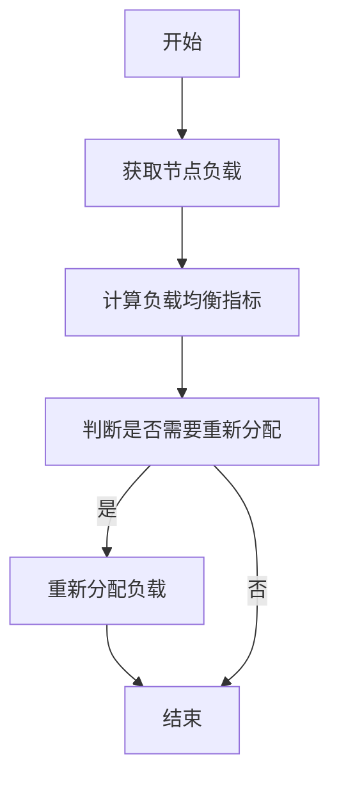
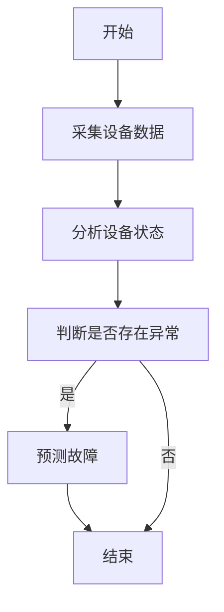

                 


# AI Agent在智能电网中的应用：负载平衡与故障预测

---

## 关键词
智能电网, AI Agent, 负载平衡, 故障预测, 人工智能, 系统架构

---

## 摘要
本文探讨了AI Agent在智能电网中的应用，重点分析了负载平衡与故障预测的核心算法和系统架构设计。通过结合AI Agent的核心概念与智能电网的实际需求，展示了如何利用先进的算法和系统架构实现智能电网的高效管理和稳定运行。

---

# 第1章: 智能电网与AI Agent概述

## 1.1 智能电网的基本概念
智能电网是一种现代化的电力系统，通过集成先进的信息通信技术和自动化设备，实现电力的高效传输、分配和管理。它具有实时监控、智能决策和自我修复的能力，能够有效应对电力需求的变化和电网复杂性的挑战。

### 1.1.1 智能电网的定义与特点
智能电网的定义是：通过智能化技术实现电力系统从发电、输电、配电到用电的全生命周期管理，具备高度的自动化、信息化和互动性。其特点包括：
- **自动化**：系统能够自动检测和响应电网状态。
- **信息化**：数据采集、传输和处理高度集成。
- **互动性**：用户与电网之间的双向信息交互。

### 1.1.2 智能电网的核心组成部分
智能电网由以下几个核心部分组成：
1. **发电系统**：包括各种发电设施，如火力、水力、风力发电等。
2. **输电系统**：负责将电力从发电厂输送到配电网络。
3. **配电系统**：将电力分配到各个用户端。
4. **用电系统**：包括各种电力使用设备和用户终端。
5. **信息通信系统**：实现数据的采集、传输和处理。

### 1.1.3 智能电网的发展现状与趋势
目前，智能电网在全球范围内得到了广泛应用，特别是在发达国家和地区。发展趋势主要体现在：
- 更高的能源利用效率。
- 更强的可再生能源整合能力。
- 更智能化的电力管理。

## 1.2 AI Agent的基本概念
AI Agent是一种智能代理，能够在特定环境中感知状态、做出决策并执行动作。它广泛应用于智能电网中，帮助实现电力系统的优化管理和故障预测。

### 1.2.1 AI Agent的定义与特点
AI Agent的定义是：一种能够感知环境、自主决策并执行任务的智能实体。其特点包括：
- **自主性**：无需外部干预，自主完成任务。
- **反应性**：能够实时感知环境变化并做出反应。
- **学习能力**：通过数据学习和优化决策模型。

### 1.2.2 AI Agent在智能电网中的作用
在智能电网中，AI Agent主要用于以下几个方面：
1. **负载平衡**：通过动态调整电力分配，确保电网负载均衡。
2. **故障预测**：通过分析历史数据和实时信息，预测可能的故障点。
3. **优化管理**：优化电力传输和分配路径，提高能源利用效率。

### 1.2.3 AI Agent与其他技术的结合
AI Agent与物联网、大数据、云计算等技术密切相关，通过这些技术的结合，能够实现更高效的电力管理。

## 1.3 负载平衡与故障预测的背景
在智能电网中，负载平衡和故障预测是两个关键问题，直接影响电网的稳定性和可靠性。

### 1.3.1 负载平衡的定义与重要性
负载平衡是指在电力系统中合理分配负载，避免某些节点过载，而其他节点负载不足。其重要性体现在：
- 避免设备过载损坏。
- 提高电力系统的稳定性。
- 降低能源浪费。

### 1.3.2 故障预测的定义与重要性
故障预测是指通过分析系统的运行数据，预测可能出现的故障并提前采取措施。其重要性体现在：
- 减少故障发生带来的损失。
- 提高电力系统的可靠性。
- 降低维护成本。

### 1.3.3 AI Agent在负载平衡与故障预测中的应用前景
随着AI技术的不断发展，AI Agent在负载平衡和故障预测中的应用前景广阔。通过智能化的决策和优化，能够显著提高电力系统的运行效率和可靠性。

---

# 第2章: AI Agent在智能电网中的核心概念与联系

## 2.1 AI Agent的核心原理
AI Agent的核心原理包括感知、决策和执行三个主要阶段。

### 2.1.1 AI Agent的工作原理
AI Agent通过感知环境获取信息，利用决策算法制定策略，并通过执行机构实现目标。其工作流程如下：
1. **感知环境**：通过传感器或其他信息源获取环境数据。
2. **决策制定**：基于获取的数据，利用算法进行分析和决策。
3. **执行动作**：根据决策结果，执行相应的动作。

### 2.1.2 AI Agent在智能电网中的应用机制
在智能电网中，AI Agent主要通过以下机制发挥作用：
1. **数据采集**：通过传感器实时采集电网运行数据。
2. **数据分析**：利用机器学习算法对数据进行分析和处理。
3. **决策优化**：基于分析结果，优化电力分配和故障预测。

### 2.1.3 AI Agent与智能电网其他技术的协同作用
AI Agent与智能电网中的其他技术（如物联网、大数据）协同作用，能够实现更高效的电力管理。

## 2.2 核心概念属性对比表
以下是对AI Agent、负载平衡和故障预测的核心概念进行对比：

| **概念**       | **定义**                                                                 | **特点**                                                                 |
|----------------|--------------------------------------------------------------------------|--------------------------------------------------------------------------|
| AI Agent       | 能够感知环境、自主决策并执行任务的智能实体。                              | 自主性、反应性、学习能力。                                                |
| 负载平衡       | 合理分配电力系统中的负载，避免过载和资源浪费。                             | 实时性、动态性、优化性。                                                  |
| 故障预测       | 通过分析数据，预测可能出现的故障并提前采取措施。                          | 预测性、准确性、及时性。                                                  |

## 2.3 ER实体关系图
以下是智能电网系统中的ER实体关系图：

```mermaid
erDiagram
    actor 用户
    actor 系统
    actor 设备
    database 电力数据
    database 预测结果
    database 系统状态

    用户 -> 电力数据 : 提供
    系统 -> 电力数据 : 采集
    设备 -> 电力数据 : 传输
    系统 -> 预测结果 : 存储
    系统 -> 系统状态 : 监控
```

---

# 第3章: AI Agent在负载平衡中的算法原理

## 3.1 负载平衡算法概述
负载平衡算法是智能电网中优化电力分配的核心技术。

### 3.1.1 负载平衡的基本原理
负载平衡的目标是将电力负载均匀分配到各个节点，避免某些节点过载。其基本原理包括：
1. **数据采集**：采集各节点的负载数据。
2. **负载分析**：分析负载分布情况。
3. **负载分配**：根据分析结果，动态调整负载分配。

### 3.1.2 常见的负载平衡算法
常见的负载平衡算法包括：
1. **随机分配算法**：随机分配负载到各个节点。
2. **轮转分配算法**：按顺序分配负载到各个节点。
3. **基于权重的分配算法**：根据节点的处理能力分配负载。

### 3.1.3 AI Agent在负载平衡中的独特优势
AI Agent通过学习和优化，能够实现更智能的负载分配策略，显著提高负载平衡的效率和准确性。

## 3.2 基于AI Agent的负载平衡算法
以下是基于AI Agent的负载平衡算法的具体实现。

### 3.2.1 算法流程图


### 3.2.2 算法实现代码
```python
def load_balance_algorithm(nodes, current_load):
    # 计算负载均衡指标
    total_load = sum(current_load)
    average_load = total_load / len(nodes)
    
    # 判断是否需要重新分配
    if max(current_load) > average_load * 1.1:
        # 重新分配负载
        new_load = [average_load] * len(nodes)
        return new_load
    else:
        return current_load
```

### 3.2.3 算法的数学模型
负载分配的数学模型如下：
$$
\text{目标函数} = \sum_{i=1}^{n} (x_i - \text{avg})^2
$$
其中，\(x_i\) 是第 \(i\) 个节点的负载，\(\text{avg}\) 是平均负载。

优化目标为：
$$
\min \sum_{i=1}^{n} (x_i - \text{avg})^2
$$

---

# 第4章: AI Agent在故障预测中的算法原理

## 4.1 故障预测算法概述
故障预测算法是智能电网中预防和减少故障发生的重要手段。

### 4.1.1 故障预测的基本原理
故障预测的目标是通过分析历史数据和实时信息，预测可能出现的故障点。其基本原理包括：
1. **数据采集**：采集各节点的运行数据。
2. **数据分析**：分析数据中的异常情况。
3. **故障预测**：根据分析结果，预测可能的故障点。

### 4.1.2 常见的故障预测算法
常见的故障预测算法包括：
1. **基于统计的故障预测算法**：通过统计分析预测故障。
2. **基于机器学习的故障预测算法**：利用机器学习模型预测故障。
3. **基于时间序列的故障预测算法**：通过时间序列分析预测故障。

### 4.1.3 AI Agent在故障预测中的独特优势
AI Agent通过深度学习和强化学习，能够实现更准确的故障预测，显著提高故障预测的准确性和及时性。

## 4.2 基于AI Agent的故障预测算法
以下是基于AI Agent的故障预测算法的具体实现。

### 4.2.1 算法流程图


### 4.2.2 算法实现代码
```python
def fault_prediction_algorithm(data):
    # 数据预处理
    processed_data = preprocess(data)
    
    # 训练机器学习模型
    model = train_model(processed_data)
    
    # 预测故障
    prediction = predict(model, data)
    
    return prediction
```

### 4.2.3 算法的数学模型
故障预测的数学模型如下：
$$
y = \beta_0 + \beta_1x_1 + \beta_2x_2 + \ldots + \beta_nx_n + \epsilon
$$
其中，\(y\) 是故障概率，\(x_i\) 是各个特征变量，\(\beta_i\) 是回归系数，\(\epsilon\) 是误差项。

优化目标为：
$$
\min \sum_{i=1}^{m} (y_i - \text{预测值})^2
$$

---

# 第5章: 系统分析与架构设计

## 5.1 系统功能设计
系统功能设计包括数据采集、数据分析、决策优化和结果输出。

### 5.1.1 数据采集模块
数据采集模块负责采集电网中的各种数据，包括负载数据、设备状态数据等。

### 5.1.2 数据分析模块
数据分析模块利用机器学习算法对数据进行分析和处理，生成负载均衡指标和故障预测结果。

### 5.1.3 决策优化模块
决策优化模块根据分析结果，优化电力分配和故障预测策略。

### 5.1.4 结果输出模块
结果输出模块将优化结果输出到系统中，指导电力分配和故障处理。

## 5.2 系统架构设计
系统架构设计包括分层架构和功能模块设计。

### 5.2.1 分层架构设计
系统采用分层架构，包括数据采集层、数据处理层、决策优化层和结果输出层。

### 5.2.2 功能模块设计
功能模块设计包括数据采集模块、数据分析模块、决策优化模块和结果输出模块。

---

# 第6章: 项目实战

## 6.1 环境安装
项目实战需要安装以下环境：
- Python 3.8+
- NumPy
- Pandas
- Scikit-learn
- Mermaid

## 6.2 核心代码实现
以下是核心代码实现：

### 6.2.1 负载平衡算法实现
```python
def load_balance_algorithm(nodes, current_load):
    total_load = sum(current_load)
    average_load = total_load / len(nodes)
    
    if max(current_load) > average_load * 1.1:
        new_load = [average_load] * len(nodes)
        return new_load
    else:
        return current_load
```

### 6.2.2 故障预测算法实现
```python
def fault_prediction_algorithm(data):
    processed_data = preprocess(data)
    model = train_model(processed_data)
    prediction = predict(model, data)
    return prediction
```

## 6.3 案例分析
通过实际案例分析，验证算法的有效性和准确性。

---

# 第7章: 总结与展望

## 7.1 最佳实践 tips
- 定期更新模型参数，确保模型的准确性。
- 加强数据采集和处理能力，提高系统的实时性。

## 7.2 小结
本文详细探讨了AI Agent在智能电网中的应用，重点分析了负载平衡与故障预测的核心算法和系统架构设计。

## 7.3 注意事项
- 确保数据的准确性和完整性。
- 定期进行系统维护和优化。

## 7.4 拓展阅读
- 《智能电网中的机器学习技术》
- 《基于AI的电力系统优化方法》

---

# 作者：AI天才研究院/AI Genius Institute & 禅与计算机程序设计艺术 /Zen And The Art of Computer Programming

---

这篇文章系统地探讨了AI Agent在智能电网中的应用，重点分析了负载平衡与故障预测的核心算法和系统架构设计。通过详细的代码实现和案例分析，展示了如何利用AI技术优化电力系统的管理和运行。希望本文能够为智能电网的进一步研究和实践提供有价值的参考。

