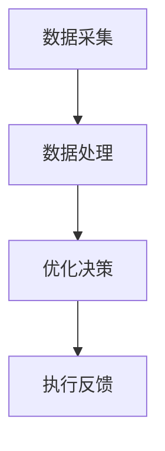

                 


# AI Agent在智能电网优化中的应用

> 关键词：智能电网, AI Agent, 优化算法, 强化学习, 能源管理

> 摘要：本文详细探讨了AI Agent在智能电网优化中的应用，从AI Agent的基本原理到智能电网的体系结构，再到具体的优化算法和项目实战，全面分析了AI Agent在智能电网优化中的优势和实现方法。

---

## 第1章: AI Agent与智能电网优化概述

### 1.1 AI Agent的基本概念

#### 1.1.1 什么是AI Agent
AI Agent（人工智能代理）是指能够感知环境、做出决策并执行动作的智能体。它通过与环境交互，实现特定目标。AI Agent可以是软件程序或物理设备，具备自主性、反应性和学习能力。

#### 1.1.2 AI Agent的核心特征
- **自主性**：AI Agent能够独立决策和行动，无需人工干预。
- **反应性**：能够实时感知环境并做出响应。
- **学习能力**：通过数据和经验不断优化自身行为。
- **协作性**：能够与其他AI Agent或系统协同工作。

#### 1.1.3 AI Agent与传统自动化的区别
AI Agent不仅仅是简单的自动化工具，它具备学习和适应能力，能够处理复杂和不确定的环境。传统的自动化系统通常基于固定的规则，而AI Agent可以根据动态环境调整策略。

### 1.2 智能电网的基本概念

#### 1.2.1 智能电网的定义与特点
智能电网是一种集成现代信息技术的电力系统，能够实时监测、分析和优化电力的生产、传输和消费。它具有智能化、高效化和环保化的特点。

#### 1.2.2 智能电网的组成部分
智能电网主要由发电、输电、配电、用电和电力市场五个部分组成。通过传感器、通信技术和数据分析，实现电力系统的智能管理。

#### 1.2.3 智能电网的发展现状
随着能源结构的多样化和环保需求的增加，智能电网在全球范围内得到了广泛应用。各国政府和企业都在积极推动智能电网的建设，以提高能源利用效率和降低碳排放。

### 1.3 AI Agent在智能电网优化中的应用

#### 1.3.1 智能电网优化的核心问题
智能电网优化主要解决以下问题：
- **电力负荷预测**：准确预测电力需求，优化发电和配电。
- **电力调度优化**：合理分配电力资源，降低能耗。
- **配电网优化**：提高配电效率，减少线路损耗。

#### 1.3.2 AI Agent在智能电网优化中的优势
AI Agent能够实时感知电力系统状态，快速做出决策，并通过学习优化性能。相比传统方法，AI Agent在处理复杂和动态问题时更具优势。

#### 1.3.3 应用场景概述
- **负荷预测**：利用历史数据和天气信息，预测未来电力需求。
- **电力调度**：根据实时数据，优化发电和输电计划。
- **配电优化**：通过AI Agent协调配电设备，减少线路损耗。

---

## 第2章: AI Agent的核心原理与模型

### 2.1 AI Agent的基本原理

#### 2.1.1 知识表示与推理
知识表示是AI Agent理解环境的基础。常用的表示方法包括规则表示、语义网络和概率图模型。推理是基于知识库进行逻辑推理，得到新的结论。

#### 2.1.2 行为选择机制
行为选择是AI Agent的核心决策过程。基于当前状态和目标，AI Agent选择最优动作。常用的方法包括贪心算法和动态规划。

#### 2.1.3 状态感知与反馈
AI Agent通过传感器和通信网络感知环境状态，并根据反馈调整行为。状态感知是AI Agent与环境交互的基础。

### 2.2 常见的AI Agent模型

#### 2.2.1 基于规则的AI Agent
基于规则的AI Agent通过预定义的规则进行决策。例如，当电力需求超过阈值时，启动备用发电机。

#### 2.2.2 基于机器学习的AI Agent
基于机器学习的AI Agent通过训练数据学习决策模型。常用的算法包括支持向量机和神经网络。

#### 2.2.3 基于强化学习的AI Agent
基于强化学习的AI Agent通过与环境交互，学习最优策略。常用的算法包括Q-learning和深度强化学习。

### 2.3 AI Agent的决策过程

#### 2.3.1 状态空间与动作空间
状态空间是所有可能的状态集合，动作空间是所有可能的动作集合。AI Agent通过状态和动作选择最优策略。

#### 2.3.2 奖励机制设计
奖励机制是强化学习的核心。通过设计合理的奖励函数，引导AI Agent学习最优行为。

#### 2.3.3 策略优化算法
策略优化算法包括贪心算法、动态规划和强化学习算法。每种算法适用于不同的场景和目标。

---

## 第3章: 智能电网优化问题分析

### 3.1 智能电网优化的核心问题

#### 3.1.1 电力负荷预测
电力负荷预测是智能电网优化的基础。通过准确预测电力需求，优化发电和配电计划。

#### 3.1.2 电力调度优化
电力调度优化是智能电网的核心问题之一。通过优化发电和输电计划，降低能耗和成本。

#### 3.1.3 配电网优化
配电网优化是提高配电效率的关键。通过优化配电设备和线路，减少线路损耗。

### 3.2 优化问题的数学建模

#### 3.2.1 线性规划模型
线性规划模型用于解决简单的优化问题。例如，电力调度优化可以使用线性规划模型。

#### 3.2.2 非线性规划模型
非线性规划模型用于解决复杂的优化问题。例如，电力负荷预测可以使用非线性规划模型。

#### 3.2.3 多目标优化模型
多目标优化模型用于解决多个目标的优化问题。例如，电力调度优化需要考虑成本、可靠性和环保性。

### 3.3 优化算法的选择与应用

#### 3.3.1 常见优化算法概述
常用的优化算法包括遗传算法、模拟退火和粒子群优化算法。每种算法适用于不同的场景和目标。

#### 3.3.2 确定优化算法的适用场景
根据问题的复杂性和规模，选择合适的优化算法。例如，遗传算法适用于多目标优化，粒子群优化适用于连续优化。

#### 3.3.3 算法性能评估指标
常用的性能评估指标包括收敛速度、解的精度和计算效率。选择算法时需要综合考虑这些指标。

---

## 第4章: AI Agent在智能电网优化中的算法实现

### 4.1 基于强化学习的AI Agent算法

#### 4.1.1 强化学习的基本原理
强化学习通过试错学习，找到最优策略。AI Agent通过与环境交互，获得奖励，并调整动作策略。

#### 4.1.2 Q-learning算法实现
Q-learning算法是一种经典的强化学习算法。通过Q表记录状态-动作对的值，更新Q值以最大化奖励。

#### 4.1.3 DQN算法在智能电网中的应用
DQN（深度Q网络）算法通过神经网络近似Q函数，适用于复杂的智能电网优化问题。例如，电力负荷预测可以使用DQN算法。

### 4.2 基于深度学习的AI Agent算法

#### 4.2.1 深度强化学习的基本原理
深度强化学习结合深度学习和强化学习，能够处理高维和非结构化的数据。例如，电力调度优化可以使用深度强化学习。

#### 4.2.2 PPO算法实现
PPO（策略梯度）算法是一种高效的强化学习算法。通过优化策略，找到最优动作序列。

#### 4.2.3 算法在电力调度中的应用
电力调度优化是智能电网的核心问题之一。通过深度强化学习算法，优化发电和输电计划，降低能耗和成本。

### 4.3 算法实现的数学模型

#### 4.3.1 Q-learning算法的数学模型
Q-learning算法的数学模型如下：
$$ Q(s, a) = Q(s, a) + \alpha (r + \gamma Q(s', a') - Q(s, a)) $$
其中，$\alpha$是学习率，$\gamma$是折扣因子，$r$是奖励。

#### 4.3.2 DQN算法的数学模型
DQN算法的数学模型如下：
$$ Q(s, a) = \theta^T \phi(s, a) $$
其中，$\theta$是参数向量，$\phi(s, a)$是状态-动作对的特征向量。

---

## 第5章: 智能电网优化系统设计与实现

### 5.1 系统功能设计

#### 5.1.1 系统架构设计
智能电网优化系统由数据采集、数据处理、优化决策和执行反馈四个模块组成。通过模块化设计，实现系统的高效运行。

#### 5.1.2 功能模块实现
数据采集模块通过传感器采集电力系统数据，数据处理模块进行数据清洗和特征提取，优化决策模块基于AI Agent算法进行决策，执行反馈模块根据反馈调整策略。

### 5.2 系统架构设计

#### 5.2.1 系统架构图


#### 5.2.2 系统接口设计
系统接口包括数据接口、算法接口和反馈接口。数据接口用于采集和传输数据，算法接口用于调用优化算法，反馈接口用于接收和处理反馈。

#### 5.2.3 系统交互流程
系统交互流程如下：
1. 数据采集模块采集电力系统数据。
2. 数据处理模块清洗和特征提取数据。
3. 优化决策模块基于AI Agent算法进行决策。
4. 执行反馈模块根据反馈调整策略。

---

## 第6章: 项目实战与案例分析

### 6.1 项目背景

#### 6.1.1 项目目标
通过AI Agent优化电力负荷预测，提高电力系统的效率和可靠性。

#### 6.1.2 项目需求
实现基于强化学习的电力负荷预测系统，准确预测电力需求，优化发电和配电计划。

### 6.2 环境配置

#### 6.2.1 环境要求
- Python 3.7及以上
- TensorFlow 2.0及以上
- NumPy 1.20及以上
- Matplotlib 3.3及以上

#### 6.2.2 工具安装
```bash
pip install numpy tensorflow matplotlib
```

### 6.3 项目实现

#### 6.3.1 环境配置代码
```python
import numpy as np
import matplotlib.pyplot as plt
import tensorflow as tf
```

#### 6.3.2 模型训练代码
```python
# 定义神经网络模型
model = tf.keras.Sequential([
    tf.keras.layers.Dense(64, activation='relu'),
    tf.keras.layers.Dense(1, activation='linear')
])

# 定义损失函数和优化器
model.compile(loss='mean_squared_error', optimizer='adam')

# 训练模型
model.fit(X_train, y_train, epochs=100, batch_size=32)
```

#### 6.3.3 模型预测代码
```python
# 使用训练好的模型进行预测
y_pred = model.predict(X_test)
```

### 6.4 案例分析

#### 6.4.1 数据分析与可视化
通过数据可视化，分析电力需求的变化趋势，为优化决策提供依据。

#### 6.4.2 模型性能评估
通过均方误差（MSE）和平均绝对误差（MAE）评估模型的性能。MSE越小，模型性能越好。

#### 6.4.3 实际案例解读
通过具体案例分析，验证AI Agent在智能电网优化中的应用效果，优化电力系统的运行效率。

---

## 第7章: 总结与展望

### 7.1 总结

#### 7.1.1 AI Agent在智能电网优化中的优势
AI Agent具备自主性、反应性和学习能力，能够实时优化电力系统的运行。

#### 7.1.2 项目成果
通过AI Agent优化电力负荷预测，提高了电力系统的效率和可靠性。

#### 7.1.3 实践意义
AI Agent的应用为智能电网的优化提供了新的思路和方法，推动了智能电网的发展。

### 7.2 展望

#### 7.2.1 未来发展方向
未来，AI Agent在智能电网优化中的应用将更加广泛，例如多能源协同优化、智能配电网管理等。

#### 7.2.2 技术发展趋势
随着人工智能技术的进步，AI Agent在智能电网优化中的应用将更加智能化和自动化。

---

## 参考文献

1. Russell, S., & Norvig, P. (2010). Artificial Intelligence: A Modern Approach.
2. Goodfellow, I., Bengio, Y., & Courville, A. (2016). Deep Learning.
3. Sutton, R. S., & Barto, A. G. (2018). Reinforcement Learning: An Introduction.

---

## 作者信息

作者：AI天才研究院/AI Genius Institute & 禅与计算机程序设计艺术 /Zen And The Art of Computer Programming

---

**注**：由于篇幅限制，上述内容为文章的部分章节，完整文章请参考完整版书籍。

