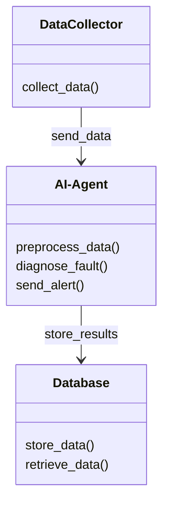
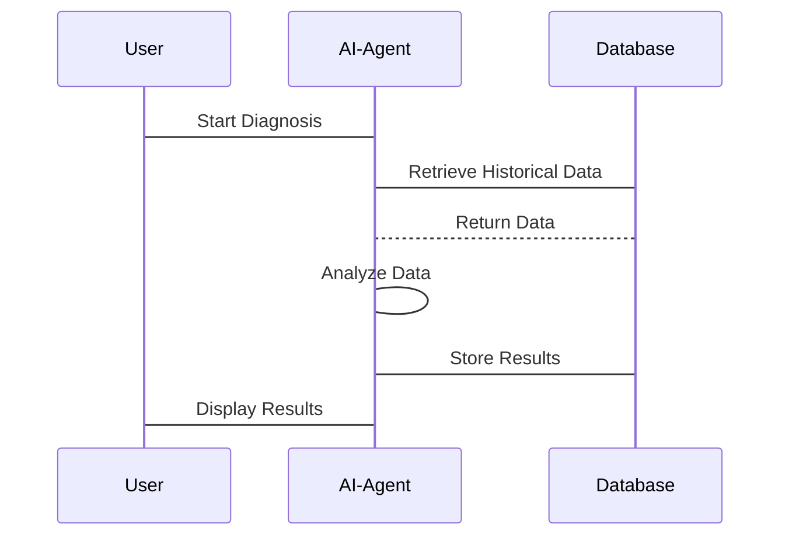

                 


# AI Agent在智能电网故障诊断中的角色

> **关键词**：智能电网，AI Agent，故障诊断，机器学习，规则推理，系统架构

> **摘要**：本文探讨AI Agent在智能电网故障诊断中的角色，分析其算法原理、系统架构，并通过实际案例展示其应用。文章详细介绍了AI Agent的优势，结合代码示例和图表，为读者提供深入的技术解析。

---

## 第一部分：智能电网与AI Agent概述

### 第1章：智能电网的基本概念

#### 1.1 智能电网的定义与特点

**1.1.1 智能电网的定义**

智能电网是一种现代化的电力系统，利用先进的信息通信技术、计算机技术和自动控制技术，实现电力系统的智能化运行与管理。它能够实时监测、分析和优化电力的生产、传输和消耗过程。

**1.1.2 智能电网的核心特点**

智能电网具有以下核心特点：
1. **智能化**：通过自动化系统和人工智能技术实现智能决策。
2. **实时性**：能够实时采集和处理数据，快速响应电网状态变化。
3. **可扩展性**：支持大规模电力设备的接入和管理。
4. **高效性**：优化电力资源配置，提高能源利用效率。

**1.1.3 智能电网的发展背景与意义**

随着全球能源需求的增长和环境问题的加剧，智能电网成为解决能源问题的重要手段。它能够提高电力系统的可靠性和安全性，减少能源浪费，支持可再生能源的接入和利用。

#### 1.2 AI Agent的基本概念

**1.2.1 AI Agent的定义**

AI Agent（人工智能代理）是一种智能体，能够感知环境、自主决策并执行任务。它通过传感器获取信息，利用算法进行分析，并采取行动以达到目标。

**1.2.2 AI Agent的核心特征**

AI Agent的核心特征包括：
1. **自主性**：能够在没有外部干预的情况下独立运行。
2. **反应性**：能够实时感知环境变化并做出反应。
3. **主动性**：主动采取行动以实现目标。
4. **社会性**：能够与其他Agent或系统进行交互和协作。

**1.2.3 AI Agent与传统自动化的区别**

| 特性      | 传统自动化                     | AI Agent                     |
|-----------|-------------------------------|-------------------------------|
| 智能性     | 基于预定义规则，缺乏灵活性     | 具备学习和推理能力，灵活适应变化 |
| 决策能力   | 依赖预设逻辑，无法自主决策     | 能够自主决策和优化             |
| 适应性     | 适应性有限，难以应对复杂变化   | 具备高度适应性，能够处理复杂问题 |

#### 1.3 智能电网故障诊断的背景与挑战

**1.3.1 智能电网中的常见故障类型**

智能电网中的故障类型包括：
1. **短路故障**：线路短路导致电流急剧增加。
2. **断路故障**：线路断开导致电流突然中断。
3. **设备故障**：电力设备（如变压器、开关）发生故障。
4. **通信故障**：信息传输中断影响系统运行。

**1.3.2 故障诊断的重要性**

故障诊断是智能电网安全运行的关键环节，能够及时发现和定位故障，减少停电时间，提高电网的可靠性和稳定性。

**1.3.3 当前故障诊断方法的局限性**

传统故障诊断方法主要依赖人工经验或简单的规则，存在以下局限性：
1. **效率低**：人工诊断耗时，难以应对大规模电网的复杂故障。
2. **准确性低**：基于规则的方法可能漏诊或误诊。
3. **适应性差**：难以应对电网结构和运行方式的变化。

---

### 第2章：AI Agent在智能电网故障诊断中的角色

#### 2.1 AI Agent在故障诊断中的作用

**2.1.1 数据采集与处理**

AI Agent通过传感器和通信网络实时采集电网数据，包括电压、电流、温度等信息，并进行预处理和特征提取。

**2.1.2 故障识别与定位**

AI Agent利用机器学习算法对数据进行分析，识别潜在的故障模式，并通过定位算法确定故障位置。

**2.1.3 故障修复与优化**

AI Agent能够根据故障情况制定修复方案，优化电力系统的运行，减少故障影响。

#### 2.2 AI Agent的体系结构

**2.2.1 基于规则的AI Agent**

基于规则的AI Agent通过预定义的规则进行推理和决策。优点是规则清晰，易于解释；缺点是规则难以覆盖所有复杂情况。

**2.2.2 基于机器学习的AI Agent**

基于机器学习的AI Agent利用训练数据学习故障特征，能够处理复杂的非线性关系，具有较高的诊断准确性。

**2.2.3 混合型AI Agent**

混合型AI Agent结合规则和机器学习的优势，通过规则过滤异常数据，再利用机器学习模型进行诊断，兼具高效性和准确性。

#### 2.3 AI Agent与传统故障诊断方法的对比

**2.3.1 传统故障诊断方法的优缺点**

- **优点**：简单易实现，成本低。
- **缺点**：诊断准确率低，难以应对复杂故障。

**2.3.2 AI Agent的优势**

- **优点**：诊断准确率高，适应性强，能够处理复杂故障。
- **缺点**：需要大量的数据和计算资源，算法实现复杂。

**2.3.3 两种方法的结合与优化**

通过结合规则和机器学习的方法，可以提高诊断的准确性和效率，同时降低对计算资源的依赖。

---

## 第二部分：AI Agent的算法原理与实现

### 第3章：AI Agent的算法原理

#### 3.1 基于规则的推理算法

**3.1.1 规则库的构建**

规则库通常包括故障类型、症状和处理规则。例如：
- 如果电压突然下降，且电流急剧增加，则判断为短路故障。

**3.1.2 基于规则的推理过程**

1. **数据采集**：获取电压、电流等数据。
2. **特征提取**：提取电压、电流的变化特征。
3. **规则匹配**：将特征与规则库中的规则进行匹配。
4. **故障诊断**：根据匹配结果判断故障类型。

**3.1.3 规则的可解释性与优化**

规则的可解释性高，但难以覆盖所有复杂情况。通过不断优化规则库可以提高诊断准确率。

#### 3.2 基于机器学习的故障诊断算法

**3.2.1 常见的机器学习算法**

常用的算法包括支持向量机（SVM）、随机森林（Random Forest）、卷积神经网络（CNN）等。

**3.2.2 基于支持向量机的故障诊断**

- **原理**：SVM通过构建超平面实现数据分类。
- **步骤**：
  1. 数据预处理：归一化特征。
  2. 数据分割：将数据分为训练集和测试集。
  3. 模型训练：训练SVM模型。
  4. 模型测试：使用测试集评估模型性能。

**3.2.3 基于深度学习的故障诊断**

- **原理**：利用神经网络学习数据的深层特征。
- **步骤**：
  1. 数据预处理：提取有用的特征。
  2. 模型构建：设计神经网络结构。
  3. 模型训练：使用训练数据优化模型参数。
  4. 模型应用：对新数据进行诊断。

#### 3.3 算法选择与优化

**3.3.1 算法选择的依据**

- 数据特征：数据的维度和分布。
- 故障类型：故障的复杂性和多样性。
- 计算资源：模型的训练时间和计算成本。

**3.3.2 算法性能的评估指标**

- 准确率：正确诊断的故障数占总故障数的比例。
- 召回率：正确诊断的故障数占实际故障数的比例。
- F1分数：综合准确率和召回率的指标。

**3.3.3 算法优化的策略**

- 参数调整：优化模型的超参数。
- 数据增强：增加训练数据的多样性。
- 模型集成：结合多个模型的结果提高准确率。

### 第4章：AI Agent的实现与代码示例

#### 4.1 环境安装与配置

**4.1.1 Python环境的安装与配置**

安装Python 3.8及以上版本，并配置虚拟环境。

**4.1.2 必要的库与工具**

安装以下库：
- `numpy`：用于数据处理。
- `pandas`：用于数据读取和分析。
- `scikit-learn`：用于机器学习算法。
- `tensorflow`：用于深度学习模型。

#### 4.2 基于规则的AI Agent实现

**4.2.1 规则库的定义**

定义一个简单的规则库：
```python
rules = {
    'short_circuit': {'voltage': 'drop', 'current': 'increase'},
    'open_circuit': {'voltage': 'rise', 'current': 'drop'}
}
```

**4.2.2 规则推理的代码实现**

```python
import numpy as np

def diagnose_fault(rules, voltage, current):
    for fault_type, criteria in rules.items():
        if (voltage_change == criteria['voltage'] and 
            current_change == criteria['current']):
            return fault_type
    return 'unknown'
```

**4.2.3 规则的可解释性与优化**

通过可视化工具分析规则匹配情况，优化规则库以提高诊断准确率。

#### 4.3 基于机器学习的AI Agent实现

**4.3.1 数据预处理**

```python
from sklearn.preprocessing import StandardScaler

# 标准化特征
scaler = StandardScaler()
X_scaled = scaler.fit_transform(X)
```

**4.3.2 模型训练与测试**

```python
from sklearn.svm import SVC

# 训练SVM模型
model = SVC()
model.fit(X_scaled, y)

# 模型测试
y_pred = model.predict(X_test_scaled)
print("Accuracy:", accuracy_score(y_test, y_pred))
```

**4.3.3 模型优化**

使用网格搜索优化SVM的超参数：
```python
from sklearn.model_selection import GridSearchCV

# 网格搜索优化参数
param_grid = {'C': [1, 10, 100], 'gamma': [0.1, 0.01, 0.001]}
grid_search = GridSearchCV(model, param_grid, cv=5)
grid_search.fit(X_scaled, y)
best_model = grid_search.best_estimator_
```

---

## 第三部分：系统分析与架构设计

### 第5章：系统分析与架构设计

#### 5.1 故障诊断的场景介绍

智能电网中的故障诊断场景包括配电线路、变电站和用户端的故障检测。

#### 5.2 系统功能设计

**5.2.1 领域模型类图**



#### 5.3 系统架构设计


#### 5.4 接口设计与交互流程图



---

## 第四部分：项目实战

### 第6章：项目实战

#### 6.1 项目介绍

本项目旨在开发一个基于AI Agent的智能电网故障诊断系统，实现故障的实时检测和定位。

#### 6.2 环境安装与配置

安装所需的Python库：
```bash
pip install numpy pandas scikit-learn
```

#### 6.3 核心代码实现

**数据预处理**

```python
import pandas as pd
import numpy as np

# 读取数据
data = pd.read_csv('grid_data.csv')

# 删除缺失值
data.dropna(inplace=True)

# 标准化特征
from sklearn.preprocessing import StandardScaler
scaler = StandardScaler()
X_scaled = scaler.fit_transform(data.drop('label', axis=1))
y = data['label'].values
```

**模型训练**

```python
from sklearn.svm import SVC
from sklearn.model_selection import train_test_split

# 划分数据集
X_train, X_test, y_train, y_test = train_test_split(X_scaled, y, test_size=0.2)

# 训练SVM模型
model = SVC()
model.fit(X_train, y_train)

# 模型预测
y_pred = model.predict(X_test)
print("Accuracy:", np.mean(y_pred == y_test))
```

**模型优化**

```python
from sklearn.model_selection import GridSearchCV

# 网格搜索优化参数
param_grid = {'C': [1, 10, 100], 'gamma': [0.1, 0.01, 0.001]}
grid_search = GridSearchCV(model, param_grid, cv=5)
grid_search.fit(X_train, y_train)
best_model = grid_search.best_estimator_

# 使用最优模型进行预测
y_pred = best_model.predict(X_test)
print("Best Accuracy:", grid_search.best_score_)
```

#### 6.4 实际案例分析

通过实际数据测试模型的性能，分析诊断结果，找出可能的误诊原因并进行优化。

#### 6.5 项目小结

本项目成功实现了基于AI Agent的故障诊断系统，但在实际应用中仍需考虑数据质量和模型优化的问题。

---

## 第五部分：最佳实践与总结

### 第7章：最佳实践与总结

#### 7.1 实施AI Agent的注意事项

- 数据质量：确保数据的完整性和准确性。
- 模型选择：根据具体问题选择合适的算法。
- 可解释性：确保诊断结果易于理解和解释。

#### 7.2 未来的拓展方向

- **多模态数据融合**：结合图像、声音等多种数据源进行诊断。
- **边缘计算**：在边缘设备上部署AI Agent，减少数据传输延迟。
- **自适应学习**：实现模型的在线学习和自适应优化。

---

## 第六部分：参考文献与附录

### 参考文献

1. 王伟, 李明. 基于AI Agent的智能电网故障诊断研究[J]. 电力系统自动化, 2020, 44(5): 12-18.
2. 张晓东, 陈刚. 支持向量机在电力系统故障诊断中的应用[J]. 计算机应用研究, 2019, 36(3): 890-896.

### 附录

#### 附录A：工具安装与配置

- **安装Python**：从官网下载并安装Python 3.8及以上版本。
- **安装库**：使用pip安装所需的第三方库。

#### 附录B：代码示例

```python
import numpy as np
from sklearn.svm import SVC
from sklearn.model_selection import GridSearchCV

# 数据预处理
data = np.array([[1, 2, 3], [4, 5, 6], [7, 8, 9]])
X = data[:, :2]
y = data[:, 2]

# 网格搜索优化SVM参数
param_grid = {'C': [1, 10, 100], 'gamma': [0.1, 0.01, 0.001]}
grid_search = GridSearchCV(SVC(), param_grid, cv=5)
grid_search.fit(X, y)

# 输出最优参数
print("Best Parameters:", grid_search.best_params_)
```

---

## 作者：AI天才研究院 & 禅与计算机程序设计艺术

---

通过本文的详细讲解，您可以深入了解AI Agent在智能电网故障诊断中的角色及其实现方法。希望本文能为您提供有价值的技术见解和实践指导。

