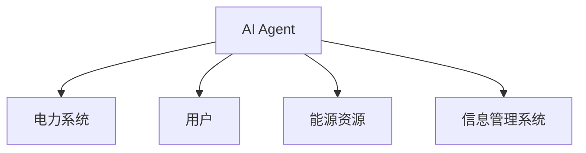

                 

# AI Agent在智能电网管理中的应用

> 关键词：智能电网，AI Agent，电力系统优化，能源管理，人工智能技术

> 摘要：本文深入探讨AI Agent在智能电网管理中的应用，涵盖背景介绍、核心概念、算法原理、系统架构、项目实战及未来展望。通过详细分析AI Agent在智能电网中的角色与价值，结合实际案例，展示其在电力系统优化、能源管理及用户行为分析中的潜力与应用。

---

## 第一部分: AI Agent与智能电网管理概述

### 第1章: AI Agent的基本概念与技术背景

#### 1.1 AI Agent的定义与核心特征

##### 1.1.1 AI Agent的定义
AI Agent（人工智能代理）是指能够感知环境并采取行动以实现目标的智能实体。它能够通过传感器获取信息，利用算法进行决策，并通过执行器与环境交互。

##### 1.1.2 AI Agent的核心特征
- **自主性**：AI Agent能够自主决策，无需外部干预。
- **反应性**：能够实时感知环境变化并做出响应。
- **学习能力**：通过机器学习算法不断优化自身行为。
- **协作性**：在多智能体系统中与其他AI Agent协同工作。

##### 1.1.3 AI Agent与传统自动化的区别
AI Agent不仅仅是被动执行指令的工具，而是具有主动决策和学习能力的智能体，能够在复杂环境中自主优化任务执行。

#### 1.2 智能电网的基本概念

##### 1.2.1 智能电网的定义与特点
智能电网是通过先进的传感、通信、信息和控制技术，实现电力系统各个环节的智能化管理，具有实时性、互动性、可靠性和高效性的特点。

##### 1.2.2 智能电网的主要组成部分
- **发电系统**：包括可再生能源发电和传统发电方式。
- **输配电系统**：包括输电、配电和变电站。
- **用户端系统**：包括电力用户和用电设备。
- **信息管理系统**：包括数据采集、分析和决策支持系统。

##### 1.2.3 智能电网的发展现状与趋势
当前，智能电网在全球范围内快速发展，主要趋势包括可再生能源的大量接入、分布式能源的兴起以及用户侧的智能化管理。

#### 1.3 AI Agent在智能电网管理中的应用背景

##### 1.3.1 智能电网管理中的问题与挑战
- **电力系统实时性与动态性问题**：电力系统的动态变化需要实时响应。
- **能源资源优化配置问题**：如何在多源能源中实现最优配置。
- **用户行为预测与需求响应问题**：用户的用电行为预测和需求响应是智能电网管理的重要内容。

##### 1.3.2 AI Agent在智能电网管理中的潜在价值
AI Agent可以通过实时数据处理、自主决策和多智能体协作，提升智能电网的运行效率和可靠性。

##### 1.3.3 当前研究与应用的现状
当前，AI Agent在智能电网中的应用主要集中在电力系统优化、能源管理、用户行为分析等领域，但仍有诸多挑战需要解决。

---

### 第2章: AI Agent在智能电网管理中的问题背景

#### 2.1 智能电网管理的主要问题

##### 2.1.1 电力系统实时性与动态性问题
电力系统的动态变化需要实时监控和快速响应，这对传统的静态模型和规则系统提出了挑战。

##### 2.1.2 能源资源优化配置问题
如何在多源能源中实现最优配置，提高能源利用效率，是智能电网管理的核心问题。

##### 2.1.3 用户行为预测与需求响应问题
用户的用电行为受多种因素影响，准确预测用户需求并进行有效的需求响应是智能电网管理的关键。

#### 2.2 AI Agent在智能电网管理中的问题解决思路

##### 2.2.1 AI Agent在电力系统实时控制中的应用
AI Agent可以通过实时感知和决策，优化电力系统的运行状态。

##### 2.2.2 AI Agent在能源优化配置中的作用
AI Agent能够根据实时数据和历史信息，优化能源的配置和调度。

##### 2.2.3 AI Agent在用户行为分析与需求响应中的应用
通过分析用户的用电行为，AI Agent可以预测需求并制定相应的响应策略。

#### 2.3 AI Agent在智能电网管理中的边界与外延

##### 2.3.1 AI Agent的适用范围
AI Agent适用于需要实时决策和动态优化的场景，如电力调度、设备维护等。

##### 2.3.2 AI Agent与其他技术的协同关系
AI Agent需要与物联网、大数据、云计算等技术协同工作，共同实现智能电网的目标。

##### 2.3.3 AI Agent在智能电网管理中的局限性
AI Agent依赖于数据质量和模型准确性，存在数据不足、模型过拟合等问题。

---

### 第3章: AI Agent在智能电网管理中的核心概念与联系

#### 3.1 AI Agent的核心原理

##### 3.1.1 知识表示与推理机制
AI Agent通过知识表示和推理机制，理解和处理复杂信息。

##### 3.1.2 学习与自适应能力
AI Agent通过机器学习算法不断优化自身行为。

##### 3.1.3 多智能体协同机制
AI Agent在多智能体系统中通过通信与协作，实现共同目标。

#### 3.2 AI Agent与智能电网管理的核心要素

##### 3.2.1 电力系统的动态模型
电力系统的动态模型是AI Agent理解和预测的基础。

##### 3.2.2 用户行为模型
用户行为模型是AI Agent进行需求预测和响应的核心。

##### 3.2.3 能源资源优化模型
能源资源优化模型是AI Agent进行配置和调度的关键。

#### 3.3 AI Agent与智能电网管理的实体关系图

---

## 总结

通过以上章节的详细阐述，我们可以看到AI Agent在智能电网管理中的重要性和潜力。从背景介绍到核心概念，从算法原理到系统架构，再到实际应用案例，AI Agent在智能电网管理中的应用已经取得了显著成效，但仍需在技术优化和实际应用中不断探索和创新。

--- 

**作者：AI天才研究院/AI Genius Institute & 禅与计算机程序设计艺术 /Zen And The Art of Computer Programming**

